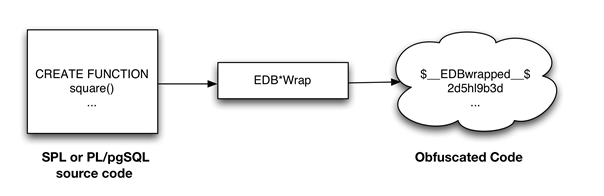

<div id="edb_wrap" class="registered_link"></div>

The EDB\*Wrap utility protects proprietary source code and programs (functions, stored procedures, triggers, and packages) from unauthorized scrutiny. The EDB\*Wrap program translates a file that contains SPL or PL/pgSQL source code (the plaintext) into a file that contains the same code in a form that is nearly impossible to read. Once you have the obfuscated form of the code, you can send that code to the PostgreSQL server and the server will store those programs in obfuscated form. While EDB\*Wrap does obscure code, table definitions are still exposed.

Everything you wrap is stored in obfuscated form. If you wrap an entire package, the package body source, as well as the prototypes contained in the package header and the functions and procedures contained in the package body are stored in obfuscated form.

If you wrap a `CREATE PACKAGE` statement, you hide the package API from other developers. You may want to wrap the package body, but not the package header so users can see the package prototypes and other public variables that are defined in the package body. To allow users to see what prototypes the package contains, use EDBWrap to obfuscate only the `CREATE PACKAGE BODY` statement in the edbwrap input file, omitting the `CREATE PACKAGE` statement. The package header source will be stored plaintext, while the package body source and package functions and procedures will be stored obfuscated.



Once wrapped, source code and programs cannot be unwrapped or debugged. Reverse engineering is possible, but would be very difficult.

The entire source file is wrapped into one unit. Any `psql` meta-commands included in the wrapped file will not be recognized when the file is executed; executing an obfuscated file that contains a psql meta-command will cause a syntax error. `edbwrap` does not validate SQL source code -if the plaintext form contains a syntax error, `edbwrap` will not complain. Instead, the server will report an error and abort the entire file when you try to execute the obfuscated form.

<div id="using_edbwrap_to_obfuscate_source_code" class="registered_link"></div>

## Using EDB\*Wrap to Obfuscate Source Code

EDB\*Wrap is a command line utility; it accepts a single input source file, obfuscates the contents and returns a single output file. When you invoke the `edbwrap` utility, you must provide the name of the file that contains the source code to obfuscate. You may also specify the name of the file where `edbwrap` will write the obfuscated form of the code. `edbwrap` offers three different command-line styles. The first style is compatible with Oracle's `wrap` utility:

```text
edbwrap iname=<input_file> [oname=<output_file>]
```

The `iname=input_file` argument specifies the name of the input file; if `input_file` does not contain an extension, `edbwrap` will search for a file named `input_file.sql`

The `oname=output_file` argument (which is optional) specifies the name of the output file; if `output_file` does not contain an extension, `edbwrap` will append `.plb` to the name.

If you do not specify an output file name, `edbwrap` writes to a file whose name is derived from the input file name: `edbwrap` strips the suffix (typically `.sql`) from the input file name and adds `.plb`.

`edbwrap` offers two other command-line styles that may feel more familiar:

```text
edbwrap --iname <input_file> [--oname <output_file>]
edbwrap -i <input_file> [-o <output_file>]
```

You may mix command-line styles; the rules for deriving input and output file names are identical regardless of which style you use.

Once `edbwrap` has produced a file that contains obfuscated code, you typically feed that file into the PostgreSQL server using a client application such as `edb-psql`. The server executes the obfuscated code line by line and stores the source code for SPL and PL/pgSQL programs in wrapped form.

In summary, to obfuscate code with EDB\*Wrap, you:

1.  Create the source code file.
2.  Invoke EDB\*Wrap to obfuscate the code.
3.  Import the file as if it were in plaintext form.

The following sequence demonstrates `edbwrap` functionality.

First, create the source code for the `list_emp` procedure (in plaintext form):

```text
[bash] cat listemp.sql
CREATE OR REPLACE PROCEDURE list_emp
IS                                  
     v_empno         NUMBER(4);      
     v_ename         VARCHAR2(10);   
     CURSOR emp_cur IS               
         SELECT empno, ename FROM emp ORDER BY empno;
BEGIN                                               
     OPEN emp_cur;                                   
     DBMS_OUTPUT.PUT_LINE('EMPNO    ENAME');         
     DBMS_OUTPUT.PUT_LINE('-----    -------');       
     LOOP                                            
         FETCH emp_cur INTO v_empno, v_ename;        
         EXIT WHEN emp_cur%NOTFOUND;                 
         DBMS_OUTPUT.PUT_LINE(v_empno || '     ' || v_ename);
     END LOOP;                                               
     CLOSE emp_cur;                                          
END;                                                        
/                                                           
```

You can import the `list_emp` procedure with a client application such as `edb-psql`:

```text
[bash] edb-psql edb
Welcome to edb-psql 8.4.3.2, the EnterpriseDB interactive terminal.
Type:  \copyright for distribution terms
       \h for help with SQL commands    
       \? for help with edb-psql commands
       \g or terminate with semicolon to execute query
       \q to quit                                     

edb=# \i listemp.sql
CREATE PROCEDURE
```

You can view the plaintext source code (stored in the server) by examining the `pg_proc` system table:

```text
edb=# SELECT prosrc FROM pg_proc WHERE proname = 'list_emp';
                             prosrc                            
--------------------------------------------------------------                                                    

     v_empno         NUMBER(4);                               
      v_ename         VARCHAR2(10);                            
      CURSOR emp_cur IS                                        
          SELECT empno, ename FROM emp ORDER BY empno;         
  BEGIN                                                        
      OPEN emp_cur;                                            
      DBMS_OUTPUT.PUT_LINE('EMPNO    ENAME');                  
      DBMS_OUTPUT.PUT_LINE('-----    -------');                
      LOOP                                                     
          FETCH emp_cur INTO v_empno, v_ename;                 
          EXIT WHEN emp_cur%NOTFOUND;                          
          DBMS_OUTPUT.PUT_LINE(v_empno || '     ' || v_ename); 
      END LOOP;                                                
      CLOSE emp_cur;                                           
  END                                                          
(1 row)                                                       

edb=# quit
```

Next, obfuscate the plaintext file with EDB\*Wrap:

```text
[bash] edbwrap -i listemp.sql                                        
EDB*Wrap Utility: Release 8.4.3.2

Copyright (c) 2004-2021 EnterpriseDB Corporation.  All Rights Reserved.

Using encoding UTF8 for input
Processing listemp.sql to listemp.plb

Examining the contents of the output file (listemp.plb) file reveals
that the code is obfuscated:

[bash] cat listemp.plb 
$__EDBwrapped__$                     
UTF8                                 
d+6DL30RVaGjYMIzkuoSzAQgtBw7MhYFuAFkBsfYfhdJ0rjwBv+bHr1FCyH6j9SgH
movU+bYI+jR+hR2jbzq3sovHKEyZIp9y3/GckbQgualRhIlGpyWfE0dltDUpkYRLN
/OUXmk0/P4H6EI98sAHevGDhOWI+58DjJ44qhZ+l5NNEVxbWDztpb/s5sdx4660qQ
Ozx3/gh8VkqS2JbcxYMpjmrwVr6fAXfb68Ml9mW2Hl7fNtxcb5kjSzXvfWR2XYzJf
KFNrEhbL1DTVlSEC5wE6lGlwhYvXOf22m1R2IFns0MtF9fwcnBWAs1YqjR00j6+fc
er/f/efAFh4=
$__EDBwrapped__$
```

You may notice that the second line of the wrapped file contains an encoding name (in this case, the encoding is UTF8). When you obfuscate a file, edbwrap infers the encoding of the input file by examining the locale. For example, if you are running edbwrap while your locale is set to en_US.utf8, edbwrap assumes that the input file is encoded in UTF8. Be sure to examine the output file after running edbwrap; if the locale contained in the wrapped file does not match the encoding of the input file, you should change your locale and rewrap the input file.

You can import the obfuscated code into the PostgreSQL server using the same tools that work with plaintext code:

```text
[bash] edb-psql edb
Welcome to edb-psql 8.4.3.2, the EnterpriseDB interactive terminal.
Type:  \copyright for distribution terms
       \h for help with SQL commands
       \? for help with edb-psql commands
       \g or terminate with semicolon to execute query
       \q to quit

edb=# \i listemp.plb
CREATE PROCEDURE

Now, the pg_proc system table contains the obfuscated code:

edb=# SELECT prosrc FROM pg_proc WHERE proname = 'list_emp';
                                     prosrc
----------------------------------------------------------------
  $__EDBwrapped__$
  UTF8
  dw4B9Tz69J3WOsy0GgYJQa+G2sLZ3IOyxS8pDyuOTFuiYe/EXiEatwwG3h3tdJk
  ea+AIp35dS/4idbN8wpegM3s994dQ3R97NgNHfvTQnO2vtd4wQtsQ/Zc4v4Lhfj
  nlV+A4UpHI5oQEnXeAch2LcRD87hkU0uo1ESeQV8IrXaj9BsZr+ueROnwhGs/Ec
  pva/tRV4m9RusFn0wyr38u4Z8w4dfnPW184Y3o6It4b3aH07WxTkWrMLmOZW1jJ
  Nu6u4o+ezO64G9QKPazgehslv4JB9NQnuocActfDSPMY7R7anmgw
  $__EDBwrapped__$
(1 row)
```

Invoke the obfuscated code in the same way that you would invoke the plaintext form:

```text
edb=# exec list_emp;

EMPNO    ENAME
-----    -------
7369     SMITH
7499     ALLEN
7521     WARD
7566     JONES
7654     MARTIN
7698     BLAKE
7782     CLARK
7788     SCOTT
7839     KING
7844     TURNER
7876     ADAMS
7900     JAMES
7902     FORD
7934     MILLER

EDB-SPL Procedure successfully completed
edb=# quit
```

When you use `pg_dump` to back up a database, wrapped programs remain obfuscated in the archive file.

Be aware that audit logs produced by the Postgres server will show wrapped programs in plaintext form. Source code is also displayed in plaintext in SQL error messages generated during the execution of a program.

!!! Note
    At this time, the bodies of the objects created by the following statements will not be stored in obfuscated form:

     ```text
     CREATE [OR REPLACE] TYPE type_name AS OBJECT
     CREATE [OR REPLACE] TYPE type_name UNDER type_name
     CREATE [OR REPLACE] TYPE BODY type_name
     ```
