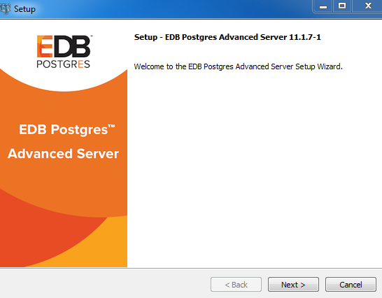
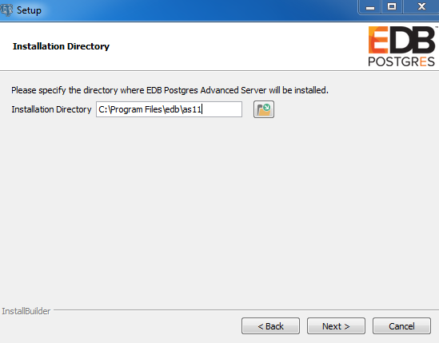
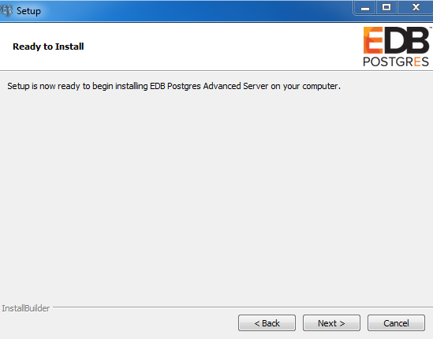

<div id="performing_an_installation_with_limited_privileges" class="registered_link"></div>

To perform an abbreviated installation of Advanced Server without access to administrative privileges, invoke the installer from the command line and include the `--extract-only` option. The `--extract-only` option extracts the binary files in an unaltered form, allowing you to experiment with a minimal installation of Advanced Server.

If you invoke the installer with the `--extract-only` options, you can either manually create a cluster and start the service, or run the installation script. To manually create the cluster, you must:

-   Use `initdb` to initialize the cluster
-   Configure the cluster
-   Use `pg_ctl` to start the service

For more information about the `initdb` and `pg_ctl` commands, see the PostgreSQL Core Documentation at:

<https://www.postgresql.org/docs/11/static/app-initdb.html>

<https://www.postgresql.org/docs/11/static/app-pg-ctl.html>

If you include the `--extract-only` option, the installer steps through a shortened form of the `Setup` wizard. During the brief installation process, the installer generates an installation script that can be later used to complete a more complete installation. You must have administrative privileges to invoke the installation script.

The installation script:

-   Initializes the database cluster if the cluster is empty.
-   Configures the server to start at boot-time.
-   Establishes initial values for Dynatune (dynamic tuning) variables.

The scripted Advanced Server installation does not create menu shortcuts or provide access to EDB Postgres StackBuilder Plus, and no modifications are made to registry files.

To perform a limited installation and generate an installation script, download and unpack the Advanced Server installer. Navigate into the directory that contains the installer, and invoke the installer with the command:

```text
edb-as11-server-11.x.x-x-windows.exe --extract-only yes
```

A dialog opens, prompting you to choose an installation language. Select a language for the installation from the drop-down listbox, and click `OK` to continue. The `Setup Wizard` opens.



<div style="text-align: center"> Fig. 16: The Welcome window </div>


Click `Next` to continue.



<div style="text-align: center"> Fig. 17: Specify an installation directory </div>


On Windows, the default Advanced Server installation directory is:

```text
C:\Program Files\edb\as11
```

You can accept the default installation location and click `Next` to continue to the `Ready to Install` window, or optionally click the `File Browser` icon to choose an alternate installation directory.



<div style="text-align: center"> Fig. 18: The Setup wizard is ready to install Advanced Server </div>


Click `Next` to proceed with the Advanced Server installation. During the installation, progress bars and popups mark the installation progress. The installer notifies you when the installation is complete.


<div style="text-align: center"> Fig. 19: The Advanced Server installation is complete </div>


After completing the minimal installation, you can execute a script to initialize a cluster and start the service. The script is (by default) located in:

```text
C:\Program Files\edb
```

To execute the installation script, open a command line and assume administrative privileges. Navigate to the directory that contains the script, and execute the command:

```text
cscript runAsAdmin.vbs
```

The installation script executes at the command line, prompting you for installation configuration information. The default configuration value is displayed in square braces immediately before each prompt; update the default value or press `Enter` to accept the default value and continue.

**Example**

The following dialog is an example of a scripted installation. The actual installation dialog may vary, and will reflect the options specified during the installation.

Specify the installation directory is the directory where Advanced Server is installed:

```text
Please enter the installation directory [ C:\Program Files\edb\as11 ] :
```

Specify the directory in which Advanced Server data will be stored:

```text
Please enter the data directory path: [C:\Program Files\edb\as11\data ] :
```

Specify the WAL directory (where the write-ahead log will be written):

```text
Please enter the Write-Ahead Log (WAL) directory path: [C:\Program Files\edb\as11\data\pg_wal ] :
```

The database mode specifies the database dialect with which the Advanced Server installation is compatible. The optional values are `oracle` or `postgresql`.

```text
Please enter database mode: [ oracle ] :
```

**Compatible with Oracle Mode**

Specify `oracle` mode to include the following functionality:

-   Data dictionary views and data type conversions compatible with Oracle databases.
-   Date values displayed in a format compatible with Oracle syntax.
-   Oracle-styled concatenation rules (if you concatenate a string value with a `NULL` value, the returned value is the value of the string).
-   Schemas (`dbo` and `sys`) compatible with Oracle databases added to the `SEARCH_PATH`.
-   Support for the Oracle built-in packages.

If you choose to install in `Compatible with Oracle` mode, the Advanced Server superuser name is `enterprisedb`.

**Compatible with PostgreSQL Mode**

Specify `postgresql` to install Advanced Server with complete compatibility with Postgres version 11.

For more information about PostgreSQL functionality, see the PostgreSQL Core Documentation available at:

<https://www.enterprisedb.com/docs>

If you choose to install in `Compatible with PostgreSQL` mode, the Advanced Server superuser name is `postgres`.

Specify a port number for the Advanced Server listener to listen on:

```text
NOTE: We will not be able to examine, if port is currently used by other application.
Please enter port: [ 5444 ] :
```

Specify a locale for the Advanced Server installation. If you accept the `DEFAULT` value, the locale defaults to the locale of the host system.

```text
Please enter the locale: [ DEFAULT ] :
```

You can optionally install sample tables and procedures. Press `Return`, or enter `Y` to accept the default and install the sample tables and procedures; enter an `n` and press `Return` to skip this step.

```text
Install sample tables and procedures? (Y/n): [ Y ] :
```

Specify a password for the database superuser. By default, the database superuser is named `enterprisedb`.

```text
Please enter the password for the SuperUser(enterprisedb): [ ] :
```

Specify a password for the service account user.

```text
Please enter the password for the ServiceAccount(enterprisedb): [ ] :
```

The server utilization value is used as an initial value for the `edb_dynatune` configuration parameter. `edb_dynatune` determines how Advanced Server allocates system resources.

-   A low value dedicates the least amount of the host machine’s resources to the database server; a low value is a good choice for a development machine.
-   A mid-range value dedicates a moderate amount of system resources to the database server. A mid-range value is a good setting for an application server with a fixed number of applications running on the same host as Advanced Server.
-   A high value dedicates most of the system resources to the database server. This is a good choice for a dedicated server host.

Specify a value between `1` and `100`:

```text
Please enter the Server Utilization: [ 66 ] :
```

After the installation is complete, you can adjust the value of `edb_dynatune` by editing the `postgresql.conf` file, located in the `data` directory of your Advanced Server installation. After editing the `postgresql.conf` file, you must restart the server for the changes to take effect.

The workload profile value is used as an initial value for the `edb_dynatune_profile` configuration parameter. `edb_dynatune_profile` controls performance-tuning based on the type of work that the server performs.

-   Specify `oltp` if the server will be supporting heavy online transaction workloads.
-   Specify `mixed` if the server will provide a mix of transaction processing and data reporting.
-   Specify `reporting` if the database server will be used for heavy data reporting.

Specify a value between `1` and `100`:

```text
Please enter the Workload Profile: [ oltp ] :
```

After the installation is complete, you can adjust the value of `edb_dynatune_profile` by editing the `postgresql.conf` file, located in the `data` directory of your Advanced Server installation, and restarting the server.

After processing, the Advanced Server installation is complete.