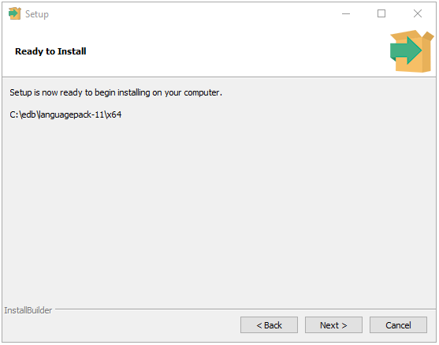
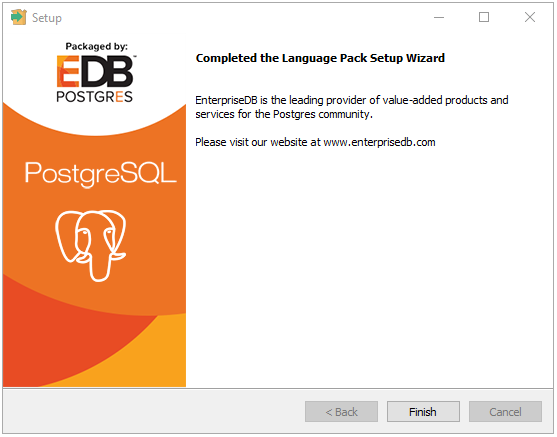
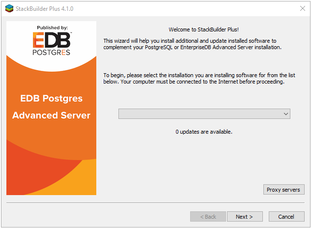

<div id="installing_language_pack" class="registered_link"></div>

This section walks you through installing and configuring Language Pack.

## Installing Language Pack

The graphical installer is available from the [EDB website](https://www.enterprisedb.com/software-downloads-postgres), as well as via Stack Builder and StackBuilder Plus. StackBuilder Plus is distributed with EDB Postgres Advanced Server and Stack Builder is distributed with PostgreSQL.

<div id="invoking_the_graphical_installer" class="registered_link"></div>

### Invoking the Graphical Installer

Assume Administrator privileges, and double-click the installer icon; if prompted, provide the password associated with the Administrator account. When prompted, select an installation language, and click `OK`.

The Language Pack setup wizard welcome window opens.


<div style="text-align: center"> Fig. 1: The Language Pack Welcome Window </div>

Click `Next` to continue.

The Ready to Install window displays the Language Pack installation directory:

 On Windows 64: `C:/edb/languagepack-11\x64`

 On OSX: `/Library/edb/languagepack-11`



<div style="text-align: center"> Fig. 2: The Ready to Install dialog </div>

You cannot modify the installation directory. Click `Next` to continue.

A progress bar marks installation progress.


<div style="text-align: center"> Fig. 3: The Installing dialog </div>

Click `Next` to continue.

The installer will inform you that the Language Pack installation has completed; click `Finish` to exit the installer.



<div style="text-align: center"> Fig. 4: The Language Pack Setup Complete dialog </div>


### Installing Language Pack with Stack Builder

You can use Stack Builder or StackBuilder Plus to download and invoke the Language Pack graphical installer. StackBuilder Plus is distributed with EDB Postgres Advanced Server and Stack Builder is distributed with PostgreSQL.

The following section walks you through installing Language Pack with Stack Builder.

The Stack Builder utility provides a graphical interface that simplifies the process of downloading and installing modules that complement your PostgreSQL installation.

Stack Builder requires Internet access; if your installation of PostgreSQL resides behind a firewall (with restricted Internet access), Stack Builder can download program installers through a proxy server. The module provider deter-mines if the module can be accessed through an HTTP proxy or an FTP proxy; currently, all updates are transferred via an HTTP proxy and the FTP proxy information is not used.

You can invoke Stack Builder at any time after the installation has completed by selecting the `Application Stack Builder` menu option from the `PostgreSQL 11` menu.

Select your server from the drop-down menu on the Stack Builder Welcome window and click `Next` to continue.



<div style="text-align: center"> Fig. 5: The Stack Builder Welcome Window </div>

Expand the `Add-ons, tools and utilities` node of the `Categories` tree control, and check the box next to EDB Language Pack version. Click `Next` to continue.

Stack Builder will confirm your package selection before downloading the installer. Click `Next` to continue.

When the download completes, Stack Builder will offer to invoke the installer for you, or will delay the installation until a more convenient time. To invoke the installer, click `Next` and follow the steps provided in the [Invoking the Graphical Installer section](#invoking-the-graphical-installer).

## Configuring Language Pack

This section walks you through configuring Language Pack on an Advanced Server and PostgreSQL hosts.

### Configuring Language Pack on an Advanced Server Host

After installing Language Pack on an Advanced Server host, you must configure the installation.

**Configuring Language Pack on Windows**

On Windows, the Language Pack installer places the languages in:

`C:\edb\languagepack-11\x64`

After installing Language Pack, you must set the following variables:

`set PYTHONHOME=C:\edb\languagepack-11\x64\Python-3.6`

Use the following commands to add Python, Perl and Tcl to your search path:

```text
set PATH=C:\edb\languagepack-11\x64\Python-3.6;
C:\edb\languagepack-11\x64\Perl-5.26\bin;
C:\edb\languagepack-11\x64\Tcl-8.6\bin;%PATH%
```

After performing the steps required to configure Language Pack on Windows, use the Windows `Services` applet to restart the Advanced Server.

### Configuring Language Pack on a PostgreSQL Host

After installing Language Pack on a PostgreSQL host, you must configure the installation.

**Configuring Language Pack on Windows**

After installing Language Pack, you must set the following variables:

`set PYTHONHOME=C:\edb\languagepack\v1\Python-3.7`

Then, use the following commands to add Language Pack to your search path:

```text
set PATH=C:\edb\languagepack-11\x64\Python-3.6;
C:\edb\languagepack\-11\x64\Perl-5.26\bin;
C:\edb\languagepack\-11\x64\Tcl-8.6\bin;%PATH%
```

After setting the system-specific steps required to configure Language Pack on Windows, restart the database server.

**Configuring Language Pack on OSX**

To simplify setting the value of `PATH` or `LD_LIBRARY_PATH`, you can create environment variables that identify the installation location:

```text
PERLHOME=/Library/edb/languagepack-11/Perl-5.26
PYTHONHOME=/Library/edb/languagepack-11/Python-3.6
TCLHOME=/Library/edb/languagepack-11/Tcl-8.6
```

Then, execute the following command to instruct the Python interpreter where to find Python:

`export PYTHONHOME`

You can use the same environment variables when setting the value of `PATH`:

```text
export PATH=$PYTHONHOME/bin:
$PERLHOME/bin:
$TCLHOME/bin:$PATH
```

Lastly, set the following variables to instruct OSX where to find the shared libraries:

```text
export DYLD_LIBRARY_PATH=$PYTHONHOME/lib:
$PERLHOME/lib/CORE:$TCLHOME/lib:
$DYLD_LIBRARY_PATH
```
