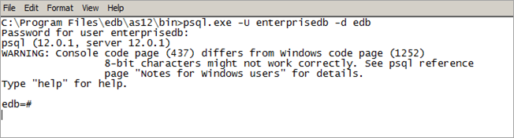

`psql` is a command line client application that allows you to execute SQL commands and view the results. To open the psql client, the client must be in your search path. The executable resides in the `bin` directory, under your Advanced Server installation.

Use the following command and options to start the psql client:

> `psql -d edb -U enterprisedb`

Where:

> `-d` specifies the database to which psql will connect;
>
> `-U` specifies the identity of the database user that will be used for the session.

If you have performed an installation with the interactive installer, you can access the psql client by selecting `EDB-PSQL` from the `EDB Postgres` menu. When the client opens, provide connection information for your session.

For more information about using the command line client, please refer to the PostgreSQL Core Documentation at:

> <https://www.postgresql.org/docs/12/static/app-psql.html>
