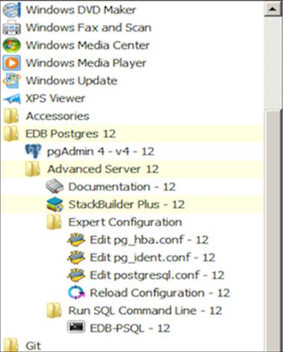

You can easily update parameters that determine the behavior of Advanced Server and supporting components by modifying the following configuration files:

-   The `postgresql.conf` file determines the initial values of Advanced Server configuration parameters.
-   The `pg_hba.conf` file specifies your preferences for network authentication and authorization.
-   The `pg_ident.conf` file maps operating system identities (user names) to Advanced Server identities (roles) when using `ident`-based authentication.

You can use your editor of choice to open a configuration file, or on Windows navigate through the `EDB Postgres` menu to open a file.

modifying_the_postgresql_conf_file modifying_the_pg_hba_conf_file setting_advanced_server_environment_variables connecting_to_advanced_server_with_psql connecting_to_advanced_server_with_the_pgadmin_4_client

