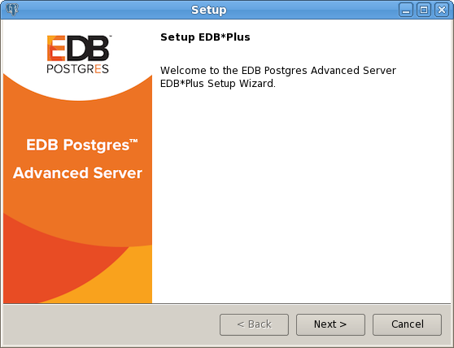
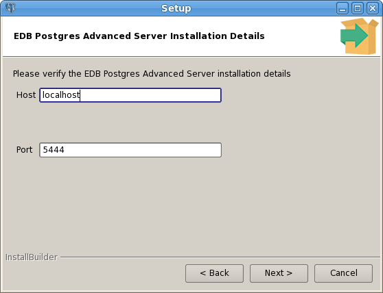
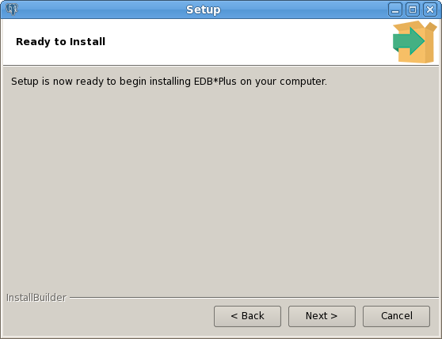
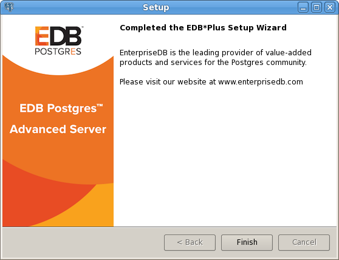

<div id="installing_edb_plus" class="registered_link"></div>

You can use an RPM installer or a graphical installer to add EDB\*Plus to your Advanced Server installation.

## Installation Pre-Requisites

Before installing EDB\*Plus, you must first install Java (version 1.7 or later). On a Linux system, you can use the yum package manager to install Java. Open a terminal window, assume superuser privileges, and enter:

> `# yum install java`

If you are using Windows, Java installers and instructions are available online at:

> <http://www.java.com/en/download/manual.jsp>

You must also have credentials that allow access to the EnterpriseDB repository. For information about requesting credentials, visit:

> <https://info.enterprisedb.com/rs/069-ALB-339/images/Repository%20Access%2004-09-2019.pdf>

After receiving your repository credentials you can:

1.  Create the repository configuration file.
2.  Modify the file, providing your user name and password.
3.  Install EDB\*Plus.

## Performing an RPM Installation

For detailed information about creating and using EnterpriseDB repositories to install Advanced Server or its supporting components, please see the *EDB Postgres Advanced Server Installation Guide*, available at:

> <https://www.enterprisedb.com/edb-docs>

**Creating a Repository Configuration File**

To create the repository configuration file, assume superuser privileges, and invoke the following command:

> `yum -y install https://yum.enterprisedb.com/edb-repo-rpms/edb-repo-latest.noarch.rpm`

The repository configuration file is named `edb.repo`. The file resides in `/etc/yum.repos.d`.

After creating the `edb.repo` file, use your choice of editor to ensure that the value of the enabled parameter is `1`, and replace the `username` and `password` placeholders in the `baseurl` specification with the name and password of a registered EnterpriseDB user.

```
[edb]
name=EnterpriseDB RPMs $releasever - $basearch
baseurl=https://<username>:<password>@yum.enterprisedb.com/edb/redhat/rhel-$releasever-$basearch
enabled=1
gpgcheck=1
gpgkey=file:///etc/pki/rpm-gpg/ENTERPRISEDB-GPG-KEY
```

After saving your changes to the configuration file, you can use the `yum install` command to install EDB\*Plus:

> `edb-as11-edbplus`

When you install an RPM package that is signed by a source that is not recognized by your system, yum may ask for your permission to import the key to your local server. If prompted, and you are satisfied that the packages come from a trustworthy source, enter `y`, and press `Return` to continue.

During the installation, yum may encounter a dependency that it cannot resolve. If it does, it will provide a list of the required dependencies that you must manually resolve.

### Configuring an RPM Installation

After performing an RPM installation of EDB\*Plus, you must set the values of environment variables that allow EDB\*Plus to locate your Java installation. Use the following commands to set variable values:

> `export JAVA_HOME=<path_to_java>`
> `export PATH=<path_to_java>/bin:$PATH`

By default, the `pg_hba.conf` file for the RPM installer enforces IDENT authentication. Before invoking EDB\*Plus, you must either modify the `pg_hba.conf` file, changing the authentication method to a form other than IDENT (and restarting the server), or perform the following steps to ensure that an IDENT server is accessible:

You must confirm that an `identd` server is installed and running. You can use the yum package manager to install an `identd` server by invoking the command:

> `yum install xinetd authd`

The command should create a file named `/etc/xinetd.d/auth` that contains:

```
service auth
{
disable = yes
socket_type = stream
wait =no
user = ident
cps = 4096 10
instances = UNLIMITED
server = /usr/sbin/in.authd server_args = -t60 --xerror –os
}
```

<div class="note">

<div class="title">

Note

</div>

if the file includes a `-E` argument at the end of the server arguments, please erase `-E`.

</div>

Then, to start the `identd` server, invoke the following commands:

> `systemctl enable xinetd`
>
> `systemctl start xinetd`

Open the `pg_ident.conf` file and create a user mapping:

```
# map_name    system_username     postgres_username
  edbas         enterprisedb        enterprisedb
```

Where:

-   The name specified in the `map_name` column is a user-defined name that will identify the mapping in the `pg_hba.conf` file.
-   The name specified in the `system_username` column is `enterprisedb`.
-   The name specified in the `postgres_username` column is `enterprisedb`.

Then, open the `pg_hba.conf` file and modify the IDENT entries:

-   If you are using an IPv4 local connection, modify the file entry to read:

    > `host all all 127.0.0.0/0 ident map=edbas`

-   If you are using an IPv6 local connection, modify the file entry to read:

    > `host all all ::1/128 ident map=edbas`

You must restart the Advanced Server service before invoking EDB\*Plus. For detailed information about controlling the Advanced Server service, see the *EDB Postgres Advanced Server Installation Guide*, available at:

> <https://www.enterprisedb.com/resources/product-documentation>

## Using the Graphical Installer

Graphical installers for EDB\*Plus are available via StackBuilder Plus; you can access StackBuilder Plus through your Windows or Linux start menu. After opening StackBuilder Plus and selecting the installation for which you wish to install EDB\*Plus, expand the component selection screen tree control to select and download the EDB\*Plus installer.



The EDB\*Plus installer welcomes you to the setup wizard, as shown in the figure below.


Use the `Installation Directory` field to specify the directory in which you wish to install the EDB\*Plus software. Then, click `Next` to continue.



Use fields on the `EDB Postgres Advanced Server Installation Details` window to identify the location of the Advanced Server host:

-   Use the Host field to identify the system on which Advanced Server resides.
-   Use the Port field to identify the listener port that Advanced Server monitors for client connections.

Then, click `Next` to continue.



The Ready to Install window notifies you when the installer has all of the information needed to install EDB\*Plus on your system. Click `Next` to install EDB\*Plus.



The installer notifies you when the setup wizard has completed the EDB\*Plus installation. Click `Finish` to exit the installer.
