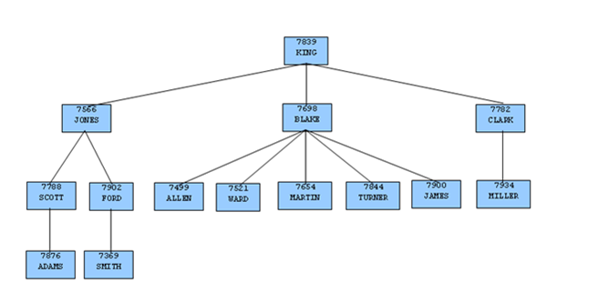

<div id="organization_tree_in_the_sample_application" class="registered_link"></div>

Consider the `emp` table of the sample application. The rows of the `emp` table form a hierarchy based upon the `mgr` column which contains the employee number of the employee’s manager. Each employee has at most, one manager. `KING` is the president of the company so he has no manager, therefore KING’s `mgr` column is null. Also, it is possible for an employee to act as a manager for more than one employee. This relationship forms a typical, tree-structured, hierarchical organization chart as illustrated below.



<div style="text-align: center"> Fig. 1: Employee Organization Hierarchy </div>


To form a hierarchical query based upon this relationship, the `SELECT` command includes the clause, `CONNECT BY PRIOR empno = mgr`. For example, given the company president, `KING`, with employee number `7839`, any employee whose `mgr` column is `7839` reports directly to `KING` which is true for `JONES, BLAKE`, and `CLARK` (these are the child nodes of `KING`). Similarly, for employee, `JONES`, any other employee with `mgr` column equal to `7566` is a child node of `JONES` - these are `SCOTT` and `FORD` in this example.

The top of the organization chart is `KING` so there is one root node in this tree. The `START WITH mgr IS NULL` clause selects only `KING` as the initial root node.

The complete `SELECT` command is shown below.

```text
SELECT ename, empno, mgr
FROM emp
START WITH mgr IS NULL
CONNECT BY PRIOR empno = mgr;
```

The rows in the query output traverse each branch from the root to leaf moving in a top-to-bottom, left-to-right order. Below is the output from this query.

```text
ename  | empno | mgr
-------+-------+------
KING   |  7839 |
JONES  |  7566 | 7839
SCOTT  |  7788 | 7566
ADAMS  |  7876 | 7788
FORD   |  7902 | 7566
SMITH  |  7369 | 7902
BLAKE  |  7698 | 7839
ALLEN  |  7499 | 7698
WARD   |  7521 | 7698
MARTIN |  7654 | 7698
TURNER |  7844 | 7698
JAMES  |  7900 | 7698
CLARK  |  7782 | 7839
MILLER |  7934 | 7782
(14 rows)
```
