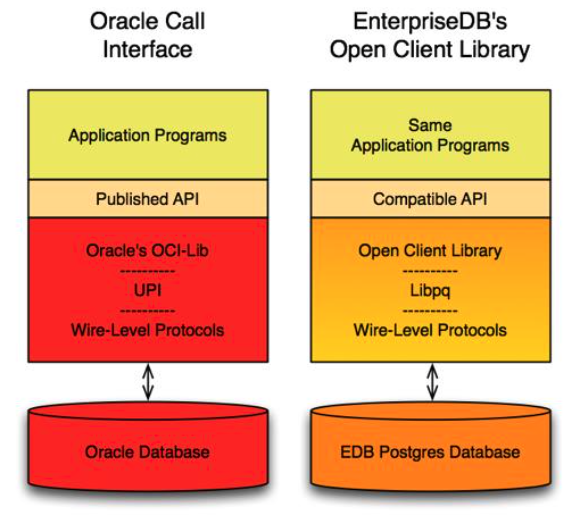

Advanced Server includes extended functionality that provides compatibility for syntax supported by Oracle applications. Detailed information about the compatibility features supported by Advanced Server is provided in the *Database Compatibility for Oracle Developers Guide*; the version-specific guides are available at:

[https://www.enterprisedb.com/docs](/epas/latest/epas_compat_ora_dev_guide/)

The following sections highlight some of the compatibility features supported by Advanced Server.

## Enabling Compatibility Features

There are several ways to install Advanced Server that will allow you to take advantage of compatibility features:

-   Use the `INITDBOPTS` variable (in the Advanced Server service configuration file) to specify `--redwood-like` before initializing your cluster.
-   When invoking `initdb` to initialize your cluster compatible with Oracle mode, include the `--redwood-like` option or `--no-redwood-compat` option to initialize your cluser in Oracle non-compatible mode.

For more information about the installation options supported by the Advanced Server installers, see the *EDB Postgres Advanced Server Installation Guide*, available from the EDB website at:

[https://www.enterprisedb.com/docs](/epas/latest/)

## Stored Procedural Language

Advanced Server supports a highly productive procedural language that allows you to write custom procedures, functions, triggers and packages. The procedural language:

-   complements the SQL language and built-in packages.
-   provides a seamless development and testing environment.
-   allows you to create reusable code.

For information about using the Stored Procedural Language, see the *Database Compatibility for Stored Procedural Language Guide*, available at:

[https://www.enterprisedb.com/docs](/epas/latest/epas_compat_spl/)

## Optimizer Hints

When you invoke a `DELETE`, `INSERT`, `SELECT`, or `UPDATE` command, the server generates a set of execution plans; after analyzing those execution plans, the server selects a plan that will (generally) return the result set in the least amount of time. The server's choice of plan is dependent upon several factors:

-   The estimated execution cost of data handling operations.
-   Parameter values assigned to parameters in the Query Tuning section of the `postgresql.conf` file.
-   Column statistics that have been gathered by the `ANALYZE` command.

As a rule, the query planner will select the least expensive plan. You can use an optimizer hint to influence the server as it selects a query plan.

An optimizer hint is a directive (or multiple directives) embedded in a comment-like syntax that immediately follows a `DELETE`, `INSERT`, `SELECT` or `UPDATE` command. Keywords in the comment instruct the server to employ or avoid a specific plan when producing the result set. For information about using optimizer hints, see the *Database Compatibility for Oracle Developers Guide*, available at:

[https://www.enterprisedb.com/docs](/epas/latest/epas_compat_ora_dev_guide/)

## Data Dictionary Views

Advanced Server includes a set of views that provide information about database objects in a manner compatible with the Oracle data dictionary views. For detailed information about the views available with Advanced Server, see the *Database Compatibility for Oracle Developers Catalog Views Guide*, available at:

[https://www.enterprisedb.com/docs](/epas/latest/epas_compat_cat_views/)

## dblink_ora

dblink_ora provides an OCI-based database link that allows you to `SELECT, INSERT, UPDATE` or `DELETE` data stored on an Oracle system from within Advanced Server. For detailed information about using `dblink_ora`, and the supported functions and procedures, see the *Database Compatibility for Oracle Developers Guide*, available at:

[https://www.enterprisedb.com/docs](/epas/latest/epas_compat_ora_dev_guide/)

## Profile Management

Advanced Server supports compatible SQL syntax for profile management. Profile management commands allow a database superuser to create and manage named *profiles*. Each profile defines rules for password management that augment password and md5 authentication. The rules in a profile can:

-   count failed login attempts
-   lock an account due to excessive failed login attempts
-   mark a password for expiration
-   define a grace period after a password expiration
-   define rules for password complexity
-   define rules that limit password re-use

A profile is a named set of attributes that allow you to easily manage a group of roles that share comparable authentication requirements. If password requirements change, you can modify the profile to have the new requirements applied to each user that is associated with that profile.

After creating the profile, you can associate the profile with one or more users. When a user connects to the server, the server enforces the profile that is associated with their login role. Profiles are shared by all databases within a cluster, but each cluster may have multiple profiles. A single user with access to multiple databases will use the same profile when connecting to each database within the cluster.

For information about using profile management commands, see the *Database Compatibility for Oracle Developers Guide*, available at:

[https://www.enterprisedb.com/docs](/epas/latest/epas_compat_ora_dev_guide/)

## Built-In Packages

Advanced Server supports a number of built-in packages that provide compatibility with Oracle procedures and functions.

| Package Name   | Description                                                                                                                                                                                                       |
| -------------- | ----------------------------------------------------------------------------------------------------------------------------------------------------------------------------------------------------------------- |
| DBMS_ALERT     | The DBMS_ALERT package provides the capability to register for, send, and receive alerts.                                                                                                                         |
| DBMS_AQ        | The DBMS_AQ package provides message queueing and processing for Advanced Server.                                                                                                                                 |
| DBMS_AQADM     | The DBMS_AQADM package provides supporting procedures for Advanced Queueing functionality.                                                                                                                        |
| DBMS_CRYPTO    | The DBMS_CRYPTO package provides functions and procedures that allow you to encrypt or decrypt RAW, BLOB or CLOB data. You can also use DBMS_CRYPTO functions to generate cryptographically strong random values. |
| DBMS_JOB       | The DBMS_JOB package provides for the creation, scheduling, and managing of jobs.                                                                                                                                 |
| DBMS_LOB       | The DBMS_LOB package provides the capability to operate on large objects.                                                                                                                                         |
| DBMS_LOCK      | Advanced Server provides support for the DBMS_LOCK.SLEEP procedure.                                                                                                                                               |
| DBMS_MVIEW     | Use procedures in the DBMS_MVIEW package to manage and refresh materialized views and their dependencies.                                                                                                         |
| DBMS_OUTPUT    | The DBMS_OUTPUT package provides the capability to send messages to a message buffer, or get messages from the message buffer.                                                                                    |
| DBMS_PIPE      | The DBMS_PIPE package provides the capability to send messages through a pipe within or between sessions connected to the same database cluster.                                                                  |
| DBMS_PROFILER  | The DBMS_PROFILER package collects and stores performance information about the PL/pgSQL and SPL statements that are executed during a performance profiling session.                                             |
| DBMS_RANDOM    | The DBMS_RANDOM package provides a number of methods to generate random values.                                                                                                                                   |
| DBMS_REDACT    | The DBMS_REDACT package enables the redacting or masking of data that is returned by a query.                                                                                                                     |
| DBMS_RLS       | The DBMS_RLS package enables the implementation of Virtual Private Database on certain Advanced Server database objects.                                                                                          |
| DBMS_SCHEDULER | The DBMS_SCHEDULER package provides a way to create and manage jobs, programs and job schedules.                                                                                                                  |
| DBMS_SESSION   | Advanced Server provides support for the DBMS_SESSION.SET_ROLE procedure.                                                                                                                                         |
| DBMS_SQL       | The DBMS_SQL package provides an application interface to the EnterpriseDB dynamic SQL functionality.                                                                                                             |
| DBMS_UTILITY   | The DBMS_UTILITY package provides various utility programs.                                                                                                                                                       |
| UTL_ENCODE     | The UTL_ENCODE package provides a way to encode and decode data.                                                                                                                                                  |
| UTL_FILE       | The UTL_FILE package provides the capability to read from, and write to files on the operating system’s file system.                                                                                              |
| UTL_HTTP       | The UTL_HTTP package provides a way to use the HTTP or HTTPS protocol to retrieve information found at an URL.                                                                                                    |
| UTL_MAIL       | The UTL_MAIL package provides the capability to manage e-mail.                                                                                                                                                    |
| UTL_RAW        | The UTL_RAW package allows you to manipulate or retrieve the length of raw data types.                                                                                                                            |
| UTL_SMTP       | The UTL_SMTP package provides the capability to send e-mails over the Simple Mail Transfer Protocol (SMTP).                                                                                                       |
| UTL_URL        | The UTL_URL package provides a way to escape illegal and reserved characters within an URL.                                                                                                                       |

For detailed information about the procedures and functions available within each package, see the *Database Compatibility for Oracle Developers Built-In Package Guide*, available at:

[https://www.enterprisedb.com/docs](/epas/latest/epas_compat_bip_guide/)

## Open Client Library

The Open Client Library provides application interoperability with the Oracle Call Interface – an application that was formerly “locked in” can now work with either an Advanced Server or an Oracle database with minimal to no changes to the application code. The EnterpriseDB implementation of the Open Client Library is written in C.

The following diagram compares the Open Client Library and Oracle Call Interface application stacks.

For detailed information about the functions supported by the Open Client Library, see the *EDB Postgres Advanced Server OCL Connector Guide*, available at:

[https://www.enterprisedb.com/docs](/ocl_connector/latest/)

## Utilities

For detailed information about the compatible syntax supported by the utilities listed below, see the *Database Compatibility for Oracle Developers Tools and Utilities Guide*, available at:

[https://www.enterprisedb.com/docs](/epas/latest/epas_compat_tools_guide/)

**EDB\*Plus**

EDB\*Plus is a utility program that provides a command line user interface to the Advanced Server that will be familiar to Oracle developers and users. EDB\*Plus accepts SQL commands, SPL anonymous blocks, and EDB\*Plus commands.

EDB\*Plus allows you to:

-   Query certain database objects
-   Execute stored procedures
-   Format output from SQL commands
-   Execute batch scripts
-   Execute OS commands
-   Record output

For detailed information about EDB\*Plus, see the *EDB\*Plus User's Guide* available at:

[https://www.enterprisedb.com/docs/p/edbplus](/epas/latest/edb_plus/)

**EDB\*Loader**

EDB\*Loader is a high-performance bulk data loader that provides an interface compatible with Oracle databases for Advanced Server. The EDB\*Loader command line utility loads data from an input source, typically a file, into one or more tables using a subset of the parameters offered by Oracle SQL\*Loader.

EDB\*Loader features include:

-   Support for the Oracle SQL\*Loader data loading methods - conventional path load, direct path load, and parallel direct path load
-   Oracle SQL\*Loader compatible syntax for control file directives
-   Input data with delimiter-separated or fixed-width fields
-   Bad file for collecting rejected records
-   Loading of multiple target tables
-   Discard file for collecting records that do not meet the selection criteria of any target table
-   Log file for recording the EDB\*Loader session and any error messages
-   Data loading from standard input and remote loading

**EDB\*Wrap**

The EDB\*Wrap utility protects proprietary source code and programs (functions, stored procedures, triggers, and packages) from unauthorized scrutiny. The EDB\*Wrap program translates a file that contains SPL or PL/pgSQL source code (the plaintext) into a file that contains the same code in a form that is nearly impossible to read. Once you have the obfuscated form of the code, you can send that code to Advanced Server and it will store those programs in obfuscated form. While EDB\*Wrap does obscure code, table definitions are still exposed.

Everything you wrap is stored in obfuscated form.  If you wrap an entire package, the package body source, as well as the prototypes contained in the package header and the functions and procedures contained in the package body are stored in obfuscated form.

**Dynamic Runtime Instrumentation Tools Architecture (DRITA)**

The Dynamic Runtime Instrumentation Tools Architecture (DRITA) allows a DBA to query catalog views to determine the *wait events* that affect the performance of individual sessions or the system as a whole. DRITA records the number of times each event occurs as well as the time spent waiting; you can use this information to diagnose performance problems. DRITA offers this functionality, while consuming minimal system resources.

DRITA compares *snapshots* to evaluate the performance of a system. A snapshot is a saved set of system performance data at a given point in time. Each snapshot is identified by a unique ID number; you can use snapshot ID numbers with DRITA reporting functions to return system performance statistics.

## ECPGPlus

EnterpriseDB has enhanced ECPG (the PostgreSQL pre-compiler) to create ECPGPlus. ECPGPlus allows you to include embedded SQL commands in C applications; when you use ECPGPlus to compile an application that contains embedded SQL commands, the SQL code is syntax-checked and translated into C.

ECPGPlus supports Pro\*C syntax in C programs when connected to an Advanced Server database. ECPGPlus supports:

-   Oracle Dynamic SQL – Method 4 (ODS-M4)
-   Pro\*C compatible anonymous blocks
-   A `CALL` statement compatible with Oracle databases

For information about using ECPGPlus, see the *EDB Postgres Advanced Server ECPG Connector Guide*, available from the EnterpriseDB website at:

[https://www.enterprisedb.com/docs](/epas/latest/ecpgplus_guide/)

## Table Partitioning

In a partitioned table, one logically large table is broken into smaller physical pieces. Partitioning can provide several benefits:

-   Query performance can be improved dramatically in certain situations, particularly when most of the heavily accessed rows of the table are in a single partition or a small number of partitions. Partitioning allows you to omit the partition column from the front of an index, reducing index size and making it more likely that the heavily used parts of the index fits in memory.
-   When a query or update accesses a large percentage of a single partition, performance may improve because the server will perform a sequential scan of the partition instead of using an index and random access reads scattered across the whole table.
-   A bulk load (or unload) can be implemented by adding or removing partitions, if you plan that requirement into the partitioning design. `ALTER TABLE` is far faster than a bulk operation. It also entirely avoids the `VACUUM` overhead caused by a bulk `DELETE`.
-   Seldom-used data can be migrated to less-expensive (or slower) storage media.

Table partitioning is worthwhile only when a table would otherwise be very large. The exact point at which a table will benefit from partitioning depends on the application; a good rule of thumb is that the size of the table should exceed the physical memory of the database server.

For information about database compatibility features supported by Advanced Server see the *Database Compatibility Table Partitioning Guide*, available at:

[https://www.enterprisedb.com/docs](/epas/latest/epas_compat_table_partitioning/)
