<div id="debugger" class="registered_link"></div>

The Debugger gives developers and DBAs the ability to test and debug server-side programs using a graphical, dynamic environment. The types of programs that can be debugged are SPL stored procedures, functions, triggers, and packages as well as PL/pgSQL functions and triggers.

The Debugger is integrated with *pgAdmin 4* and *EDB Postgres Enterprise Manager*. If you have installed Advanced Server on a Windows host, pgAdmin 4 is automatically installed; you will find the pgAdmin 4 icon in the `Windows Start` menu. If your Advanced Server host is on a CentOS or Linux system, you can use `yum` to install pgAdmin4. Open a command line, assume superuser privileges, and enter:

```text
yum install edb-pgadmin4*
```

On Linux, the `edb-asxx-server-pldebugger` RPM package where `xx` is the Advanced Server version number, must be installed as well. Information about pgAdmin 4 is available at:

<https://www.pgadmin.org/>

The RPM installation will add the pgAdmin4 icon to your Applications menu.

There are two basic ways the Debugger can be used to test programs:

-   **Standalone Debugging.** The Debugger is used to start the program to be tested. You supply any input parameter values required by the program and you can immediately observe and step through the code of the program. Standalone debugging is the typical method used for new programs and for initial problem investigation.
-   **In-Context Debugging.** The program to be tested is initiated by an application other than the Debugger. You first set a *global breakpoint* on the program to be tested. The application that makes the first call to the program encounters the global breakpoint. The application suspends execution at which point the Debugger takes control of the called program. You can then observe and step through the code of the called program as it runs within the context of the calling application. After you have completely stepped through the code of the called program in the Debugger, the suspended application resumes execution. In-context debugging is useful if it is difficult to reproduce a problem using standalone debugging due to complex interaction with the calling application.

The debugging tools and operations are the same whether using standalone or in-context debugging. The difference is in how the program to be debugged is invoked.

The following sections discuss the features and functionality of the Debugger using the standalone debugging method. The directions for starting the Debugger for in-context debugging are discussed in the [Setting Global Breakpoint for In-Context Debugging](#setting_global_breakpoint_for_in_context_debugging).

## Configuring the Debugger

Before using the Debugger, edit the `postgresql.conf` file (located in the `data` subdirectory of your Advanced Server home directory), adding `$libdir/plugin_debugger` to the libraries listed in the `shared_preload_libraries` configuration parameter:

```text
shared_preload_libraries = '$libdir/dbms_pipe,$libdir/edb_gen,$libdir/plugin_debugger'
```

After modifying the `shared_preload_libraries` parameter, you must restart the database server.

## Starting the Debugger

Use pgAdmin 4 to access the Debugger for standalone debugging. To open the Debugger, highlight the name of the stored procedure or function you wish to debug in the pgAdmin 4 `Browser` panel. Then, navigate through the `Object` menu to the `Debugging` menu and select `Debug` from the submenu.

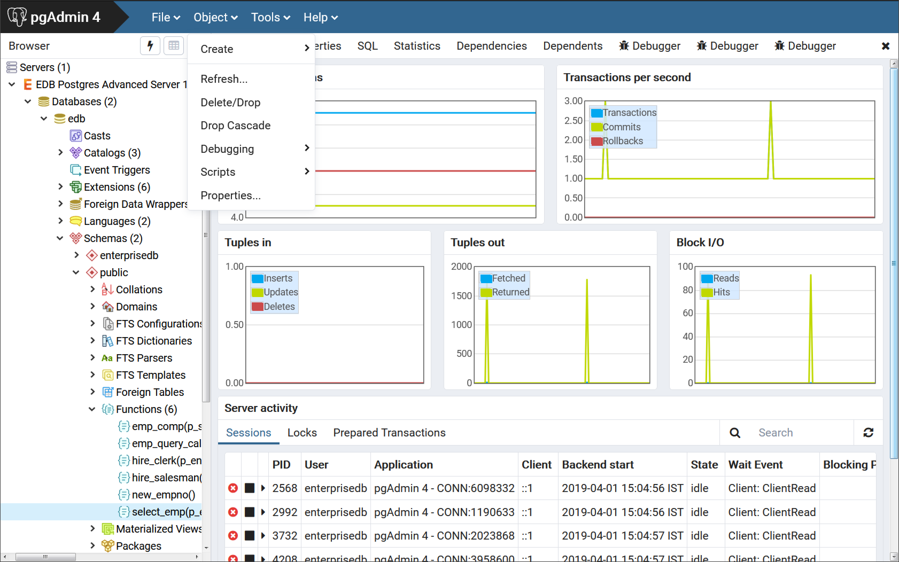

<div style="text-align: center"> Fig. 1: Starting the Debugger from the Object menu </div>


You can also right-click on the name of the stored procedure or function in the pgAdmin 4 `Browser`, and select `Debugging`, and the `Debug` from the context menu.

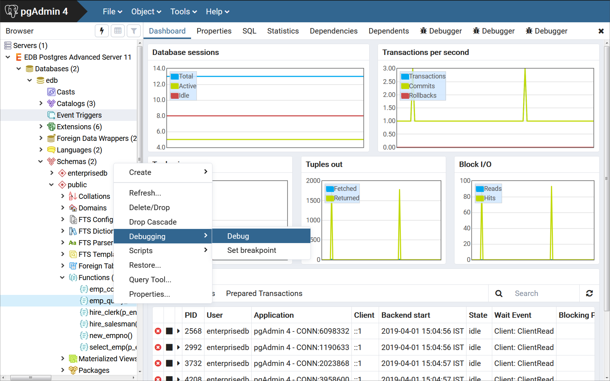

<div style="text-align: center"> Fig. 2: Starting the Debugger from the Object's context menu </div>


Note that triggers cannot be debugged using standalone debugging. Triggers must be debugged using in-context debugging. See the [Setting Global Breakpoint for In-Context Debugging](#setting_global_breakpoint_for_in_context_debugging) for information on setting a global breakpoint for in-context debugging.

To debug a package, highlight the specific procedure or function under the package node of the package you wish to debug and follow the same directions as for stored procedures and functions.

## The Debugger Window

You can use the `Debugger` window to pass parameter values when you are standalone-debugging a program that expects parameters. When you start the debugger, the `Debugger` window opens automatically to display any `IN` or `IN OUT` parameters expected by the program. If the program declares no `IN` or `IN OUT` parameters, the `Debugger` window does not open.

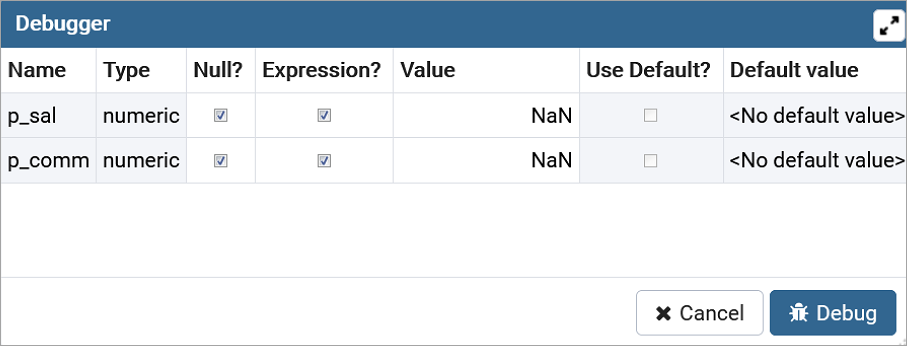

<div style="text-align: center"> Fig. 3: The Debugger window </div>


Use the fields on the `Debugger` window to provide a value for each parameter:

-   The `Name` field contains the formal parameter name.
-   The `Type` field contains the parameter data type.
-   Check the `Null?` checkbox to indicate that the parameter is a `NULL` value.
-   Check the `Expression?` checkbox if the `Value` field contains an expression.
-   The `Value` field contains the parameter value that will be passed to the program.
-   Check the `Use Default?` checkbox to indicate that the program should use the value in the `Default Value` field.
-   The `Default Value` field contains the default value of the parameter.

Press the `Tab` key to select the next parameter in the list for data entry, or click on a `Value` field to select the parameter for data entry.

If you are debugging a procedure or function that is a member of a package that has an initialization section, check the `Debug Package Initializer` check box to instruct the Debugger to step into the package initialization section, allowing you to debug the initialization section code before debugging the procedure or function. If you do not select the check box, the Debugger executes the package initialization section without allowing you to see or step through the individual lines of code as they are executed.

After entering the desired parameter values, click the `Debug` button to start the debugging process. Click the `Cancel` button to terminate the Debugger.

!!! Note
    The `Debugger` window does not open during in-context debugging. Instead, the application calling the program to be debugged must supply any required input parameter values.

When you have completed a full debugging cycle by stepping through the program code, the `Debugger` window re-opens, allowing you to enter new parameter values and repeat the debugging cycle, or end the debugging session.

## Main Debugger Window

The Main Debugger window contains two panels:

-   The top `Program Body` panel displays the program source code.
-   The bottom `Tabs` panel provides a set of tabs for different information.

Use the `Tool Bar` icons located at the top panel to access debugging functions.

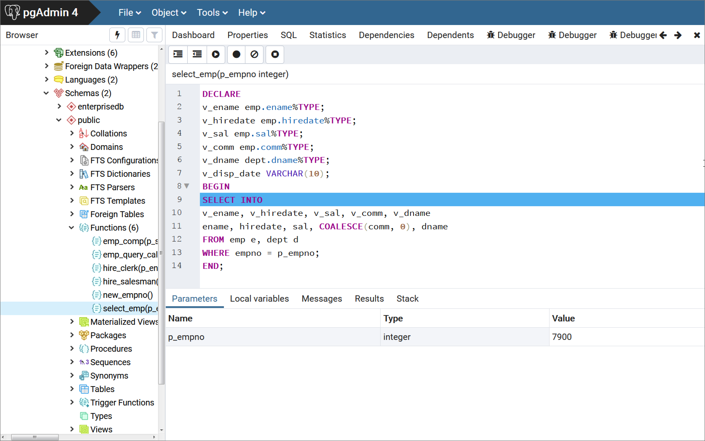

<div style="text-align: center"> Fig. 4: The Main Debugger window </div>


The two panels are described in the following sections.

### The Program Body Panel

The `Program Body` panel displays the source code of the program that is being debugged.

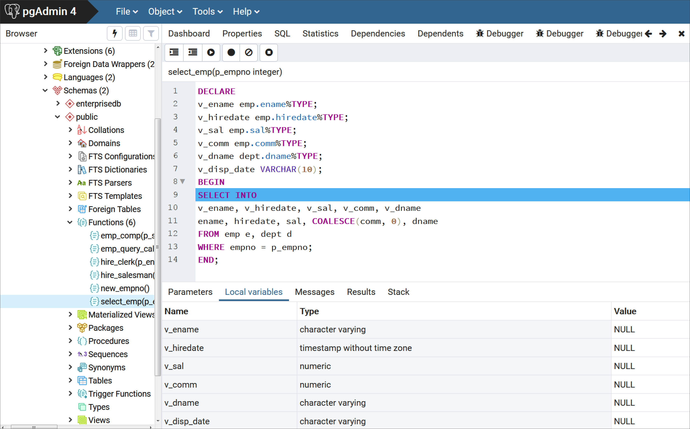

<div style="text-align: center"> Fig. 5: The Program Body </div>


The figure shows that the Debugger is about to execute the `SELECT` statement. The blue indicator in the program body highlights the next statement to execute.

### The Tabs Panel

You can use the bottom `Tabs` panel to view or modify parameter values or local variables, or to view messages generated by `RAISE INFO` and function results.

The following is the information displayed by the tabs in the panel:

-   The `Parameters` tab displays the current parameter values.
-   The `Local variables` tab displays the value of any variables declared within the program.
-   The `Messages` tab displays any results returned by the program as it executes.
-   The `Results` tab displays program results (if applicable) such as the value from the `RETURN` statement of a function.
-   The `Stack tab` displays the call stack.

The following figures show the results from the various tabs.

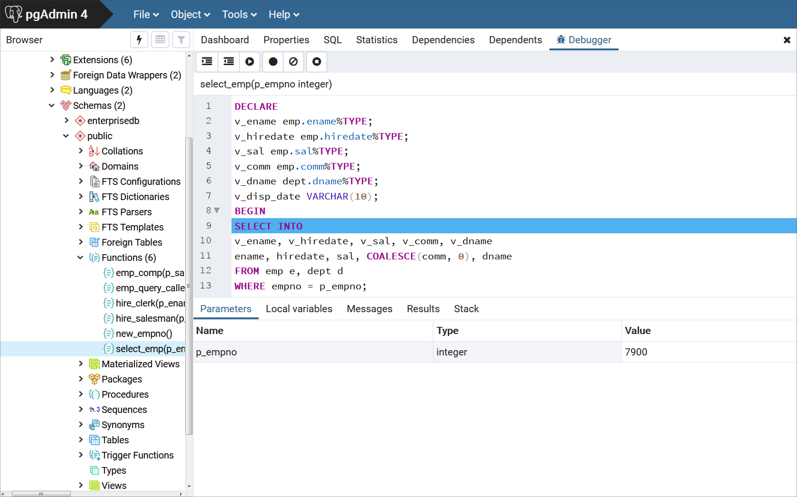

<div style="text-align: center"> Fig. 6: The Parameters tab </div>


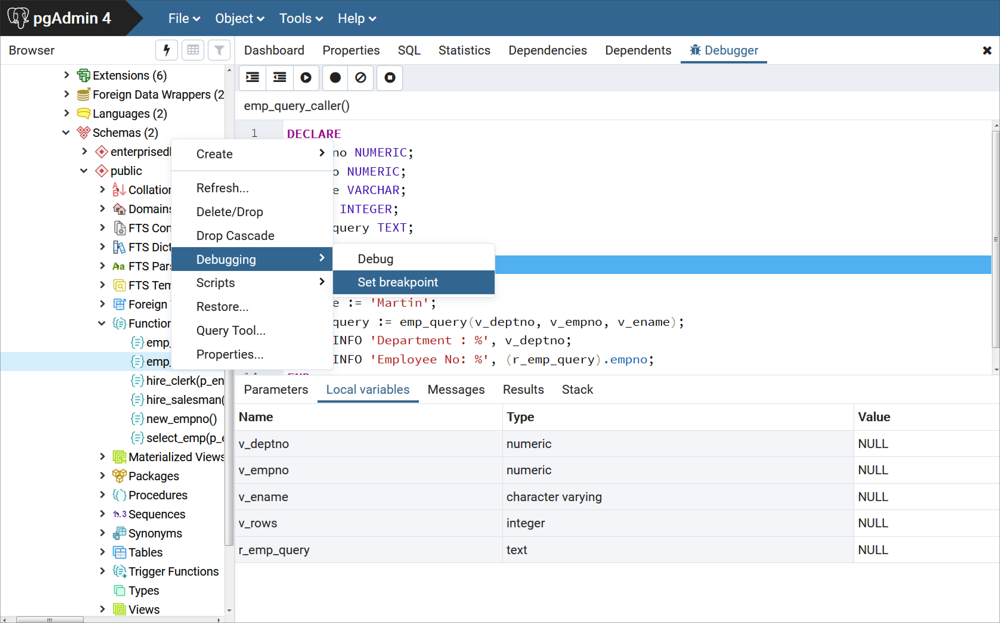

<div style="text-align: center"> Fig. 7: The Local variables tab </div>


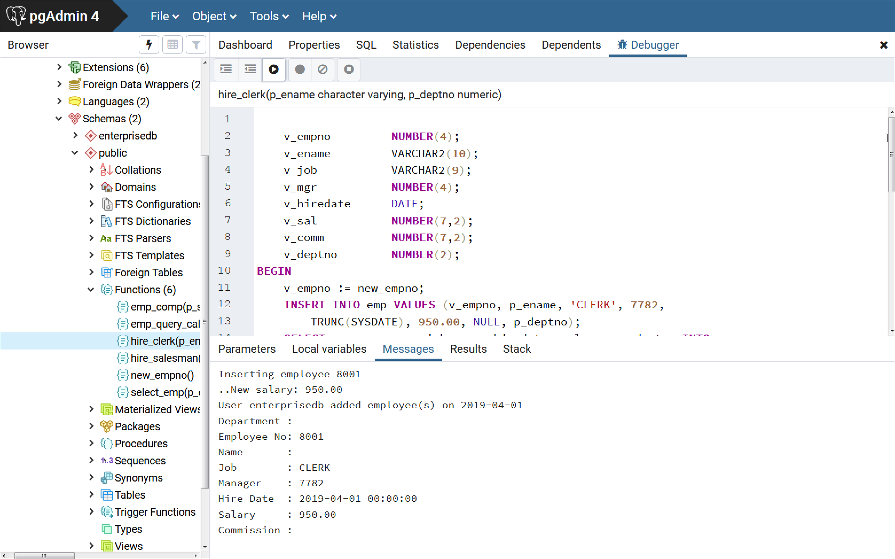

<div style="text-align: center"> Fig. 8: The Messages tab </div>


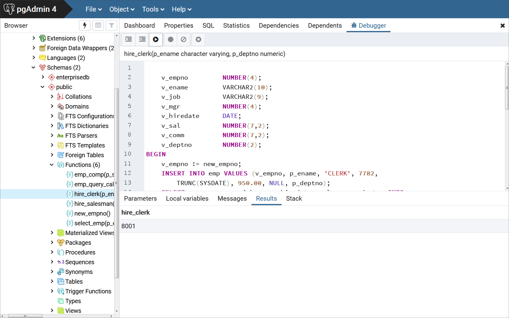

<div style="text-align: center"> Fig. 9: The Results tab </div>


### The Stack Tab

<div id="stack_tab" class="registered_link"></div>

The `Stack` tab displays a list of programs that are currently on the call stack (programs that have been invoked, but which have not yet completed). When a program is called, the name of the program is added to the top of the list displayed in the `Stack` tab. When the program ends, its name is removed from the list.

The `Stack` tab also displays information about program calls. The information includes:

-   The location of the call within the program
-   The call arguments
-   The name of the program being called

Reviewing the call stack can help you trace the course of execution through a series of nested programs.


<div style="text-align: center"> Fig. 10: A debugged program calling a subprogram </div>


The above figure shows that `emp_query_caller` is about to call a subprogram named `emp_query`. `emp_query_caller` is currently at the top of the call stack.

After the call to `emp_query` executes, `emp_query` is displayed at the top of the `Stack` tab, and its code is displayed in the `Program Body` panel.


<div style="text-align: center"> Fig. 11: Debugging the called subprogram </div>


Upon completion of execution of the subprogram, control returns to the calling program `(emp_query_caller)`, now displayed at the top of the `Stack` tab.


<div style="text-align: center"> Fig. 12: Control returns from debugged subprogram </div>


## Debugging a Program

You can perform the following operations to debug a program:

-   Step through the program one line at a time
-   Execute the program until you reach a breakpoint
-   View and change local variable values within the program

### Stepping Through the Code

Use the tool bar icons to step through a program with the Debugger:

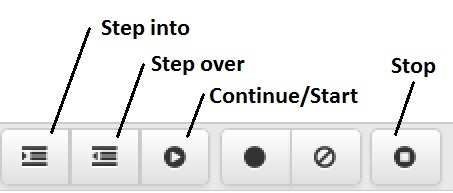

<div style="text-align: center"> Fig. 13: The Tool bar icons </div>


The icons serve the following purposes:

-   **Step into.** Click the `Step into` icon to execute the currently highlighted line of code.
-   **Step over.** Click the `Step over` icon to execute a line of code, stepping over any sub-functions invoked by the code. The sub-function executes, but is not debugged unless it contains a breakpoint.
-   **Continue/Start.** Click the `Continue/Start` icon to execute the highlighted code, and continue until the program encounters a breakpoint or completes.
-   **Stop.** Click the `Stop` icon to halt the execution of a program.

### Using Breakpoints

As the Debugger executes a program, it pauses whenever it reaches a breakpoint. When the Debugger pauses, you can observe or change local variables, or navigate to an entry in the call stack to observe variables or set other breakpoints. The next step into, step over, or continue operation forces the debugger to resume execution with the next line of code following the breakpoint. There are two types of breakpoints:

**Local Breakpoint -** A local breakpoint can be set at any executable line of code within a program. The Debugger pauses execution when it reaches a line where a local breakpoint has been set.

**Global Breakpoint -** A global breakpoint will trigger when *any* session reaches that breakpoint. Set a global breakpoint if you want to perform in-context debugging of a program. When a global breakpoint is set on a program, the debugging session that set the global breakpoint waits until that program is invoked in another session. A global breakpoint can only be set by a superuser.

To create a local breakpoint, left-click within the grey shaded margin to the left of the line of code where you want the local breakpoint set. Where you click in the grey shaded margin should be close to the right side of the margin as in the spot where the breakpoint dot is shown on source code line 12.

When created, the Debugger displays a dark dot in the margin, indicating a breakpoint has been set at the selected line of code.

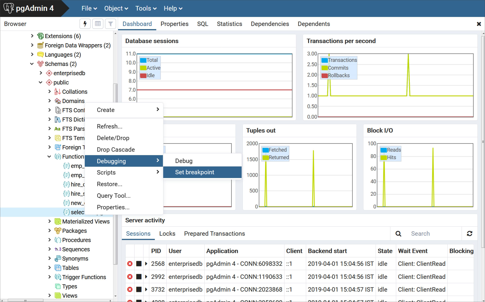

<div style="text-align: center"> Fig. 14: Set a breakpoint by clicking in left-hand margin </div>


You can set as many local breakpoints as desired. Local breakpoints remain in effect for the duration of a debugging session until they are removed.

**Removing a Local Breakpoint**

To remove a local breakpoint, left-click the mouse on the breakpoint dot in the grey shaded margin of the `Program Body` panel. The dot disappears, indicating that the breakpoint has been removed.

You can remove all of the breakpoints from the program that currently appears in the `Program Body` frame by clicking the `Clear all breakpoints` icon.

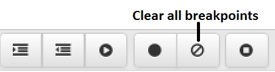

<div style="text-align: center"> Fig. 15: Clear all breakpoints icon </div>


!!! Note
    When you perform any of the preceding actions, only the breakpoints in the program that currently appears in the `Program Body` panel are removed. Breakpoints in called subprograms or breakpoints in programs that call the program currently appearing in the `Program Body` panel are not removed.

### Setting a Global Breakpoint for In-Context Debugging

<div id="setting_global_breakpoint_for_in_context_debugging" class="registered_link"></div>

To set a global breakpoint for in-context debugging, highlight the stored procedure, function, or trigger on which you wish to set the breakpoint in the `Browser` panel. Navigate through the `Object` menu to select `Debugging`, and then `Set Breakpoint`.

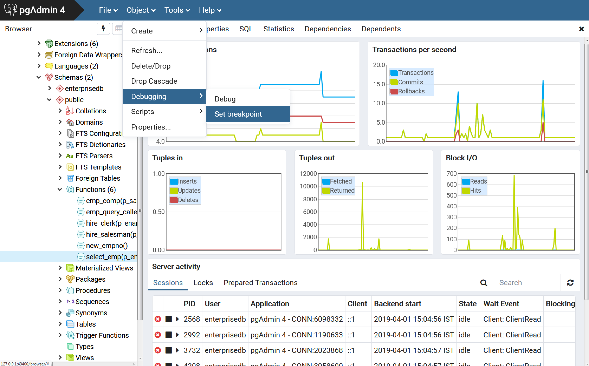

<div style="text-align: center"> Fig. 16: Setting a global breakpoint from the Object menu </div>


Alternatively, you can right-click on the name of the stored procedure, function, or trigger on which you wish to set a global breakpoint and select `Debugging`, then `Set Breakpoint` from the context menu as shown by the following.


<div style="text-align: center"> Fig. 17: Setting a global breakpoint from the Object's context menu </div>


To set a global breakpoint on a trigger, expand the table node that contains the trigger, highlight the specific trigger you wish to debug, and follow the same directions as for stored procedures and functions.

To set a global breakpoint in a package, highlight the specific procedure or function under the package node of the package you wish to debug and follow the same directions as for stored procedures and functions.

After you choose `Set Breakpoint`, the Debugger window opens and waits for an application to call the program to be debugged.

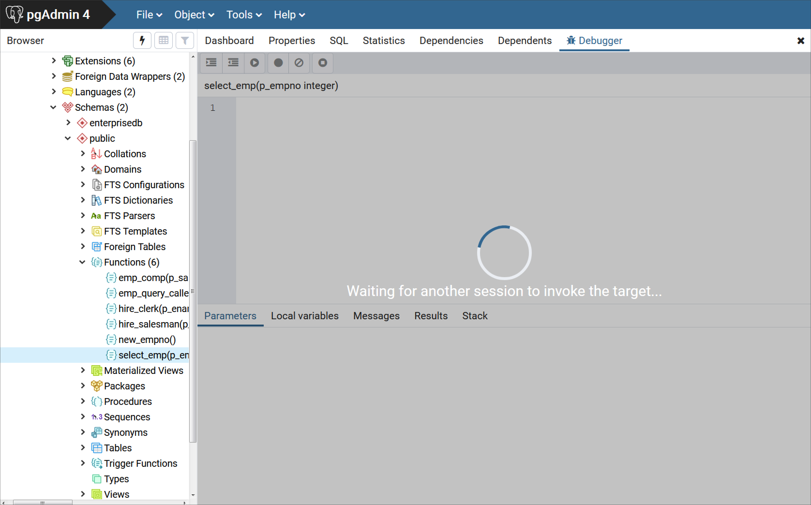

<div style="text-align: center"> Fig. 18: Waiting for invocation of program to be debugged </div>


The PSQL client invokes the `select_emp` function (on which a global breakpoint has been set).

```text
$ psql edb enterprisedb
psql.bin (12.0.0, server 12.0.0)
Type "help" for help.

edb=# SELECT select_emp(7900);
```

The `select_emp` function does not complete until you step through the program in the Debugger.


<div style="text-align: center"> Fig. 19: Program on which a global breakpoint has been set </div>


You can now debug the program using any of the previously discussed operations such as step into, step over, and continue, or set local breakpoints. When you have stepped through execution of the program, the calling application (PSQL) regains control and the `select_emp` function completes execution and its output is displayed.

```text
$ psql edb enterprisedb
psql.bin (12.0.0, server 12.0.0)
Type "help" for help.

edb=# SELECT select_emp(7900);
INFO: Number    : 7900
INFO: Name      : JAMES
INFO: Hire Date : 12/03/1981
INFO: Salary    : 950.00
INFO: Commission: 0.00
INFO: Department: SALES
 select_emp
------------
(1 row)
```

At this point, you can end the Debugger session. If you do not end the Debugger session, the next application that invokes the program will encounter the global breakpoint and the debugging cycle will begin again.

### Exiting the Debugger

To end a Debugger session and exit the Debugger, click on the close icon `(x)` located in the upper-right corner to close the tab.

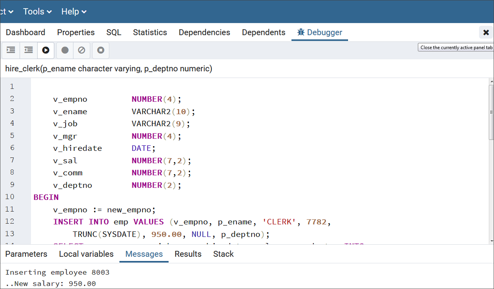

<div style="text-align: center"> Fig. 20: Exiting from the Debugger </div>


