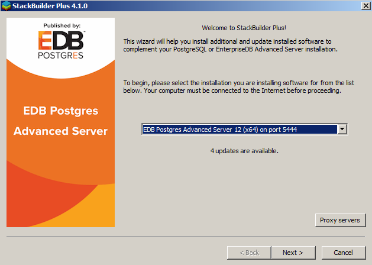
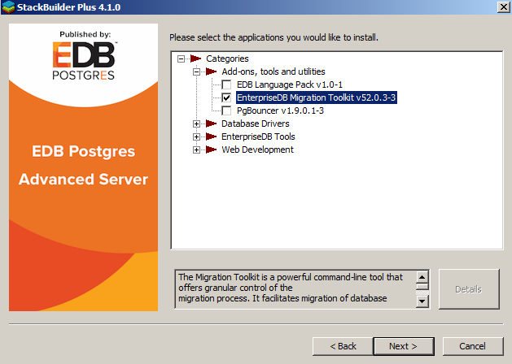
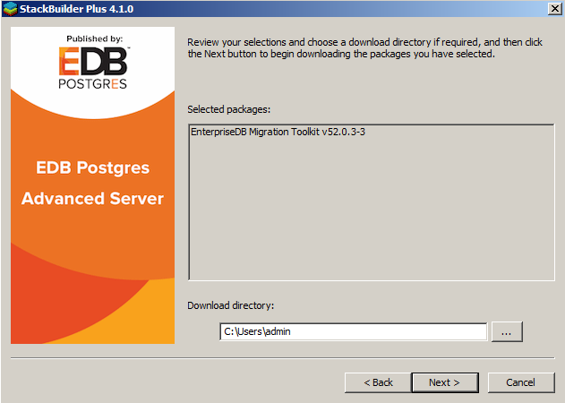
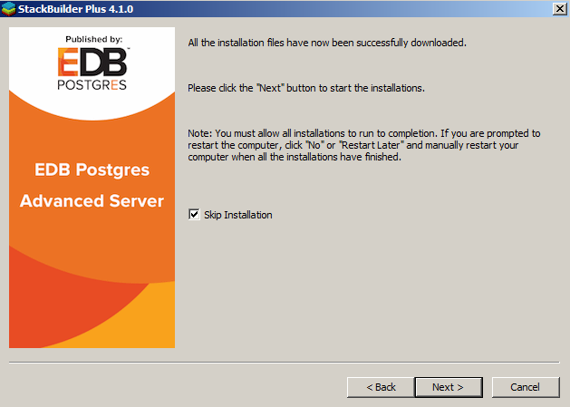

The StackBuilder Plus utility provides a graphical interface that simplifies the process of updating, downloading, and installing modules that complement your Advanced Server installation. When you install a module with StackBuilder Plus, StackBuilder Plus automatically resolves any software dependencies.

You can invoke StackBuilder Plus at any time after the installation has completed by selecting the `StackBuilder Plus` menu option from the `Apps` menu. Enter your system password (if prompted), and the StackBuilder Plus welcome window opens.

 Fig. 20: The StackBuilder Plus welcome window 

Use the drop-down listbox on the welcome window to select your Advanced Server installation.

StackBuilder Plus requires Internet access; if your installation of Advanced Server resides behind a firewall (with restricted Internet access), StackBuilder Plus can download program installers through a proxy server. The module provider determines if the module can be accessed through an HTTP proxy or an FTP proxy; currently, all updates are transferred via an HTTP proxy and the FTP proxy information is not used.

If the selected Advanced Server installation has restricted Internet access, use the `Proxy Servers` on the `Welcome` window to open the `Proxy servers` dialog.

 Fig. 21: The Proxy Servers dialog 

Enter the IP address and port number of the proxy server in the `HTTP proxy` on the `Proxy Servers` dialog. Currently, all StackBuilder Plus modules are distributed via HTTP proxy (FTP proxy information is ignored). Click `OK` to continue.

 Fig. 22: The StackBuilder Plus module selection window 

The tree control on the StackBuilder Plus module selection window displays a node for each module category.

Expand a module, and highlight a component name in the tree control to review a detailed description of the component. To add one or more components to the installation or to upgrade a component, check the box to the left of a module name and click `Next`.

StackBuilder Plus confirms the packages selected.

 Fig. 23: A summary window displays a list of selected packages 

Use the browse icon (...) to the right of the `Download directory` field to open a file selector, and choose an alternate location to store the downloaded installers. Click `Next` to connect to the server and download the required installation files.

When the download completes, a window opens that confirms the installation files have been downloaded and are ready for installation.

 Fig. 24: Confirmation that the download process is complete 

You can check the box next to `Skip Installation`, and select `Next` to exit StackBuilder Plus without installing the downloaded files, or leave the box unchecked and click `Next` to start the installation process.

Each downloaded installer has different requirements. As the installers execute, they may prompt you to confirm acceptance of license agreements, to enter passwords, and provide configuration information.

During the installation process, you may be prompted by one (or more) of the installers to restart your system. Select `No` or `Restart Later` until all installations are completed. When the last installation has completed, reboot the system to apply all of the updates.

You may occasionally encounter packages that don’t install successfully. If a package fails to install, StackBuilder Plus will alert you to the installation error with a popup dialog, and write a message to the log file at `%TEMP%`.

 Fig. 25: StackBuilder Plus confirms the completed installation 

When the installation is complete, StackBuilder Plus will alert you to the success or failure of the installations of the requested packages. If you were prompted by an installer to restart your computer, reboot now.
