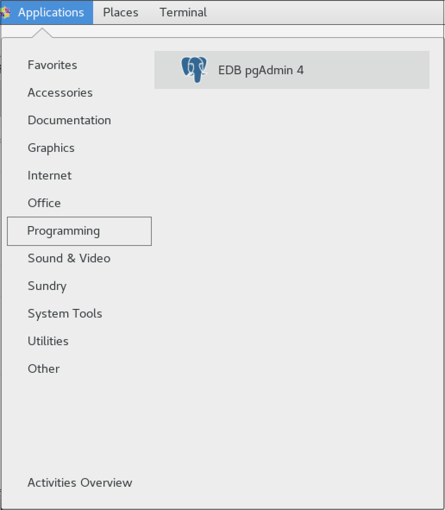
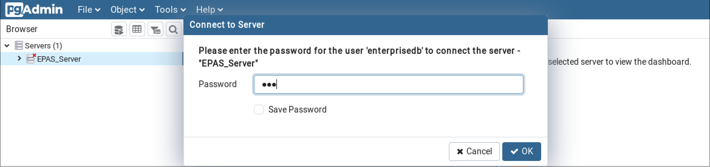

<div id="installing_and_configuring_pgadmin4" class="registered_link"></div>

pgAdmin 4 is the leading Open Source management tool for Postgres databases. EDB pgAdmin 4 is an enhanced version of open source pgAdmin 4 specifically for Advanced Server databases. It is designed to meet the needs of both novice and experienced Postgres users alike, providing a powerful graphical interface that simplifies the creation, maintenance, and use of database objects.

You can install EDB pgAdmin 4 for your Advanced Server database using the `yum` package manager for RHEL or CentOS 7.x platform and using `dnf` package manager for RHEL or Rocky Linux 8.x platform.

<div id="installing_edb_pgadmin_4_on_a_linux_host" class="registered_link"></div>

## Installing pgAdmin 4 on a Linux Host

You can use the following steps to install pgAdmin4 using `yum` package manager:

**Create a Repository Configuration File**

To create a repository configuration file, you must have the credentials that allow access to the EDB repository. For information about requesting credentials, visit:

<https://www.enterprisedb.com/user/login>

To create the repository configuration file, assume superuser privileges and invoke the following command:

```text
yum -y install https://yum.enterprisedb.com/edbrepos/edb-repo-latest.noarch.rpm
```

The repository configuration file is named `edb.repo`. The file resides in `/etc/yum.repos.d.`

After creating the `edb.repo` file, use the following command to replace the `USERNAME` and `PASSWORD` placeholders in the baseurl specification with the username and password of a registered EDB user:

```text
sed -i "s@<username>:<password>@USERNAME:PASSWORD@" /etc/yum.repos.d/edb.repo
```

!!! Note
    If you have `edb.repo` already configured then you can skip this step.

**Install EDB pgAdmin 4**

After creating the repository configuration file and adding a username and password to the `edb.repo` file, you can install `edb-pgadmin4`. To install `edb-pgadmin4`, assume superuser privileges and invoke the following command:

```text
yum install edb-pgadmin4*
```

The following packages will be installed:

-   `edb-pgadmin4`

-   `edb-pgadmin4-desktop-common`

-   `edb-pgadmin4-desktop-gnome`

-   `edb-pgadmin4-docs`

-   `edb-pgadmin4-web`

**Start pgAdmin 4 in Desktop Mode**

```text
/usr/edb/pgadmin4/bin/pgAdmin4
```

You can also start pgAdmin 4 in desktop mode from the `Applications` menu as shown below:



<div style="text-align: center"> Fig. 1: Accessing EDB pgAdmin 4 from Applications Menu. </div>


<div id="registering_and_connecting_advanced_server_on_edb_pgadmin_4" class="registered_link"></div>

## Registering and Connecting to Advanced Server with pgAdmin 4

First, you must register Advanced Server on pgAdmin 4. For information about registering your server, visit:

<https://www.pgadmin.org/docs/pgadmin4/latest/server_dialog.html>

To connect to your registered Advanced Server instance, right click on your server name, select `Connect Server`, and provide the password:



<div style="text-align: center"> Fig. 2: Connecting to EPAS Server through EDB pgAdmin 4. </div>


