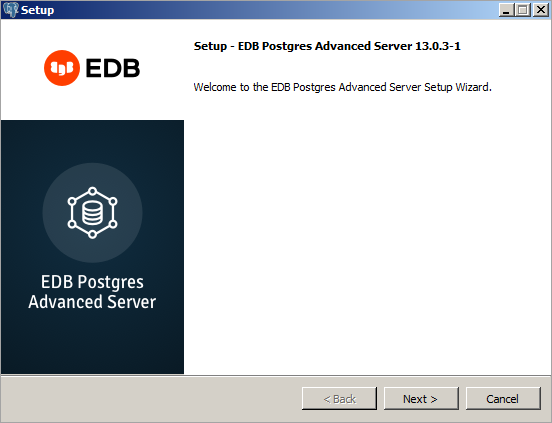

<div id="performing_an_installation_with_limited_privileges" class="registered_link"></div>


To perform an abbreviated installation of Advanced Server without access to administrative privileges, invoke the installer from the command line and include the `--extract-only` option. The `--extract-only` option extracts the binary files in an unaltered form, allowing you to experiment with a minimal installation of Advanced Server.

If you invoke the installer with the `--extract-only` options, you can either manually create a cluster and start the service, or run the installation script. To manually create the cluster, you must:

-   Use `initdb` to initialize the cluster
-   Configure the cluster
-   Use `pg_ctl` to start the service

For more information about the `initdb` and `pg_ctl` commands, see the PostgreSQL Core Documentation at:

> <https://www.postgresql.org/docs/current/static/app-initdb.html>
>
> <https://www.postgresql.org/docs/current/static/app-pg-ctl.html>

If you include the `--extract-only` option, the installer steps through a shortened form of the `Setup` wizard. During the brief installation process, the installer generates an installation script that can be later used to complete a more complete installation. You must have administrative privileges to invoke the installation script.

The installation script:

-   Initializes the database cluster if the cluster is empty.
-   Configures the server to start at boot-time.
-   Establishes initial values for Dynatune (dynamic tuning) variables.

The scripted Advanced Server installation does not create menu shortcuts or provide access to EDB Postgres StackBuilder Plus, and no modifications are made to registry files.

To perform a limited installation and generate an installation script, download and unpack the Advanced Server installer. Navigate into the directory that contains the installer, and invoke the installer with the command:

``` text
edb-as13-server-13.x.x-x-windows.exe --extract-only yes
```

A dialog opens, prompting you to choose an installation language. Select a language for the installation from the drop-down listbox, and click `OK` to continue. The `Setup Wizard` opens.

<figure><figcaption aria-hidden="true"><em>The Welcome window</em></figcaption></figure>

Click `Next` to continue.

<figure><figcaption aria-hidden="true"><em>Specify an installation directory</em></figcaption></figure>

On Windows, the default Advanced Server installation directory is:

``` text
C:\Program Files\edb\as13
```

You can accept the default installation location and click `Next` to continue to the `Ready to Install` window, or optionally click the `File Browser` icon to choose an alternate installation directory.

<figure><figcaption aria-hidden="true"><em>The Setup wizard is ready to install Advanced Server</em></figcaption></figure>

Click `Next` to proceed with the Advanced Server installation. During the installation, progress bars and popups mark the installation progress. The installer notifies you when the installation is complete.

<figure><figcaption aria-hidden="true"><em>The Advanced Server installation is complete</em></figcaption></figure>

After completing the minimal installation, you can execute a script to initialize a cluster and start the service. The script is (by default) located in:

``` text
C:\Program Files\edb
```
