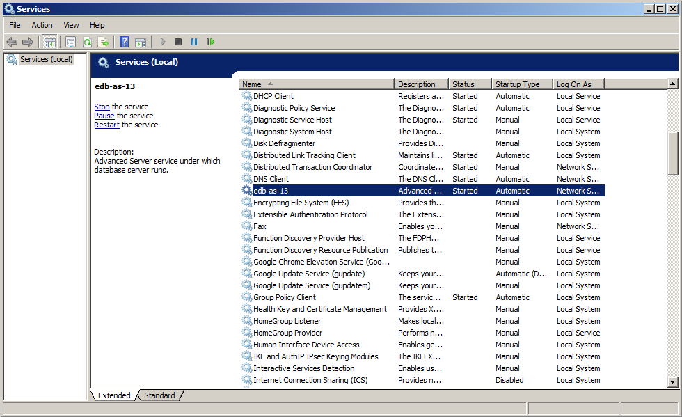

The Windows operating system includes a graphical service controller that offers control of Advanced Server and the services associated with Advanced Server components. The `Services` utility can be accessed through the `Administrative Tools` section of the Windows `Control Panel`.

Fig. 1: *The Advanced Server service in the Windows Services window*

The `Services` window displays an alphabetized list of services; the `edb-as-13` service controls Advanced Server.

-   Use the `Stop the service` option to stop the instance of Advanced Server. Please note that any user (or client application) connected to the Advanced Server instance will be abruptly disconnected if you stop the service.
-   Use the `Start the service` option to start the Advanced Server service.
-   Use the `Pause the service` option to tell Advanced Server to reload the server configuration parameters without disrupting user sessions for many of the configuration parameters. See [Configuring Advanced Server](../06_configuring_advanced_server/#configuring_advanced_server) for more information about the parameters that can be updated with a server reload.
-   Use the `Restart the service` option to stop and then start the Advanced Server. Please note that any user sessions will be terminated when you stop the service. This option is useful to reset server parameters that only take effect on server start.
