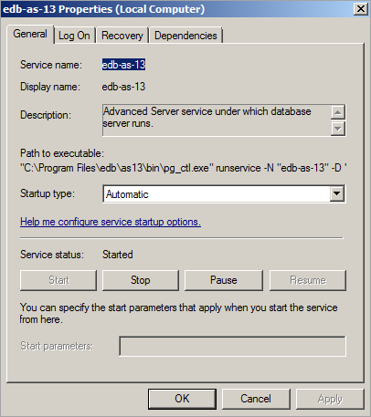

You can use the Windows Services utility to control the startup behavior of the server. Right click on the name of the service you wish to update, and select `Properties` from the context menu to open the `Properties` dialog.

Use the drop-down listbox in the `Startup type` field to specify how the Advanced Server service will behave when the host starts.

 Fig. 2: Specifying Advanced Server's startup behavior 

-   Specify `Automatic (Delayed Start)` to instruct the service controller to start after boot.
-   Specify `Automatic` to instruct the service controller to start and stop the server whenever the system starts or stops.
-   Specify `Manual` to instruct the service controller that the server must be started manually.
-   Specify `Disabled` to instruct the service controller to disable the service; after disabling the service, you must stop the service or restart the server to make the change take effect. Once disabled, the server’s status cannot be changed until `Startup type` is reset to `Automatic (Delayed Start)`, `Automatic`, or `Manual`.
