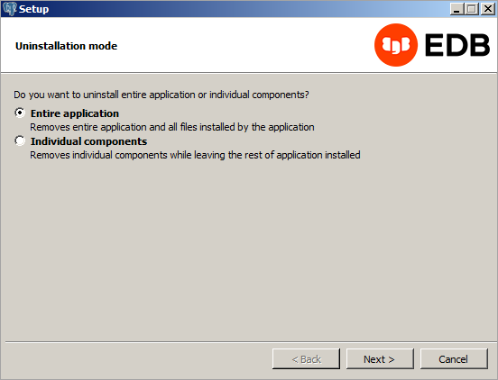
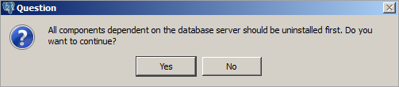
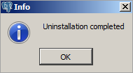

<div id="uninstalling_advanced_server" class="registered_link"></div>


Note that after uninstalling Advanced Server, the cluster data files remain intact and the service user persists. You may manually remove the cluster data and service user from the system.

## Using Advanced Server Uninstallers at the Command Line

The Advanced Server interactive installer creates an uninstaller that you can use to remove Advanced Server or components that reside on a Windows host. The uninstaller is created in `C:\Program Files\edb\as13`. To open the uninstaller, assume superuser privileges, navigate into the directory that contains the uninstaller, and enter:

``` text
uninstall-edb-as13-server.exe
```

The uninstaller opens.

<figure><figcaption aria-hidden="true"><em>The Advanced Server uninstaller</em></figcaption></figure>

You can remove the `Entire application` (the default), or select the radio button next to `Individual components` to select components for removal; if you select `Individual components`, a dialog will open, prompting you to select the components you wish to remove. After making your selection, click `Next`.

<figure><figcaption aria-hidden="true"><em>Acknowledge that dependent components are removed first</em></figcaption></figure>

If you have elected to remove components that are dependent on Advanced Server, those components will be removed first; click `Yes` to acknowledge that you wish to continue.

Progress bars are displayed as the software is removed. When the uninstallation is complete, an `Info` dialog opens to confirm that Advanced Server (and/or its components) has been removed.

<figure><figcaption aria-hidden="true"><em>The uninstallation is complete</em></figcaption></figure>
