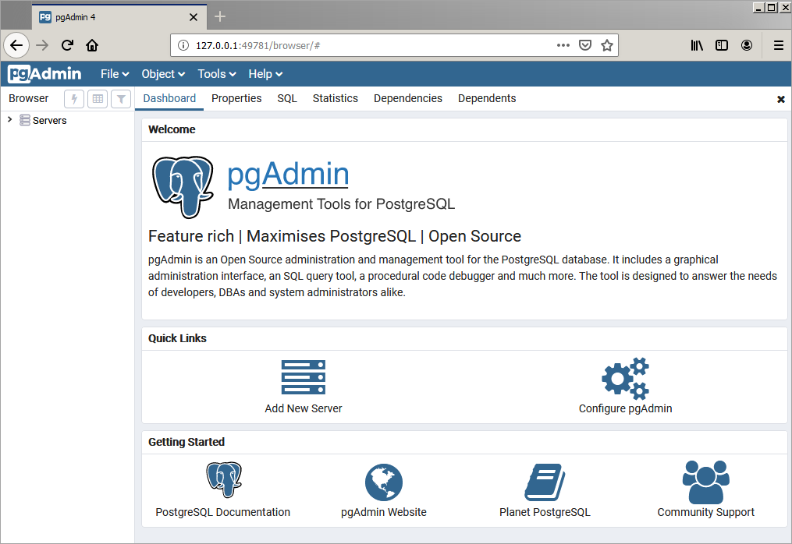

When you install Advanced Server on Windows using the graphical installer, you have the option to install pgAdmin 4 along with Advanced Server:

<figure><figcaption aria-hidden="true"><em>pgAdmin 4 installation through installer</em></figcaption></figure>

To install pgAdmin 4 along with Advanced Server, select the checkbox next to `pgAdmin 4` and click `Next`. pgAdmin 4 will be installed along with the other components of Advanced Server in the directory shown below:

<figure><figcaption aria-hidden="true"><em>pgAdmin 4 installation directory</em></figcaption></figure>

After the installation completes, you can launch the application from the Windows `Start` menu; simply navigate through the Advanced Server 13 menu to select `pgAdmin 4`. The client opens as shown below.

<figure><figcaption aria-hidden="true"><em>Welcome screen of pgAdmin 4</em></figcaption></figure>
