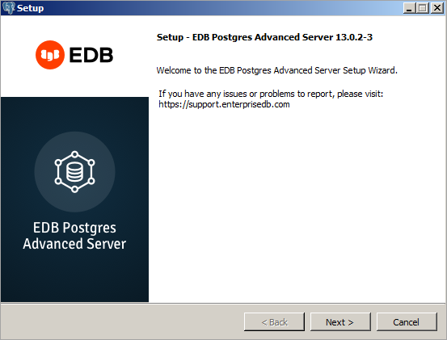
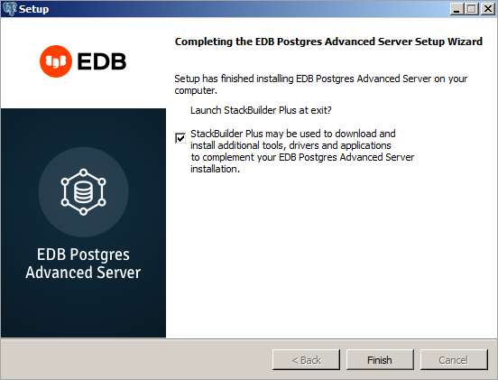

Advanced Server adds extended functionality to the open-source PostgreSQL database that supports database administration, enhanced SQL capabilities, database and application security, performance monitoring and analysis, and application development utilities. Advanced Server also supports database compatibility features for Oracle users; for detailed information about compatibility features, see the Advanced Server documentation.

This guide will walk you through using the graphical installer to install EDB Postgres Advanced Server on a Windows system. The database created by this tutorial is well-suited for experimentation and testing. There are likely to be additional security and resource considerations when configuring a production installation that are not covered by this document.

This guide assumes that you are familiar with simple operating system and system administration procedures, and have administrative privileges on the host on which Advanced Server will be installed.

Please note that if you are using the pdf version of this document, using cut/paste to copy a command may result in extra spaces or carriage returns in the pasted command. If a command fails, check the command carefully for extra characters.

**Components of an EDB Postgres Advanced Server Deployment**

Among the components that make up an Advanced Server deployment are:

> **The Database Server** - The database server (the `postmaster`) is the service that provides the key functionality that allows you to store and manage data. Advanced Server is built on the PostgreSQL open-source database project; it includes all of the documented features of community PostgreSQL and more.
>
> **The Database Cluster** - A cluster is a set of on-disk structures that comprise a collection of databases. A cluster is serviced by a single-instance of the database server. A database cluster is stored in the `data` directory; please note that the `data` directory of a production database should not be stored on an NFS file system.
>
> **Configuration Files** - You can use the parameters listed in Postgres configuration files to manage deployment preferences, security preferences, connection behaviors, and logging preferences.
>
> **Supporting Tools, Utilities, and Clients** - EDB makes available a full suite of tools and utilities that can help you monitor and manage your Advanced Server deployment. For more information, visit the [EDB website](https://www.enterprisedb.com/).
>
> **Supporting Functions, Procedures, Data Types, Index Types, Operators, Utilities, and Aggregates** - Advanced Server includes a number of features that help you manage your data.

Please note: The `data` directory of a production database should not be stored on an NFS file system.

**Installation Prerequisites**

**User Privileges**

To perform an Advanced Server installation on a Windows system, you must have administrator privileges. If you are installing Advanced Server on a Windows system that is configured with `User Account Control` enabled, you can assume sufficient privileges to invoke the graphical installer by right clicking on the name of the installer and selecting `Run as administrator` from the context menu.

**Windows-specific Software Requirements**

You should apply Windows operating system updates before invoking the Advanced Server installer. If (during the installation process) the installer encounters errors, exit the installation, and ensure that your version of Windows is up-to-date before restarting the installer.

**Migration Toolkit or EDB\*Plus Installation Pre-requisites**

Before using StackBuilder Plus to install Migration Toolkit or EDB\*Plus, you must first install Java (version 1.8 or later). If you are using Windows, Java installers and instructions are available online at:

> <http://www.java.com/en/download/manual.jsp>

**Installing and Configuring Advanced Server**

The graphical installer provides a quick and easy way to install Advanced Server 13 on a Windows system. Use the wizard's dialogs to specify information about your system and system usage; when you have completed the dialogs, the installer performs an installation based on the selections made during the setup process.

To invoke the wizard, you must have administrator privileges. Assume administrator privileges, and double-click the `edb-as13-server-13.x.x-x-windows-x64` executable file.

<div class="note">

<div class="title">

Note

</div>

To install Advanced Server on some versions of Windows, you may be required to right click on the file icon and select `Run as Administrator` from the context menu to invoke the installer with `Administrator` privileges.

</div>

When the `Language Selection` popup opens, select an installation language and click `OK` to continue to the `Setup` window.

<figure><figcaption aria-hidden="true"><em>The Advanced Server installer Welcome window</em></figcaption></figure>

Click `Next` to continue.

The EnterpriseDB `License Agreement` opens.

<figure><figcaption aria-hidden="true"><em>The EnterpriseDB License Agreement</em></figcaption></figure>

Carefully review the license agreement before highlighting the appropriate radio button; click `Next` to continue.

The `Installation Directory` window opens.

<figure><figcaption aria-hidden="true"><em>The Installation Directory window</em></figcaption></figure>

By default, the Advanced Server installation directory is:

``` text
C:\Program Files\edb\as13
```

You can accept the default installation location, and click `Next` to continue, or optionally click the `File Browser` icon to open the `Browse For Folder` dialog to choose an alternate installation directory.

<div class="note">

<div class="title">

Note

</div>

The `data` directory of a production database should not be stored on an NFS file system.

</div>

<figure><figcaption aria-hidden="true"><em>The Select Components window</em></figcaption></figure>

The `Select Components` window contains a list of optional components that you can install with the Advanced Server `Setup` wizard. You can omit a module from the Advanced Server installation by deselecting the box next to the components name.

The `Setup` wizard can install the following components while installing Advanced Server 13:

**EDB Postgres Advanced Server**

> Select the `EDB Postgres Advanced Server` option to install Advanced Server 13.

**pgAdmin 4**

> Select the `pgAdmin 4` option to install the pgAdmin 4 client. pgAdmin 4 provides a powerful graphical interface for database management and monitoring.

**StackBuilder Plus**

> The `StackBuilder Plus` utility is a graphical tool that can update installed products, or download and add supporting modules (and the resulting dependencies) after your Advanced Server setup and installation completes.

**Command Line Tools**

> The `Command Line Tools` option installs command line tools and supporting client libraries including:
>
> -   libpq
> -   psql
> -   EDB\*Loader
> -   ecpgPlus
> -   pg\_basebackup, pg\_dump, and pg\_restore
> -   pg\_bench
> -   and more.

<div class="note">

<div class="title">

Note

</div>

The `Command Line Tools` are required if you are installing Advanced Server or pgAdmin 4.

</div>

After selecting the components you wish to install, click `Next` to open the `Additional Directories` window.

<figure><figcaption aria-hidden="true"><em>The Additional Directories window</em></figcaption></figure>

By default, the Advanced Server `data` files are saved to:

``` text
C:\Program Files\edb\as13\data
```

The default location of the Advanced Server `Write-Ahead Log (WAL) Directory` is:

``` text
C:\Program Files\edb\as13\data\pg_wal
```

Advanced Server uses write-ahead logs to promote transaction safety and speed transaction processing; when you make a change to a table, the change is stored in shared memory and a record of the change is written to the write-ahead log. When you perform a `COMMIT`, Advanced Server writes contents of the write-ahead log to disk.

Accept the default file locations, or use the `File Browser` icon to select an alternate location; click `Next` to continue to the `Advanced Server Dialect` window.

<figure><figcaption aria-hidden="true"><em>The Advanced Server Dialect window</em></figcaption></figure>

Use the drop-down listbox on the `Advanced Server Dialect` window to choose a server dialect. The server dialect specifies the compatibility features supported by Advanced Server.

By default, Advanced Server installs in `Compatible with Oracle` mode; you can choose between `Compatible with Oracle` and `Compatible with PostgreSQL` installation modes.

**Compatible with Oracle**

If you select `Compatible with Oracle`, the installation will include the following features:

-   Data dictionary views that is compatible with Oracle databases.
-   Oracle data type conversions.
-   Date values displayed in a format compatible with Oracle syntax.
-   Support for Oracle-styled concatenation rules (if you concatenate a string value with a `NULL` value, the returned value is the value of the string).
-   Schemas (`dbo` and `sys`) compatible with Oracle databases added to the `SEARCH_PATH`.
-   Support for the following Oracle built-in packages:

| Package         | Functionality compatible with Oracle Databases                                                                                                                               |
|-----------------|------------------------------------------------------------------------------------------------------------------------------------------------------------------------------|
| dbms\_alert     | Provides the capability to register for, send, and receive alerts.                                                                                                           |
| dbms\_job       | Provides the capability for the creation, scheduling, and managing of jobs.                                                                                                  |
| dbms\_lob       | Provides the capability to manage on large objects.                                                                                                                          |
| dbms\_output    | Provides the capability to send messages to a message buffer, or get messages from the message buffer.                                                                       |
| dbms\_pipe      | Provides the capability to send messages through a pipe within or between sessions connected to the same database cluster.                                                   |
| dbms\_rls       | Enables the implementation of Virtual Private Database on certain Advanced Server database objects.                                                                          |
| dbms\_sql       | Provides an application interface to the EDB dynamic SQL functionality.                                                                                                      |
| dbms\_utility   | Provides various utility programs.                                                                                                                                           |
| dbms\_aqadm     | Provides supporting procedures for Advanced Queueing functionality.                                                                                                          |
| dbms\_aq        | Provides message queueing and processing for Advanced Server.                                                                                                                |
| dbms\_profiler  | Collects and stores performance information about the PL/pgSQL and SPL statements that are executed during a performance profiling session.                                  |
| dbms\_random    | Provides a number of methods to generate random values.                                                                                                                      |
| dbms\_redact    | Enables the redacting or masking of data that is returned by a query.                                                                                                        |
| dbms\_lock      | Provides support for the `DBMS_LOCK.SLEEP` procedure.                                                                                                                        |
| dbms\_scheduler | Provides a way to create and manage jobs, programs, and job schedules.                                                                                                       |
| dbms\_crypto    | Provides functions and procedures to encrypt or decrypt RAW, BLOB or CLOB data. You can also use `DBMS_CRYPTO` functions to generate cryptographically strong random values. |
| dbms\_mview     | Provides a way to manage and refresh materialized views and their dependencies.                                                                                              |
| dbms\_session   | Provides support for the `DBMS_SESSION.SET_ROLE` procedure.                                                                                                                  |
| utl\_encode     | Provides a way to encode and decode data.                                                                                                                                    |
| utl\_http       | Provides a way to use the HTTP or HTTPS protocol to retrieve information found at an URL.                                                                                    |
| utl\_file       | Provides the capability to read from, and write to files on the operating system’s file system.                                                                              |
| utl\_smtp       | Provides the capability to send e-mails over the Simple Mail Transfer Protocol (SMTP).                                                                                       |
| utl\_mail       | Provides the capability to manage e-mail.                                                                                                                                    |
| utl\_url        | Provides a way to escape illegal and reserved characters within an URL.                                                                                                      |
| utl\_raw        | Provides a way to manipulate or retrieve the length of raw data types.                                                                                                       |

This is not a comprehensive list of the compatibility features for Oracle included when Advanced Server is installed in `Compatible with Oracle` mode; for more information, see the *Database Compatibility for Oracle Developer’s Guide* available from the EDB website at:

> <https://www.enterprisedb.com/edb-docs>

If you choose to install in `Compatible with Oracle` mode, the Advanced Server superuser name is `enterprisedb`.

**Compatible with PostgreSQL**

If you select `Compatible with PostgreSQL`, Advanced Server will exhibit compatibility with PostgreSQL version 13. If you choose to install in `Compatible with PostgreSQL` mode, the default Advanced Server superuser name is `postgres`.

For detailed information about PostgreSQL functionality, visit the official PostgreSQL website at:

> <http://www.postgresql.org>

After specifying a configuration mode, click `Next` to continue to the `Password` window.

<figure><figcaption aria-hidden="true"><em>The Password window</em></figcaption></figure>

Advanced Server uses the password specified on the `Password` window for the database superuser. The specified password must conform to any security policies existing on the Advanced Server host.

After you enter a password in the `Password` field, confirm the password in the `Retype Password` field, and click `Next` to continue.

The `Additional Configuration` window opens.

<figure><figcaption aria-hidden="true"><em>The Additional Configuration window</em></figcaption></figure>

Use the fields on the `Additional Configuration` window to specify installation details:

-   Use the `Port` field to specify the port number that Advanced Server should listen to for connection requests from client applications. The default is `5444`.
-   If the `Locale` field is set to `[Default locale]`, Advanced Server uses the system locale as the working locale. Use the drop-down listbox next to `Locale` to specify an alternate locale for Advanced Server.
-   By default, the `Setup` wizard installs corresponding sample data for the server dialect specified by the compatibility mode `(Oracle` or `PostgreSQL)`. Clear the check box next to `Install sample tables and procedures` if you do not wish to have sample data installed.

After verifying the information on the `Additional Configuration` window, click `Next` to open the `Dynatune Dynamic Tuning: Server Utilization` window.

The graphical `Setup` wizard facilitates performance tuning via the Dynatune Dynamic Tuning feature. Dynatune functionality allows Advanced Server to make optimal usage of the system resources available on the host machine on which it is installed.

<figure><figcaption aria-hidden="true"><em>The Dynatune Dynamic Tuning: Server Utilization window</em></figcaption></figure>

The `edb_dynatune` configuration parameter determines how Advanced Server allocates system resources. Use the radio buttons on the `Server Utilization` window to set the initial value of the `edb_dynatune` configuration parameter:

-   Select `Development` to set the value of `edb_dynatune` to `33`. A low value dedicates the least amount of the host machine’s resources to the database server. This is a good choice for a development machine.
-   Select `General Purpose` to set the value of `edb_dynatune` to `66`. A mid-range value dedicates a moderate amount of system resources to the database server. This would be a good setting for an application server with a fixed number of applications running on the same host as Advanced Server.
-   Select `Dedicated` to set the value of `edb_dynatune` to `100`. A high value dedicates most of the system resources to the database server. This is a good choice for a dedicated server host.

After the installation is complete, you can adjust the value of `edb_dynatune` by editing the `postgresql.conf` file, located in the `data` directory of your Advanced Server installation. After editing the `postgresql.conf` file, you must restart the server for your changes to take effect.

Select the appropriate setting for your system, and click `Next` to continue to the `Dynatune Dynamic Tuning: Workload Profile` window.

<figure><figcaption aria-hidden="true"><em>The Dynatune Dynamic Tuning: Workload Profile window</em></figcaption></figure>

Use the radio buttons on the `Workload Profile` window to specify the initial value of the `edb_dynatune_profile` configuration parameter. The `edb_dynatune_profile` parameter controls performance-tuning aspects based on the type of work that the server performs.

-   Select `Transaction Processing (OLTP systems)` to specify an `edb_dynatune_profile` value of `oltp`. Recommended when Advanced Server is supporting heavy online transaction processing.
-   Select `General Purpose (OLTP and reporting workloads)` to specify an `edb_dynatune_profile` value of `mixed`. Recommended for servers that provide a mix of transaction processing and data reporting.
-   Select `Reporting (Complex queries or OLAP workloads)` to specify an `edb_dynatune_profile` value of `reporting`. Recommended for database servers used for heavy data reporting.

After the installation is complete, you can adjust the value of `edb_dynatune_profile` by editing the `postgresql.conf` file, located in the `data` directory of your Advanced Server installation. After editing the `postgresql.conf` file, you must restart the server for your changes to take effect.

For more information about `edb_dynatune` and other performance-related topics, see the *EDB Postgres Advanced Server Guide* available from the EDB website at:

> <https://www.enterprisedb.com/edb-docs>

Click `Next` to continue. The `Update Notification Service` window opens.

<figure><figcaption aria-hidden="true"><em>The Update Notification Service window</em></figcaption></figure>

When enabled, the update notification service notifies you of any new updates and security patches available for your installation of Advanced Server.

By default, Advanced Server is configured to start the service when the system boots; clear the `Install Update Notification Service` check box, or accept the default, and click `Next` to continue.

The `Pre Installation Summary` opens.

<figure><figcaption aria-hidden="true"><em>The Pre Installation Summary</em></figcaption></figure>

The `Pre Installation Summary` provides an overview of the options specified during the `Setup` process. Review the options before clicking `Next`; click `Back` to navigate back through the dialogs and update any options.

The `Ready to Install` window confirms that the installer has the information it needs about your configuration preferences to install Advanced Server. Click `Next` to continue.

<figure><figcaption aria-hidden="true"><em>The Ready to Install window</em></figcaption></figure>

<figure><figcaption aria-hidden="true"><em>Installing Advanced Server</em></figcaption></figure>

As each supporting module is unpacked and installed, the module’s installation is confirmed with a progress bar.

Before the `Setup` wizard completes the Advanced Server installation, it offers to `Launch StackBuilder Plus at exit?`

<figure><figcaption aria-hidden="true"><em>The Setup wizard offers to Launch StackBuilder Plus at exit</em></figcaption></figure>

You can clear the `StackBuilder Plus` check box and click `Finish` to complete the Advanced Server installation, or accept the default and proceed to StackBuilder Plus.

EDB Postgres StackBuilder Plus is included with the installation of Advanced Server and its core supporting components. StackBuilder Plus is a graphical tool that can update installed products, or download and add supporting modules (and the resulting dependencies) after your Advanced Server setup and installation completes.

For more detailed product usage information, see the [Advanced Server documentation, available at the EDB website](https://www.enterprisedb.com/edb-docs/).
