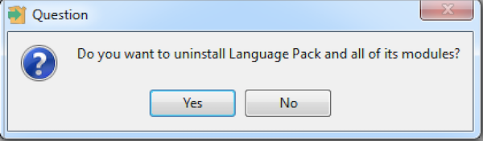
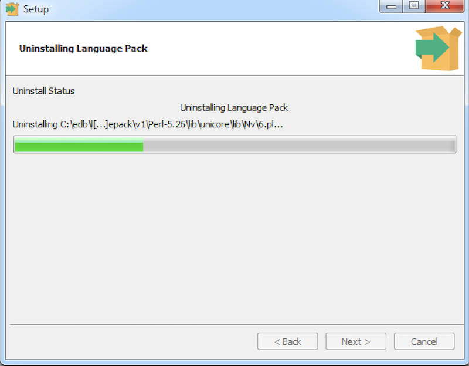

The following section outlines the process of uninstalling Language Pack.

The Language Pack graphical installer creates an uninstaller that you can use to remove Language Pack. The uninstaller is created in the installation directory.

Perform the following steps to uninstall Language Pack:

1.  Navigate into the directory that contains the uninstaller and assume superuser privileges. Open the uninstaller and click `Yes` to begin uninstalling Language Pack.

Fig. 1: The Language Pack Uninstaller

2.  The uninstallation process begins. Click `OK` when the uninstallation completes.

Fig. 2: Uninstalling Language Pack
