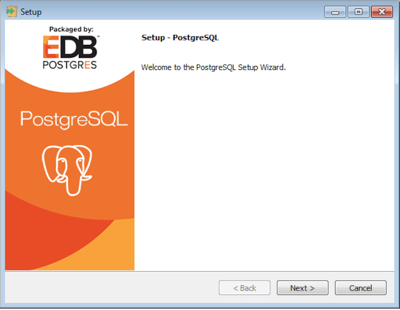
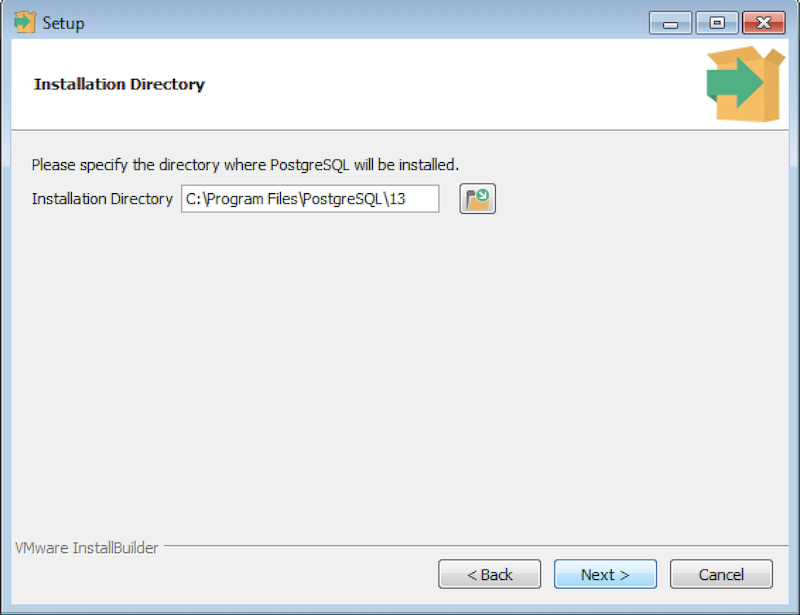
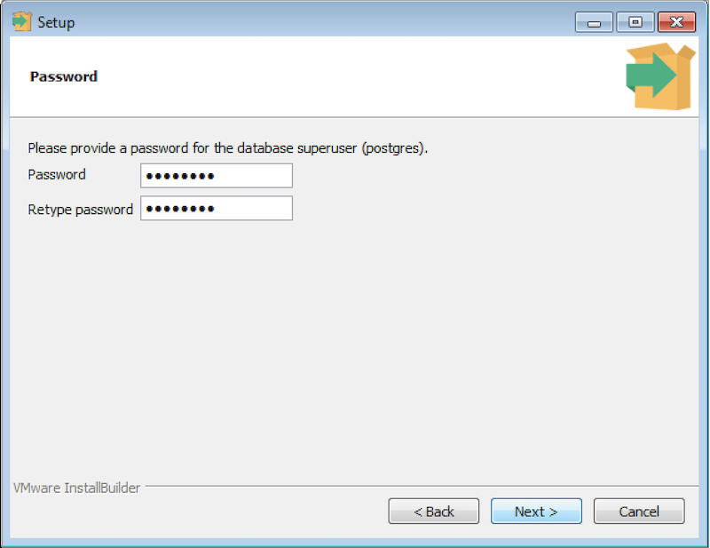
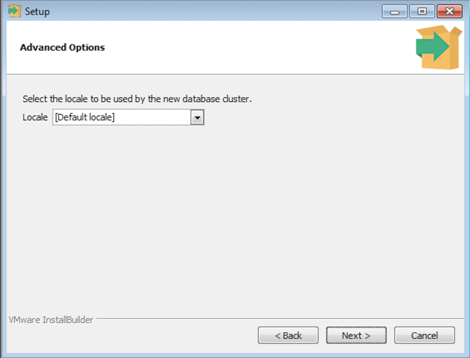
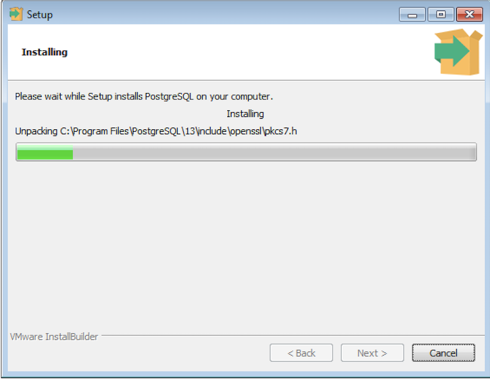
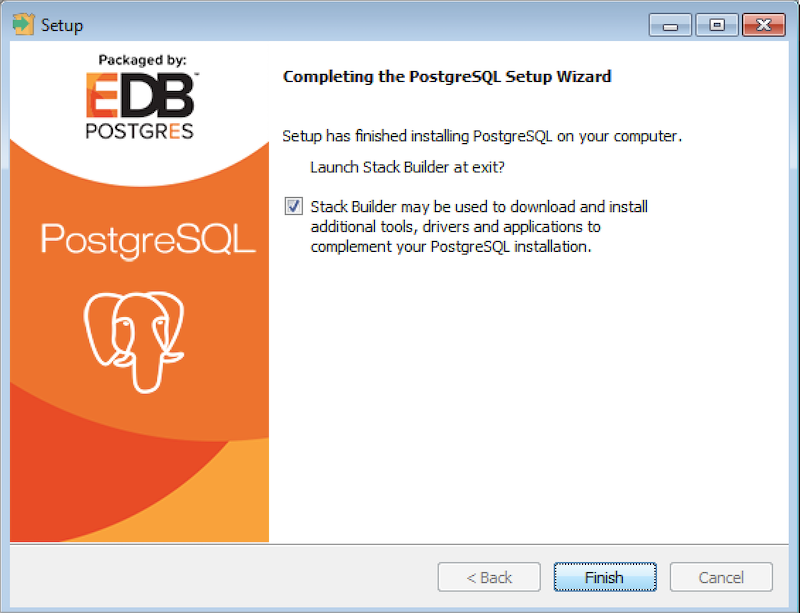

To perform an installation using the graphical installation wizard, you must have superuser or administrator privileges. To start the installation wizard, assume sufficient privileges and double-click the installer icon; if prompted, provide a password.

Note that in some versions of Windows, to invoke the installer with `Administrator` privileges, you need to right-click on the installer icon and select `Run as Administrator` from the context menu.

The PostgreSQL setup wizard opens:

Click `Next` to continue. The `Installation Directory` window opens.

Accept the default installation directory, or specify an alternate location and click `Next` to continue.

Use options on the `Select Components` dialog to select which software components will be installed.

Select:

-   `PostgreSQL Server` to install the PostgreSQL database server.

-   `pgAdmin 4` to install pgAdmin 4. This is available for PostgreSQL version 13.0.

-   `Stack Builder` to install the Stack Builder utility; for more information about the Stack Builder utility, see [Using Stack Builder](../#using_stackbuilder).

-   `Command Line Tools` to install PostgreSQL tools such as:

    > `psql, pg_isready`, and `pgbench`
    >
    > `clusterdb, createdb`, and `dropdb`
    >
    > `createuser` and `dropuser`
    >
    > `pg_basebackup, pg_dump, pg_dumpall`, and `pg_restore`
    >
    > `reindexdb, vacuumdb`, and `vacuumlo`
    >
    > This is not a comprehensive list; the command line tools installed may vary by platform.

Click `Next` to continue. The `Data Directory` window opens.

Accept the default location or specify the name of the alternate directory in which you wish to store the data files, and click `Next` to continue.

The `Password` window opens.

PostgreSQL uses the password specified on the `Password` window for both the database superuser and the PostgreSQL service account.

PostgreSQL runs as a service in the background; the PostgreSQL service account is named `postgres`. If you have already created a service account with the name `postgres`, you must specify same password as the existing password for the `postgres` service account.

The specified password must conform to any security policies existing on the PostgreSQL host. After entering a password in the `Password` field, and confirming the password in the `Retype Password` field, click `Next` to continue.

Use the `Port` field to specify the port number on which the server should listen. The default listener port is `5432`. Click `Next` to continue.

Use the `Locale` field to specify the locale that will be used by the new database cluster. The `Default locale` is the operating system locale. Click `Next` to continue.

The `Pre Installation Summary` dialog displays the installation preferences that you have specified with the installation wizard. Review the settings; you can use the `Back` button to return to a previous dialog to modify a setting, or click `Next` to continue.

The wizard will inform you that it has the information required to install PostgreSQL; click `Next` to continue.

During the installation, the setup wizard confirms the installation progress of PostgreSQL via a series of progress bars.

Before the setup wizard completes the PostgreSQL installation, it offers to launch Stack Builder at exit.

The Stack Builder utility provides a graphical interface that downloads and installs applications and drivers that work with PostgreSQL. You can optionally uncheck the `Stack Builder` box and click `Finish` to complete the PostgreSQL installation or accept the default and proceed to launch Stack Builder.
