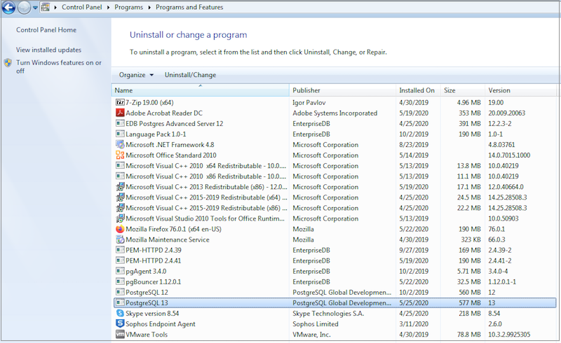
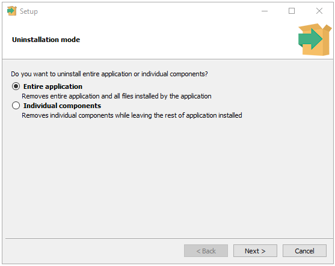
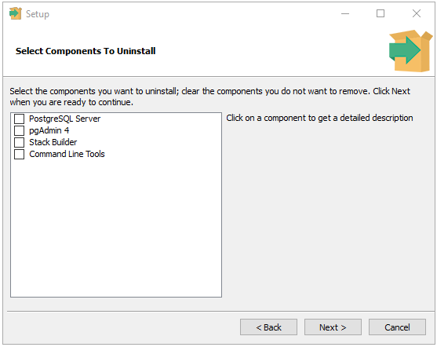
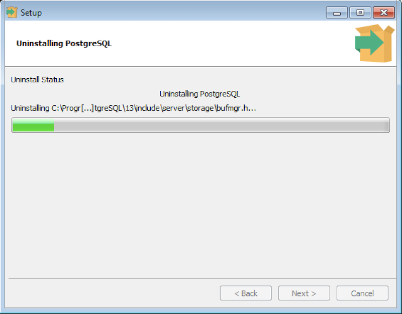
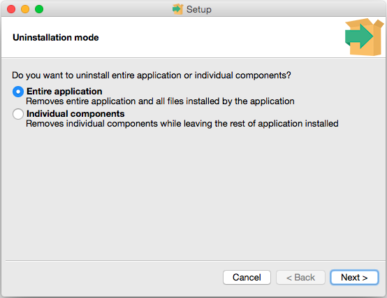

The PostgreSQL installer creates an uninstaller in the PostgreSQL installation directory.

## Uninstalling PostgreSQL on a Windows System

You can use the graphical interface provided by Windows to uninstall PostgreSQL. Navigate through the Windows `Control Panel` to open the Windows `Uninstall or change a program` dialog.

<figure><figcaption aria-hidden="true"><em>The Uninstall or change a program dialog</em></figcaption></figure>

Right-click the `PostgreSQL 13` and select `Uninstall/Change` from the context menu.

<figure><figcaption aria-hidden="true"><em>Confirm that you wish to uninstall PostgreSQL</em></figcaption></figure>

You can either remove the entire application or individual components.

-   If you wish to remove the entire application, select the `Entire application` option and click `Next` to start uninstalling components.
-   If you wish to remove individual components, select the `Individual components` option and click `Next`, a selection screen opens, allowing you to select which components you wish to uninstall. Select the components you wish to uninstall, and click `Next` to start uninstalling components.

<figure><figcaption aria-hidden="true"><em>Select the components to uninstall</em></figcaption></figure>

<figure><figcaption aria-hidden="true"><em>Uninstalling PostgreSQL</em></figcaption></figure>

A progress bar will keep you informed as PostgreSQL is removed.

<figure><figcaption aria-hidden="true"><em>An Info dialog confirms the uninstallation</em></figcaption></figure>

When the uninstaller completes, an `Info` dialog opens to confirm. Click `OK` to exit.

## Uninstalling PostgreSQL on a Mac System

To uninstall PostgreSQL on a Mac system, assume the identity of an operating system superuser, and navigate into the folder in which the uninstaller resides:

> `/Library/PostgreSQL/13`

Then, invoke the uninstaller with the command:

> `open uninstall-postgres.app`

If prompted, provide a password that allows the uninstaller to make changes to your system. The uninstaller will open, asking you if you wish to uninstall the entire application or individual components.

<figure><figcaption aria-hidden="true"><em>Remove the entire application or components</em></figcaption></figure>

If you wish to remove the entire application, select the `Entire application` option and click `Next` to start uninstalling components.

If you select the `Individual components` option, a selection screen opens, allowing you to select which components you wish to uninstall.

<figure><figcaption aria-hidden="true"><em>Selecting the components to uninstall</em></figcaption></figure>

Select the components you wish to uninstall, and click `Next` to start uninstalling components. Progress bars are displayed as each component is removed; an `Info` popup informs you when the uninstallation is complete.

<figure><figcaption aria-hidden="true"><em>The Uninstallation is completed</em></figcaption></figure>

Click `OK` to exit the uninstaller.
