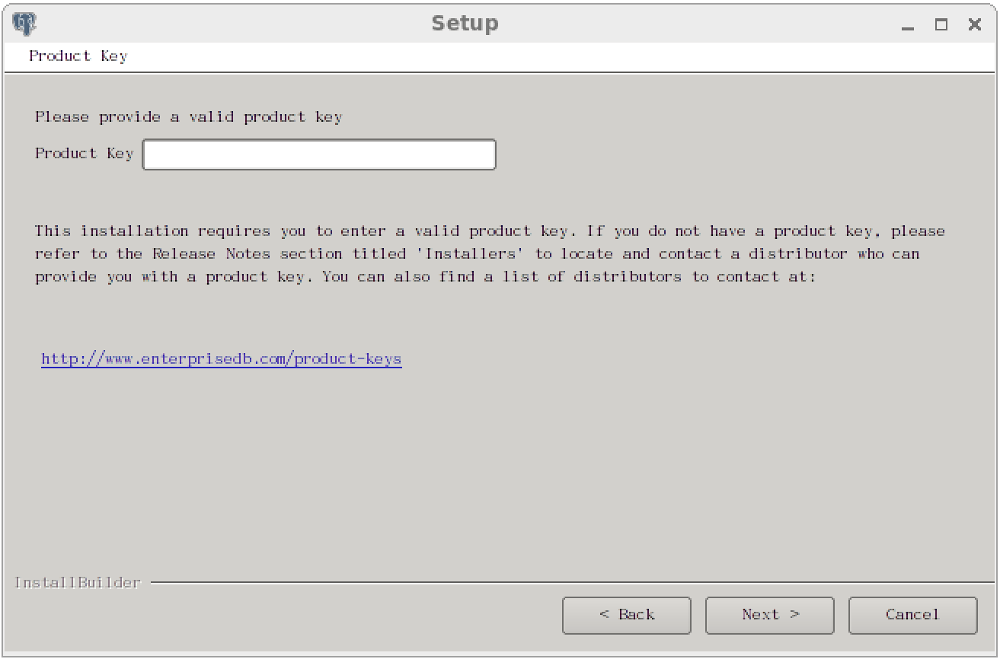
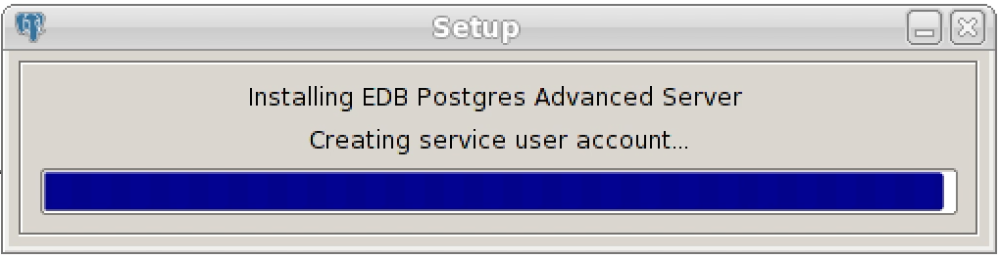
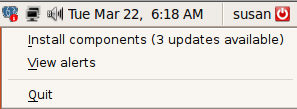
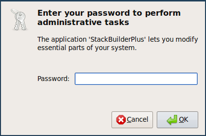

The Advanced Server installer is available from the EnterpriseDB website at:

<http://www.enterprisedb.com/downloads/postgres-postgresql-downloads>

After navigating to the Software Downloads page, choose the Advanced Server installation that corresponds to your platform. After selecting a download, you will be invited to register as an Advanced Server user. Enter your current EnterpriseDB login information, or complete an online registration form to start the download.

When the download completes, extract files using your system-specific file extractor.

You can use the extracted installer in different installation modes to perform an Advanced Server installation:

-   For information about using the extracted files to perform a graphical installation on Windows, See Section 4.3.1.
-   For information about performing a graphical installation on Linux, see Section 4.3.2.
-   For information about using the installer to perform a command line installation, see Section 4.4.
-   For information about performing an unattended installation, see Section 4.4.2.
-   For information about performing an installation with limited privileges, see Section 4.4.3.
-   For information about the command line options you can use when invoking the installer, see Section 4.4.4.

During the installation process, the Advanced Server installer program copies a number of temporary files to the location specified by the TEMP or TMP environment variable (on Windows), or to the /tmp directory (on Linux). You can optionally specify an alternate location for the installer to place the temporary files by modifying or creating the TEMP environment variable.

If invoking the installer from the command line, you can set the value of the variable on the command line:

On Windows, use the command:

SET TMP=temp_file_location

On Linux, use the command:

> export TEMP=temp_file_location

Where temp_file_location specifies the alternate location for the temporary files.

Please Note: If you are invoking the installer to perform a system upgrade, the installer will preserve the configuration options specified during the previous installation.

## Graphical Installation Prerequisites

**User Privileges**

Before invoking the installer on a Linux system, you must have superuser privileges to perform an Advanced Server installation. To perform an Advanced Server installation on a Windows system, you must have administrator privileges. If you are installing Advanced Server into a Windows system that is configured with User Account Control enabled, you can assume sufficient privileges to invoke the graphical installer by right clicking on the name of the installer and selecting Run as administrator from the context menu. When prompted, enter an administrator password to continue (see Figure 4.1).

*Figure 4.1 -The User Account Control window.*

**Linux-specific Software Requirements**

You must install xterm, konsole, or gnome-terminal before executing any console-based program installed by the Advanced Server installer. Without a console program, you will not be able to access Advanced Server configuration files through menu selections.

Before invoking the StackBuilder Plus utility on a Linux system, you must install the redhat-lsb package. To install the package, open a terminal window, assume superuser privileges, and enter:

\# yum install redhat-lsb

For more information about using StackBuilder Plus, see Section 4.5.

**SELinux Permissions**

Before invoking the installer on a system that is running SELinux, you must set SELinux to permissive mode.

The following example works on Redhat Enterprise Linux, Fedora Core or CentOS distributions. Use comparable commands that are compatible with your Linux distribution to set SELinux to permissive mode during installation and return it to enforcing mode when installation is complete.

Before installing Advanced Server, set SELinux to permissive mode with the command:

\# setenforce Permissive

When the installation is complete, return SELinux to enforcing mode with the command:

\# setenforce Enforcing

**Windows-specific Software Requirements**

Be sure to apply Windows operating system updates before invoking the Advanced Server installer. If (during the installation process) the installer encounters errors, exit the installation, and ensure that your version of Windows is up-to-date before restarting the installer.

**Migration Toolkit or EDB\*Plus Installation Prerequisites**

Before using the Advanced Server installer to install Migration Toolkit or EDB\*Plus, you must first install Java (version 7 or 8) or OpenJDK (version 1.7 or 1.8). On a Linux system, you can use the yum package manager to install Java. Open a terminal window, assume superuser privileges, and enter:

\# yum install java-*version*

Follow the onscreen instructions to complete the installation.

If you are using Windows, Java installers and instructions are available online at:

<http://www.java.com/en/download/manual.jsp>

## Locales Requiring Product Keys

The Advanced Server 9.6 installer will request a product key before completing an installation into a host system using one of the locales listed in the table below. Product keys are available from your local Advanced Server distributor.

Note: The product key applies only to the Advanced Server installation program. The Advanced Server database program has no built-in limitations or expiration features that require a product key or any other activation technique.

| Locale                                 | Locale Identifier |
| -------------------------------------- | ----------------- |
| Traditional Chinese with Hong Kong SCS | zh_HK             |
| Traditional Chinese for Taiwan         | zh_TW             |
| Simplified Chinese                     | zh_CN             |
| Japanese                               | ja_JP             |
| Korean                                 | ko_KR             |
| Argentina - Spanish                    | es_ar             |
| Beliz - English                        | en_bz             |
| Brazil - Portuguese                    | pt_br             |
| Bolivia - Spanish                      | es_bo             |
| Chile - Spanish                        | es_cl             |
| Colombia - Spanish                     | es_co             |
| Costa Rica - Spanish                   | es_cr             |
| Dominican Republic - Spanish           | es_do             |
| Ecuador - Spanish                      | es_ec             |
| Guatemala - Spanish                    | es_gt             |
| Guyana - English                       | en_gy             |
| Honduras - Spanish                     | es_hn             |
| Mexico - Spanish                       | es_mx             |
| Nicaragua - Spanish                    | es_ni             |
| Panama - Spanish                       | es_pa             |
| Peru - Spanish                         | es_pe             |
| Puerto Rico - Spanish                  | es_pr             |
| Paraguay - Spanish                     | es_py             |
| El Salvador - Spanish                  | es_sv             |
| Uruguay - Spanish                      | es_uy             |
| Venezuela - Spanish                    | es_ve             |

During an installation in one of the listed locales, the Product Key window (shown in Figure 4.2) will open, prompting you to provide a valid product key. Enter a product key, and press Next to continue with the installation.

*Figure 4.2 -The Advanced Server Product Key Window*

## Performing a Graphical Installation

A graphical installation wizard provides a quick and easy way to install Advanced Server 9.6 on a Linux or Windows system. As the Setup wizard’s easy-to-follow dialogs lead you through the installation process, specify information about your system, your system usage, and the modules that will best complement your installation of Advanced Server. When you have completed the dialogs, the installer performs an installation based on the selections made during the setup process.

When the Advanced Server installation finishes, you will be offered the option to invoke EDB Postgres StackBuilder Plus. StackBuilder Plus provides an easy-to-use graphical interface that can update installed products, or download and add any omitted modules (and the resulting dependencies) after your Advanced Server setup and installation completes. See Section 4.5 for more information about StackBuilder Plus.

### Using the Graphical Installer with Windows

To perform an installation using the graphical wizard on a Windows system, you must have administrator privileges. To start the Setup wizard, assume administrator privileges, and double-click the edb-as96-meta-9.6.*x.x*-windows-x64 executable file.

|                                                                                                                                                                                                                        |
| ---------------------------------------------------------------------------------------------------------------------------------------------------------------------------------------------------------------------- |
| *To install Advanced Server on some versions of Windows you may be required to right click on the file and select* *Run as Administrator from the context menu to invoke the installer with Administrator privileges.* |

The wizard opens a Language Selection popup; select an installation language from the drop-down listbox and click OK to continue. If you do not have Java installed on your system, the installer will ask you to confirm that you wish to continue the installation without installing Java based components; click Yes to continue to the Setup window (shown in Figure 4.3):

!\[image](./images/image6.png)

*Figure 4.3 -The Advanced Server installer Welcome window*

Click Next to continue.

The EnterpriseDB License Agreement (see Figure 4.4) opens.

!\[image](./images/image7.png)

*Figure 4.4 -The EnterpriseDB License Agreement*

Carefully review the license agreement before highlighting the appropriate radio button; click Next to continue.

The User Authentication window opens, as shown in Figure 4.5.

!\[image](./images/image8.png)

*Figure 4.5 -The User Authentication window.*

Before continuing, you must provide the email address and password associated with your EnterpriseDB user account. Registration is free; if you do not have an EnterpriseDB user account, click the link provided to open a web browser, and supply your user information.

Enter the email address of a registered account in the Email field, and the corresponding password in the Password field, and click Next to continue.

The Installation Directory window opens, as shown in Figure 4.6.

!\[image](./images/image9.png)

*Figure 4.6 -The Installation Directory window.*

By default, the Advanced Server installation directory is:

C:\\Program Files\\edb

You can accept the default installation location, and click Next to continue, or optionally click the File Browser icon to open the Browse For Folder dialog (shown in Figure 4.7) to choose an alternate installation directory.

*Figure 4.7 -The Browse For Folder dialog*

Use the tree control displayed on the Browse For Folder dialog to navigate to an alternate installation directory, or create a new installation directory by selecting the Make New Folder button, and entering a name for the new folder.

After selecting an alternate installation directory, click OK to continue. When you return to the Installation Directory window, click Next to open the Select Components window.

!\[image](./images/image11.png)

*Figure 4.8 -The Select Components window*

The Select Components window (shown in Figure 4.8) contains a list of optional components that you can install with the Advanced Server Setup wizard. Note that if you do not have Java installed on your system, those components that require Java are disabled and will not be installed. You can omit a module from the Advanced Server installation by deselecting the box next to the components name.

The Setup wizard can install the following components while installing Advanced Server 9.6:

**EDB Postgres Advanced Server**

Select the EDB Postgres Advanced Server option to install Advanced Server 9.6.

**EDB Postgres Connectors**

Select the EDB Postgres Connectors option to install the client connector API’s for JDBC, .NET, OCI and ODBC. The client connectors facilitate application connectivity for Advanced Server.

**EDB Postgres Migration Toolkit**

If you have Java (version 7 or 8) or OpenJDK (version 1.7 or 1.8) installed on your system, you can use the EDB Postgres Migration Toolkit option to install Migration Toolkit. Migration Toolkit is a command line migration utility that facilitates migration from MySQL, Oracle, Microsoft SQL Server and Sybase databases.

See the *EDB Postgres Migration Guide* for more information about Migration Toolkit available from the EnterpriseDB website at:

<http://www.enterprisedb.com/products-services-training/products/documentation/enterpriseedition>

**EDB Postgres pgAdmin 4**

Select the EDB Postgres pgAdmin 4 option to install the pgAdmin 4 client. pgAdmin 4 provides a powerful graphical interface for database management and monitoring.

**EDB Postgres Advanced Server EDB\*Plus**

If you have Java installed on your system, you can select the EDB Postgres Advanced Server EDB\*Plus option to install EDB\*Plus. EDB\*Plus is the Advanced Server SQL command line interface that offers compatibility with Oracle’s SQL Plus commands.

**EDB Postgres Advanced Server Slony Replication**

Check the box next to EDB Postgres Advanced Server Slony Replication to specify that Slony should be included in the installation process. Slony facilitates master-standby replication suited for large databases with a limited number of standby systems.

**EDB Postgres PgBouncer**

Select the EDB Postgres pgBouncer option to install PgBouncer. PgBouncer is a lightweight connection pooling utility for Advanced Server. Connection pooling can dramatically reduce processing time and resources for systems maintaining client connections to one or more databases.

StackBuilder Plus is included with the installation of Advanced Server and its core supporting components. The StackBuilder Plus utility is a graphical tool that can update installed products, or download and add any omitted modules (and the resulting dependencies) after your Advanced Server setup and installation completes. See Section 4.5 for more information about StackBuilder Plus.

After adjusting the list of modules or accepting the default and installing all modules, click Next to open the Data Directory window (shown in Figure 4.9).

!\[image](./images/image12.png)

*Figure 4.9 -The Data Directory window.*

By default, the Advanced Server data files are saved to:

C:\\Program Files\\edb\\as9.6\\data

You can accept the default location for the data files, or use the File Browser icon to open the Browse For Folder dialog.

The default location of the Advanced Server Write-Ahead Log (WAL) Directory is:

C:\\Program Files\\edb\\as9.6\\data\\pg_xlog

Advanced Server uses write-ahead logs to promote transaction safety and speed transaction processing; when you make a change to a table, the change is stored in shared memory and a record of the change is written to the write-ahead log. When you perform a COMMIT, Advance Server writes contents of the write-ahead log to disk.

Accept the default file locations, or specify alternate locations with the File Browser icon; click Next to continue to the Configuration Mode window (shown in Figure 4.10).

!\[image](./images/image13.png)

*Figure 4.10 -The Configuration Mode window.*

Use the drop-down listbox on the Configuration Mode window to choose a server dialect. The server dialect specifies the compatibility features supported by Advanced Server.

By default, Advance Server installs in Compatible with Oracle mode; you can choose between Compatible with Oracle and Compatible with PostgreSQL installation modes.

**Compatible with Oracle**

If you select Compatible with Oracle on the Configuration Mode dialog, the installation will include the following features:

-   Data dictionary views compatible with Oracle databases.
-   Oracle data type conversions.
-   Date values displayed in a format compatible with Oracle syntax.
-   Support for Oracle-styled concatenation rules (if you concatenate a string value with a NULL value, the returned value is the value of the string).
-   Schemas (dbo and sys) compatible with Oracle databases added to the SEARCH_PATH.
-   Support for the following Oracle built-in packages:

| Package        | Functionality Compatible with Oracle Databases                                                                         |
| -------------- | ---------------------------------------------------------------------------------------------------------------------- |
| dbms_alert     | Provides the ability to register for, send and receive alerts.                                                         |
| dbms_crypto    | Provides a way to encrypt or decrypt RAW, BLOB or CLOB data.                                                           |
| dbms_job       | Implements job-scheduling functionality.                                                                               |
| dbms_lob       | Provides the ability to manage large objects.                                                                          |
| dbms_lock      | Provides support for the DBMS_LOCK.SLEEP procedure.                                                                    |
| dbms_mview     | Provides a way to manage and refresh materialized views.                                                               |
| dbms_output    | Provides the ability to display a message on the client.                                                               |
| dbms_pipe      | Provides the ability to send a message from one session and read it in another session.                                |
| dbms_profiler  | Collects and stores performance data about PL/pgSQL and SPL statements.                                                |
| dbms_random    | Provides a way to generate random numbers.                                                                             |
| dbms_rls       | Implements row level security.                                                                                         |
| dbms_scheduler | Provides a way to create and manage Oracle-style jobs.                                                                 |
| dbms_session   | A partial implementation that provides support for DBMS_SESSION.SET_ROLE.                                              |
| dbms_sql       | Implements use of Dynamic SQL                                                                                          |
| dbms_utility   | Provides a collection of misc functions and procedures.                                                                |
| utl_encode     | Provides a way to encode or decode data.                                                                               |
| utl_file       | Provides a way for a function, procedure or anonymous block to interact with files stored in the server’s file system. |
| utl_http       | Provides a way to use HTTP or HTTPS to retrieve information found at a URL.                                            |
| utl_mail       | Provides a simplified interface for sending email and attachments.                                                     |
| utl_raw        | Provides a way to manipulate or retrieve the length of raw data types.                                                 |
| utl_smtp       | Implements smtp email functions.                                                                                       |
| utl_url        | Provides a way to escape illegal and reserved characters in a URL.                                                     |

This is not a comprehensive list of the compatibility features for Oracle included when Advanced Server is installed in Compatible with Oracle mode; more information about Advanced Server is found in the *Database Compatibility for Oracle Developer’s Guide* available from the EnterpriseDB website at:

<http://www.enterprisedb.com/products-services-training/products/documentation>

If you choose to install in Compatible with Oracle mode, the Advanced Server superuser name is enterprisedb.

**Compatible with PostgreSQL**

When installed in Compatible with PostgreSQL mode, Advanced Server exhibits complete compatibility with PostgreSQL version 9.6. If you choose to install in Compatible with PostgreSQL mode, the Advanced Server superuser name is postgres.

For detailed information about PostgreSQL functionality, visit the official PostgreSQL website at:

<http://www.postgresql.org>

After specifying a configuration mode, click Next to continue to the Password window (shown in Figure 4.11).

!\[image](./images/image14.png)

*Figure 4.11 -The Password window.*

Advanced Server uses the password specified on the Password window for the database superuser and the pgAgent service. The specified password must conform to any security policies existing on the Advanced Server host.

After you enter a password in the Password field, confirm the password in the Retype Password field, and click Next to continue.

The Additional Configuration window opens (shown in Figure 4.12).

!\[image](./images/image15.png)

*Figure 4.12 -The Additional Configuration window.*

Use the fields on the Additional Configuration window to specify installation details:

-   Use the Port field to specify the port number that Advanced Server should listen to for connection requests from client applications. The default is 5444.
-   If the Locale field is set to \[Default locale], Advanced Server uses the system locale as the working locale. Use the drop-down listbox next to Locale to specify an alternate locale for Advanced Server.
-   By default, the Setup wizard installs corresponding sample data for the server dialect specified by the compatibility mode (Oracle or PostgreSQL). Clear the checkbox next to Install sample tables and procedures if you do not wish to have sample data installed.

After verifying the information on the Additional Configuration window, click Next to open the Dynatune Dynamic Tuning: Server Utilization window (shown in Figure 4.13).

The graphical Setup wizard facilitates performance tuning via the Dynatune Dynamic Tuning feature. Dynatune functionality allows Advanced Server to make optimal usage of the system resources available on the host machine on which it is installed.

!\[image](./images/image16.png)

*Figure 4.13 -The Dynatune Dynamic Tuning: Server Utilization window.*

The edb_dynatune configuration parameter determines how Advanced Server allocates system resources. Use the radio buttons on the Server Utilization window to set the initial value of the edb_dynatune configuration parameter:

-   Select Development to set the value of edb_dynatune to 33. A low value dedicates the least amount of the host machine’s resources to the database server. This is a good choice for a development machine.
-   Select General Purpose to set the value of edb_dynatune to 66. A mid-range value dedicates a moderate amount of system resources to the database server. This would be a good setting for an application server with a fixed number of applications running on the same host as Advanced Server.
-   Select Dedicated to set the value of edb_dynatune to 100. A high value dedicates most of the system resources to the database server. This is a good choice for a dedicated server host.

After the installation is complete, you can adjust the value of edb_dynatune by editing the postgresql.conf file, located in the data directory of your Advanced Server installation. After editing the postgresql.conf file, you must restart the server for your changes to take effect.

Select the appropriate setting for your system, and click Next to continue to the Dynatune Dynamic Tuning: Workload Profile window (shown in Figure 4.14).

!\[image](./images/image17.png)

*Figure 4.14 -The Dynatune Dynamic Tuning: Workload Profile window.*

Use the radio buttons on the Workload Profile window to specify the initial value of the edb_dynatune_profile configuration parameter. The edb_dynatune_profile parameter controls performance-tuning aspects based on the type of work that the server performs.

-   Select Transaction Processing (OLTP systems) to specify an edb_dynatune_profile value of oltp. Recommended when Advanced Server is supporting heavy online transaction processing.
-   Select General Purpose (OLTP and reporting workloads) to specify an edb_dynatune_profile value of mixed. Recommended for servers that provide a mix of transaction processing and data reporting.
-   Select Reporting (Complex queries or OLAP workloads) to specify an edb_dynatune_profile value of reporting. Recommended for database servers used for heavy data reporting.

After the installation is complete, you can adjust the value of edb_dynatune_profile by editing the postgresql.conf file, located in the data directory of your Advanced Server installation. After editing the postgresql.conf file, you must restart the server for your changes to take effect.

For more information about edb_dynatune and other performance-related topics, see the *EDB Postgres Advanced Server Guide* available from the EnterpriseDB website at:

<http://www.enterprisedb.com/products-services-training/products/documentation>

Click Next to continue. The Advanced Configuration window (shown in Figure 4.15) opens.

!\[image](./images/image18.png)

*Figure 4.15 -The Advanced Configuration window.*

**PgBouncer**

PgBouncer is a lightweight connection pooling utility for Advanced Server. Connection pooling can dramatically reduce processing time and resources for systems maintaining client connections to one or more databases. By default, Advanced Server expects PgBouncer to listen on port 6432.

Please note that the PgBouncer program stores a list of users and passwords in clear-text form in the following file:

C:\\Program Files\\edb\\pgbouncer1.7\\etc\\userlist.txt

By default, the file is located in a directory that is accessible only to the cluster owner (by default, enterprisedb), but administrators should take note of the file and maintain permissions in a manner that secures the file from untrusted users

For more information about PgBouncer, visit the project site at:

<https://wiki.postgresql.org/wiki/PgBouncer>

**pgAgent**

pgAgent is a job scheduling agent for Postgres, capable of running multi-step batch/shell and SQL tasks on complex schedules. pgAgent also provides background support for the DBMS_JOB built-in package that is compatible with Oracle databases.

**Update Notification Service**

When enabled, the Update Notification Service notifies you of any new updates and security patches available for your installation of Advanced Server.

By default, Advanced Server is configured to start the the PgBouncer, pgAgent and Update Notification Service services when the system boots; clear applicable Service Configuration checkboxes, or accept the defaults, and click Next to continue.

The Pre Installation Summary opens as shown in Figure 4.16.

!\[image](./images/image19.png)

*Figure 4.16 -The Pre Installation Summary.*

The Pre Installation Summary provides an overview of the options specified during the Setup process. Review the options before clicking Next; use the Back button to navigate back through the dialogs and update any options.

The Ready to Install window (see Figure 4.17) confirms that the installer has the information it needs about your configuration preferences to install Advanced Server. Click Next to continue.

!\[image](./images/image20.png)

*Figure 4.17 -The Ready to Install window.*

As each supporting module is unpacked and installed, the module’s installation is confirmed with a progress bar (see Figure 4.18).

!\[image](./images/image21.png)

*Figure 4.18 -Popup dialogs confirm the installation of supporting modules.*

Before the Setup wizard completes the Advanced Server installation, it offers to Launch StackBuilder Plus at exit? (see Figure 4.19).

!\[image](./images/image22.png)

*Figure 4.19 -The Setup wizard offers to Launch StackBuilder Plus at exit.*

You can clear the StackBuilder Plus checkbox and click Finish to complete the Advanced Server installation, or accept the default and proceed to StackBuilder Plus.

EDB Postgres StackBuilder Plus is included with the installation of Advanced Server and its core supporting components. StackBuilder Plus is a graphical tool that can update installed products, or download and add any omitted modules (and the resulting dependencies) after your Advanced Server setup and installation completes. See Section 4.5 for more information about StackBuilder Plus.

### Using the Graphical Installer on a Linux System

To use the graphical installation wizard on a Linux system, you must have superuser privileges. To invoke the Setup wizard, open a Terminal window, navigate to the directory that contains the unpacked Advanced Server binary file, and enter the command:

./edb-as96-meta-9.6.*x.x*-linux-x64.run

The wizard opens a Language Selection popup; select an installation language from the drop-down listbox and click OK to continue. If you do not have Java installed on your system, the installer will ask you to confirm that you wish to continue the installation without installing Java based components; click Yes to continue to the Setup window (shown in Figure 4.20).

!\[image](./images/image23.png)

*Figure 4.20 -The Advanced Server installer Setup welcome.*

Click Next to continue.

The License Agreement window (shown in Figure 4.21) opens.

!\[image](./images/image24.png)

*Figure 4.21 -The EnterpriseDB License Agreement.*

Review the EnterpriseDB License Agreement carefully before selecting the radio button next to I accept the agreement. Click Next to continue to the User Authentication window.

The User Authentication window opens, as shown in Figure 4.22.

!\[image](./images/image25.png)

*Figure 4.22 -The User Authentication window.*

Before continuing, you must provide the email address and password associated with your EnterpriseDB user account. Registration is free; if you do not have an EnterpriseDB user account, click the link provided to open a web browser, and enter your user information.

Enter the email address of a registered account in the Email field, and the corresponding password in the Password field, and click Next to continue to the Installation Directory window (see Figure 4.23).

!\[image](./images/image26.png)

*Figure 4.23 -The Installation Directory window.*

By default, the Advanced Server installation directory is:

/opt/edb

You can accept the default installation location, and click Next to continue, or click the File Browser icon to open a Select File dialog (shown in Figure 4.24) to choose an alternate installation directory.

*Figure 4.24 -The Select File dialog.*

Use the Select File dialog to navigate to an alternate installation directory, or create a new installation directory by selecting the Add Folder icon, and entering a name for the new folder.

After selecting an alternate installation directory, click Open to continue. When you return to the Installation Directory window, click Next to open the Select Components window.

!\[image](./images/image28.png)

*Figure 4.25 -The Select Components window.*

The Select Components window (shown in Figure 4.25) contains a list of the utilities that you can install with the Advanced Server Setup wizard. If your system does not include a Java installation, those components dependent on Java will be disabled and will not install. You can skip the installation of a module by clearing the x mark next to the component name.

The Setup wizard can install the following components while installing Advanced Server 9.6:

**EDB Postgres Advanced Server 9.6**

Select the EDB Postgres Advanced Server option to install Advanced Server 9.6.

**EDB Postgres Connectors**

Select the EDB Postgres Connectors option to install the client connector API’s for JDBC, OCI and ODBC. The client connectors facilitate application connectivity for Advanced Server.

**EDB Postgres Advanced Server Infinite Cache**

Select the EDB Postgres Advanced Server Infinite Cache option to install the edb-icache daemon. With Infinite Cache, Advanced Server will be able to utilize memory from other computers connected to your network to avoid reading frequently accessed data from disk.

The Setup wizard can optionally install the Infinite Cache daemon on a remote icache server without including a complete installation of Advanced Server. To install only the edb-icache daemon, deselect the other components shown on the Select Components window before clicking Next.

For more information about using Infinite Cache and the edb-icache daemon, see the *EDB Postgres Advanced Server Guide* available at:

<http://www.enterprisedb.com/products-services-training/products/documentation>

**EDB Postgres Migration Toolkit**

If you have Java (version 7 or 8) or OpenJDK (version 1.7 or 1.8) installed on your system, you can use the EDB Postgres Migration Toolkit option to install Migration Toolkit. Migration Toolkit is a command line migration utility that facilitates migration from MySQL, Oracle, Microsoft SQL Server and Sybase databases. See the *EDB Postgres Migration Guide* for more information about Migration Toolkit available at:

<http://www.enterprisedb.com/products-services-training/products/documentation>

**EDB Postgres pgAdmin 4**

Select the EDB Postgres pgAdmin 4 option to install the pgAdmin 4 client. pgAdmin 4 provides a powerful graphical interface for database management and monitoring.

**EDB Postgres pgPool-II**

Use the EDB Postgres pgPool-II option to include pgPool-II in the Advanced Server installation. pgPool-II provides load balancing, connection pooling, high availability, and connection limits for Advanced Server databases.

**EDB Postgres pgPool-II Extensions**

If you are installing pgPool-II, check the box next to EDB Postgres pgPool-II Extensions to include the server extensions required by the server to implement pgPool-II functionality.

**EDB Postgres Advanced Server EDB\*Plus**

Select the EDB Postgres Advanced Server EDB\*Plus option to install EDB\*Plus. EDB\*Plus is the Advanced Server command line interface that offers compatibility with Oracle’s SQL Plus commands.

Please note that the EDB\*Plus installation option will only be enabled if your system contains Java.

**EDB Postgres Advanced Server Slony Replication**

Check the box next to EDB Postgres Advanced Server Slony Replication to specify that Slony should be included in the Advanced Server installation. Slony facilitates master-standby replication suited for large databases with a limited number of standby systems.

**EDB Postgres PgBouncer**

Check the box next to EDB Postgres pgBouncer to specify that PgBouncer should be included in the Advanced Server installation. PgBouncer is a lightweight connection pooling utility for Advanced Server. Connection pooling can dramatically reduce processing time and resources for systems maintaining client connections to one or more databases.

StackBuilder Plus is included with the installation of Advanced Server and its core supporting components. The StackBuilder Plus utility is a graphical tool that can update installed products, or download and add any omitted modules (and the resulting dependencies) after your Advanced Server setup and installation completes. See Section 4.5 for more information about StackBuilder Plus.

After editing the list of supporting components, click Next to open the Additional Directories window (shown in Figure 4.26).

!\[image](./images/image29.png)

*Figure 4.26 -The Additional Directories window.*

Use the fields in the Additional Directories window to specify locations for the Advanced Server Data Directory and Write-Ahead Log (WAL) Directory.

The default Data Directory is /opt/edb/as9.6/data. You can use the file selector icon to specify an alternate location.

The default location of the Advanced Server Write-Ahead Log (WAL) Directory is opt/edb/as9.6/data/pg_xlog. Accept the default location, or specify an alternate location with the file selector icon.

Advanced Server uses write-ahead logs to promote transaction safety and speed transaction processing; when you make a change to a table, the change is stored in shared memory and a record of the change is written to the write-ahead log. When you perform a COMMIT, Advance Server writes contents of the write-ahead log to disk.

Click Next to continue to the Configuration Mode window (shown in Figure 4.27).

!\[image](./images/image30.png)

*Figure 4.27 -The Configuration Mode window.*

Use the drop-down listbox on the Configuration Mode window to choose a server dialect. The server dialect specifies the compatibility features supported by Advanced Server.

By default, Advance Server installs with database compatibility with Oracle; you can choose between Compatible with Oracle and Compatible with PostgreSQL installation modes.

**Compatible with Oracle Mode**

If you select Compatible with Oracle in the Configuration Mode dialog, the installation will include the following features:

-   Dictionary views compatible with Oracle databases.
-   Oracle data type conversions.
-   Date values displayed in a format compatible with Oracle syntax.
-   Oracle-styled concatenation rules (if you concatenate a string value with a NULL value, the returned value is the value of the string).
-   Schemas (dbo and sys) compatible with Oracle databases added to the SEARCH_PATH.
-   Support for the following Oracle built-in packages:

| Package        | Functionality Compatible with Oracle Databases                                                                         |
| -------------- | ---------------------------------------------------------------------------------------------------------------------- |
| dbms_alert     | Provides the ability to register for, send and receive alerts.                                                         |
| dbms_crypto    | Provides a way to encrypt or decrypt RAW, BLOB or CLOB data.                                                           |
| dbms_job       | Implements job-scheduling functionality.                                                                               |
| dbms_lob       | Provides the ability to manage large objects.                                                                          |
| dbms_lock      | Provides support for the DBMS_LOCK.SLEEP procedure.                                                                    |
| dbms_mview     | Provides a way to manage and refresh materialized views.                                                               |
| dbms_output    | Provides the ability to display a message on the client.                                                               |
| dbms_pipe      | Provides the ability to send a message from one session and read it in another session.                                |
| dbms_profiler  | Collects and stores performance data about PL/pgSQL and SPL statements.                                                |
| dbms_random    | Provides a way to generate random numbers.                                                                             |
| dbms_rls       | Implements row level security.                                                                                         |
| dbms_scheduler | Provides a way to create and manage Oracle-style jobs.                                                                 |
| dbms_session   | A partial implementation that provides support for DBMS_SESSION.SET_ROLE.                                              |
| dbms_sql       | Implements use of Dynamic SQL                                                                                          |
| dbms_utility   | Provides a collection of misc functions and procedures.                                                                |
| utl_encode     | Provides a way to encode or decode data.                                                                               |
| utl_file       | Provides a way for a function, procedure or anonymous block to interact with files stored in the server’s file system. |
| utl_http       | Provides a way to use HTTP or HTTPS to retrieve information found at a URL.                                            |
| utl_mail       | Provides a simplified interface for sending email and attachments.                                                     |
| utl_raw        | Provides a way to manipulate or retrieve the length of raw data types.                                                 |
| utl_smtp       | Implements smtp email functions.                                                                                       |
| utl_url        | Provides a way to escape illegal and reserved characters in a URL.                                                     |

This is not a comprehensive list of the compatibility features for Oracle included when Advanced Server is installed in Compatible with Oracle mode. For more information, refer to the *Database Compatibility for Oracle Developer's Guide* available at:

<http://www.enterprisedb.com/products-services-training/products/documentation>

If you choose to install in Compatible with Oracle mode, the Advanced Server superuser name is enterprisedb.

**Compatible with PostgreSQL Mode**

When installed in Compatible with PostgreSQL mode, Advanced Server exhibits complete compatibility with Postgres version 9.6.

For more information about PostgreSQL functionality, visit the official PostgreSQL website at:

<http://www.postgresql.org>

If you choose to install in Compatible with PostgreSQL mode, the Advanced Server superuser name is postgres.

After specifying a configuration mode, click Next to continue to the Password window (shown in Figure 4.28).

!\[image](./images/image31.png)

*Figure 4.28 -The Password window.*

Advanced Server uses the password specified in the Password window for the database superuser and pgAgent service. The specified password must conform to any security policies existing on the Advanced Server host.

After you enter a password in the Password field, confirm the password in the Retype Password field, and click Next to continue.

!\[image](./images/image32.png)

*Figure 4.29 -The Additional Configuration window.*

Use the fields on the Additional Configuration window (shown in Figure 4.29) to specify installation details:

-   Use the Port field to specify the port number that Advanced Server should listen to for connection requests from client applications. The default is 5444.
-   If the Locale field is set to \[Default Locale], Advanced Server uses the system locale as the working locale. Use the drop-down listbox next to Locale to specify an alternate locale for Advanced Server.
-   By default, the Setup wizard installs corresponding sample data for the server dialect specified by the compatibility mode (Oracle or PostgreSQL). Clear the checkbox next to Install sample tables and procedures if you do not wish to have sample data installed.

After verifying the selections on the Additional Configuration window, click Next to open the Dynatune Dynamic Tuning: Server Utilization window (shown in Figure 4.30).

The Setup wizard facilitates performance tuning via the Dynatune Dynamic Tuning feature. Dynatune functionality allows Advanced Server to make optimal usage of the system resources available on the host machine.

!\[image](./images/image33.png)

*Figure 4.30 -The Server Utilization window.*

The edb_dynatune configuration parameter determines how Advanced Server allocates system resources. The radio buttons on the Server Utilization window set the initial value of the edb_dynatune configuration parameter.

-   Select Development to set the value of edb_dynatune to 33. A low value dedicates the least amount of the host machine’s resources to the database server. This is a good choice for a development machine.
-   Select General Purpose to set the value of edb_dynatune to 66. A mid-range value dedicates a moderate amount of system resources to the database server. This would be a good setting for an application server with a fixed number of applications running on the same host as Advanced Server.
-   Select Dedicated to set the value of edb_dynatune to 100. A high value dedicates most of the system resources to the database server. This is a good choice for a dedicated server host.

After the installation is complete, you can adjust the value of edb_dynatune by editing the postgresql.conf file, located in the data directory of your Advanced Server Installation. After editing the postgresql.conf file, you must restart the server for the changes to take effect.

Select the appropriate setting for your system, and click Next to continue to the Dynatune Dynamic Tuning: Workload Profile window (shown in Figure 4.31).

!\[image](./images/image34.png)

*Figure 4.31 -The Workload Profile window.*

Use the radio buttons on the Workload Profile window to specify the initial value of the edb_dynatune_profile configuration parameter. The edb_dynatune_profile parameter controls performance-tuning aspects based on the type of work that the server performs.

-   Select Transaction Processing (OLTP systems) to specify an edb_dynatune_profile value of oltp. Recommended when Advanced Server is supporting heavy online transaction processing workloads.
-   Select General Purpose (OLTP and reporting workloads) to specify an edb_dynatune_profile value of mixed. Recommended for servers that provide a mix of transaction processing and data reporting.
-   Select Reporting (Complex queries or OLAP workloads) to specify an edb_dynatune_profile value of reporting. Recommended for database servers used for heavy data reporting.

After the installation is complete, you can adjust the value of edb_dynatune_profile by editing the postgresql.conf file, located in the data directory of your Advanced Server installation. After editing the postgresql.conf file, you must restart the server for the changes to take effect.

For more information about edb_dynatune and other performance-related topics, see the *EDB Postgres Advanced Server Guide* available at:

<http://www.enterprisedb.com/products-services-training/products/documentation>

After selecting the radio button that best describes the use of the system, click Next to continue. The Advanced Configuration window (shown in Figure 4.32) opens.

!\[image](./images/image35.png)

*Figure 4.32 -The Advanced Configuration window.*

**PgBouncer**

PgBouncer is a lightweight connection pooling utility for Advanced Server. Connection pooling can dramatically reduce processing time and resources for systems maintaining client connections to one or more databases. By default, Advanced Server expects PgBouncer to listen on port 6432.

Please note that the PgBouncer program stores a list of users and passwords in clear-text form in the following file:

/opt/edb/pgbouncer1.7/etc/userlist.txt

The file is located in a directory that is accessible only to the cluster owner (by default, enterprisedb), but administrators should take note of the file and maintain permissions in a manner that secures the file from untrusted users.

For more information about PgBouncer, visit:

<http://wiki.postgresql.org/wiki/PgBouncer>

**pgAgent**

pgAgent is a job scheduling agent for Postgres, capable of running multi-step batch/shell and SQL tasks on complex schedules. pgAgent also provides background support for the DBMS_JOB built-in package compatible with Oracle databases.

**Update Notification Service**

When enabled, the Update Notification Service notifies you of any new updates and security patches available for your installation of Advanced Server.

By default, Advanced Server is configured to start the PgBouncer, pgAgent and Update Notification Service services when the system boots; clear applicable Service Configuration checkboxes, or accept the defaults, and click Next to continue.

The Pre Installation Summary window opens (shown in Figure 4.33).

!\[image](./images/image36.png)

*Figure 4.33 -The Pre Installation Summary.*

The Pre Installation Summary provides an overview of the options specified during the Setup process. Review the options before clicking Next; use the Back button to navigate back through the dialogs to update any options.

The Ready to Install window (shown in Figure 4.34) confirms that the installer has the information it needs about your configuration preferences to install Advanced Server.

!\[image](./images/image37.png)

*Figure 4.34 -The Ready to Install window.*

Click Next to continue. The Setup wizard confirms the installation progress of Advanced Server via a series of progress bars (shown in Figure 4.35).

*Figure 4.35 -Popup dialogs confirm the installation progress.*

Before the Setup wizard completes the Advanced Server installation, it offers to Launch Stack Builder Plus at exit? (see Figure 4.36).

!\[image](./images/image39.png)

*Figure 4.36 -The Setup wizard offers to Launch StackBuilder Plus at exit.*

You can clear the StackBuilder Plus checkbox and click Finish to complete the Advanced Server installation, or you can accept the default and proceed to StackBuilder Plus.

StackBuilder Plus provides a graphical interface that updates, downloads and installs applications and drivers that work with Advanced Server. For more information about StackBuilder Plus, see Section 4.5, *Using StackBuilder Plus*.

## Invoking the Installer from the Command Line

The command line options of the Advanced Server installer offer functionality in situations where a graphical installation may not work because of limited resources or privileges. You can:

-   Include the --mode unattended option when invoking the installer to perform an installation without user input.
-   Include the --mode text option when invoking the installer to perform an installation from the command line.
-   Invoke the installer with the --extract-only option to perform a minimal installation when you don’t hold the privileges required to perform a complete installation.

Not all command line options are suitable for all platforms. For a complete reference guide to the command line options, see Section 4.4.4, *Reference - Command Line Options*.

Please note: If you are invoking the installer from the command line to perform a system upgrade, the installer will ignore command line options, and preserve the configuration of the previous installation.

### Performing a Text Mode Installation

To specify that the installer should run in text mode, include the --mode text command line option when invoking the installer. Text-mode installations are useful if you need to install on a remote server using ssh tunneling (and have access to a minimal amount of bandwidth), or if you do not have access to a graphical interface.

In text mode, the installer uses a series of command line questions to establish the configuration parameters. Text-mode installations are valid only on Linux systems.

You must assume superuser privileges before performing a text-mode installation. To perform a text-mode installation on a Linux system, navigate to the directory that contains the installation binary file and enter:

\# ./edb-as96-meta-9.6.x.x-linux-x64.run --mode text

At any point during the installation process, you can press Ctrl-C to abort the installation.

The installer starts, prompting you to select an installation language:

> Language Selection
>
> Please select the installation language
>
> \[1] English - English
>
> \[2] Japanese - 日本語
>
> \[3] Simplified Chinese - 简体中文
>
> \[4] Traditional Chinese - 繁体中文
>
> \[5] Korean - 한국어
>
> Please choose an option \[1] :

The installation language is the language used by the installer during the installation process. The default value for English is displayed in square braces immediately to the left of the prompt (\[1]); press Enter to accept the default value and continue, or change the value to specify an alternate installation language.

If the installer detects that you do not have Java installed on your system, it will alert you that it will not install Java-based components. Select Y or Enter to continue, or exit the installation and install Java before re-opening the installer.

The text mode installer welcomes you to the Setup Wizard, and introduces the License Agreement. Use the Enter key to page through the license agreement:

> Welcome to the EDB Postgres Advanced Server Setup Wizard.
> This is a public beta test build intended for testing only.
> NOT FOR PRODUCTION USE.
> If you have any issues or problems to report, please visit:
> <http://forums.enterprisedb.com>
> \----------------------------------------------------------
> Please read the following License Agreement. You must accept the terms of this agreement before continuing with the installation.
> Press \[Enter] to continue:

Press Enter to continue reviewing the license agreement. After displaying the license, the installer prompts you to accept the license:

> Do you accept this license? \[y/n]:

After reading the license agreement, enter y to accept the agreement and proceed with the installation. Enter n if you do not accept the license agreement; this will abort the installation.

> Press Enter to proceed.

Next, Advanced Server will prompt you for the User Authentication information associated with your EnterpriseDB user account. There is no charge to register for an EnterpriseDB user account; if you do not have a user account, visit <http://www.enterprisedb.com/user-login-registration> to register.

> This installation requires a registration with EnterpriseDB.com. Please enter your credentials below. If you do not have an account, Please create one now on <https://www.enterprisedb.com/user-login-registration>

When prompted, enter the email address of a registered account, and then the corresponding password:

> Email \[]:
>
> Password :

By default, Advanced Server is installed in /opt/edb:

> Please specify the directory where EDB Postgres Advanced Server will be installed.
>
> Installation Directory \[/opt/edb]:

Enter an alternate location, or press Enter to accept the default and continue to the component selection portion of the installation process

Next, the installer prompts you individually for each component that is to be installed with Advanced Server:

> Select the components you want to install.

Enter Y or press Enter to accept the default value of yes after each component that you wish to include with the installation. Enter n to omit a component from the installation.

> EDB Postgres Advanced Server \[Y/n] :
> EDB Postgres Connectors \[Y/n] :
> EDB Postgres Advanced Server Infinite Cache \[Y/n] :
> EDB Postgres Migration Toolkit \[Y/n] :
> EDB Postgres pgAdmin 4 \[Y/n] :
> EDB Postgres pgPool-II \[Y/n] :
> EDB Postgres pgPool-II Extensions \[Y/n] :
> EDB Postgres Advanced Server EDB\*Plus \[Y/n] :
> EDB Postgres Advanced Server Slony Replication \[Y/n] :
> EDB Postgres pgBouncer \[Y/n] :

The Advanced Server components are:

**EDB Postgres Advanced Server**

Press Y or enter after the EDB Postgres Advanced Server option to install Advanced Server 9.6.

**EDB Postgres Connectors**

Press Y or enter after the EDB Postgres Connectors option to install the client connector API’s for JDBC, .NET, OCI and ODBC. The client connectors facilitate application connectivity for Advanced Server.

**EDB Postgres Advanced Server Infinite Cache**

Press Y or enter after the EDB Postgres Advanced Server Infinite Cache option to install the Infinite Cache daemon.

The Setup wizard can optionally install the edb-icache daemon on a remote icache server without including a complete installation of Advanced Server. To install only the edb-icache daemon, enter n after all other options before you confirm your selections.

For more information about using Infinite Cache and the edb-icache daemon, see the *EDB Postgres Advanced Server Guide* available at:

<http://www.enterprisedb.com/products-services-training/products/documentation>

**EDB Postgres Migration Toolkit**

Press Y or enter after the EDB Postgres Migration Toolkit option to install Migration Toolkit. Migration Toolkit is a command line migration utility that facilitates migration from MySQL, Oracle, Microsoft SQL Server and Sybase databases. See the *EDB Postgres Migration Guide* for more information about Migration Toolkit available at:

<http://www.enterprisedb.com/products-services-training/products/documentation>

**EDB Postgres pgAdmin 4**

Press Y or enter after the EDB Postgres pgAdmin 4 option to install the pgAdmin 4 client. pgAdmin 4 provides a powerful graphical interface for database management and monitoring.

**EDB Postgres pgPool-II**

Press Y or enter after the EDB Postgres pgPool-II option to install pgPool-II. pgPool-II provides load balancing, connection pooling, high availability, and connection limits for Advanced Server databases.

**EDB Postgres pgPool-II Extensions**

If you are installing pgPool-II, include the EDB Postgres pgPool-II Extensions to provide the extensions required by the server to implement pgPool-II functionality.

**EDB Postgres Advanced Server EDB\*Plus**

Press Y or enter after the EDB Postgres Advanced Server EDB\*Plus option to install EDB\*Plus. EDB\*Plus is the Advanced Server command line interface that offers compatibility with Oracle’s SQL Plus commands.

**EDB Postgres Advanced Server Slony Replication**

Press Y or enter after the EDB Postgres Advanced Server Slony Replication option to specify that Slony should be included in the Advanced Server installation. Slony facilitates master-standby replication suited for large databases with a limited number of standby systems.

**EDB Postgres PgBouncer**

Press Y or enter after the EDB Postgres pgBouncer option to install PgBouncer. PgBouncer is a lightweight connection pooling utility for Advanced Server. Connection pooling can dramatically reduce processing time and resources for systems maintaining client connections to one or more databases.

After selecting components for installation, confirm that the list is correct by entering Y; enter n to iterate through the list of components a second time.

> Is the selection above correct? \[Y/n]:

Next, the installer prompts you to specify the location of the Additional Directories required by Advanced Server. The default data directory is /opt/edb/as9.6/data. You can specify an alternate location, or press Enter to accept the default and continue.

> Please select a directory under which to store your data.
> Data Directory \[/opt/edb/as9.6/data]:

The default location of the Advanced Server Write-Ahead Log (WAL) Directory is /opt/edb/as9.6/data/pg_xlog. Press Enter to accept the default location and continue, or specify an alternate location.

> Please select a directory under which to store your Write-Ahead Logs.
> Write-Ahead Log (WAL) Directory \[/opt/edb/as9.6/data/pg_xlog]:

Advanced Server uses write-ahead logs to help ensure transaction safety and speed transaction processing; when you make a change to a table, the change is stored in shared memory and a record of the change is written to the write-ahead log. When you COMMIT a transaction, Advance Server writes contents of the write-ahead log to disk.

Next, the installer prompts you to select a Configuration Mode:

> EDB Postgres Advanced Server always installs with database compatibility features for Oracle(R) and maintains full PostgreSQL compliance. Select your style preference for installation defaults and samples.
>
> The Oracle configuration will cause the use of certain objects (e.g. DATE data types, string operations, etc.) to produce results compatible with Oracle, create the same Oracle sample tables, and have the database match Oracle examples used in the documentation.
>
> Configuration Mode
>
> \[1] Compatible with Oracle
>
> \[2] Compatible with PostgreSQL
>
> Please choose an option \[1] :

The configuration mode specifies the server dialect with which Advanced Server will be compatible; you can choose between Compatible with Oracle and Compatible with PostgreSQL installation modes.

**Compatible with Oracle Mode**

Installing Advanced Server in Compatible with Oracle mode provides the following functionality:

-   Data dictionary views and data type conversions compatible with Oracle databases.
-   Date values displayed in a format compatible with Oracle syntax.
-   Oracle-styled concatenation rules (if you concatenate a string value with a NULL value, the returned value is the value of the string).
-   Schemas (dbo and sys) compatible with Oracle databases added to the SEARCH_PATH.
-   Support for the following Oracle built-in packages:

| Package        | Functionality Compatible with Oracle Databases                                                                         |
| -------------- | ---------------------------------------------------------------------------------------------------------------------- |
| dbms_alert     | Provides the ability to register for, send and receive alerts.                                                         |
| dbms_crypto    | Provides a way to encrypt or decrypt RAW, BLOB or CLOB data.                                                           |
| dbms_job       | Implements job-scheduling functionality.                                                                               |
| dbms_lob       | Provides the ability to manage large objects.                                                                          |
| dbms_lock      | Provides support for the DBMS_LOCK.SLEEP procedure.                                                                    |
| dbms_mview     | Provides a way to manage and refresh materialized views.                                                               |
| dbms_output    | Provides the ability to display a message on the client.                                                               |
| dbms_pipe      | Provides the ability to send a message from one session and read it in another session.                                |
| dbms_profiler  | Collects and stores performance data about PL/pgSQL and SPL statements.                                                |
| dbms_random    | Provides a way to generate random numbers.                                                                             |
| dbms_rls       | Implements row level security.                                                                                         |
| dbms_scheduler | Provides a way to create and manage Oracle-style jobs.                                                                 |
| dbms_session   | A partial implementation that provides support for DBMS_SESSION.SET_ROLE.                                              |
| dbms_sql       | Implements use of Dynamic SQL                                                                                          |
| dbms_utility   | Provides a collection of misc functions and procedures.                                                                |
| utl_encode     | Provides a way to encode or decode data.                                                                               |
| utl_file       | Provides a way for a function, procedure or anonymous block to interact with files stored in the server’s file system. |
| utl_http       | Provides a way to use HTTP or HTTPS to retrieve information found at a URL.                                            |
| utl_mail       | Provides a simplified interface for sending email and attachments.                                                     |
| utl_raw        | Provides a way to manipulate or retrieve the length of raw data types.                                                 |
| utl_smtp       | Implements smtp email functions.                                                                                       |
| utl_url        | Provides a way to escape illegal and reserved characters in a URL.                                                     |

This is not a comprehensive list of the compatibility features for Oracle included when Advanced Server is installed in Compatible with Oracle mode; more information about Advanced Server is available in the *Database Compatibility for Oracle Developer’s Guide* available at:

<http://www.enterprisedb.com/products-services-training/products/documentation/enterpriseedition>

If you choose to install in Compatible with Oracle mode, the Advanced Server superuser name is enterprisedb.

**Compatible with PostgreSQL Mode**

When installed in Compatible with PostgreSQL mode, Advanced Server exhibits complete compatibility with Postgres version 9.6. For more information about PostgreSQL functionality, visit the official PostgreSQL website at:

<http://www.postgresql.org>

If you choose to install in Compatible with PostgreSQL mode, the Advanced Server superuser name is postgres.

Press Enter to accept the default configuration mode (Compatible with Oracle) and continue; enter 2 and press Enter to install in Compatible with PostgreSQL mode.

Next, the installer prompts you for a database superuser password:

> Please provide a password for the database superuser (enterprisedb). A locked Unix user account (enterprisedb) will be created if not present.
>
> Password :
>
> Retype Password :

Advanced Server uses the password specified for the database superuser and pgAgent service. The specified password must conform to any security policies existing on the Advanced Server host.

After entering a password in the Password field, confirm the password and press Enter to continue.

The installer prompts you for Additional Configuration information:

> Additional Configuration

When prompted, enter the Port that the Advanced Server service will monitor for connections. By default, Advanced Server chooses the first available port after port number 5444:

> Please select the port number the server should listen on.
>
> Port \[5444]:

Specify a Locale by entering a locale number from the list shown. Accept the Default locale value to instruct the installer to use the system locale as the server locale.

> Select the locale to be used by the new database cluster.
>
> Locale
>
> \[1] \[Default locale]
> \[2] C
> \[3] POSIX
>
> Please choose an option \[1] :

When prompted, enter Y (or press Enter to accept the default value) to install the sample tables and procedures for the database dialect specified by the compatibility mode (Oracle or PostgreSQL):

> Install sample tables and procedures. \[Y/n]:

Dynatune functionality allows Advanced Server to make optimal usage of the system resources available on the host machine. To facilitate performance tuning through Dynatune, the installer prompts you first for Server Utilization information:

> Dynatune Dynamic Tuning: Server Utilization
>
> Please select the type of server to determine the amount of system resources that may be utilized:
>
> \[1] Development (e.g. a developer's laptop)
>
> \[2] General Purpose (e.g. a web or application server)
>
> \[3] Dedicated (a server running only EDB Postgres)
>
> Please choose an option \[2] :

The edb_dynatune configuration parameter determines how Advanced Server allocates system resources. Your selection will establish the initial value of edb_dynatune.

-   Specify Development to set the value of edb_dynatune to 33. A low value dedicates the least amount of the host machine’s resources to the database server. This is a good choice for a development machine.
-   Specify General Purpose to set the value of edb_dynatune to 66. A mid-range value dedicates a moderate amount of system resources to the database server. This would be a good setting for an application server with a fixed number of applications running on the same host as Advanced Server.
-   Specify Dedicated to set the value of edb_dynatune to 100. A high value dedicates most of the system resources to the database server. This is a good choice for a dedicated server host.

Enter a value of 1, 2, or 3, or accept the default value of 2 (to indicate that the server will be used for General Purpose processing) and press Enter to continue.

Next, the Advanced Server installer prompts for information about the type of workload the system will be processing:

> Dynatune Dynamic Tuning:
>
> Workload Profile
>
> Please select the type of workload this server will be used for:
>
> \[1] Transaction Processing (OLTP systems)
>
> \[2] General Purpose (OLTP and reporting workloads)
>
> \[3] Reporting (Complex queries or OLAP workloads)
>
> Please choose an option \[1] :

The installer uses the Workload Profile to establish the initial value of the edb_dynatune_profile configuration parameter. The edb_dynatune_profile parameter controls performance-tuning aspects based on the type of work that the server performs.

-   Enter 1 to indicate Transaction Processing (OLTP systems) and set the value of edb_dynatune_profile to oltp. Recommended when Advanced Server is supporting heavy online transaction processing workloads.
-   Enter 2 to indicate General Purpose (OLTP and reporting workloads) and set the value of edb_dynatune_profile to mixed. Recommended for servers that provide a mix of transaction processing and data reporting.
-   Enter 3 to indicate Reporting (Complex queries or OLAP workloads) and set the value of edb_dynatune_profile to reporting. Recommended for database servers used for heavy data reporting.

After choosing a Workload Profile, press Enter to continue.

After the installation is complete, you can adjust the values of edb_dynatune and edb_dynatune_profile by editing the postgresql.conf file, located in the data directory of your Advanced Server installation, and restarting the server.

For more information about edb_dynatune and other performance-related topics, see the *EDB Postgres Advanced Server Guide* available at:

<http://www.enterprisedb.com/products-services-training/products/documentation>

When the installer continues, it requests Advanced Configuration information for the PgBouncer and pgAgent services.

> Advanced Configuration
>
> \----------------------------------------------------------
>
> PgBouncer Listening Port \[6432]:
>
> \----------------------------------------------------------
>
> Service Configuration
>
> Autostart PgBouncer Service \[Y/n]:
>
> Autostart pgAgent Service \[Y/n]:
>
> Update Notification Service \[Y/n]:
>
> The Update Notification Service informs, downloads and installs whenever security patches and other updates are available for your EDB Postgres Advanced Server installation.

**PgBouncer**

PgBouncer is a lightweight connection pooling utility for Advanced Server. Connection pooling can dramatically reduce processing time and resources for systems maintaining client connections to one or more databases.

Please note: The PgBouncer program stores a list of users and passwords in clear-text form in the following file:

/opt/edb/pgbouncer1.7/etc/userlist.txt

By default, the file is located in a directory that is accessible only to the cluster owner (by default, enterprisedb), but administrators should take note of the file and maintain permissions in a manner that secures the file from untrusted users.

For more information about PgBouncer, visit the project site at:

<http://pgbouncer.projects.postgresql.org/doc/usage.html>

By default, Advanced Server expects PgBouncer to listen on port 6432; provide a Listening Port, or accept the default, and press Enter to continue.

**pgAgent**

pgAgent is a job scheduling agent for Postgres, capable of running multi-step batch/shell and SQL tasks on complex schedules. pgAgent also provides background support for the DBMS_JOB built-in package compatible with Oracle databases.

**Update Notification Service**

If enabled, the Update Notification Service notifies you of any available updates and security patches for your installation of Advanced Server.

By default, the installer specifies that Advanced Server should start the services when the system boots; specify n to disable autostart for PgBouncer, pgAgent, and the Update Notification Service, or accept the defaults, and

Press Enter to continue to the Pre Installation Summary:

> Pre Installation Summary
>
> Following settings will be used for installation:
>
> Installation Directory: /opt/edb
>
> Data Directory: /opt/edb/as9.6/data
>
> WAL Directory: /opt/edb/as9.6/data/pg_xlog
>
> Database Port: 5444
>
> Database Superuser: enterprisedb
>
> Operating System Account: enterprisedb
>
> Database Service: edb-as-9.6
>
> PgBouncer Listening Port: 6432
>
> Press \[Enter] to continue:

The Pre Installation Summary lists the options specified during the installation setup process; review the listing and press Enter to continue; press Enter again to start the installation process.

> Setup is now ready to begin installing EDB Postgres Advanced Server on your computer.
>
> Do you want to continue? \[Y/n]:

The installer extracts the Advanced Server files and proceeds with the installation:

> Please wait while Setup installs EDB Postgres Advanced Server on your computer.
>
> Installing EDB Postgres Advanced Server
>
> 0% \_\_\_\_\_\_\_\_\_\_\_\_\_\_ 50% \_\_\_\_\_\_\_\_\_\_\_\_\_\_ 100%
>
> \########################################

The dialog lists each module as it is being installed:

> Installing EDB Postgres Advanced Server ...
> Installing EDB Postgres Advanced Server pgAgent ...
> Installing EDB Postgres Connectors ...
> Installing EDB Postgres Migration Toolkit ...
> Installing EDB Postgres Advanced Server EDB\*Plus ...
> Installing EDB Postgres Advanced Server Infinite Cache ...
> Installing EDB Postgres pgAdmin 4 ...
> Installing EDB Postgres Advanced Server Slony Replication ...
> Installing EDB Postgres pgPool-II ...
> Installing EDB Postgres pgPool-II Extensions ...
> Installing EDB Postgres pgBouncer ...
> Installing EDB Postgres StackBuilder Plus ...

Then, informs you when the installation is complete.

> Setup has finished installing EDB Postgres Advanced Server on your computer.

### Performing an Unattended Installation

To specify that the installer should run without user interaction, include the --mode unattended command line option. In unattended mode, the installer uses one of the following sources for configuration parameters:

-   command line options (specified when invoking the installer)
-   parameters specified in an option file
-   Advanced Server installation defaults

Unattended installations are supported on both Windows and Linux systems.

You can embed the non-interactive Advanced Server installer within another application installer; during the installation process, a progress bar allows the user to view the progression of the installation (shown in Figure 4.37).

*Figure 4.37 –The installation progress bar.*

You must have superuser privileges to install Advanced Server using the --mode unattended option on a Linux system. On a Windows system, administrative privileges are required. If you are using the --mode unattended option to install Advanced Server with another installer, the calling installer must be invoked with superuser or administrative privileges.

To start the installer in unattended mode, specify the --mode unattended option on the command line.

**On Linux**

To install in unattended mode on a Linux machine, navigate to the directory that contains the Advanced Server installer and enter:

./edb-as96-meta-9.6.*x.x*-linux-x64.run --mode unattended

\--superpassword *database_superuser_password* --webusername *edb_user\_[name@email.com](mailto:name@email.com)* --webpassword *edb_user_password*

The --superpassword option specifies a password for the database superuser. If you omit the option, the database superuser password defaults to enterprisedb. The default password can be easily guessed by a potential intruder; be sure to provide a stronger password with the --superpassword option.

You must include the --webusername and --webpassword options to specify the identity of a registered EnterpriseDB user. There is no charge to register for an EnterpriseDB user account; if you do not have an account, you can create one at:

<http://www.enterprisedb.com/user-login-registration>

You can control configuration parameters for Advanced Server by specifying options at the command line, or by including the parameters in a configuration file. Specify the parameters within the configuration file in option=value pairs (shown in Figure 4.38).

*Figure 4.38 -A sample configuration parameter file.*

When you invoke the installer, include the --optionfile parameter, and the complete path to the configuration parameter file:

\# ./edb-as96-meta-9.6.x.x-linux-x64.run --optionfile /$HOME/config_param

For more information about the command line options supported during an unattended installation, see Section 4.4.4, *Reference - Command Line Options*.

**On Windows**

To start the installer in unattended mode on a Windows system, navigate to the directory that contains the executable file, and enter:

edb-as96-meta-9.6.*x.x*-windows-x64.exe --mode unattended --superpassword *database_superuser_password* --servicepassword *system_password* --webusername *edb_user\_[name@email.com](mailto:name@email.com)* --webpassword *edb_user_password*

Include the --servicepassword option to specify an operating system password for the user installing Advanced Server. Omitting the option can lead to authentication problems on some Windows systems, and enforced password policies may not accept the default password (enterprisedb).

Use the --webusername and --webpassword options to specify the identity of a registered EnterpriseDB user; if you do not have an account, you can create one at:

<http://www.enterprisedb.com/user-login-registration>

### Performing an Installation with Limited Privileges

To perform an abbreviated installation of Advanced Server without access to root or administrative privileges, invoke the installer from the command line and include the
\--extract-only option. Invoking the installer with the --extract-only option extracts the binary files in an unaltered form, allowing you to experiment with a minimal installation of Advanced Server.

If you invoke the installer with the --extract-only options, you can either manually create a cluster and start the service, or run the installation script. To manually create the cluster, you must:

-   Initialize the cluster
-   Configure the cluster
-   Start and stop the service with pg_ctl

For more information about the initdb and pg_ctl commands, please see the PostgreSQL Core Documentation at:

<https://www.postgresql.org/docs/9.6/static/app-initdb.html>

<https://www.postgresql.org/docs/9.6/static/app-pg-ctl.html>

If you include the --extract-only option when you invoke the installer, the installer steps through a shortened form of the Setup wizard. During the brief installation process, the installer generates an installation script that can be later used to complete a more complete installation. To invoke the installation script, you must have superuser privileges on Linux or administrative privileges on Windows.

The installation script:

-   Initializes the database cluster if the cluster is empty.
-   Configures the server to start at boot-time.
-   Creates services for the supporting components (such as pgAgent and PgBouncer).
-   Establishes initial values for Dynatune (dynamic tuning) variables.

The scripted Advanced Server installation does not create menu shortcuts or access to EDB Postgres StackBuilder Plus, and no modifications are made to registry files. The Advanced Server Update Monitor will not detect components installed by the scripted installation, and will not issue alerts for available updates to those components.

To perform a limited installation and generate an installation script, download and unpack the Advanced Server installer. Navigate into the directory that contains the installer, and invoke the installer with the command:

On Linux:

./edb-as96-meta-9.6*.x.x*-linux-x64.run --extract-only yes

On Windows:

edb-as96-meta-9.6*.x.x*-windows.exe --extract-only yes

A dialog opens, prompting you to choose an installation language. Select a language for the installation from the drop-down listbox, and click OK to continue. The Setup Wizard opens (shown in Figure 4.39).

!\[image](./images/image42.png)

*Figure 4.39 -The Welcome window.*

Click Next to continue to the Advanced Server License Agreement (shown in Figure 4.40).

!\[image](./images/image43.png)

*Figure 4.40 -The Advanced Server license agreement.*

After reading the license agreement, select the appropriate radio button and click Next to continue to the User Authentication window (shown in Figure 4.41).

!\[image](./images/image44.png)

*Figure 4.41 -The Advanced Server User Authentication window.*

Before continuing, you must provide the email address and password associated with your EnterpriseDB user account. Registration is free; if you do not have a user account, click the link provided to open a web browser, and register your user information.

Enter the email address of a registered account in the Email field, and the corresponding password in the Password field, and click Next to continue.

!\[image](./images/image45.png)

*Figure 4.42 -The Extract Mode confirmation window.*

The Extract Mode window (shown in Figure 4.42) serves as a reminder that this is a limited installation, and as such, Update Monitor will not be able to notify you of available updates for the software included in this installation. Click Next to continue to the Installation Directory window (shown in Figure 4.43).

!\[image](./images/image46.png)

*Figure 4.43 -Specify an installation directory.*

On Linux, the default Advanced Server installation directory is:

/opt/edb

On Windows, the default Advanced Server installation directory is:

C:\\Program Files\\edb

You can accept the default installation location, and click Next to continue to the Ready to Install window (shown in Figure 4.44), or optionally click the File Browser icon to choose an alternate installation directory.

!\[image](./images/image47.png)

*Figure 4.44 -The Setup wizard is ready to install Advanced Server.*

Click Next to proceed with the Advanced Server installation.

*Figure 4.45 -Progress bars display the installation progress.*

During the installation, progress bars and popups mark the installation progress (Figure 4.45).

The installer notifies you when the installation with limited privileges is complete (see Figure 4.46).

!\[image](./images/image49.png)

*Figure 4.46 -The Advanced Server installation is complete.*

After completing the minimal installation, you can execute a script to initialize a cluster and start the service. The script is (by default) located in the following directories:

On Linux:

/opt/edb

On Windows:

C:\\Program Files\\edb

To execute the installation script, open a command line and assume superuser or administrative privileges. Navigate to the directory that contains the script, and execute the command:

On Linux:

./runAsRoot.sh

On Windows:

cscript runAsAdmin.vbs

The installation script executes at the command line, prompting you for installation configuration information. The default configuration value is displayed in square braces immediately before each prompt; update the default value or press Enter to accept the default value and continue.

**Example**

The following dialog is an example of a scripted installation on a Linux system. The actual installation dialog will vary by platform and reflect the options specified during the installation.

\\======================
INSTALLATION DIRECTORY
\\======================
Please enter the installation directory \[ /opt/edb ] :

The installation directory is the directory where Advanced Server is installed.

\\==============
DATA DIRECTORY
\\==============
NOTE: If data directory exists and postgresql.conf file exists in that directory, we will not initialize the cluster.

Please enter the data directory path: \[ /opt/edb/as9.6/data ] :

The data directory is the directory where Advanced Server data is stored.

\\=============
WAL DIRECTORY
\\=============
Please enter the Write-Ahead Log (WAL) directory path:
\[ /opt/edb/as9.6/data/pg_xlog ] :

The WAL directory is where the write-ahead log will be written.

\\=============
DATABASE MODE
\\=============
Please enter database mode: \[ oracle ] :

Database mode specifies the database dialect with which the Advanced Server installation is compatible. The optional values are oracle or postgresql.

**Compatible with Oracle Mode**

Specify oracle mode to include the following functionality:

-   Data dictionary views and data type conversions compatible with Oracle databases.
-   Date values displayed in a format compatible with Oracle syntax.
-   Oracle-styled concatenation rules (if you concatenate a string value with a NULL value, the returned value is the value of the string).
-   Schemas (dbo and sys) compatible with Oracle databases added to the SEARCH_PATH.
-   Support for the following Oracle built-in packages:

| Package        | Functionality Compatible with Oracle Databases                                                                         |
| -------------- | ---------------------------------------------------------------------------------------------------------------------- |
| dbms_alert     | Provides the ability to register for, send and receive alerts.                                                         |
| dbms_crypto    | Provides a way to encrypt or decrypt RAW, BLOB or CLOB data.                                                           |
| dbms_job       | Implements job-scheduling functionality.                                                                               |
| dbms_lob       | Provides the ability to manage large objects.                                                                          |
| dbms_lock      | Provides support for the DBMS_LOCK.SLEEP procedure.                                                                    |
| dbms_mview     | Provides a way to manage and refresh materialized views.                                                               |
| dbms_output    | Provides the ability to display a message on the client.                                                               |
| dbms_pipe      | Provides the ability to send a message from one session and read it in another session.                                |
| dbms_profiler  | Collects and stores performance data about PL/pgSQL and SPL statements.                                                |
| dbms_random    | Provides a way to generate random numbers.                                                                             |
| dbms_rls       | Implements row level security.                                                                                         |
| dbms_scheduler | Provides a way to create and manage Oracle-style jobs.                                                                 |
| dbms_session   | A partial implementation that provides support for DBMS_SESSION.SET_ROLE.                                              |
| dbms_sql       | Implements use of Dynamic SQL                                                                                          |
| dbms_utility   | Provides a collection of misc functions and procedures.                                                                |
| utl_encode     | Provides a way to encode or decode data.                                                                               |
| utl_file       | Provides a way for a function, procedure or anonymous block to interact with files stored in the server’s file system. |
| utl_http       | Provides a way to use HTTP or HTTPS to retrieve information found at a URL.                                            |
| utl_mail       | Provides a simplified interface for sending email and attachments.                                                     |
| utl_raw        | Provides a way to manipulate or retrieve the length of raw data types.                                                 |
| utl_smtp       | Implements smtp email functions.                                                                                       |
| utl_url        | Provides a way to escape illegal and reserved characters in a URL.                                                     |

This is not a comprehensive list of the compatibility features for Oracle included when Advanced Server is installed in Compatible with Oracle mode; more information about Advanced Server is available in the *Database Compatibility for Oracle Developer’s Guide* available at:

<http://www.enterprisedb.com/products-services-training/products/documentation>

If you choose to install in Compatible with Oracle mode, the Advanced Server superuser name is enterprisedb.

**Compatible with PostgreSQL Mode**

Specify postgresql to install Advanced Server with complete compatibility with Postgres version 9.6.

For more information about PostgreSQL functionality, see the PostgreSQL Core Documentation available at:

<http://www.enterprisedb.com/products-services-training/products/documentation>

If you choose to install in Compatible with PostgreSQL mode, the Advanced Server superuser name is postgres.

\\====
PORT
\\====
NOTE: We will not be able to examine, if port is currently used by other application.

Please enter port: \[ 5444 ] :

Specify a port number for the Advanced Server listener to listen on.

\\======
LOCALE
\\======
Please enter the locale: \[ DEFAULT ] :

Specify a locale for the Advanced Server installation. If you accept the DEFAULT value, the locale defaults to the locale of the host system.

\\=============
SAMPLE TABLES
\\=============
Install sample tables and procedures? (Y/n): \[ Y ] :

Press Return, or enter Y to accept the default, and install the sample tables and procedures; enter an n and press Return to skip this step.

\\===========================
DATABASE SUPERUSER PASSWORD
\\===========================
Please provide password for the super-user(enterprisedb): \[ ] :
Please re-type password for the super-user(enterprisedb): \[ ] :

Specify and confirm a password for the database superuser. By default, the database superuser is named enterprisedb. (On Windows, there is no password validation if you are logged in as an administrator, but you may be prompted to supply a service account password.)

\\==================
SERVER UTILIZATION
\\==================
Please enter the server utilization: \[ 66 ] :

Specify a value between 1 and 100.

The server utilization value is used as an initial value for the edb_dynatune configuration parameter. edb_dynatune determines how Advanced Server allocates system resources.

-   A low value dedicates the least amount of the host machine’s resources to the database server; a low value is a good choice for a development machine.
-   A mid-range value dedicates a moderate amount of system resources to the database server. A mid-range value is a good setting for an application server with a fixed number of applications running on the same host as Advanced Server.
-   A high value dedicates most of the system resources to the database server. This is a good choice for a dedicated server host.

After the installation is complete, you can adjust the value of edb_dynatune by editing the postgresql.conf file, located in the data directory of your Advanced Server installation. After editing the postgresql.conf file, you must restart the server for the changes to take effect.

\\================
WORKLOAD PROFILE
\\================
Please enter the workload profile: \[ oltp ] :

The workload profile value is used as an initial value for the edb_dynatune_profile configuration parameter. edb_dynatune_profile controls performance-tuning based on the type of work that the server performs.

-   Specify oltp if the server will be supporting heavy online transaction workloads.
-   Specify mixed if the server will provide a mix of transaction processing and data reporting.
-   Specify reporting if the database server will be used for heavy data reporting.

After the installation is complete, you can adjust the value of edb_dynatune_profile by editing the postgresql.conf file, located in the data directory of your Advanced Server installation, and restarting the server.

Before continuing with the installation, the installer displays the selected options and initializes the database cluster in preparation for the installation of individual components. When the installer has prepared the system for the installation, the installation begins. Before installing a component, the installer prompts you to select modules for installation. With each component, onscreen warnings may alert you to unresolved dependencies.

*Please note that the available components are different for each platform, and the prompts that follow may vary.*

Found Slony replication. Do you want to configure Slony?
(Y/n) \[ Y ] :

Slony facilitates master-standby replication suited for large databases with a limited number of standby systems.

NOTE: slony replication service is installed. Please configure it as per your requirement and start the service.

Found PgBouncer. Do you want to configure PgBouncer? (Y/n)\[ Y ] :

PgBouncer is a lightweight connection pooling utility for Advanced Server. Connection pooling can dramatically reduce processing time and resources for systems maintaining client connections to one or more databases.

\\==============
PGBOUNCER PORT
\\==============
NOTE: We will not be able to examine, if port is currently used by other application.

Please enter the port on which PgBouncer will listen: \[ 6432 ] :

Specify a listener port for the PgBouncer utility.

Starting PgBouncer service…

Found Infinite Cache. Do you want to configure Infinite Cache? (Y/n) \[ Y ] :

For more information about Infinite Cache and the edb-icache daemon, see the *EDB Postgres Advanced Server Guide* available at:

<http://www.enterprisedb.com/products-services-training/products/documentation>

NOTE: Infinite Cache service is installed. Please configure it as per your requirement and start the service.

Found pgpool-II. Do you want to configure pgpool-II? (Y/n) \[Y]:

pgPool-II provides load balancing, connection pooling, high availability, and connection limits for Advanced Server databases.

NOTE: EDBAS-PGPOOL-3.5 SERVICE IS INSTALLED. Please configure it as per your requirement and start the service.

Found EdbPlus. Do you want to configure EdbPlus? (Y/n) \[ Y ] :

EDB\*Plus is the Advanced Server command line interface that offers compatibility with Oracle’s SQL Plus commands. The installer will prompt you for the absolute path of java on your system; Java 1.7 or higher is required for EDB\*Plus.

Found EdbMtk. Do you want to configure EdbMtk? (Y/n) \[ Y ] :

EDB Postgres Migration Toolkit is a command line migration utility that facilitates migration from MySQL, Oracle, Microsoft SQL Server and Sybase databases. The installer will prompt you for the absolute path of java on your system; Java (version 7 or 8) or OpenJDK (version 1.7 or 1.8) is supported by Migration Toolkit.

The installer saves the specified configuration values in the following file:

'/opt/edb/.rar_options\_*xxxxx*'

After continued processing, the Advanced Server installation on Linux is complete.

### Reference - Command Line Options

You can optionally include the following parameters for an Advanced Server installation on the command line, or in a configuration file when invoking the Advanced Server installer.

\--autostart_pgagent { yes | no }

Use the --autostart_pgagent parameter to specify whether the installer should start the pgAgent service at boot-time. The default is yes.

\--autostart_pgbouncer { yes | no }

Use the --autostart_pgbouncer parameter to specify whether the installer should start the PgBouncer service. The default is yes.

\--create_samples { yes | no }

Use the --create_samples option to specify whether the installer should create the sample tables and procedures for the database dialect specified with the --databasemode parameter. The default is yes.

\--databasemode { oracle | postgresql }

Use the --databasemode parameter to specify a database dialect. The default is oracle.

\--datadir *data_directory*

Use the --datadir parameter to specify a location for the cluster's data directory. *data_directory* is the name of the directory; include the complete path to the desired directory.

\--debuglevel { 0 | 1 | 2 | 3 | 4 }

Use the --debuglevel parameter to set the level of detail written to the *debug_log* file (see --debugtrace). Higher values produce more detail in a longer trace file. The default is 2.

\--debugtrace *debug_log*

Use the --debugtrace parameter to troubleshoot installation problems. *debug_log* is the name of the file that contains installation troubleshooting details.

\--disable-components component_list

Use the --disable-components parameter to specify a list of Advanced Server components to exclude from the installation. By default, *component_list* contains '' (the empty string). *component_list* is a comma-separated list containing one or more of the following components:

dbserver

> EDB Postgres Advanced Server 9.6.

connectors

> The EDB Postgres Connector API’s for JDBC, .NET, OCI and ODBC.

infinitecache (Linux only.)

> EDB Postgres Advanced Server Infinite Cache allows you to increase the amount of data maintained as in-memory cache by distributing the cache across multiple commodity hardware farms.

edbmtk

> EDB Postgres Migration Toolkit is a command line migration utility that facilitates migration from MySQL, Oracle, Microsoft SQL Server and Sybase databases.

pgadmin4 (Linux and Windows only.)

> The EDB Postgres pgAdmin 4 provides a powerful graphical interface for database management and monitoring.

edbplus

> EDB Postgres Advanced Server EDB\*Plus is the Advanced Server command line interface that offers compatibility with Oracle’s SQL Plus commands.

pgpool (Linux only.)

> EDB Posgres pgPool-II provides load balancing, connection pooling, high availability, and connection limits for Advanced Server databases.

pgpool-extensions

> Include the pgpool-extensions option to install server extensions required by the server when running pgPool-II.

replication

> EDB Postgres Advanced Server Slony Replication facilitates master-standby replication suited for large databases with a limited number of standby systems.

pgbouncer

> EDB Postgres PgBouncer is a lightweight connection pooler for Advanced Server that can dramatically reduce the processing time and resources required to maintain a large number of client connections to one or more databases.

\--enable_acledit

The --enable_acledit option instructs the installer to grant permission to the user specified by the --serviceaccount option to access the Advanced Server binaries and data directory. The --enable_acledit option particularly should be specified when a *discretionary access control list* (DACL) needs to be set for allowing access to objects on a Windows host on which Advanced Server is to be installed. See the following for information on a DACL:

<https://msdn.microsoft.com/en-us/library/windows/desktop/aa446597(v=vs.85).aspx>

In order to perform future operations such as upgrading Advanced Server, access to the data directory must exist for the service account user specified by the --serviceaccount option. By specifying the --enable_acledit option, access to the data directory by the service account user is provided. By default, this option is false (disabled).

\--enable-components *component_list*

Although this option is listed when you run the installer with the --help option, the --enable-components parameter has absolutely no effect on which components are installed. All components will be installed regardless of what is specified in *component_list*. In order to install only specific, selected components, you must use the --disable-components parameter previously described in this section to list the components you do not want to install.

\--extract-only { yes | no }

Include the --extract-only parameter to indicate that the installer should extract the Advanced Server binaries without performing a complete installation. Superuser privileges are not required for the --extract-only option. The default value is no.

\--help

Include the --help parameter to view a list of the optional parameters.

\--installer-language { en | ja | zh_CN | zh_TW | ko }

Use the --installer-language parameter to specify an installation language for Advanced Server. The default is en.

en specifies English.

ja specifies Japanese

zh_CN specifies Chinese Simplified.

zh_TW specifies Traditional Chinese.

ko specifies Korean.

\--install_runtimes { yes | no } (Windows only.)

Include --install_runtimes to specify whether the installer should install the Microsoft Visual C++ runtime libraries. Default is yes.

\--locale *locale*

Specifies the locale for the Advanced Server cluster. By default, the installer will use to the locale detected by initdb.

\--mode {qt | gtk | xwindow | text | unattended}

Use the --mode parameter to specify an installation mode. The following modes are supported:

qt - Specify qt to tell the installer to use the Qt graphical toolkit

gtk - Specify gtk to tell the installer to use the GTK graphical toolkit.

xwindow - Specify xwindow to tell the installer to use the X Window graphical toolkit.

text - Specify text to perform a text mode installation in a console window. This is a Linux-only option.

unattended - Specify unattended to specify that the installer should perform an installation that requires no user input during the installation process.

\--optionfile *config_file*

Use the --optionfile parameter to specify the name of a file that contains the installation configuration parameters. *config_file* must specify the complete path to the configuration parameter file.

\--pgbouncerport

Use the --pgbouncerport parameter to specify a listener port for the PgBouncer service. The default value is 6432.

\--prefix *installation_dir*/as9.*x*

Use the --prefix parameter to specify an installation directory for Advanced Server. The installer will append a version-specific sub-directory (i.e. as9.6) to the specified directory. By default, on a Linux system, Advanced Server is installed in:

/opt/edb/as9.6

The default installation directory on a Windows system is:

C:\\Program Files\\edb\\as9.6

\--productkey *product_key*

Use the --productkey parameter to specify a value for the product key.

The --productkey parameter is only required when the specified system locale is Japanese, Chinese or Korean.

\--serverport *port_number*

Use the --serverport parameter to specify a listener port number for Advanced Server.

If you are installing Advanced Server in unattended mode, and do not specify a value using the --serverport parameter, the installer will use port 5444, or the first available port after port 5444 as the default listener port.

\--server_utilization {33 | 66 | 100}

Use the --server_utilization parameter to specify a value for the edb_dynatune configuration parameter. The edb_dynatune configuration parameter determines how Advanced Server allocates system resources.

-   A value of 33 is appropriate for a system used for development. A low value dedicates the least amount of the host machine’s resources to the database server.
-   A value of 66 is appropriate for an application server with a fixed number of applications. A mid-range value dedicates a moderate amount of system resources to the database server. The default value is 66.
-   A value of 100 is appropriate for a host machine that is dedicated to running Advanced Server. A high value dedicates most of the system resources to the database server.

When the installation is complete, you can adjust the value of edb_dynatune by editing the postgresql.conf file, located in the data directory of your Advanced Server installation. After editing the postgresql.conf file, you must restart the server for the changes to take effect.

\--serviceaccount *user_account_name*

Use the --serviceaccount parameter to specify the name of the user account that owns the server process.

-   If --databasemode is set to oracle (the default), the default value of
     \--serviceaccount is enterprisedb.
-   If --databasemode is set to postgresql, the default value of --serviceaccount is set to postgres.

Please note that for security reasons, the --serviceaccount parameter must specify the name of an account that does not hold administrator privileges.

If you specify both the --serviceaccount option and the --enable_acledit option when invoking the installer, the database service and pgAgent will use the same service account, thereby having the required permissions to access the Advanced Server binaries and data directory. **Note:** For installing on Windows hosts, see the --enable_acledit option in this section for additional information relevant to a Windows environment.

Please note that on Windows hosts, if you do not include the --serviceaccount option when invoking the installer, the NetworkService account will own the database service, and the pgAgent service will be owned by either enterprisedb or postgres (depending on the installation mode).

\--servicename *service_name*

Use the --servicename parameter to specify the name of the Advanced Server service. The default is edb-as-96.

\--servicepassword *user_password* (Windows only)

Use --servicepassword to specify the OS system password. If unspecified, the value of --servicepassword defaults to the value of --superpassword.

\--superaccount *super_user_name*

Use the --superaccount parameter to specify the user name of the database superuser.

-   If --databasemode is set to oracle (the default), the default value of
     \--superaccount is enterprisedb.
-   If --databasemode is set to postgresql, the default value of --superaccount is set to postgres

\--superpassword *superuser_password*

Use --superpassword to specify the database superuser password. If you are installing in non-interactive mode, --superpassword defaults to enterprisedb.

\--unattendedmodeui { none | minimal | minimalWithDialogs }

Use the --unattendedmodeui parameter to specify installer behavior during an unattended installation.

Include --unattendedmodeui none to specify that the installer should not display progress bars during the Advanced Server installation.

Include --unattendedmodeui minimal to specify that the installer should display progress bars during the installation process. This is the default behavior.

Include --unattendedmodeui minimalWithDialogs to specify that the installer should display progress bars and report any errors encountered during the installation process (in additional dialogs).

\--version

Include the --version parameter to retrieve version information about the installer:

EDB Postgres Advanced Server 9.6 --- Built on 2016-06-15 00:04:00 IB: 15.10.1-201511121057

\--webusername *{registered_username}*

You must specify the name of a registered user and password when performing an installation of EDB Postgres Advanced Server 9.6. Use the --webusername parameter to specify the name of the registered EnterpriseDB user that is performing the installation.

*registered_username* must be an email address.

If you do not have a *registered user name*, visit the EnterpriseDB website at:

<http://www.enterprisedb.com/user-login-registration>

\--webpassword *{associated_password}*

Use the --webpassword parameter to specify the password associated with the registered EnterpriseDB user that is performing the installation.

\--workload_profile {oltp | mixed | reporting}

Use the --workload_profile parameter to specify an initial value for the edb_dynatune_profile configuration parameter. edb_dynatune_profile controls aspects of performance-tuning based on the type of work that the server performs.

-   Specify oltp if the Advanced Server installation will be used to support heavy online transaction processing workloads.
-   The default value is oltp.
-   Specify mixed if Advanced Server will provide a mix of transaction processing and data reporting.
-   Specify reporting if Advanced Server will be used for heavy data reporting.

After the installation is complete, you can adjust the value of edb_dynatune_profile by editing the postgresql.conf file, located in the data directory of your Advanced Server installation. After editing the postgresql.conf file, you must restart the server for the changes to take effect.

For more information about edb_dynatune and other performance-related topics, see the *EDB Postgres Advanced Server Guide* available at:

<http://www.enterprisedb.com/products-services-training/products/documentation/enterpriseedition>

\--xlogdir *directory_name* (Linux only.)

Use the --xlogdir parameter to specify a location for the write-ahead log. The default value is /opt/edb/as9.6/data/pg_xlog.

## Using StackBuilder Plus

The StackBuilder Plus utility provides a graphical interface that simplifies the process of updating, downloading and installing modules that complement your Advanced Server installation. When you install a module with StackBuilder Plus, StackBuilder Plus automatically resolves any software dependencies.

Please note: If your installation resides on a Linux system, you must install the redhat-lsb package before invoking StackBuilder Plus. For more information, see Section 4.1.

You can invoke StackBuilder Plus at any time after the installation has completed by selecting the StackBuilder Plus menu option from the EDB Add-ons menu (Linux) or from the Apps menu (Windows). Enter your system password (if prompted), and the StackBuilder Plus welcome window opens (shown in Figure 4.63).

!\[image](./images/image50.png)

*Figure 4.63 -The StackBuilder Plus welcome window.*

Use the drop-down listbox on the welcome window to select your Advanced Server installation.

StackBuilder Plus requires Internet access; if your installation of Advanced Server resides behind a firewall (with restricted Internet access), StackBuilder Plus can download program installers through a proxy server. The module provider determines if the module can be accessed through an HTTP proxy or an FTP proxy; currently, all updates are transferred via an HTTP proxy and the FTP proxy information is not used.

If the selected Advanced Server installation has restricted Internet access, use the Proxy Servers button on the Welcome window to open the Proxy servers dialog (shown in Figure 4.64).

!\[image](./images/image51.png)

*Figure 4.64 –The Proxy servers dialog.*

Enter the IP address and port number of the proxy server in the HTTP proxy on the Proxy servers dialog. Currently, all StackBuilder Plus modules are distributed via HTTP proxy (FTP proxy information is ignored). Click OK to continue.

!\[image](./images/image52.png)

*Figure 4.65 –The StackBuilder Plus module selection window.*

When you have made your selections, click the Next button to continue. The tree control on the StackBuilder Plus module selection window (shown in Figure 4.65) displays a node for each module category.

-   If the module is installed, you will see the word (installed) to the right of the module name.
-   If a module name is in **bold** type, the installer has detected a mismatch between the available version and the installed version.
-   Boxes next to the modules that are already installed, but eligible for update are automatically checked.

To add new modules to the selected Advanced Server installation, check the box to the left of the module name and click Next. A window opens, requesting your EnterpriseDB registration information (as shown in Figure 4.66).

!\[image](./images/image53.png)

*Figure 4.66 –The User Authenication window.*

Before downloading and installing modules and updates with StackBuilder Plus, you must enter the user information associated with your EnterpriseDB account. If you do not have an EnterpriseDB user account, click the link provided to open a web browser, and enter your user information.

Enter the email address of a registered account in the Email field, and the corresponding password in the Password field, and click Next to continue. The next dialog confirms the packages selected (Figure 4.67).

!\[image](./images/image54.png)

*Figure 4.67 -A summary window displays a list of selected packages.*

By default, the selected package installers are downloaded to:

On Windows:

C:\\Users\\Administrator

On Linux:

> /root

You can change the directory; use the button (...) to the right of the Download directory field to open a file selector, and choose an alternate location to store the downloaded installers. Click Next to connect to the server and download the required installation files. (see Figure 4.68).

!\[image](./images/image55.png)

*Figure 4.68 -StackBuilder Plus is downloading installation files for the specified packages.*

When the download completes, a window opens that confirms the installation files have been downloaded and are ready for installation (see Figure 4.69).

!\[image](./images/image56.png)

*Figure 4.69 -Confirmation that the download process is complete.*

You can check the box next to Skip Installation, and select Next to exit StackBuilder Plus without installing the downloaded files, or leave the box unchecked and click Next to start the installation process.

Each downloaded installer has different requirements. As the installers execute, they may prompt you to confirm acceptance of license agreements, to enter passwords, and enter configuration information.

During the installation process, you may be prompted by one (or more) of the installers to restart your system. Select No or Restart Later until all installations are completed. When the last installation has completed, reboot the system to apply all of the updates.

You may occasionally encounter packages that don’t install successfully. If a package fails to install, StackBuilder Plus will alert you to the installation error with a popup dialog, and write a message to the log file at:

> On Windows: %TEMP%
>
> On Linux: /root

!\[image](./images/image57.png)

*Figure 4.70 -StackBuilder Plus confirms the completed installation.*

When the installation is complete, StackBuilder Plus will alert you to the success or failure of the installations of the requested packages (see Figure 4.70). If you were prompted by an installer to restart your computer, reboot now.

The following table lists some of the modules supported by StackBuilder Plus. Please note that the list is subject to change and varies by platform.

| Category and Module Name           | Description                                                                                                                                                                          |
| ---------------------------------- | ------------------------------------------------------------------------------------------------------------------------------------------------------------------------------------ |
| **Add-ons, tools and utilities**   |                                                                                                                                                                                      |
| EDB\*Plus                          | A SQL\*Plus-compatible command-line interface for Advanced Server.                                                                                                                   |
| EnterpriseDB Migration Toolkit     | Migration Toolkit is a command line tool that facilitates migration from Oracle databases into Advanced Server                                                                       |
| Infinite Cache                     | Infinite Cache (for Linux only) allows you to utilize memory on other computers connected to your network to increase the amount of memory in the shared buffer cache.               |
| PgBouncer                          | Connection pooler for Postgres Server, packaged by EnterpriseDB.                                                                                                                     |
| StackBuilder Plus                  | An advanced application stack builder that provides an easy interface for downloading and installing Advanced Server updates and modules.                                            |
| pgAgent                            | pgAgent is a job scheduling agent for Postgres, capable of running multi-step batch/shell and SQL tasks on complex schedules                                                         |
| pgPool-II                          | pgPool-II provides load balancing, connection pooling, high availability, and connection limits for Advanced Server databases.                                                       |
| **Database Drivers**               |                                                                                                                                                                                      |
| EnterpriseDB Connectors            | A collection of drivers. Includes .NET, ODBC, JDBC and libpq drivers for Advanced Server                                                                                             |
| **Database Server**                |                                                                                                                                                                                      |
| Advanced Server                    | The EDB Postgres Advanced Server database server.                                                                                                                                    |
| **EnterpriseDB Solution Pack**     |                                                                                                                                                                                      |
| Postgres Enterprise Manager Agent  | The PEM Agent is responsible for executing tasks and reporting statistics from the host and monitored Postgres instances to the PEM Server.                                          |
| Postgres Enterprise Manager Server | The PEM Server is used as the data repository for monitoring data and as a server to which the agents and client connect.                                                            |
| xDB Replication Server             | xDB Replication Server is an asynchronous, master-to-standby replication system enabling replication of tables from an Oracle or SQL Server database to an Advanced Server database. |
| **Replication Solutions**          |                                                                                                                                                                                      |
| Slony Replication                  | Slony is a master to multiple standbys replication system that supports cascading and failover. Packaged by EnterpriseDB.                                                            |
| **Spatial Extensions**             |                                                                                                                                                                                      |
| PostGIS                            | PostGIS enables Advanced Server to store spatial data for geographic information systems (GIS).                                                                                      |
| **Web Development**                |                                                                                                                                                                                      |
| ApachePHP                          | A distribution of the Apache webserver and PHP, preconfigured for use with Advanced Server. Packaged by EnterpriseDB.                                                                |

1.  ***Using the Update Monitor***

The Update Monitor utility polls the EnterpriseDB website and alerts you to security updates and enhancements as they become available for Advanced Server 9.6. Update Monitor is automatically installed and invoked with Advanced Server.

When Update Monitor is actively monitoring, the Postgres elephant icon is displayed in the system tray (see Figure 4.71).

*Figure 4.71 -The Update Monitor icon.*

If you have installed more than one version of Advanced Server, Update Monitor watches for updates and alerts for all installed versions. When Update Monitor finds an update or alert, it displays an alert symbol to let you know that an update or alert is available for one of the Advanced Server installations (see Figure 4.72).

*Figure 4.72 -The Update Monitor icon displays an alert.*

Right click on the symbol to open the context menu (shown in Figure 4.73).

*Figure 4.73 -The Update Monitor context menu.*

If updates are available for your Advanced Server installation, the update count is displayed after the View alerts menu item. Click Install components to start the installation process.

A system dialog opens, prompting you to enter your password (Figure 4.74).

*Figure 4.74 - Enter a superuser password.*

Enter a superuser password, and click OK to continue. StackBuilder Plus opens (shown in Figure 4.75).

!\[image](./images/image50.png)

*Figure 4.75 - The StackBuilder Plus welcome window.*

The StackBuilder Plus wizard walks you through installing the latest versions of the Advanced Server component software; see [Section 4.5](#_Using_StackBuilder_Plus_10), *Using StackBuilder Plus* for more information about the update process.

When the update is complete and there are no new updates available, the Update Monitor icon returns to a non-alerted state.

Update Monitor also monitors the EnterpriseDB website for alerts. If an alert is available for your Advanced Server installation, the Update Monitor icon displays an alert symbol. Right-click on the icon to access the context menu, where the alert count is displayed next to the View alerts menu item. Choose the View alerts option to display the Postgres Plus Alerts window (see Figure 4.76).

!\[image](./images/image62.png)

*Figure 4.76 - An EnterpriseDB alert.*

-   The Postgres Plus Alerts window displays helpful hyperlinks that can direct you to more information relevant to the alert.
-   Use the Run StackBuilder Plus button to open StackBuilder Plus from the alert to run applicable updates for your current Advanced Server installation.

    1.  ***Installation Troubleshooting***

***Difficulty Displaying Java-based Applications***

If you encounter difficulty displaying Java-based applications (controls or text not being displayed correctly, or blank windows), upgrading to the latest libxcb-xlib libraries should correct the problem on most Linux distributions. Please visit the following link for other possible work-arounds:

<http://bugs.sun.com/bugdatabase/view_bug.do?bug_id=6532373>

***--mode unattended Authentication Errors***

Authentication errors from component modules during unattended installations may indicate that the specified values of --servicepassword or --superpassword may be incorrect.

***Errors During an Advanced Server Installation on Windows***

If you encounter an error during the installation process on a Windows system, exit the installation, and ensure that your version of Windows is up-to-date. After applying any outstanding operating system updates, re-invoke the Advanced Server installer.

***Applications Fail to Launch During an Advanced Server Installation on Linux***

If applications fail to launch (such as StackBuilder Plus or your web browser) during the installation process on a Linux system, verify that the xdg-open program is on your system. If xdg-open is missing, install the xdg-utils package.

If you are using the GNOME desktop, load the root profile before running the Advanced Server installation script. To load the root profile, issue the command, su - root instead of su root before installing Advanced Server.

***Configuration File Editors Close Spontaneously***

If you are using a Linux system with the gnome console, a bug in the gnome shell may cause configuration file editors accessed via the Expert Configuration menu (under the Advanced Server Application menu) to close spontaneously. To correct this error, open a terminal window and enter:

dconf write /org/gnome/settings-daemon/plugins/cursor/active false

Please note that each time you reboot your system, you must invoke the command, resetting the value.

***The Installation Fails to Complete Due to Existing data Directory Contents***

If an installation fails to complete due to existing content in the data directory, the server will write an error message to the server logs:

A data directory is neither empty, or a recognisable data directory.

If you encounter a similar message, you should confirm that the data directory is empty; the presence of files (including the system-generated lost+found folder) will prevent the installation from completing. Either remove the files from the data directory, or specify a different location for the data directory before re-invoking the installer to complete the installation.
