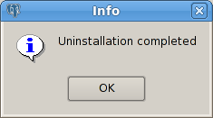

Note that after uninstalling Advanced Server, the cluster data files remain intact and the service user persists. You may manually remove the cluster data and service user from the system.

## Uninstalling a RPM Package

You can use either the rpm or yum command to remove RPM packages. Note that removing a package does not damage the Advanced Server data directory.

### Uninstalling a RPM Package with rpm

Include the -e option on the rpm command to remove installed packages; the command syntax is:

> rpm -e package_name \[*package*\_*name*…]

Where *package_name* is the name of the package that you would like to remove. The package name is the name of the .rpm file used when installing the package, with the version number and file extension (.rpm) removed; for example, the command:

> rpm -e edb-as96

Removes the package installed with the command:

> rpm -i edb-as96-9.6-*x*.rhel6.rpm

To instruct rpm to remove multiple packages, provide a list of packages you wish to remove when invoking the command.

### Uninstalling a RPM Package with yum

You can use the yum remove command to remove an RPM package. To remove a package, open a terminal window, assume superuser privileges, and enter the command:

> yum remove *package_name*

Where *package_name* is the name of the package that you would like to remove. The package name is the name of the .rpm file used when installing the package, with the file extension (.rpm) removed; for example, the command:

yum remove edb-as96

Removes the package installed with the command:

yum install edb-as96-9.6.*x*.*x*.rhel6.rpm

Note: yum and RPM will not remove a package that is required by another package. If you attempt to remove a package that satisfies a package dependency, yum or RPM will provide a warning.

## Using Advanced Server Uninstallers at the Command Line

The Advanced Server interactive installer creates uninstallers that you can use to remove Advanced Server or any of its individual components. If you uninstall an Advanced Server component, the remainder of the Advanced Server installation will remain intact.

The following table lists the names and locations of the Advanced Server binary uninstallers on Linux:

| Advanced Server Component                  | Uninstaller Name               | Linux Uninstaller Location   |
| ------------------------------------------ | ------------------------------ | ---------------------------- |
| The Database Server                        | uninstall-edb-as96-dbserver    | /opt/edb/as9.6               |
| Advanced Server and all supporting modules | uninstall-edb-as96-meta        | /opt/edb                     |
| Connectors                                 | uninstall-edb-connectors       | /opt/edb/connectors          |
| EDB\*Plus                                  | uninstall-edb-as96-edbplus     | /opt/edb/as9.6/edbplus       |
| Infinite Cache                             | uninstall_edb_infinitecache    | /opt/edb/as9.6/share/contrib |
| Migration Toolkit                          | uninstall-edb-migrationtoolkit | /opt/edb/mtk                 |
| pgAdmin 4                                  | uninstall-pgadmin4             | /opt/edb/pgadmin4            |
| pgAgent                                    | uninstall-edb-as96-pgagent     | /opt/edb/as9.6               |
| PgBouncer 1.7                              | uninstall-edb-pgbouncer        | /opt/edb/pgbouncer1.7        |
| pgPool-II                                  | uninstall-edb-pgpool           | /opt/edb/pgpool3.5           |
| pgPool-II Extension                        | uninstall-pgpool_extension     | /opt/edb/as9.6               |
| Slony Replication                          | uninstall-replication          | /opt/edb/as9.6               |
| StackBuilder Plus                          | uninstall-edb-stackbuilderplus | /opt/edb/sbp                 |

The following table lists the names and locations of the Advanced Server binary uninstallers on Windows:

| Advanced Server Component                  | Uninstaller Name                 | Windows Uninstaller Location                                           |
| ------------------------------------------ | -------------------------------- | ---------------------------------------------------------------------- |
| The Database Server                        | *uninstall-edb-as96-dbserver*    | C:\\Program Files\\edb\\as9.6                                          |
| Advanced Server and all supporting modules | *uninstall-edb-as96-meta*        | C:\\Program Files\\edb                                                 |
| Connectors                                 | uninstall-edb-connectors         | C:\\Program Files\\edb\\connectors                                     |
| EDB\*Plus                                  | uninstall-edb-as96-edbplus       | C:\\Program Files\\edb\\as9.6\\edbplus                                 |
| Migration Toolkit                          | *uninstall-edb-migrationtoolkit* | C:\\Program Files\\edb\\mtk                                            |
| pgAdmin 4                                  | uninstall-ppadmin4               | C:\\Program Files\\edb\\pgadmin4                                       |
| pgAgent                                    | *uninstall-edb-as96-pgagent*     | C:\\Program Files\\edb\\as9.6                                          |
| PgBouncer 1.7                              | *uninstall-edb-pgbouncer*        | C:\\Program Files\\edb\\pgbouncer1.7                                   |
| PL/Java                                    | *pljava_uninstall*               | C:\\Program Files\\edb\\as9.6\\share                                   |
| Slony Replication                          | uninstall-replication            | C:\\Program Files\\edb\\as9.6                                          |
| StackBuilder Plus                          | uninstall-edb-stackbuilderplus   | C:\\Program Files\\edb\\sbp                                            |
| xDB Replication Server                     | uninstall-xdbreplicationserver   | C:\\Program Files (x86)\\PostgreSQL\\EnterpriseDB-xDBReplicationServer |

To uninstall Advanced Server and all of the supporting modules, navigate to the Advanced Server directory and enter:

On Linux, assume superuser privileges and enter:

./uninstall-edb-as96-meta

On Windows assume Administrator privileges and enter:

uninstall-edb-as96-meta

A dialog opens, asking you to confirm your decision to uninstall Advanced Server (see Figure 9.1)

*Figure 9.1 - A dialog confirms that you wish to uninstall Advanced Server.*

Click Yes to confirm that you wish to uninstall Advanced Server. As the uninstallation progresses, a dialog displays a progress indicator for each uninstalled module. When the un-installer completes, a popup confirms that the data directory and service account have not been removed (see Figure 9.2).

*Figure 9.2 - A dialog confirms that the data directory and service user have not been removed.*

When the uninstallation is complete, an Info dialog opens to confirm that Advanced Server (and/or its components) has been removed (see Figure 9.3).

*Figure 9.3 - The uninstallation is complete.*

## Uninstalling Advanced Server on a Windows System

This section describes how to use the uninstaller to remove Advanced Server and all of its components. The following steps are easily adapted to remove a single service. Note that a system restart may be required to complete the removal of some Advanced Server components; if prompted, click OK to continue.

You can use the graphical interface provided by Windows to uninstall Advanced Server 9.6. Navigate through the Windows Control Panel to open the Windows Programs and Features dialog (shown in Figure 9.4).

!\[image](./images/image76.png)

*Figure 9.4 - The Programs and Features dialog.*

Right click EDB Postgres Advanced Server 9.6 (Complete) and select Uninstall/Change from the context menu to uninstall Advanced Server and all supporting Advanced Server components; optionally, right click on the Advanced Server component you wish to uninstall. If you are removing both the server and its supporting modules, a popup (shown in Figure 9.5) will prompt you to confirm that you wish to remove Advanced Server and its supporting components.

*Figure 9.5 - A dialog asks you to confirm that you wish to remove the server and its components.*

Please note that uninstalling Advanced Server will leave the data directory and database service user intact; you will be prompted for a confirmation (as shown in Figure 9.6).

*Figure 9.6 - A popup confirms that the data directory and service user account have not been removed from the host system.*

Popup dialogs signal the removal of each Advanced Server component. When the uninstallation process is complete, an Info dialog opens to confirm (shown in Figure 9.7)

*Figure 9.7 - An Info dialog confirms the uninstallation.*
