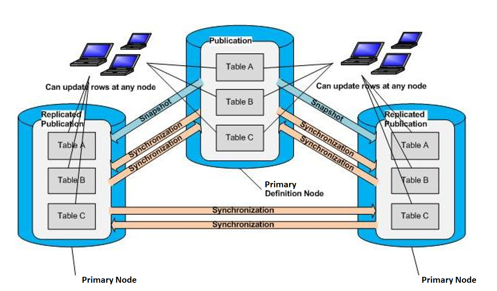

As an alternative to the single-master (primary-to-secondary) replication model, xDB Replication Server supports multi-master replication.

The following definitions are used when referring to multi-master replication systems.

A primary node is a database participating in a multi-master replication system.

The database (primary node) in which the publication is initially defined is specially designated as the `primary definition node (MDN)`. There can be only one primary definition node at any given time, however, it is possible to change which primary node is the primary definition node. When it is important to make a distinction between the primary definition node and all other primary nodes that are not the primary definition node, the latter are referred to as `non-MDN nodes`.

The primary definition node has the following significance:

-   The publication is initially created in the primary definition node, and the tables comprising the publication must exist in the database to be designated as the primary definition node at the time the publication is defined.
-   The publication can be initially replicated to other primary nodes by means of a snapshot from the primary definition node.
-   Each subsequent primary node added to the replication system must either: 1) contain no tables with the same schema-qualified names as the publication tables in the primary definition node; or 2) contain all publication table definitions as they exist in the primary definition node with the same schema-qualified names. In the first case, when you add the primary node, you select the option to replicate the publication schema from the primary definition node. In the second case, you do not select this option.
-   The table rows in a primary node can be reloaded from the primary definition node. The primary node tables are truncated and the rows reloaded by a snapshot from the primary definition node.

Once the multi-master replication system is defined, changes (inserts, updates, and deletions) to rows of the publication tables on any primary node are synchronized to all other primary nodes on either an on demand or scheduled basis.

Generally, changes must not be made to the table definitions in any of the primary nodes including the primary definition node. If such changes are made, they are not propagated to other nodes in the multi-master replication system unless they are made using the DDL change replication feature described in [Replicating DDL Changes](../../07_common_operations/08_replicating_ddl_changes/#replicating_ddl_changes). If changes are made to tables without using the DDL change replication feature, there is a risk that future replication attempts may fail.

**Figure 2-7: In a multi-master replication system, table rows can be updated at any primary node**
