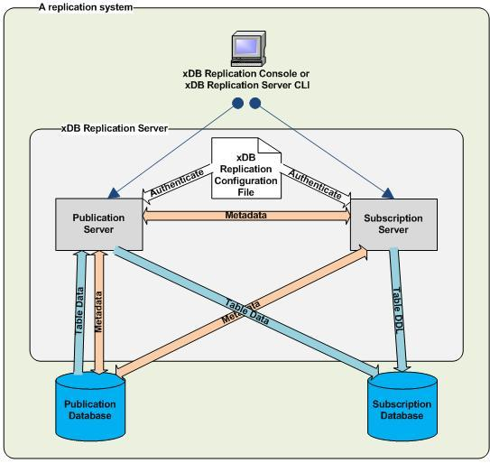
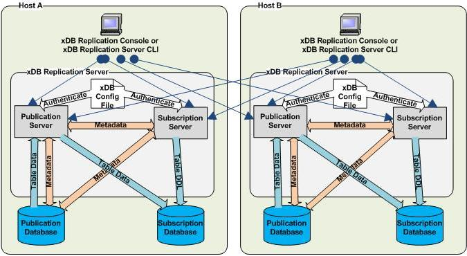

<div id="physical_components" class="registered_link"></div>

xDB Replication Server is not a single, executable program, but rather a set of programs along with data stores containing configuration information and metadata that work together to form a replication system.

The following diagram illustrates the components of xDB Replication Server and how they are used to form a complete, basic, single-master replication system.



**Figure 2-8: xDB Replication Server - physical view (single-master replication system)**

The following diagram illustrates the components of xDB Replication Server and how they are used to form a complete, basic, multi-master replication system.


**Figure 2 9: xDB Replication Server - physical view (multi-master replication system)**


The minimal configuration of xDB Replication Server for a basic replication system consists of the following software components:

-   **Publication server.** The program that configures the publication database and primary nodes for replication and performs replication.
-   **Subscription server.** The program that configures the subscription database for replication and initiates replication. The subscription server is used only in single-master replication systems.
-   **xDB Replication Configuration file.** Text file containing connection and authentication information used by the publication server and subscription server upon startup to connect to a publication database designated as the controller database. Also used to authenticate registration of the publication server and subscription server from the user interface when creating a replication system.
-   **xDB Startup Configuration file.** Text file containing installation and configuration information used for the Java Runtime Environment when the publication server and subscription server are started.

The entire replication system is completed with the addition of the following components:

-   User interfaces for configuring and maintaining the replication system
-   One or more publication databases for a single-master replication system
-   One or more subscription databases for a single-master replication system
-   One primary definition node for a multi-master replication system
-   One or more additional primary nodes for a multi-master replication system

The user interface, publication server, subscription server, publication database, subscription database, and primary nodes can all run on the same host or on separate, networked hosts.

Any number of user interfaces can be used at any time to access any number of publication servers and subscription servers on the network as long as the network locations, user names, and passwords of the publication and subscription servers are known.

Any number of publication and subscription databases can participate in a single-master replication system.

Any number of primary nodes can participate in a multi-master replication system.

The following sections describe each component in more detail.

## Publication Server

The publication server creates and manages the metadata for publications. When a publication is created, the publication server creates database objects in the control schema of the publication database to record metadata about the publication.

Whenever a primary node is added to a multi-master replication system, the publication server creates database objects in the control schema of the primary node for recording metadata. For non-MDN nodes, the publication server also calls EnterpriseDB’s Migration Toolkit to create the publication table definitions if so chosen at primary node creation time.

!!! Note
    See [Control Schema and Control Schema Objects](#control_schema_and_objects) for information on the control schema.

The publication server is also responsible for performing a replication. For snapshot replications, the publication server calls EnterpriseDB’s Migration Toolkit to perform the snapshot.

For single-master synchronization replications, the publication server uses the Java Database Connectivity (JDBC) interface to apply changes to the subscription table rows based on changes that have been recorded in either one of two ways: a) If the publication database is running under Postgres version 9.4 or later and the logical decoding option has been chosen when creating the publication, changes are obtained from the Postgres WAL files using a logical replication slot, or b) In all other circumstances, changes are recorded in metadata tables (called shadow tables) in the publication database by row-based triggers that fire upon any insert, update, or deletion to the publication table rows.

For multi-master synchronization replications, the publication server performs the same process as for single-master synchronizations, but does so for each primary node pair combination in the multi-master replication system.

The publication server may run on the same host as the other xDB Replication Server components, or it may run on a separate, networked host.

## Subscription Server

!!! Note
    The subscription server is required only for single-master replication systems. The subscription server does not need to be running, nor even installed if only multi-master replication systems are in use.

The subscription server creates and manages the metadata for subscriptions. When a subscription is created, the subscription server creates database objects in the control schema of the publication database to record metadata about the subscription.

When a subscription is created, the subscription server calls EnterpriseDB’s Migration Toolkit to create the subscription table definitions in the subscription database. The rows in the subscription tables are not populated until a replication occurs. Rows are populated by actions of the publication server.

The subscription server is also responsible for initiating a replication as a result of manual user action through the user interface, or a schedule created for the subscription. The subscription server initiates a call to the publication server that manages the associated publication. The publication server then performs the actual replication.

The subscription server may run on the same host as the other xDB Replication Server components, or it may run on a separate, networked host.

When the subscription server is started, it uses the information in the xDB Replication Configuration file found on its host to connect to the designated controller database.

<div id="xdb_replication_conf_file" class="registered_link"></div>

## xDB Replication Configuration File

The xDB Replication Configuration file contains the connection and authentication information used by any publication server or subscription server running on the host containing the file.

Specifically, the xDB Replication Configuration file is accessed in the following circumstances:

-   When a publication server or subscription server is started on the host.
-   When a publication server or subscription server is registered during the process of creating a replication system. Registration of a publication server or subscription server is done using the xDB Replication Console or the xDB Replication Server Command Line Interface.

The following table contains a brief description of the parameters in the xDB Replication Configuration file.

**Table 2-2: xDB Replication Configuration FilexDB Replication Configuration File**

|                  |                                                                                                                                                                                |
| ---------------- | ------------------------------------------------------------------------------------------------------------------------------------------------------------------------------ |
| **Parameter**    | **Description**                                                                                                                                                                |
| `admin_user`     | xDB administrator user name (the admin user name) for registering a publication server or a subscription server on this host containing the xDB Replication Configuration file |
| `admin_password` | Encrypted password of the admin user                                                                                                                                           |
| `database`       | Database name of the controller database                                                                                                                                       |
| `user`           | Database user name of the controller database                                                                                                                                  |
| `password`       | Encrypted password of the controller database user                                                                                                                             |
| `port`           | Port number on which the database server of the controller database listens for requests                                                                                       |
| `host`           | IP address of the host running the database server of the controller database                                                                                                  |
| `type`           | Database type of the controller database such as oracle, enterprisedb, etc.                                                                                                    |


The xDB Replication Server product creates the content of this file as follows:

-   The xDB Replication Configuration file and some of its initial content are created when you install a publication server or subscription server on a host during the xDB Replication Server installation process.
-   Parameters `admin_user` and `admin_password` are determined during the xDB Replication Server installation process. See Chapter [Installation and Uninstallation](../../03_installation/#installation) for how the content of these parameters are determined.
-   Parameters `database, user, password, port, host,` and `type` are set with the connection and authentication information of the first publication database definition you create with the xDB Replication Console or xDB Replication Server CLI. This database is designated as the controller database. See [Controller Database](#controller-database) for information on the controller database. See [Adding a Publication Database](../../05_smr_operation/02_creating_publication/02_adding_pub_database/#adding_pub_database) for creating a publication database definition for a single-master replication system. See [Adding the Primary definition node](../../06_mmr_operation/02_creating_publication_mmr/#adding_pdn) for creating the publication database definition for a multi-master replication system.

The following is an example of the content of an xDB Replication Configuration file:

```text
#xDB Replication Server Configuration Properties
#Tue May 26 13:45:37 GMT-05:00 2015
port=1521
admin_password=ygJ9AxoJEX854elcVIJPTw\=\=
user=pubuser
admin_user=admin
type=oracle
password=ygJ9AxoJEX854elcVIJPTw\=\=
database=xe
host=192.168.2.23
```

!!! Note
    The passwords for the admin user name and the controller database user name are encrypted. Should you change either of these passwords, you must modify the corresponding password parameters in the xDB Replication Configuration file to contain the encrypted form of the new password. See [Encrypting the Password in the xDB Replication Configuration File](../../10_appendix/04_miscellaneous_xdb_processing_topics/02_encrypt_password_inconf_file/#encrypt_password_in%20conf_file) for directions on how to generate the encrypted form of a password.

See [Post-Installation Host Environment](../../03_installation/05_post_installation_host_environment/#post_installation_host_environment) for the file system location of the xDB Replication Configuration file.

<div id="xdb_startup_conf_file" class="registered_link"></div>

## xDB Startup Configuration File

The xDB Startup Configuration file contains installation and configuration information primarily used by the Java Runtime Environment (JRE) when any publication server or subscription server is started up on the host containing the file.

The content of the file is created by the xDB Replication Server installer when you install xDB Replication Server.

The following is an example of the content of an xDB Startup Configuration file:

```text
#!/bin/sh

JAVA_EXECUTABLE_PATH="/usr/bin/java"
JAVA_MINIMUM_VERSION=1.8
JAVA_BITNESS_REQUIRED=64
JAVA_HEAP_SIZE="-Xms256m -Xmx1536m"
PUBPORT=9051
SUBPORT=9052
```

The following table contains a brief description of the parameters in the xDB Startup Configuration file.

**Table 2-3: xDB Startup Configuration File**

|                         |                                                                                                                                              |
| ----------------------- | -------------------------------------------------------------------------------------------------------------------------------------------- |
| **Parameter**           | **Description**                                                                                                                              |
| `JAVA_EXECUTABLE_PATH`  | Directory path to the Java runtime program used to start and run the publication and subscription servers                                    |
| `JAVA_MINIMUM_VERSION`  | The earliest JRE version that can be used by the publication and subscription servers                                                        |
| `JAVA_BITNESS_REQUIRED` | The bitness of the Java virtual machine required by the installed publication and subscription servers                                       |
| `JAVA_HEAP_SIZE`        | In `-Xmsnnnm` `nnn` specifies the minimum Java heap size in megabytes. In `-Xmxnnnm` `nnn` specifies the maximum Java heap size in megabytes |
| `PUBPORT`               | Port number on which the publication server listens for requests                                                                             |
| `SUBPORT`               | Port number on which the subscription server listens for requests                                                                            |

The `JAVA_EXECUTABLE_PATH` parameter specifies the location of the Java runtime program as identified by the xDB Replication Server installer during the installation process. The setting of this parameter may be subsequently changed to a different JRE installation if so desired.

`The JAVA_MINIMUM_VERSION` parameter specifies the earliest version of the Java Runtime Environment that can be used with xDB Replication Server. This setting must not be changed.

The `JAVA_BITNESS_REQUIRED` parameter must not be altered. If the installed value is modified, or if it does not match the bitness of the Java virtual machine as identified by `JAVA_EXECUTABLE_PATH`, a number of errors may occur, which include failure of the publication and subscription servers to start and registration failure of the xDB Replication Server product.

See [Setting Heap Memory Size for the Publication and Subscription Servers](../../05_smr_operation/01_prerequisites/01_setting_heap_size_for_pub_and_sub/#setting_heap_size_for_pub_and_sub) for information on setting the `JAVA_HEAP_SIZE` parameter.

See [Firewalls and Access to Ports](../../05_smr_operation/01_prerequisites/06_verifying_host_accessibility/#firewalls_and_access_to_ports) Setting Heap Memory Size for the Publication and Subscription Servers for information on the `PUBPORT` and `SUBPORT` parameters.

After making any modifications to the xDB Startup Configuration file, the publication server and subscription server must be restarted.

See [Post-Installation Host Environment](../../03_installation/05_post_installation_host_environment/#post_installation_host_environment) for the file system location of the xDB Startup Configuration file.

## xDB Replication Console

The xDB Replication Console is the graphical user interface program you can use to create and control all aspects of a replication system.

Through a single xDB Replication Console, you can configure and operate a replication system running on the same host on which the xDB Replication Console is installed, or you can configure and operate replication systems where the xDB Replication Server components are distributed on different hosts in a networked environment.



**Figure 2-10: xDB Replication Consoles accessing multiple hosts**

In the preceding figure, there are two Postgres installations running on two networked hosts, each with its own xDB Replication Server installation. Each host is running a publication server and a subscription server.

The xDB Replication Console on each host can access and manage the replication systems on the other host if given the network IP address, port number, user name, and password with which the publication server and subscription server were installed with on the remote host. See Chapter [Introduction to the xDB Replication Console](../../04_intro_xdb_console/#intro_xdb_console) for information on the user interface of the xDB Replication Console.

## xDB Replication Server Command Line Interface

xDB Replication Server Command Line Interface (CLI) is a command line driven alternative to the xDB Replication Console graphical user interface, providing equivalent functionality for creating and controlling all aspects of a replication system.

Automation of replication system operations can be done by embedding xDB Replication Server CLI commands in scripts such as Bash for Linux.

xDB Replication Server CLI is installed whenever you choose to install the xDB Replication Console.

Chapter [xDB Replication Server Command Line Interface](../../08_xdb_cli/#xdb_cli) provides directions for using xDB Replication Server CLI.

## Publication Database

The publication database contains the tables and views used in a publication. The publication database may be running on the same host or on a different host than where the publication server is running as long as the hosts are accessible to each other by a network.

Each publication database also contains a control schema, which is a collection of database objects containing metadata on all replication systems, both single-master and multi-master, controlled by the publication server connected to this publication database. See [Control Schema and Control Schema Objects](#control_schema_and_objects) for information on the control schema.

In a multi-master replication system, all primary nodes are considered publication databases.

A database plays the roles of both a publication database and a subscription database if it contains publications and subscriptions.

## Subscription Database

!!! Note
    The subscription database applies only to single-master replication systems.

The subscription database contains the tables created from a subscription. The subscription database may be running on the same host or on a different host than where the subscription server is running as long as the hosts are accessible to each other by a network.

A subscription database can also serve as a publication source for replicating to a third server if desired. This configuration is referred to as cascading replication.

A database plays the roles of both a publication database and a subscription database if it contains publications and subscriptions such as in the cascaded replication scenario.

## Primary node

In a multi-master replication system, the databases containing the set of tables (the publication) for which row changes are to be replicated are called primary nodes. The primary nodes may be running on the same host or on different hosts than where the publication server is running as long as the hosts are accessible to each other by a network.

Each primary node also contains a control schema, which is a collection of database objects containing metadata on all replication systems, both single-master and multi-master, controlled by the publication server connected to this primary node. See [Control Schema and Control Schema Objects](#control_schema_and_objects) for information on the control schema. The primary nodes may be running under the same, or under multiple database server instances (Postgres database clusters).

<div id="pdn" class="registered_link"></div>

## Primary definition node

The first node added to create a multi-master replication system is initially designated the primary definition node. This node must contain the table definitions (and optionally, the initial set of rows) that are to be included in the publication.

As subsequent databases are added as primary nodes to the replication system, the table definitions and initial row sets can optionally be propagated from the primary definition node to the newly added primary nodes.

After the multi-master replication system is defined, it is possible to reassign the role of the primary definition node to another primary node in the multi-master replication system. The significance of this reassignment is that snapshots can be taken from the newly appointed primary definition node to other primary nodes. This could be beneficial if the data in the old primary definition node becomes corrupt or out-of-sync with the other primary nodes and needs to be completely refreshed by a snapshot from another primary node.

As with all primary nodes, the primary definition node contains a control schema, which is a collection of database objects containing metadata on all replication systems, both single-master and multi-master, controlled by the publication server connected to this primary node. See [Control Schema and Control Schema Objects](#control_schema_and_objects) for information on the control schema.

<div id="control_schema_and_objects" class="registered_link"></div>

## Control Schema and Control Schema Objects

The control schema is a conceptual term referring to the collection of metadata database objects that define the logical and physical structure of, and enable the operation and maintenance of xDB Replication Server single-master and multi-master replication systems.

These metadata database objects, referred to as control schema objects consist of tables, sequences, functions, procedures, triggers, packages, etc.

The control schema objects store metadata such as type of replication system (single-master or multi-master), network location, database type, connection and authentication information for publication databases, subscription databases, and primary nodes, names of publications and the tables and views they contain, names of subscriptions and the publications to which they are subscribed, replication transaction status, replication scheduling, replication history cleanup scheduling, replication history, etc.

Each publication database in a trigger-based, single-master replication system also contains control schema objects with the changes that have been made to rows in the publication and the status of whether or not those changes have been applied to the subscription tables.

Similarly, for a multi-master replication system, each trigger-based primary node contains control schema objects with the changes that have been made to rows in the publication residing on that primary node, and the statuses of whether or not those changes have been applied to the other primary nodes in the multi-master replication system.

!!! Note
    For log-based single-master and multi-master replication systems, changes are extracted from the database server WAL files instead of being stored in control schema objects. See [Synchronization Replication with the Log-Based Method](../02_replication_concepts_and_definitions/10_sync_replication_log_based/#sync_replication_log_based) for information on the log-based method.

The actual, physical database schemas implementing the control schema to which the control schema objects belong varies depending upon the database type (Oracle, SQL Server, or Postgres) and how the database was initially configured for use by xDB Replication Server.

The following points should be noted about the control schema:

-   The control schema and its control schema objects are created in every publication database of both single-master and multi-master replication systems. That is, all master (publication) databases of single-master replication systems and all primary nodes of multi-master replication systems.
-   When a new primary database is added for a single-master replication system or a new primary node for a multi-master replication system, a snapshot operation is used to replicate the control schema to the newly added publication database assuming there is an existing controller database. See [Controller Database](#controller-database) for information regarding the controller database.
-   Updates to the configuration of a single-master replication system or a multi-master replication system made by the xDB Replication Console or the xDB Replication Server Command Line Interface are synchronized between the control schemas on all publication databases to ensure that the metadata is consistent across all publication databases.
-   The secondary (subscription) database of single-master replication systems contains one, single table as its metadata database object. The term, subscription metadata object, is specifically used to refer to this database object in the subscription database. The general terms, control schema and control schema objects refer to the database objects in the publication databases.
-   The control schema objects in all databases controlled by the same given publication server generally contain the same information. This allows any such database to provide the information needed by xDB Replication Server to control all single-master and multi-master replication systems running under that given publication server.
-   Should a certain publication database of a replication system go offline due to database server problems, network connectivity issues, etc., the other replication systems running under the same publication server are still functional since the other publication databases can provide the control schema information required to run all replication systems.

<div id="controller_database" class="registered_link"></div>

## Controller Database

In the xDB Replication Configuration file, the connection and authentication information for one publication database is included and as such, designated as the controller database.

As with all publication databases, the controller database contains the control schema with the replication system information for all single-master and multi-master replication systems run by the publication server that accesses that xDB Replication Configuration file.

The controller database serves as the primary provider of the replication system information to the publication server and the subscription server. Thus, upon initial startup, the publication server and subscription server attempt to connect to the designated controller database. This controller database then provides the metadata information for all replication systems.

Should the initial connection to the controller database fail for some reason, you can manually edit the xDB Replication Configuration file to provide the connection and authentication information for another publication database. Then upon startup of the publication server and subscription server, the control schema of this alternate publication database is used to provide the replication system information.

The initial controller database is determined by the first publication database definition created by the xDB Replication Console or the xDB Replication Server CLI either for a single-master or multi-master replication system. The publication server records the connection and authentication information in the xDB Replication Configuration file.

If you wish to delete the publication database definition of the current controller database, you must first designate another publication database, defined under the same publication server, as the controller using the xDB Replication Console. See [Switching the Controller Database](../../07_common_operations/07_switching_controller_db/#switching_controller_db) for directions on switching the controller to another publication database.

The following are some points regarding the controller database:

-   The database server running the controller database must be running and accessible before starting the publication server and subscription server.
-   For a single-master replication system, the publication server under which the publication database and publication are defined and the subscription server under which the subscription database and the subscription related to the publication are defined, must both connect to the same the controller database. This gives the publication server and the subscription server access to the same control schema.
-   When changes are made to the metadata maintained by the control schema in the controller database, these changes are replicated by the publication server to the control schemas of all other publication databases. This ensures that the metadata of all single-master and multi-master systems are complete and consistent in the control schemas of all publication databases. This allows you to switch the controller database at some later point in time. See [Switching the Controller Database](../../07_common_operations/07_switching_controller_db/#switching_controller_db) for information on switching the controller database.

!!! Note
    If the controller database is an Oracle or a SQL Server publication database, then a second Oracle or SQL Server publication database cannot be added to create a second single-master replication system. In order for xDB Replication Server to run more than one single-master replication systems consisting of Oracle or SQL Server publication databases, a Postgres publication database must be designated as the controller database.

Once you have multiple Oracle or SQL Server publication databases set up in single-master replication systems with a Postgres controller database, do not switch the controller database to an Oracle or SQL Server publication database.
