

This section contains examples of replication systems and how the logical components are used to define them.

In the accompanying diagrams, the logical components, represented by nodes in the replication tree of the xDB Replication Console, are superimposed on physical component diagrams. The logical components are shaded in yellow to aid in identifying them in the diagrams.

## Oracle to PostgreSQL or Advanced Server Replication

The following is an illustration of a basic Oracle to PostgreSQL or Advanced Server single-master replication system. A single publication in Oracle contains tables from two schemas that are replicated to a database residing in either PostgreSQL or Advanced Server.

**Figure 2-11: Oracle to PostgreSQL or Advanced Server replication**

The following describes the logical components in the preceding diagram: \* The publication server to be used is identified by registering its network location, user name, and password.

-   A publication database definition is created subordinate to the SMR type node under the publication server. The Oracle database user name pubuser is specified in the definition along with the database network location and database identifier. When you create a user named `pubuser` in Oracle, a schema named `pubuser` is automatically created by Oracle at the same time. The publication server creates the control schema objects in the `pubuser` control schema for the replication system’s metadata when you create the publication database definition.
-   A publication named pub is created subordinate to the publication database definition. The publication consists of table `A` in schema `S1` and tables `B` and `C` in schema `S2`.
-   The subscription server to be used is identified by registering its network location, user name, and password.
-   A subscription database definition is created subordinate to the subscription server. The Postgres database user name `subuser` is specified in the definition along with the database network location and database identifier.
-   A subscription named `sub` is created subordinate to the subscription database definition. When the subscription is created, the subscription server creates schemas named `S1` and `S2` in the subscription database. The table definitions for tables `A, B`, and `C` are also created at this time. When replication occurs, the publication server populates these tables with rows from the publication.

The following screen capture shows how the logical components of this replication system appear in the xDB Replication Console replication tree.

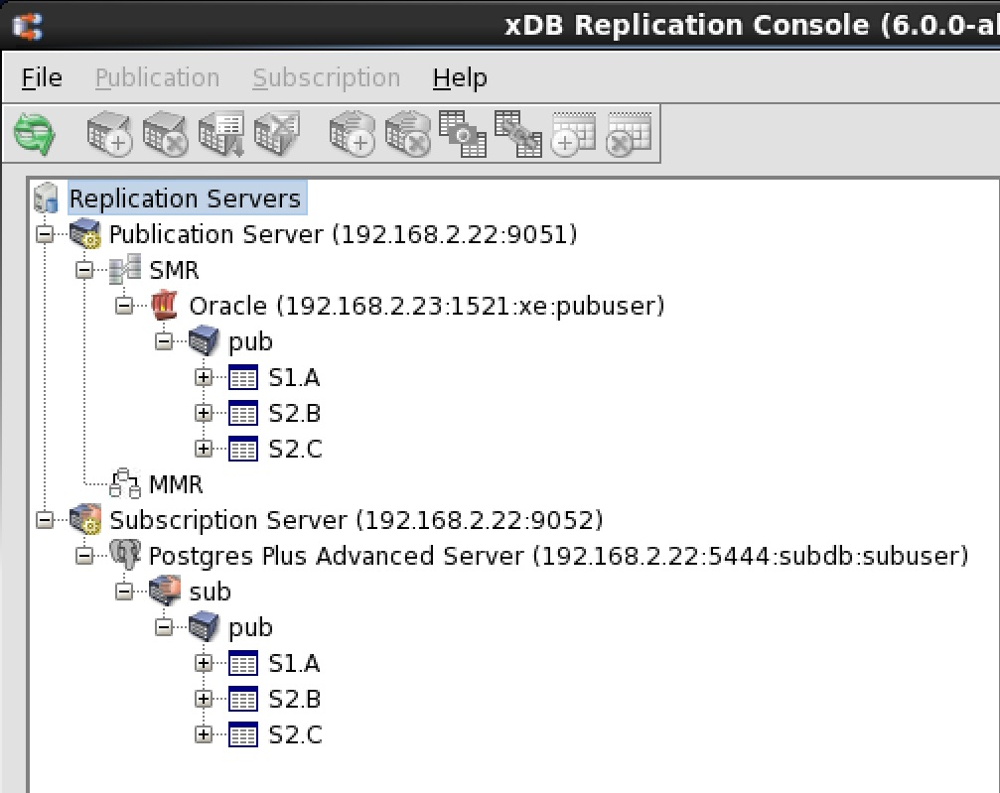

**Figure 2-12: Oracle to Postgres replication tree**

See Chapter [Introduction to the xDB Replication Console](../../04_intro_xdb_console/#intro_xdb_console) for an introduction to the xDB Replication Console.

## SQL Server to PostgreSQL or Advanced Server Replication

The following is an illustration of a basic SQL Server to PostgreSQL or Advanced Server single-master replication system. A single publication in SQL Server contains tables from two schemas that are replicated to a database residing in either PostgreSQL or Advanced Server.

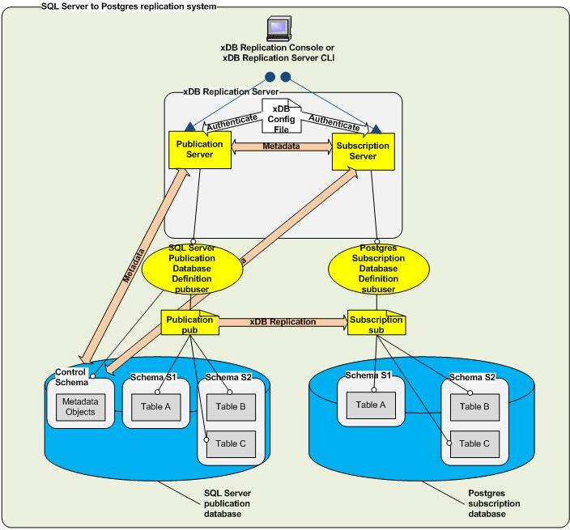

**Figure 2-13: SQL Server to PostgreSQL or Advanced Server replication**

The following describes the logical components in the preceding diagram:

-   The publication server to be used is identified by registering its network location, user name, and password.
-   A publication database definition is created subordinate to the SMR type node under the publication server. The SQL Server login pubuser is specified in the definition along with the database network location and database identifier. The schema pubuser was created during the publication database preparation step as described in [SQL Server Publication Database](../../05_smr_operation/01_prerequisites/04_preparing_pub_database/#sql_server_pub_db). The `pubuser` schema along with the control schema consisting of three physical schemas `_edb_replicator_pub`, `_edb_replicator_sub`, and `_edb_scheduler` are populated with the control schema objects for the replication system’s metadata when you create the publication database definition.
-   A publication named pub is created subordinate to the publication database definition. The publication consists of table `A` in schema `S1` and tables `B` and `C` in schema `S2`.
-   The subscription server to be used is identified by registering its network location, user name, and password.
-   A subscription database definition is created subordinate to the subscription server. The Postgres database user name `subuser` is specified in the definition along with the database network location and database identifier.
-   A subscription named sub is created subordinate to the subscription database definition. When the subscription is created, the subscription server creates schemas named `S1` and `S2` in the subscription database. The table definitions for tables `A, B`, and `C` are also created at this time. When replication occurs, the publication server populates these tables with rows from the publication.

The following screen capture shows how the logical components of this replication system appear in the xDB Replication Console replication tree.

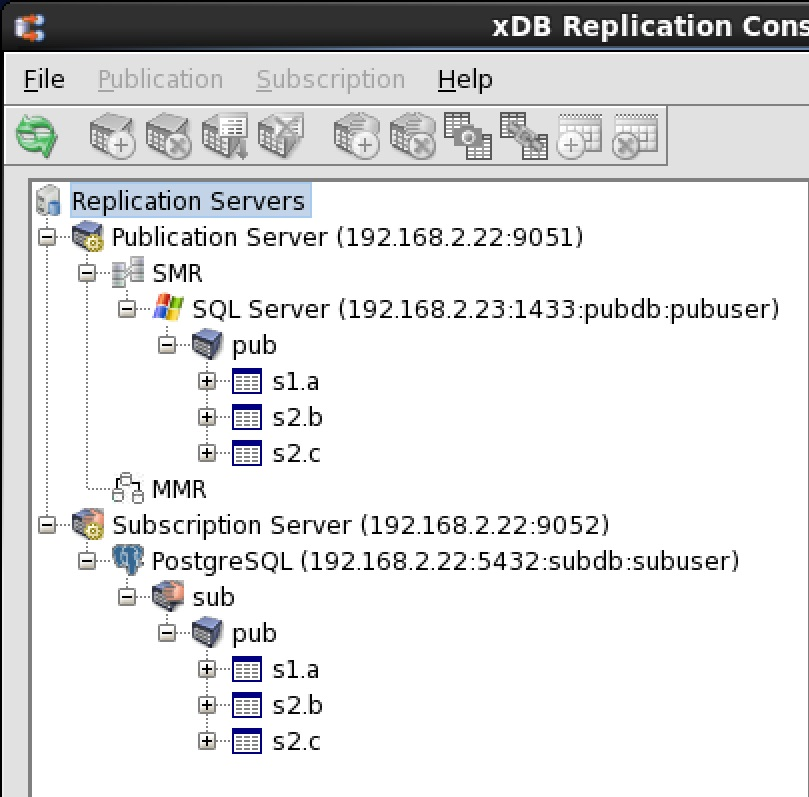

**Figure 2-14: SQL Server to Postgres replication tree**

See Chapter [Introduction to the xDB Replication Console](../../04_intro_xdb_console/#intro_xdb_console) for an introduction to the xDB Replication Console.

## Advanced Server to Oracle Replication

The following is an illustration of a basic Advanced Server to Oracle single-master replication system. A single publication in an Advanced Server database contains tables from two schema that are replicated to an Oracle database.

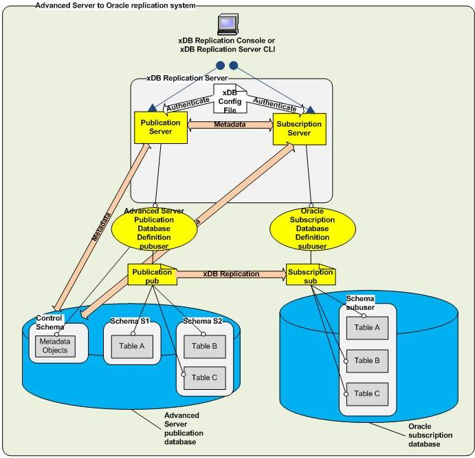

**Figure 2-15: Advanced Server to Oracle replication**

The following describes the logical components in the preceding diagram:

-   The publication server to be used is identified by registering its network location, user name, and password.
-   A publication database definition is created subordinate to the SMR type node under the publication server. The Postgres database user name `pubuser` is specified in the definition along with the database network location and database identifier. The publication server creates the control schema consisting of three physical schemas `_edb_replicator_pub`, `_edb_replicator_sub`, and `_edb_scheduler` and populates them with the control schema objects for the replication system’s metadata when you create the publication database definition.
-   A publication named pub is created subordinate to the publication database definition. The publication consists of table `A` in schema `S1` and tables `B` and `C` in schema `S2`.
-   The subscription server to be used is identified by registering its network location, user name, and password.
-   A subscription database definition is created subordinate to the subscription server. The Oracle database user name `subuser` is specified in the definition along with the database network location and database identifier.
-   A subscription named sub is created subordinate to the subscription database definition. When you create a user named `subuser` in Oracle, a schema named `subuser` is automatically created by Oracle at the same time. The table definitions for tables A, B, and C are created in schema `subuser` when you create subscription sub. When replication occurs, the publication server populates these tables with rows from the publication.

The following screen capture shows how the logical components of this replication system appear in the xDB Replication Console replication tree.

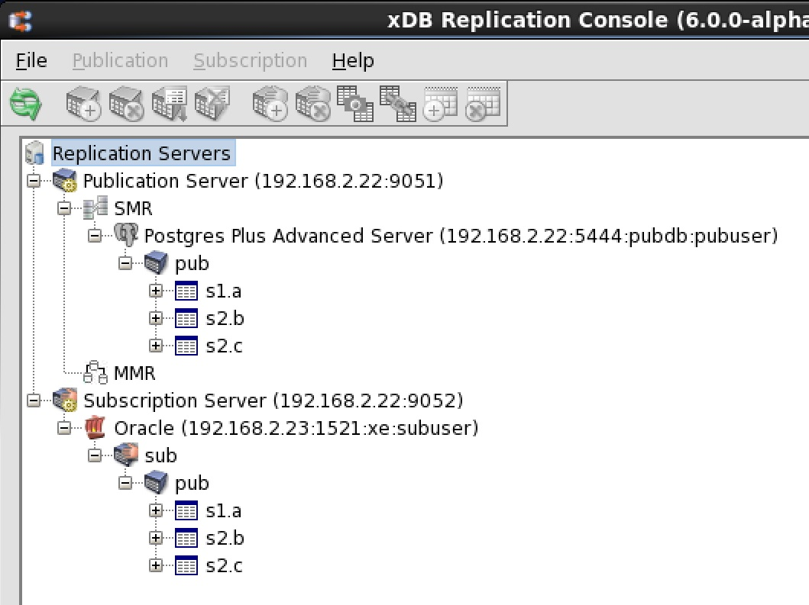

**Figure 2-16: Advanced Server to Oracle replication tree**

See Chapter [Introduction to the xDB Replication Console](../../04_intro_xdb_console/#intro_xdb_console) for an introduction to the xDB Replication Console.

## PostgreSQL to Oracle Replication

The following is an illustration of a basic PostgreSQL to Oracle single-master replication system. A single publication in a PostgreSQL database contains tables from two schemas that are replicated to an Oracle database. WAL based method as well as trigger-based method is supported in this type of replication.

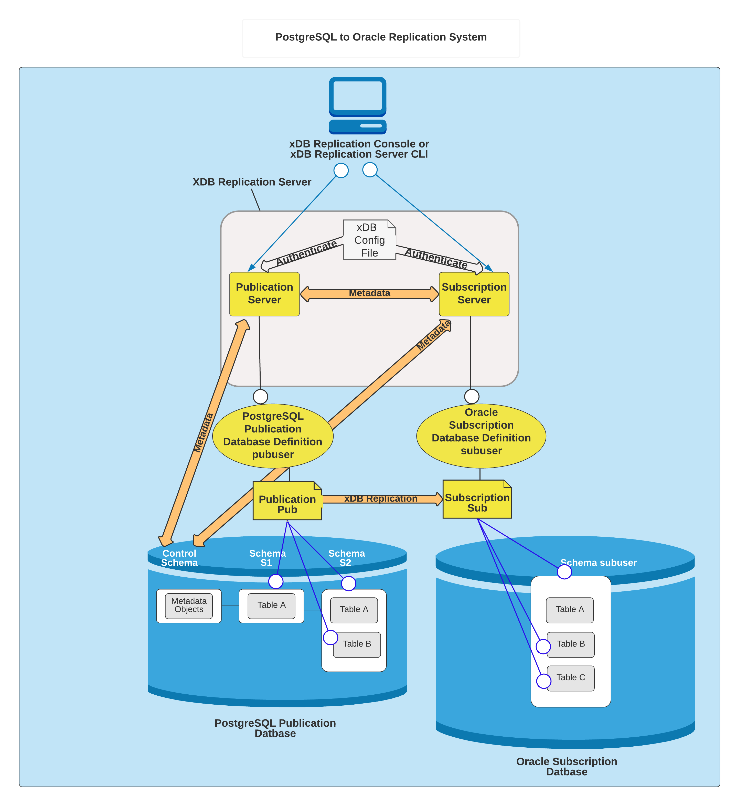

**Figure 2-16: PostgreSQL to Oracle replication**

The following describes the logical components in the preceding diagram:

-   The publication server to be used is identified by registering its network location, user name, and password.
-   A publication database definition is created subordinate to the SMR type node under the publication server. The Postgres database user name pubuser is specified in the definition along with the database network location and database identifier. The publication server creates the control schema consisting of three physical schemas \_edb_replicator_pub, \_edb_replicator_sub, and \_edb_scheduler and populates them with the control schema objects for the replication system’s metadata when you create the publication database definition.
-   A publication named pub is created subordinate to the publication database definition. The publication consists of table A in schema S1 and tables B and C in schema S2.
-   The subscription server to be used is identified by registering its network location, user name, and password.
-   A subscription database definition is created subordinate to the subscription server. The Oracle database user name subuser is specified in the definition along with the database network location and database identifier.
-   A subscription named sub is created subordinate to the subscription database definition. When you create a user named subuser in Oracle, a schema named subuser is automatically created by Oracle at the same time. The table definitions for tables A, B, and C are created in schema subuser when you create subscription sub. When replication occurs, the publication server populates these tables with rows from the publication.

The following screen capture shows how the logical components of this replication system appear in the xDB Replication Console replication tree.

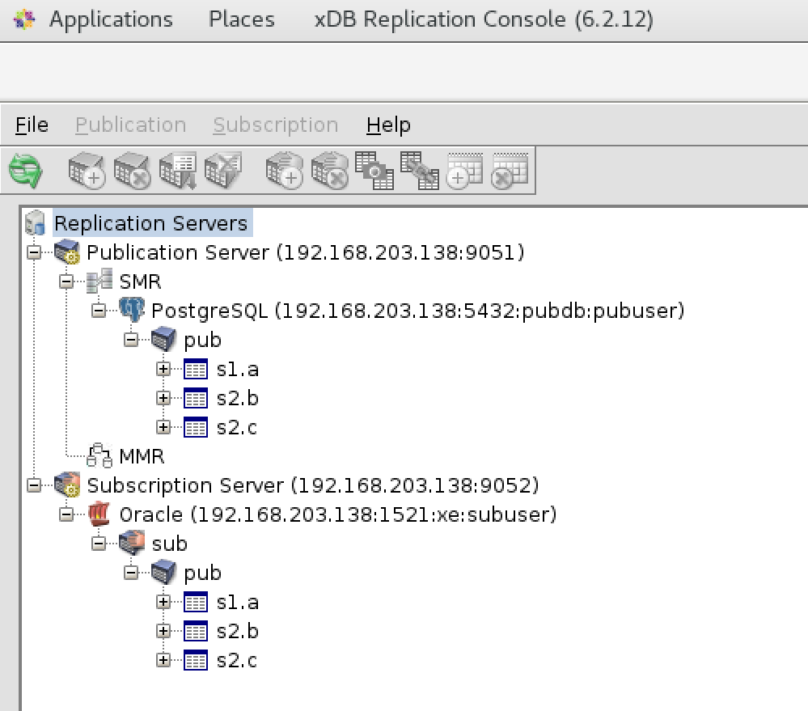

**Figure 2-17: PostgreSQL to Oracle replication tree**

## PostgreSQL or Advanced Server to SQL Server Replication

The following is an illustration of a basic PostgreSQL or Advanced Server to SQL Server single-master replication system. A single publication in a PostgreSQL or Advanced Server database contains tables from two schemas that are replicated to a SQL Server database.

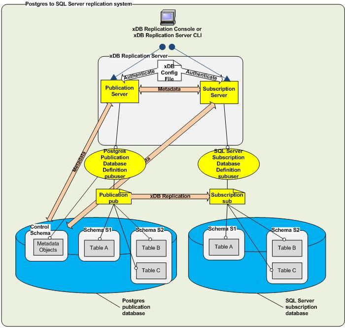

**Figure 2-18: PostgreSQL or Advanced Server to SQL Server replication**

The following describes the logical components in the preceding diagram:

-   The publication server to be used is identified by registering its network location, user name, and password.
-   A publication database definition is created subordinate to the SMR type node under the publication server. The Postgres database user name `pubuser` is specified in the definition along with the database network location and database identifier. The publication server creates the control schema consisting of three physical schemas `_edb_replicator_pub`, `_edb_replicator_sub`, and `_edb_scheduler` and populates them with the control schema objects for the replication system’s metadata when you create the publication database definition.
-   A publication named pub is created subordinate to the publication database definition. The publication consists of table `A` in schema `S1` and tables `B` and `C` in schema `S2`.
-   The subscription server to be used is identified by registering its network location, user name, and password.
-   A subscription database definition is created subordinate to the subscription server. The SQL Server login `subuser` is specified in the definition along with the database network location and database identifier.
-   A subscription named sub is created subordinate to the subscription database definition. When the subscription is created, the subscription server creates schemas named `S1` and `S2` in the subscription database. The table definitions for tables `A, B`, and `C` are also created at this time. When replication occurs, the publication server populates these tables with rows from the publication.

The following screen capture shows how the logical components of this replication system appear in the xDB Replication Console replication tree.

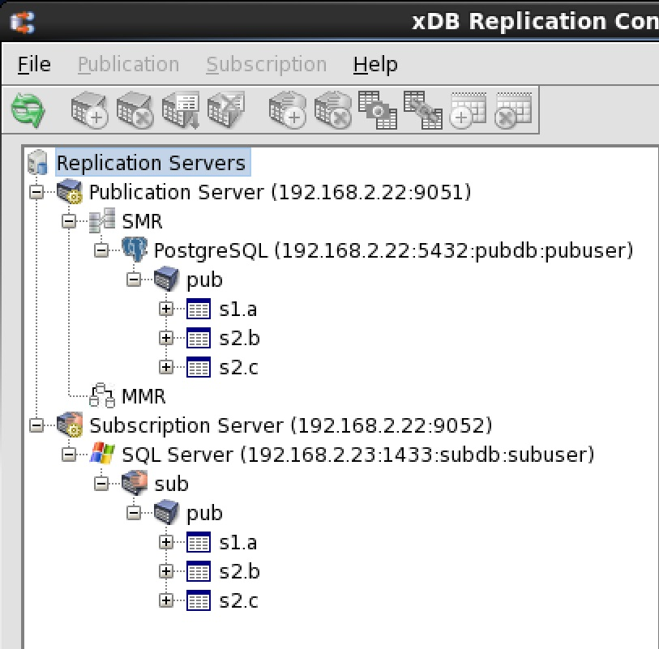

**Figure 2-19: Postgres to SQL Server replication tree**

See [Introduction to the xDB Replication Console](../../04_intro_xdb_console/#intro_xdb_console) for an introduction to the xDB Replication Console.

## Postgres Multi-Master Replication

The following is an illustration of a basic Postgres multi-master replication system. A publication in a Postgres primary definition node contains tables from two schemas that are initially replicated to two other Postgres primary nodes. The tables in all three primary nodes can then be updated and synchronized with each other.

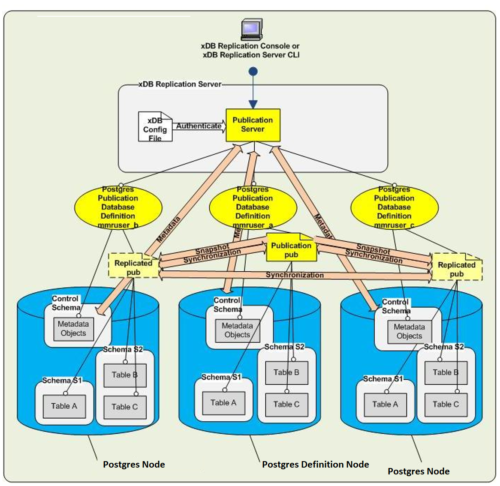

**Figure 2-20: Postgres multi-master replication system**

The following describes the logical components in the preceding diagram:

-   The publication server to be used is identified by registering its network location, user name, and password.
-   A publication database definition is created subordinate to the MMR type node under the publication server. This first publication database definition identifies the primary definition node. The Postgres database user name `MMRuser_a` is specified in the definition along with the database network location and database identifier. The publication server creates the control schema consisting of three physical schemas `_edb_replicator_pub`, `_edb_replicator_sub`, and `_edb_scheduler` and populates them with the control schema objects for the replication system’s metadata when you create the publication database definition.
-   A publication named pub is created subordinate to the publication database definition. The publication consists of table `A` in schema `S1` and tables `B` and `C` in schema `S2`.
-   A second primary node is added by creating another publication database definition subordinate to the MMR type node of the publication server under which the primary definition node resides. The Postgres database user name `MMRuser_b` is specified in the definition along with the database network location and database identifier to create the second primary node.
-   When you add the second primary node, you can choose to have the publication server create schemas S1 and S2 and the table definitions for `A, B`, and `C` for you, or you could have manually created the schemas and table definitions beforehand. The publication server creates the control schema consisting of three physical schemas `_edb_replicator_pub`, \_edb_replicator_sub, and \_edb_scheduler under which it creates the control schema objects to store the primary node’s metadata. When defining the primary node, you can choose to have the publication server populate these tables with rows from the publication at this time, or you can defer table loading to a later point in time.
-   A third primary node is added in a similar manner using the Postgres database user name `MMRuser_c`.

The following screen capture shows how the logical components of this replication system appear in the xDB Replication Console replication tree.

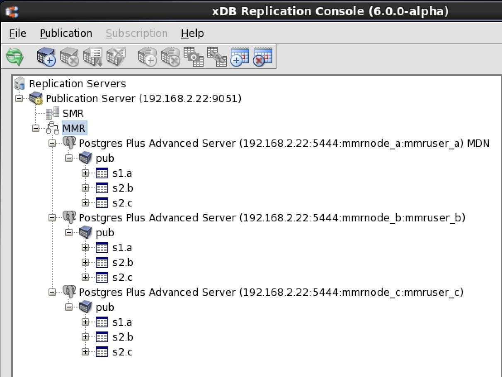

**Figure 2-21: Postgres multi-master replication tree**

See Chapter [Introduction to the xDB Replication Console](../../04_intro_xdb_console/#intro_xdb_console) for an introduction to the xDB Replication Console.
