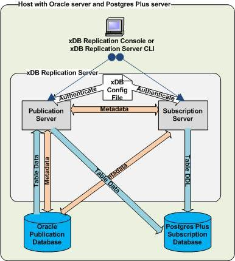
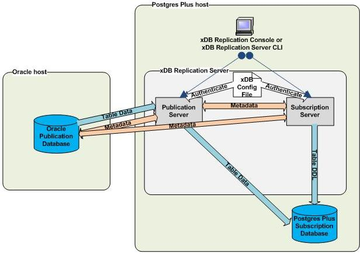
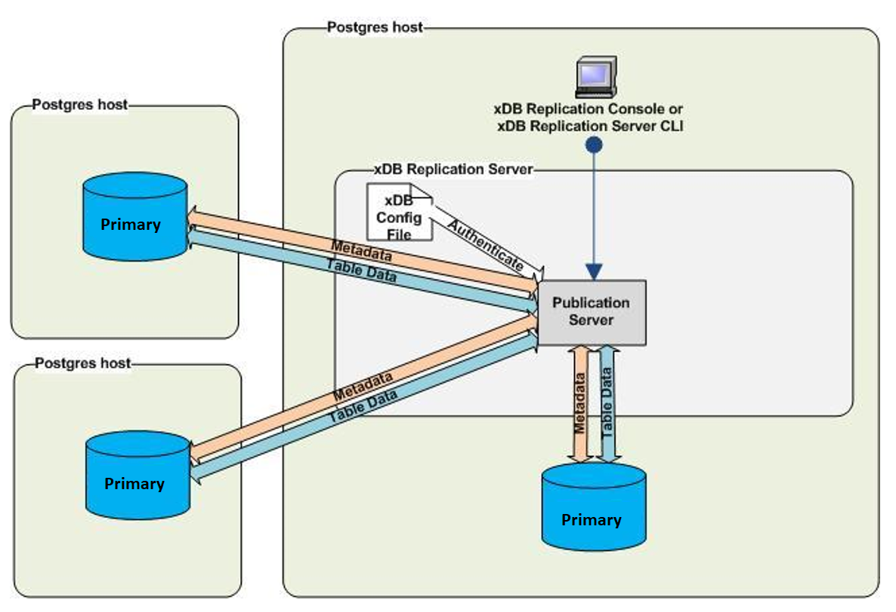

xDB Replication Server provides the flexibility of allowing you to run the replication system’s components on separate machines on a network.

In fact xDB Replication Server is designed so that it is possible to set up replication systems where each of the components (publication server, subscription server, publication database, subscription database, and primary nodes) may all run on the same host, each component may run on its own separate host, or any combination of components may run on any number of hosts.

However, for practical purposes, there are two basic scenarios. The simplest case is where all components are on the same host. The other case is where you have the Oracle or SQL Server database server running on a host separate from the rest of the replication system components.

This section discusses the advantages and disadvantages of each scenario.

## Single Host

The simplest implementation of a replication system is when all replication components run on a single host. This means that the PostgreSQL or Advanced Server installation, the complete xDB Replication Server installation (publication server and subscription server), and the Oracle or SQL Server database server reside on the same machine.

The Postgres publication or subscription database as the case may be, can reside in the initial database cluster that is created when Postgres is installed on the host.

**Figure 2-22: Single host replication system**

The advantages of a single host replication system are the following:

-   There is a performance advantage since there is no network over which to push replication data, especially if large snapshots are involved.
-   Configuration is much simpler. When creating the replication system logical components, the IP addresses of all components are the same.

The disadvantages of a single host replication system are the following:

-   The replication system and the database servers all consume the resources of one machine, which can adversely affect database application performance.
-   The publication and subscription databases may be in different geographic locations, thereby requiring multiple networked hosts.
-   Your site may require the use of a dedicated host for the Oracle or SQL Server database server so xDB Replication Server could not reside on the same machine.

## Single-Master Replication Distributed Hosts

xDB Replication Server allows you to build a replication system with either or both of the publication database and the subscription database on separate hosts. This is illustrated in the following diagram:

**Figure 2-23: Oracle database server on distributed host**

The same remote distribution can be used for the subscription database instead of, or in addition to the publication database.

The advantages of a distributed host replication system are the following:

-   The replication system and the database servers can each consume the resources of their own machines, which can be individually selected and tuned.
-   The publication and subscription databases can be in different geographic locations.
-   You can enforce stronger database security if only the database server is allowed to run on a host.

The disadvantages of a distributed host replication system are the following:

-   There may be a performance disadvantage since there is a network over which to push replication data, especially if large snapshots are involved.
-   Installation is more complex if the Postgres database must run on a different host than xDB Replication Server. This involves installing Postgres on two separate hosts.
-   Configuration is more complex. The network and firewalls must be properly configured to allow the distributed components to communicate. When creating the replication system logical components, the correct IP addresses of all components must be used. In addition, the correct IP addresses must be kept up-to-date in the replication system control schema should they change in the networked environment.

## Multi-Master Replication Distributed Hosts

In a multi-master replication system, the Postgres database servers running the primary nodes can be running on a single or multiple hosts. The following example illustrates two primary nodes running on database servers on separate hosts as well as a primary node running on the same database server as the publication server.

Figure 2-24: Multi-master replication on distributed hosts
