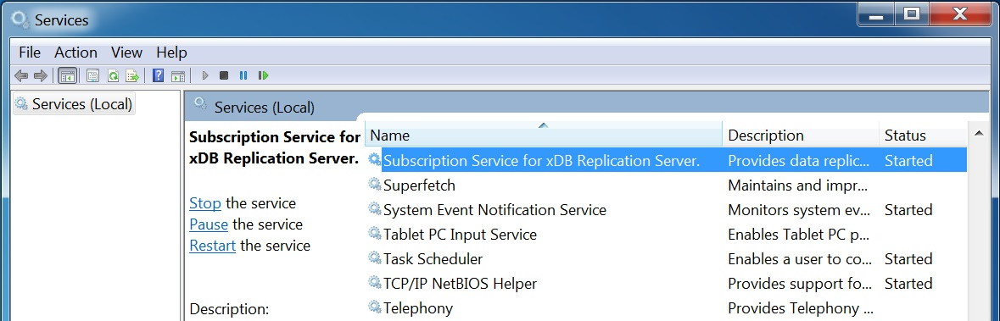
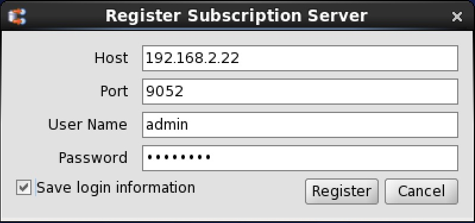
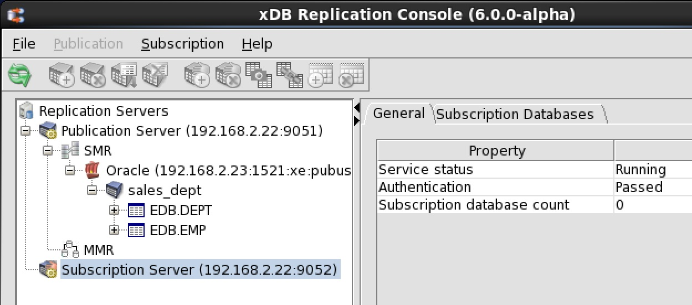

When you register a subscription server, you are identifying the network location, admin user name, and password of a specific, running, subscription server instance that you want to use to manage all aspects of the subscriptions you will be creating subordinate to it.

It is important that you record the login information for the subscription server as you must always use this same subscription server instance to manage all subscriptions created subordinate to it as represented in the xDB Replication Console replication tree.

**Step 1:** Start the subscription server if it is not already running. Repeat the same process as in Step 1 of [Registering a Publication Server](../02_creating_publication/01_registering_publication_server/#registering_publication_server).

!!! Note
    If you are using Oracle publication or subscription databases, and the subscription server has not been restarted since copying the Oracle JDBC driver to the `lib/jdbc` subdirectory of your xDB Replication Server installation, you must restart the subscription server.

**For Linux only:** Use the `systemctl` command for CentOS 7 or RHEL 7 and CentOS 8 or RHEL 8, and the service command for previous Linux versions to start, stop, or restart `edb-xdbsubserver` for the subscription server. See [Registering a Publication Server](../02_creating_publication/01_registering_publication_server/#registering_publication_server) for information on how these commands are used.

**For Windows only:** Open Control Panel, System and Security, Administrative Tools, and then Services. Use the Start or Restart link for the service named Subscription Service for xDB Replication Server.

**Figure 5-16: Windows subscription service**

If the subscription server fails to start, see [Publication and Subscription Server Startup Failures](../../10_appendix/03_resolving_problems/02_where_to_look_for_errors/#pub_and_sub_startup_failures) for information.

**Step 2:** Register the subscription server. Open the xDB Replication Console from the system’s application menu. For xDB Replication Server installed from an xDB RPM package, the xDB Replication Console is started by invoking the script `XDB_HOME/bin/runRepConsole.sh`.

**Step 3:** Select the top level Replication Servers node. From the `File` menu, choose `Subscription` Server, and then choose `Register Server`. Alternatively, click the secondary mouse button on the Replication Servers node and choose `Register Subscription` Server. The `Register Subscription Server` dialog box appears.

Enter the values you supplied during the installation of xDB Replication Server unless otherwise specified.

-   `Host.` Network IP address of the host running the subscription server. This is the network IP address used for `sub_ipaddr` in the `pg_hba.conf` file in [Postgres Server Authentication](../01_prerequisites/06_verifying_host_accessibility/#postgres_server_auth). (Do not use `localhost` for this field.)
-   `Port.` Port number the subscription server is using. This is the port number you specified on the Subscription Server Details screen in Step 17 of [Installing With Stack Builder or StackBuilder Plus](../../03_installation/01_installing_with_stackbuilder/#installing_with_stackbuilder).
-   `User Name.` Admin user name that is used to authenticate your usage of this subscription server. This is the user name you specified on the xDB Admin User Details screen in Step 15 of [Installing With Stack Builder or StackBuilder Plus](../../03_installation/01_installing_with_stackbuilder/#installing_with_stackbuilder).
-   `Password.` Password of the admin user given in the User Name field.
-   `Save login information.` Check this box if you do not want to re-register the subscription server each time you open the xDB Replication Console. See [Saving Server Login Information](../../04_intro_xdb_console/#saving_server_login_info) for additional information on the advantages and disadvantages of saving server login information.

!!! Note
    The user name and password combination you enter is authenticated against the admin user name and password in the xDB Replication Configuration file residing on the host with the IP address you enter in the Host field.

**Figure 5-17: Register Subscription Server dialog box**

Click the Register button after you have filled in the fields. A Subscription Server node appears in the replication tree of the xDB Replication Console.

**Figure 5-18: Replication tree after registering a subscription server**
