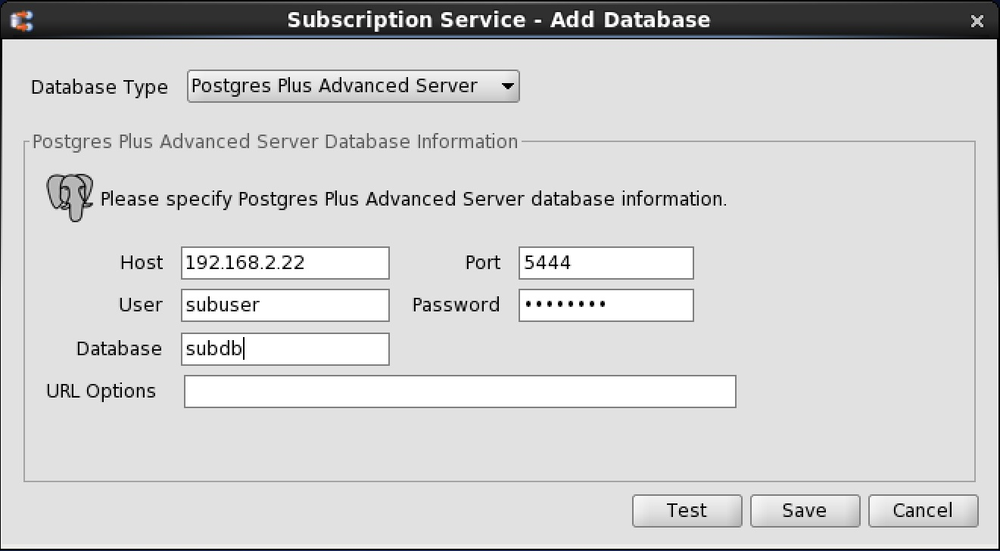
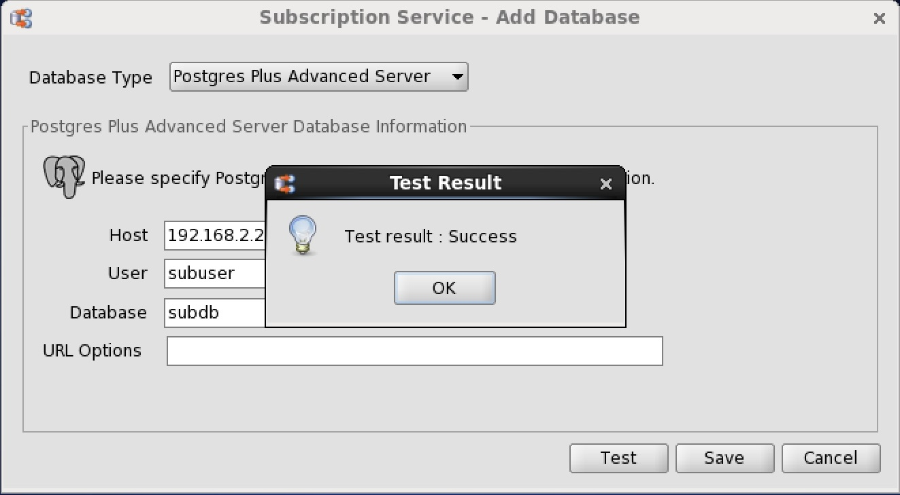
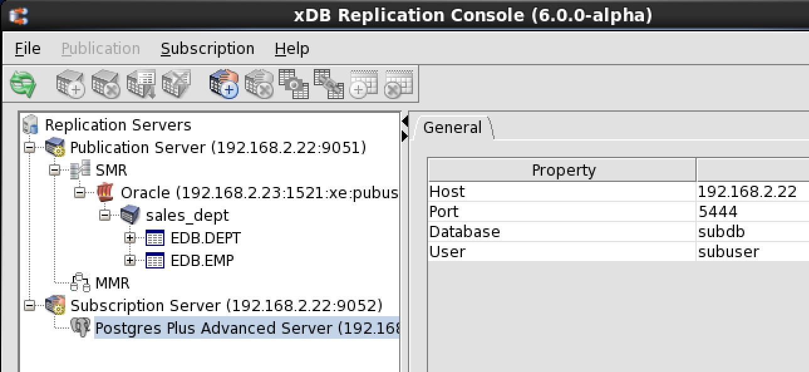

The database in which subscriptions are to reside must be identified to xDB Replication Server. This is done by creating a subscription database definition.

After the subscription database definition is created, a Subscription Database node representing that subscription database definition appears in the replication tree of the xDB Replication Console. Subscriptions created subordinate to this subscription database definition will have their publications replicated to the database identified by the subscription database definition.

You must enter database connection information such as the database server network address, database identifier, and database login user name and password when you create the subscription database definition. The connection information is used by the subscription server to create the subscription table definitions and by the publication server to perform replications.

Note the following restriction on the subscription database:

-   **For Oracle only.** There must be no existing tables or views owned by the Oracle subscription database user that has the same name as a table or view in a publication that will be replicated to this database. For example, if the Oracle subscription database user name is `subuser`, and if a Postgres publication contains a table with the name dept, then the Oracle subscription database must not have an existing table or view with the schema-qualified name `subuser.dept` at the time you create the subscription.
-   **For Postgres only.** There must be no existing tables or views with the same schema-qualified name as a table or view in a publication that will be replicated to this database. For example, if the publication contains a table with the schema-qualified name `edb.dept`, then the Postgres subscription database must not have an existing table or view with the schema-qualified name edb.dept at the time you create the subscription.

!!! Note
    If the SQL Server publication schema name is dbo, the subscription tables are created under a schema named `dbo_sql` in Postgres.

-   **For SQL Server only.** There must be no existing tables or views with the same schema-qualified name as a table or view in a publication that will be replicated to this database. For example, if the publication contains a table with the schema-qualified name `edb.dept`, then the SQL Server subscription database must not have an existing table or view with the schema-qualified name edb.dept at the time you create the subscription.

!!! Note
    If the Postgres publication schema name is public, the subscription tables are created under a schema named `public_sql` in SQL Server.

!!! Note
    A database that has been added as a publication database can also be used as a subscription database.

**Step 1:** Make sure the database server in which the subscription database resides is running and accepting client connections.

**Step 2:** Select the Subscription Server node. From the Subscription menu, choose Subscription Database, and then choose Add Database. Alternatively, click the secondary mouse button on the Subscription Server node and choose Add Database. The `Subscription Service – Add Database` dialog box appears.

**Step 3:** Fill in the following fields:

-   Database Type. Select Oracle, SQL Server, PostgreSQL, or Postgres Plus Advanced Server for the type of subscription database. For an Advanced Server Oracle compatible installation, select the Postgres Plus Advanced Server option. For PostgreSQL or an Advanced Server PostgreSQL compatible installation, select the PostgreSQL option.
-   `Host`. IP address of the host on which the subscription database server is running.
-   `Port`. Port on which the subscription database server is listening for connections.
-   `User`. The subscription database user name chosen in [Postgres Subscription Database](../01_prerequisites/05_preparing_sub_database/#postgres_sub_database) for a Postgres subscription database or the database user name created in Step 2 of [Oracle Subscription Database](../01_prerequisites/05_preparing_sub_database/#oracle_sub_database) for an Oracle subscription database or the database user name created in Step 2 of [SQL Server Subscription Database](../01_prerequisites/05_preparing_sub_database/#sql_sub_database) for a SQL Server subscription database.
-   `Password`. Password of the database user.
-   `Service ID (For Oracle)`. Enter the Oracle System Identifier (SID) of the Oracle instance running the subscription database if the SID radio button is selected. Enter the net service name of a connect descriptor as defined in the `TNSNAMES.ORA` file if the Service Name radio button is selected. Note (For Oracle 12c Pluggable Database): Use the service name.
-   `Database (For Postgres or SQL Server)`. Enter the Postgres or SQL Server database name.
-   `URL Options (For SSL connectivity)`. Enter the URL options to establish SSL connectivity to the subscription database. See [Using Secure Sockets Layer (SSL) Connections](../../07_common_operations/11_using_ssl_connections/#using_ssl_connections) for information on using SSL connections.

**Figure 5-19: Subscription Service - Add Database dialog box**

**Step 4:** Click the `Test` button. If Test Result: Success appears, click the OK button, then click the Save button.

**Figure 5-20: Successful subscription database test**

If an error message appears investigate the cause of the error, correct the problem, and repeat steps 1 through 4.

When the subscription database definition is successfully saved, a Subscription Database node is added to the replication tree under the Subscription Server node.

**Figure 5-21: Replication tree after adding a subscription database**
