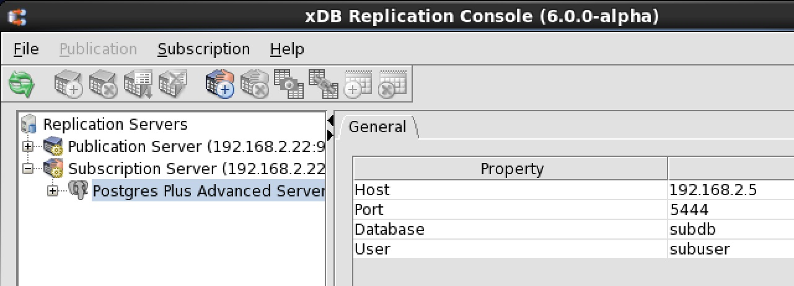
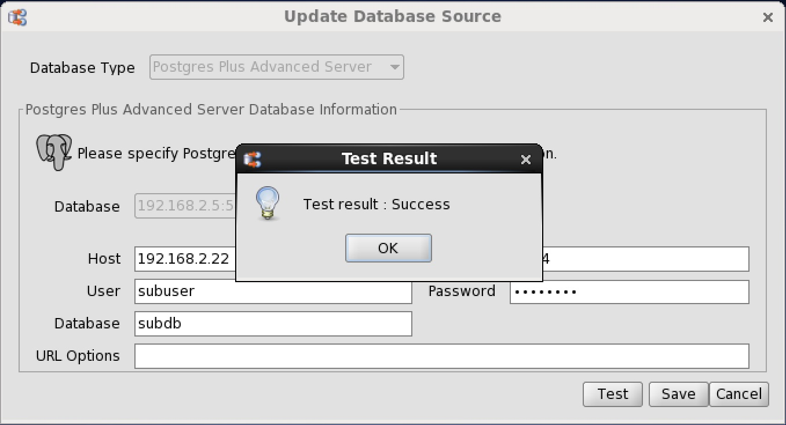
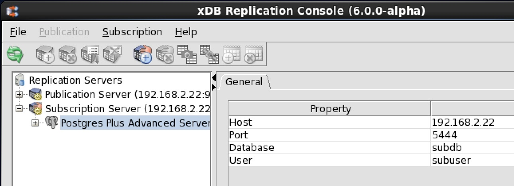

When you create a subscription database definition, you save the subscription database server’s network location (IP address and port number), the database identifier, a database login user name, and the user’s password in the control schema accessed by the subscription server. This login information is used whenever a session needs to be established with the subscription database. See [Adding a Subscription Database](../03_creating_subscription/02_adding_subscription_database/#adding_subscription_database) for information on creating a subscription database definition.

The steps described in this section show you how to update the subscription database login information stored in the control schema should any of these attributes of the actual, physical database change.

!!! Note
    Depending upon the database type (Oracle, SQL Server, or Postgres), certain attributes must not be changed. If you have already added subscriptions, you must not change any attribute that alters access to the schema where the subscription tables were created.

Attributes you must not change if there are existing subscriptions include the following:

-   The Oracle login user name as the subscription tables already reside in this Oracle user’s schema
-   The database server network location if the new network location references a database server that does not access the database that already contains the subscription tables
-   The database identifier if the new database identifier references a different physical database than where the subscription tables already reside

Attributes you may change include the following:

-   The login user name’s password to match a changed database user password
-   The database server network location if the corresponding location change was made to the database server that accesses the subscription database
-   The database identifier such as the Oracle service name, SQL Server database name, or Postgres database name if the corresponding name change was made on the database server
-   All attributes may be changed if there are no existing subscriptions

**Step 1:** Make sure the database server that you ultimately wish to save as the subscription database definition is running and accepting client connections.

**Step 2:** Make sure the subscription server whose node is the parent of the subscription database definition you wish to change is running and has been registered in the xDB Replication Console you are using. See [Registering a Subscription Server](../03_creating_subscription/01_registering_subscription_server/#registering_subscription_server) for directions on starting and registering a subscription server.

**Step 3:** Select the Subscription Database node corresponding to the subscription database definition that you wish to update.

**Figure 5-38: Selecting a subscription database definition for update**

**Step 4:** From the Subscription menu, choose Subscription Database, and then choose Update Database. Alternatively, click the secondary mouse button on the Subscription Database node and choose Update Database. The Update Database Source dialog box appears.

**Step 5:** Enter the desired changes. See Step 3 of Section [Adding a Subscription Database](../03_creating_subscription/02_adding_subscription_database/#adding_subscription_database) for the precise meanings of the fields.

**Figure 5-39: Update Database Source dialog box**

**Step 6:** Click the `Test` button. If Test Result: Success appears, click the `OK` button, then click the `Save` button.

**Figure 5-40: Successful subscription database test**

If an error message appears investigate the cause of the error, correct the problem, and repeat steps 1 through 6.

**Step 7:** Click the `Refresh` icon in the xDB Replication Console tool bar to show the updated Subscription Database node and any of its subscriptions.

**Figure 5-41: Updated subscription database**
