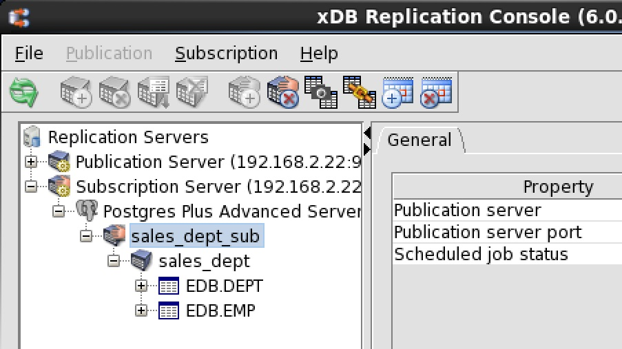
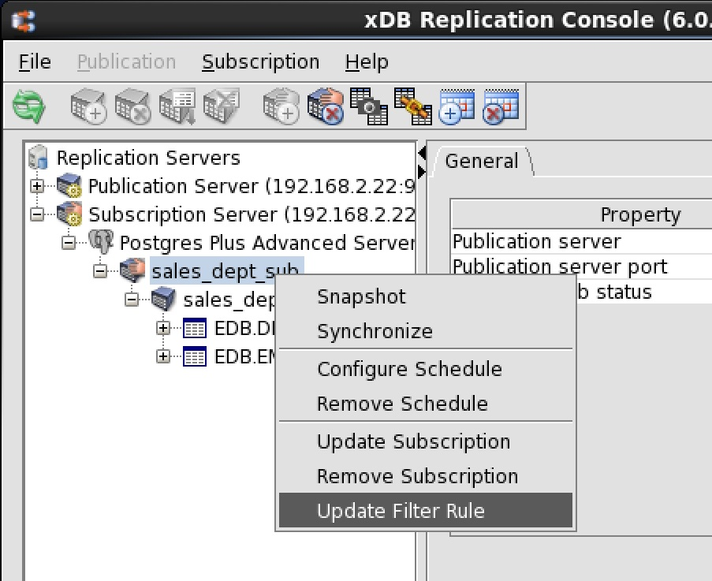
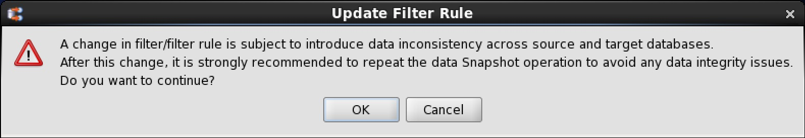
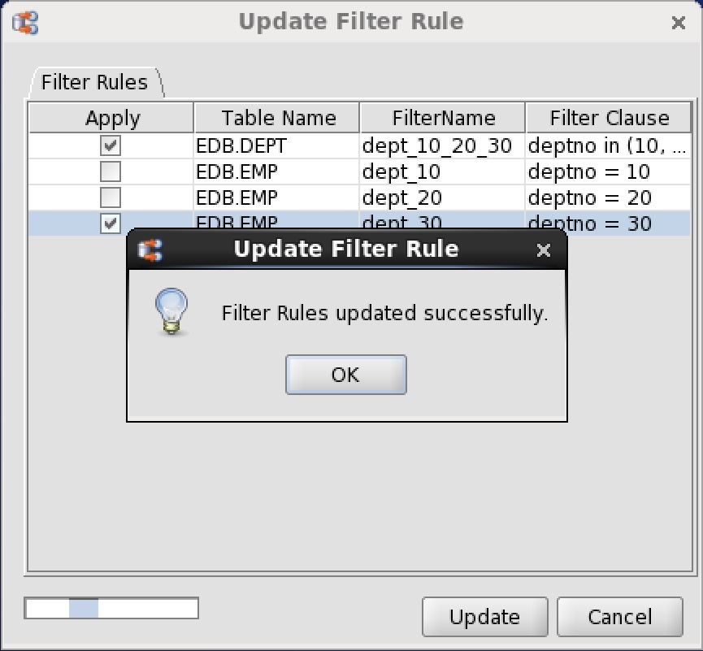

Table filters must first be defined in a set of available table filters in the publication before they can be enabled on a subscription. See [Adding a Publication](../02_creating_publication/03_adding_publication/#adding_publication) for information on defining table filters in a single-master replication system.

The following are the steps for enabling or disabling table filters on an existing subscription.

**Step 1:** Make sure the publication server whose node is the parent of the publication associated with the subscription you wish to change is running and has been registered in the xDB Replication Console you are using. See [Registering a Publication Server](../02_creating_publication/01_registering_publication_server/#registering_publication_server) for directions on starting and registering a publication server. Make sure the subscription server whose node is the parent of the subscription you wish to change is running and has been registered in the xDB Replication Console you are using. See [Registering a Subscription Server](../03_creating_subscription/01_registering_subscription_server/#registering_subscription_server) for directions on starting and registering a subscription server.

**Step 2:** Select the Subscription node of the subscription on which you wish to enable or disable individual filter rules.

**Figure 5-45: Selecting a subscription on which to enable or disable filter rules**

**Step 3:** Open the Filter Rules tab in any of the following ways:

-   Choose `Update Filter Rule` from the `Subscription` menu.
-   Click the secondary mouse button on the Subscription node and choose `Update Filter Rule`.

**Figure 5-46: Opening the Filter Rules tab on a subscription**

**Step 4:** In the `Filter Rules` tab check or uncheck the boxes to specify the filter rules to enable or disable on the subscription. At most one filter rule may be enabled any given subscription table. Click the `Update` button.

**Figure 5-47: Filter Rules tab**

**Step 5:** A confirmation box appears presenting a warning message and a recommendation to perform a snapshot replication to any subscription on which you changed the filtering criteria.

Click the `Ok` button in the confirmation box to proceed with the update to the filter rule selections. Click the `Cancel` button to return to the `Filter Rules` tab if you wish to modify your filter rule selections.

**Figure 5-48: Change filter rule confirmation**

**Step 6:** If you clicked the `Ok` button in the preceding step, the `Filter Rules updated successfully` confirmation message appears if the update was successful.

**Figure 5-49: Successful update of filter rules**

If you clicked the `Cancel` button in the preceding step, the `Filter Rules` tab reopens. You can modify your filter rule selections by repeating Step 4, or you can click the Cancel button in the Filter Rules tab to abort the filter rule updates on the subscription.

**Step 7:** It is strongly recommended that a snapshot replication be performed to the subscription that contains tables on which the filtering criteria has changed.

A snapshot ensures that the content of the subscription tables is consistent with the updated filtering criteria. See [Performing Snapshot Replication](../04_on_demand_replication/01_perform_replication/#perform_replication) for information on performing a snapshot replication.
