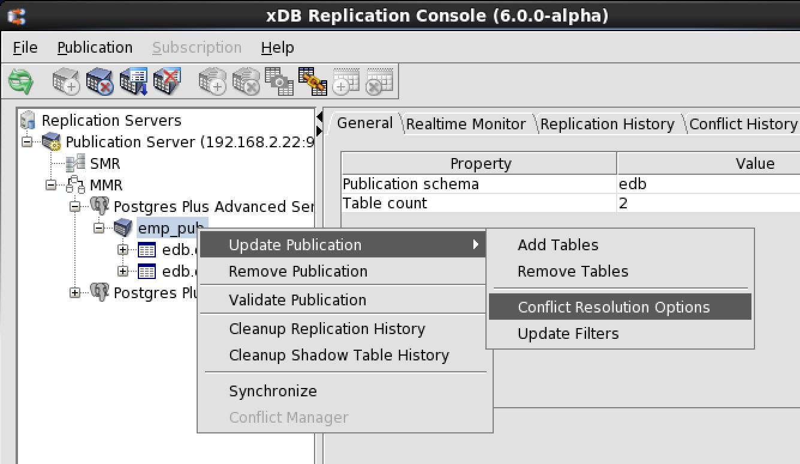
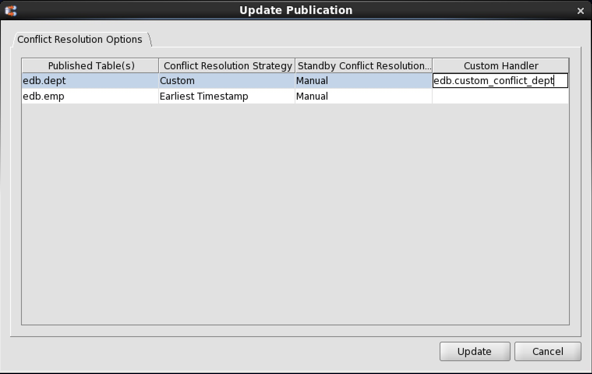
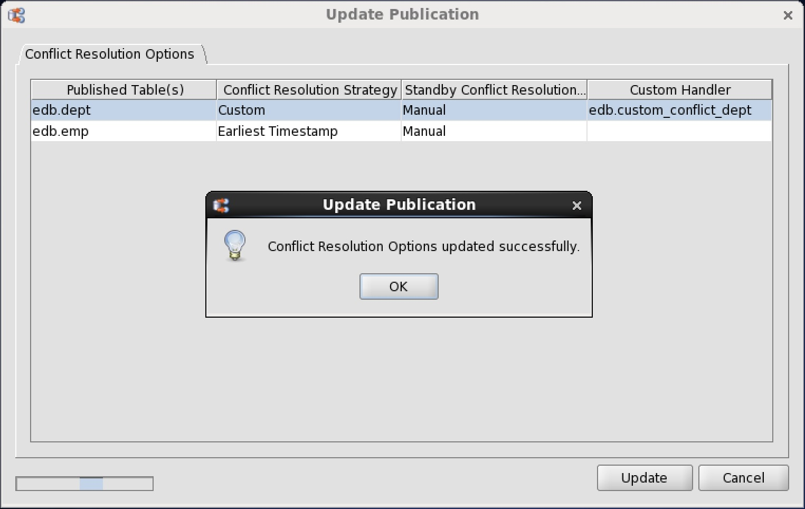

<div id="adding_custom_conflict_handling_function" class="registered_link"></div>

The following are the steps to add a custom conflict handling function to the primary definition node.

**Step 1:** The publication under the primary definition node must exist before adding the function to the primary definition node. See [Adding a Publication](../../02_creating_publication_mmr/#add_pub_mmr) for information on creating the publication.

**Step 2:** Add the function to the primary definition node. The following example shows the addition of the function using PSQL.

```text
edb=# \i /home/user/custom_conflict_dept.sql
CREATE FUNCTION
```

**Step 3:** Open the `Conflict Resolution Options` tab in any of the following ways:



**Figure 6-28: Opening the Conflict Resolution Options tab**

-   From the `Publication` menu, choose `Update Publication`, then `Conflict Resolution Options`.
-   Click the secondary mouse button on the Publication node, choose `Update Publication`, and then choose `Conflict Resolution Options`.

**Step 4:** For the table on which you want to use custom conflict handling, select Custom from the appropriate drop-down list. In the Custom Handler text box, enter the schema and function name used in the `CREATE FUNCTION` statement.



**Figure 6-29: Setting conflict resolution to custom conflict handling**

**Step 5:** Click the `Update` button, and then click `OK` in response to the `Conflict Resolution Options Updated Successfully` confirmation message.



**Figure 6-30: Successfully updated conflict resolution options**

!!! Note
    If the multi-master replication system uses custom conflict handling, and you subsequently switch the role of the primary definition node to another primary node, you must re-add the functions to the new primary definition node. That is, you must repeat Step 2 on the new primary definition node.

!!! Note
    If you wish to delete the multi-master replication system, before removing the publication you must drop all custom conflict handling functions from the primary definition node.

The following example shows the deletion of a custom conflict function.

```text
DROP FUNCTION edb.custom_conflict_dept(_edb_replicator_pub.rrst_edb_dept,_edb_replicator_pub.rrst_edb_dept,varchar);
```
