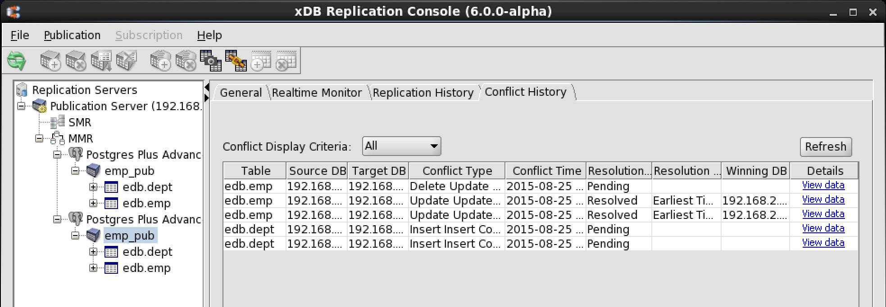
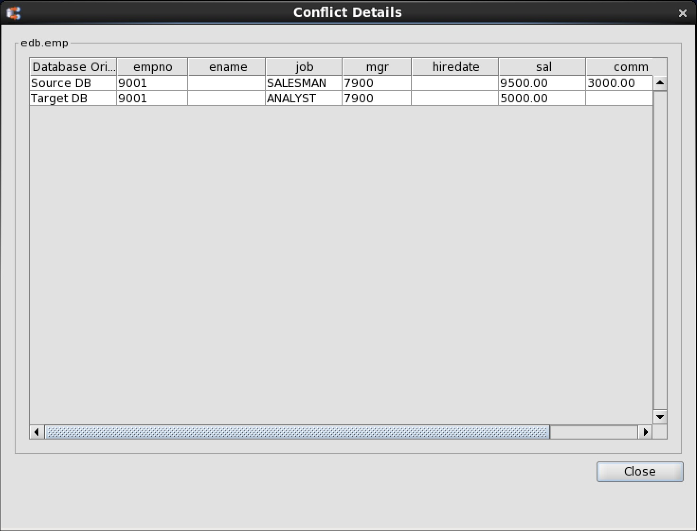

<div id="find_conflict" class="registered_link"></div>

Conflicts can be found using the `Conflict History` tab as described in Section [Viewing Conflict History](../../07_view_conflict_history/#view_conflict_history). The following is an example of the Conflict History tab. Click the Refresh button to reveal all of the latest conflicts.



**Figure 6-32: Conflict History tab for trigger-based method**

The `Source DB` and `Target DB` columns provide the IP address and database names of the source and target primary nodes involved in the conflict.

Click the `View Data link` to show the details of the transactions involved in a particular conflict as shown by the following:



**Figure 6-33: Conflict Details window**

You can also obtain this information from a SQL query rather than from the xDB Replication Console graphical user interface. The following query can be run from a primary node to display information regarding pending (unresolved) conflicts:

```text
SELECT DISTINCT
  conflict_type,
  t.table_name,
  pk_value,
  d1.db_host AS src_db_host,
  d1.db_port AS src_db_port,
  d1.db_name AS src_db_name,
  src_rrep_sync_id,
  d2.db_host AS target_db_host,
  d2.db_port AS target_db_port,
  d2.db_name AS target_db_name,
  target_rrep_sync_id,
  c.notes
FROM _edb_replicator_pub.xdb_conflicts c
  JOIN _edb_replicator_pub.xdb_pub_database d1 ON c.src_db_id = d1.pub_db_id
  JOIN _edb_replicator_pub.xdb_pub_database d2 ON c.target_db_id = d2.pub_db_id
  JOIN _edb_replicator_pub.rrep_tables t ON c.table_id = t.table_id
WHERE resolution_status = 'P'
ORDER BY t.table_name;
```


Example output from the query is shown by the following:

```text
-[ RECORD 1 ]-------+----------------------------------------------------------------
conflict_type       | II
table_name          | dept
pk_value            | deptno=50
src_db_host         | 192.168.2.22
src_db_port         | 5444
src_db_name         | edb
src_rrep_sync_id    | 2
target_db_host      | 192.168.2.22
target_db_port      | 5444
target_db_name      | MMRnode
target_rrep_sync_id | 0
notes               | ERROR: duplicate key value violates unique constraint "dept_pk"
                    |   Detail: Key (deptno)=(50) already exists.
-[ RECORD 2 ]-------+----------------------------------------------------------------
conflict_type       | II
table_name          | dept
pk_value            | deptno=50
src_db_host         | 192.168.2.22
src_db_port         | 5444
src_db_name         | MMRnode
src_rrep_sync_id    | 1
target_db_host      | 192.168.2.22
target_db_port      | 5444
target_db_name      | edb
target_rrep_sync_id | 0
notes               | ERROR: duplicate key value violates unique constraint "dept_pk"
                    |   Detail: Key (deptno)=(50) already exists.
-[ RECORD 3 ]-------+----------------------------------------------------------------
conflict_type       | DU
table_name          | emp
pk_value            |
src_db_host         | 192.168.2.22
src_db_port         | 5444
src_db_name         | edb
src_rrep_sync_id    | 5
target_db_host      | 192.168.2.22
target_db_port      | 5444
target_db_name      | MMRnode
target_rrep_sync_id | 4
```
