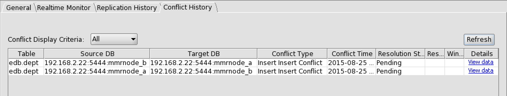

<div id="overview_correction_strategies" class="registered_link"></div>

Before you begin manual resolution correction, it is important to determine the extent of the inconsistencies that may have occurred in the publication tables across the primary nodes of the replication system.

The Conflict History tab and the SQL query described in Section [Finding Conflicts](01_find_conflict/#find_conflict) can help determine the source of an initial conflict.

However, once this conflict has occurred, your replication system may have processed and replicated additional transactions during that synchronization operation. Some of these subsequent replications may have succeeded as expected, but others may have failed or produced unexpected results as a consequence of the prior conflict.

If you have a replication schedule in effect, additional synchronization operations can occur, which may create additional conflicts.

Therefore, when you have discovered that a conflict has occurred, it is strongly recommended that you stop the publication server. Use the stop option of the Linux scripts or Windows services described in Step 1 of Section [Registering a Publication Server](../../../05_smr_operation/02_creating_publication/01_registering_publication_server/#registering_publication_server).

In this way, you can carefully analyze the content of the publication tables in question as well as any pending transactions in the shadow tables to determine the best course of action to take without the interference of continuing updates by a running replication system.

When analyzing your tables you must determine the following:

-   Which publication tables contain inconsistent rows across primary nodes (that is, missing rows on some primary nodes, or rows with different column values for the same primary key on different primary nodes).
-   Which pending transactions in the shadow tables have not been applied to the publication tables across all primary nodes. Pending transactions are denoted by a value of P in the `rrep_tx_conflict_status` column of the shadow table.
-   Which transactions on the publication tables have occurred and are recorded in the shadow tables following the initial conflict, and whether or not these transactions have been applied completely and correctly to the publication tables across all primary nodes. These transactions may not be marked as pending. Instead their `rrep_tx_conflict_status` column could be set to null meaning that no specific conflict was detected during replication, or the transaction has not yet been replicated. These transactions can be identified because they have a later `rrep_tx_timestamp` value than the transactions causing the initial conflict.

The general steps to resolving the problem following this analysis are the following:

**Step 1:** Make the necessary manual corrections to the rows in the publication tables across all primary nodes to get them into an initial, consistent state so each publication table has the same set of identical rows across primary nodes. This may be to a state before the conflicting transactions occurred, depending upon what you determine to be the easiest course of action for fully resolving the conflict.

**Step 2:** Apply or reapply transactions (either from your application or from the shadow tables) so that all publication tables across all primary nodes are updated consistently according to the desired, expected result of what has been recorded in the shadow tables.

**Step 3:** In the shadow tables, update certain indicators for conflicting entries to show that these were resolved in Step 2.

**Step 4:** In the control schema, update certain indicators for the conflicting entries to show that these conflicts have been resolved. This update changes the Resolution Status of these entries to Resolved in the Conflict History tab. These entries will no longer appear in the SQL query described in Section [Finding Conflicts](01_find_conflict/#find_conflict).

Perform the Step 4 updates to the control schema of the controller database. The currently designated controller database can be determined from the content of the xDB Replication Configuration file (see Section [xDB Replication Configuration File](../../../02_overview/03_replication_server_components_and_architecture/01_physical_components/#xdb_replication_conf_file)). The publication server ensures that the control schema changes made on the controller database are replicated to the control schemas of all publication databases to maintain metadata consistency across all publication databases.

**Step 5:** Resume operation of your replication system. Start the publication server and recreate the replication schedule if you were using one.

For accomplishing steps 1 and 2, use some combination of the following methods. Which methods you use depend upon the state of your publication tables and the extent of pending transactions that need to be applied from the shadow tables.

-   Manual Publication Table Correction. Use a utility such as PSQL or pgAdmin (Postgres Enterprise Manager Client in Advanced Server) to manually correct the rows in the publication tables across all primary nodes without replicating these changes. Use the database user with `session_replication_role` set to `replica` for this purpose.
-   Correction Using New Transactions. Rerun your application on one primary node to create new transactions that you will allow to replicate to all other primary nodes. Use this method after you have ensured that all publication tables are in a consistent state across all primary nodes.
-   Correction Using Shadow Table Transactions. Force the synchronization of transactions already recorded in the shadow tables. Use this method if there are many shadow table transactions that need to be applied, and it is simpler to force the synchronization of these transactions rather than reissuing the transactions from your application.

Each of these methods is described in more detail in the following sections.

For purposes of illustration, the following replication environment is used.

-   A 3-node multi-master replication system has been established. The primary node names are `MMRnode_a` (the primary definition node and the controller database), `MMRnode_b`, and `MMRnode_c`.
-   The publication is named `emp_pub` and uses the dept and `emp` tables that have been used as examples throughout this document.
-   The conflict used to illustrate the first two conflict resolution methods is a uniqueness conflict occurring on the dept table on primary key column `deptno` on value 50 resulting from the `INSERT` statements shown by the following:

On `MMRnode_a`, the following statement is run:

```text
INSERT INTO dept VALUES (50, 'FINANCE', 'CHICAGO');
```

On `MMRnode_b`, the following statement is run:

```text
INSERT INTO dept VALUES (50, 'MARKETING', 'LOS ANGELES');
```

A synchronization replication is then performed.

The following is the content of table dept on `MMRnode_a`:

```text
MMRnode_a=# SELECT * FROM dept;
 deptno |   dname    |   loc
--------+------------+----------
     10 | ACCOUNTING | NEW YORK
     20 | RESEARCH   | DALLAS
     30 | SALES      | CHICAGO
     40 | OPERATIONS | BOSTON
     50 | FINANCE    | CHICAGO
(5 rows)
```

The following is the content of table dept on `MMRnode_b`:

```text
MMRnode_b=# SELECT * FROM dept;
 deptno |   dname    |     loc
--------+------------+-------------
     10 | ACCOUNTING | NEW YORK
     20 | RESEARCH   | DALLAS
     30 | SALES      | CHICAGO
     40 | OPERATIONS | BOSTON
     50 | MARKETING  | LOS ANGELES
(5 rows)
```

The following is the content of table dept on `MMRnode_c`:

```text
MMRnode_c=# SELECT * FROM dept;
 deptno |   dname    |   loc
--------+------------+----------
     10 | ACCOUNTING | NEW YORK
     20 | RESEARCH   | DALLAS
     30 | SALES      | CHICAGO
     40 | OPERATIONS | BOSTON
(4 rows)
```

The Conflict History tab shows the following entry:



**Figure 6-34: Conflict History tab with a uniqueness conflict**

The following is the output from the SQL query described in Section [Finding Conflicts](01_find_conflict/#find_conflict).

```text
-[ RECORD 1 ]-------+----------------------------------------------------------------
conflict_type       | II
table_name          | dept
pk_value            | deptno=50
src_db_host         | 192.168.2.22
src_db_port         | 5444
src_db_name         | MMRnode_a
src_rrep_sync_id    | 2
target_db_host      | 192.168.2.22
target_db_port      | 5444
target_db_name      | MMRnode_b
target_rrep_sync_id | 0
notes               | ERROR: duplicate key value violates unique constraint "dept_pk"
                    |   Detail: Key (deptno)=(50) already exists.
-[ RECORD 2 ]-------+----------------------------------------------------------------
conflict_type       | II
table_name          | dept
pk_value            | deptno=50
src_db_host         | 192.168.2.22
src_db_port         | 5444
src_db_name         | MMRnode_b
src_rrep_sync_id    | 1
target_db_host      | 192.168.2.22
target_db_port      | 5444
target_db_name      | MMRnode_a
target_rrep_sync_id | 0
notes               | ERROR: duplicate key value violates unique constraint "dept_pk"
                    |   Detail: Key (deptno)=(50) already exists.
```

The following sections describe the application of different methods to resolve this conflict.
