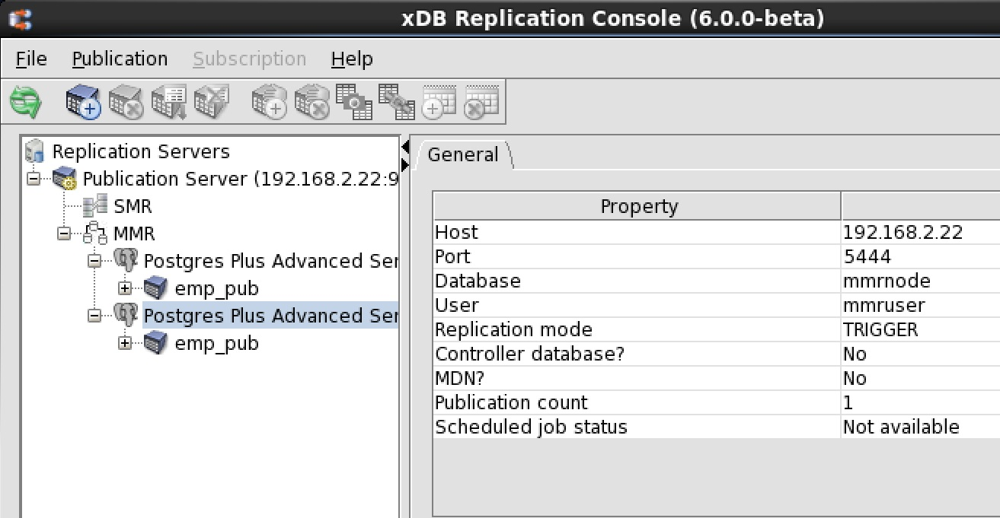
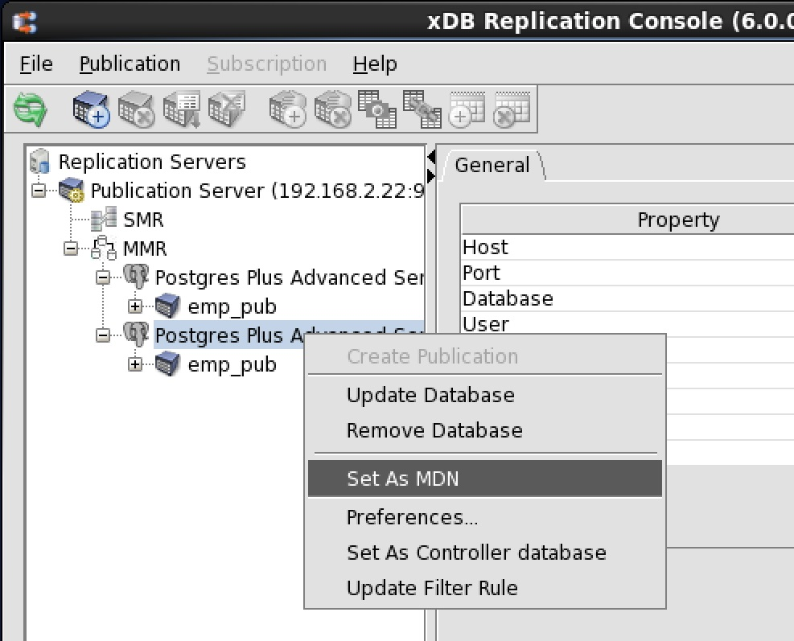
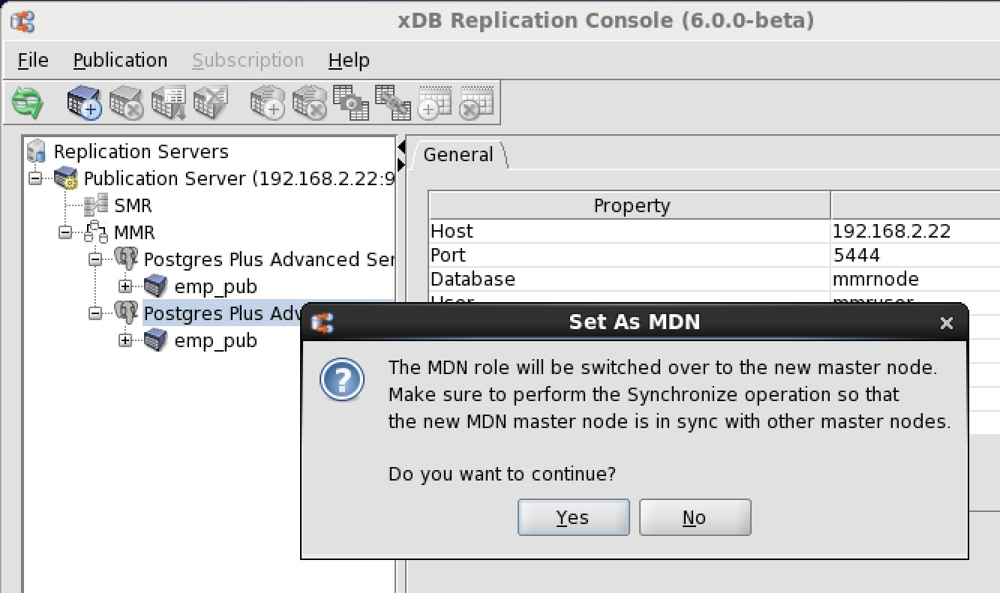
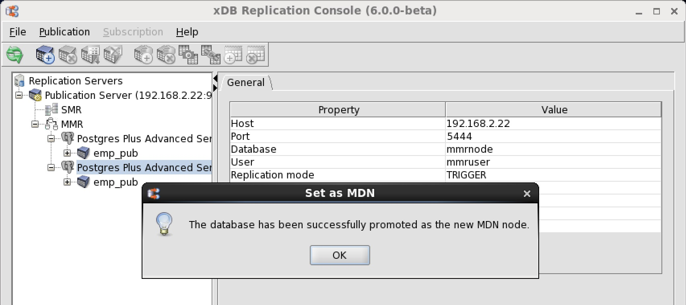
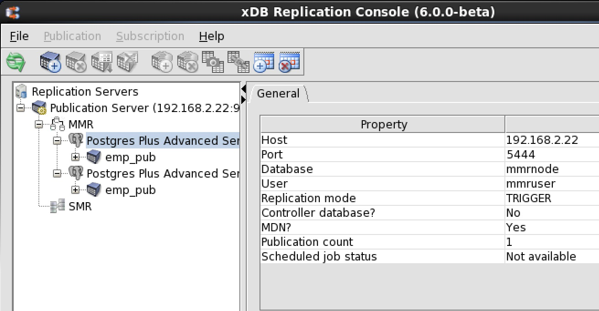

After the multi-master replication system is created, you can switch the role of the primary definition node with another primary node.

**Step 1:** Make sure the publication server whose node is the parent of the primary nodes of the replication system is running and has been registered in the xDB Replication Console you are using. See Section [Registering a Publication Server](../05_smr_operation/02_creating_publication/01_registering_publication_server/#registering_publication_server) for directions on starting and registering a publication server.

**Step 2:** Select the Publication Database node corresponding to the primary node that you wish to set as the primary definition node.

**Figure 6-69: Selecting the primary node to set as the primary definition node**

**Step 3:** Click the secondary mouse button on the Publication Database node and choose `Set as PDN`.

**Figure 6-70: Setting the primary definition node**

**Step 4:** In the `Set as PDN` confirmation box, click the `Yes` button.

**Figure 6-71: Set as PDN confirmation**

**Step 5:** The selected master node is now the master definition node.

**Figure 6-72: Database promoted to primary definition node**

**Step 6:** The value `Yes` in the PDN field of the Property window indicates this database is the primary definition node.

!!! Note
    The new primary definition node is moved to the top of the replication tree in the xDB Replication Console.

**Figure 6-73: Primary definition node (PDN) indicated by ‘Yes’ in the Property window**

!!! Note
    You should now perform a synchronization replication to ensure that the new primary definition node is synchronized with the other primary nodes. See [Performing Synchronization Replication](05_on_demand_replication_mmr/#perform_synchronization_replication_mmr) for directions on performing a synchronization replication.
