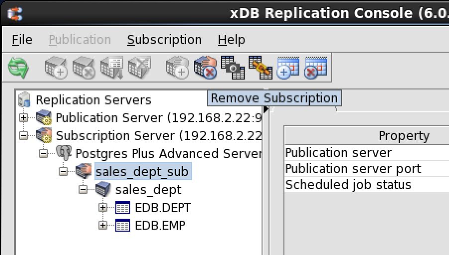
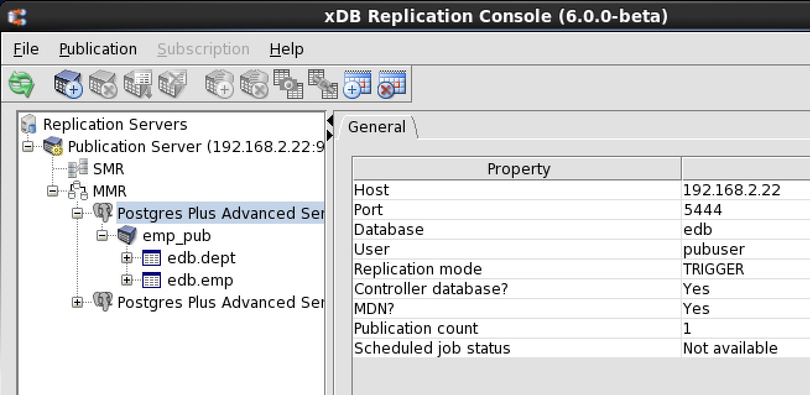
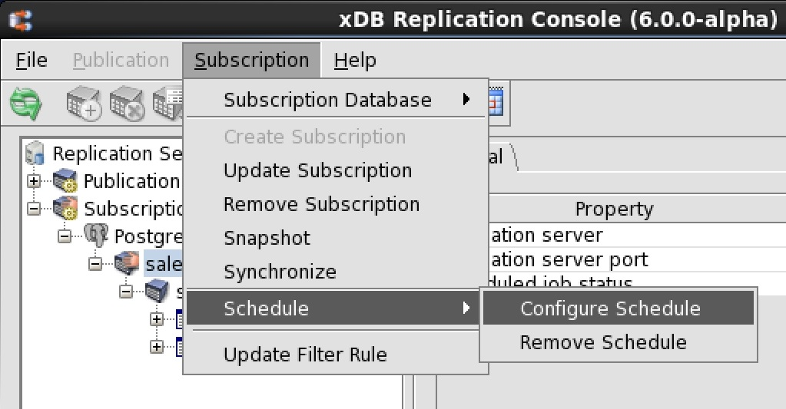
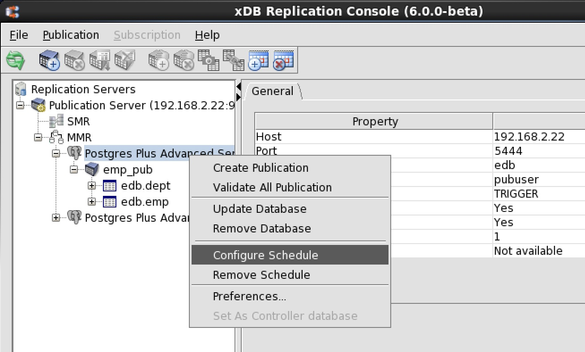
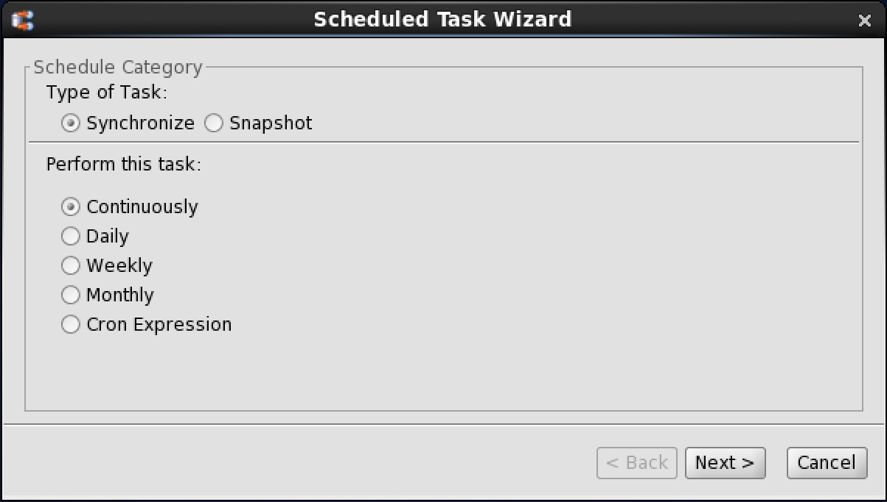
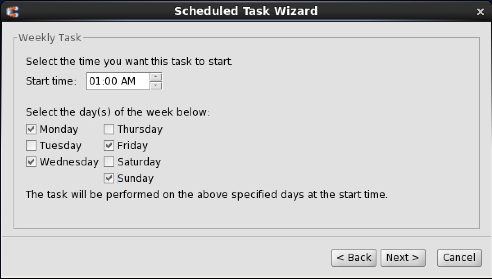
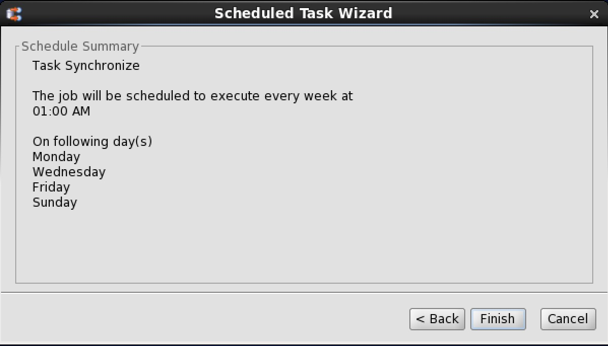
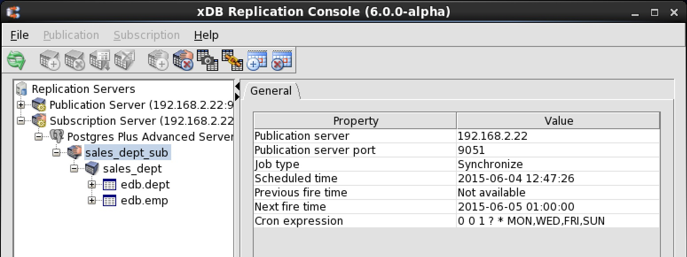

A schedule establishes recurring points in time when replication is to occur.

!!! Note
    (For MMR only): Be sure an initial snapshot replication has been performed from the primary definition node to every other primary node in the multi-master replication system. If a newly added primary node did not undergo an initial snapshot, any subsequent synchronization replication initiated by a schedule may fail to apply the transactions to that primary node. The initial snapshot could be taken when the primary node is first added (see [Creating Additional Primary nodes](../06_mmr_operation/03_creating_primary_nodes/#creating_primary_nodes)) or by performing an on demand snapshot (see [Performing Snapshot Replication](../06_mmr_operation/05_on_demand_replication_mmr/#perform_snapshot_replication_mmr)).

In a single-master replication system, once a schedule is created the subscription server initiates replications according to the schedule until either the schedule is changed or removed. In a multi-master replication system, the publication server handles this process.

See [Managing a Schedule](03_managing_schedule/#managing_schedule) for changing or removing a schedule.

When a scheduled replication is to take place, all components of the replication system must be running:

-   Publication database server
-   Subscription database server (applies only to single-master replication systems)
-   Publication server
-   Subscription server (applies only to single-master replication systems)

If any of the preceding components are not running at the time of a scheduled replication, then replication does not occur at that point in time. The replication occurs at the next scheduled replication time when all applicable replication system components are running.

For synchronization replications with the trigger-based method, changes that have occurred on the source tables that were not replicated due to a skipped, scheduled replication are maintained as pending transactions in the shadow tables of the source database.

For synchronization replications with the log-based method, changes that have been extracted from the WAL files to in-memory structures, but have not been applied are persisted using Java object serialization to files on the host running the publication server.

All changes since the last successful replication are applied whenever the next scheduled replication occurs. Thus, accumulated changes are never lost due to a missed replication.

For snapshot replications, skipped, scheduled replications present no problem since a snapshot replication replaces all of the data in the target tables with the current source data.

**Step 1 (For SMR only):** Select the Subscription node of the subscription for which you wish to create a schedule.

**Figure 7-18: Selecting a subscription on which to set a schedule**

**Step 1 (For MMR only):** Select the Publication Database node designated as the controller database. (The Controller database field in the Property window is set to Yes for the controller database.)

**Figure 7-19: Selecting the controller database on which to set a schedule**

**Step 2 (For SMR only):** Open the Scheduled Task Wizard dialog box in any of the following ways:

**Figure 7-20: Opening the Scheduled Task Wizard dialog box on a subscription**

-   From the `Subscription` menu, choose `Schedule`, then `Configure Schedule`.
-   Click the secondary mouse button on the Subscription node and choose `Configure Schedule`.
-   Click the primary mouse button on the `Configure Schedule` icon.

**Step 2 (For MMR only):** Open the `Scheduled Task Wizard` dialog box in any of the following ways:

-   Click the secondary mouse button on the Publication Database node and choose `Configure Schedule`.
-   Click the primary mouse button on the `Configure Schedule icon`.

**Figure 7-21: Opening the Scheduled Task Wizard dialog box on the controller database**

**Step 3:** In the `Scheduled Task Wizard` dialog box, select the radio button for either synchronization replication or snapshot replication.

!!! Note
    If the publication associated with this subscription is a snapshot-only publication, then only Snapshot may be chosen.

!!! Note
    In a multi-master replication system, only Synchronize may be chosen.

**Figure 7-22: Scheduled Task Wizard dialog box**

**Step 4:** Select the radio button for the scheduled replication frequency, or select `Cron Expression` to write your own cron expression. The frequency choices have the following meanings:

-   `Continuously`. Schedules replication to run continuously at an interval in seconds that you specify. Select this option if the source tables change frequently during the day and the target tables must be kept up-to-date throughout the course of the day.
-   `Daily`. Schedules replication to run once a day at the time you choose. Select this option if the target tables need to be refreshed daily.
-   `Weekly`. Schedules replication to run once a day at the time you choose, but only on the specific days of the week you choose. Select this option if you need more flexibility than a daily schedule, and the target tables do not have to be refreshed every day.
-   `Monthly`. Schedules replication to run one day per month on the day of the month and time you choose, but only on the specific months you choose. Select this option if updates to the source tables are not very frequent, and the target tables can be out-of-date by a month or more. The Monthly option allows you to schedule replication for as frequently as once a month or infrequently as once a year.
-   `Cron` Expression. Provides additional flexibility for specifying a schedule beyond the four preceding radio button choices. See appendix [Writing a Cron Expression](../10_appendix/04_miscellaneous_xdb_processing_topics/03_writing_cron_exp/#writing_cron_exp) for directions on writing a cron expression.

The following example shows the selection of a weekly schedule.

**Figure 7-23: Selecting a weekly schedule**

**Step 5:** After completing the `Scheduled Task Wizard` dialog box, click the `Next` button.

**Step 6:** Your selected schedule will appear. Click the `Finish` button to accept the schedule.

**Figure 7-24: Scheduled Task Wizard summary**

If you click the `Refresh` icon, you will see the schedule properties in the `General` tab.

**Figure 7-25: Information window with the replication schedule**
