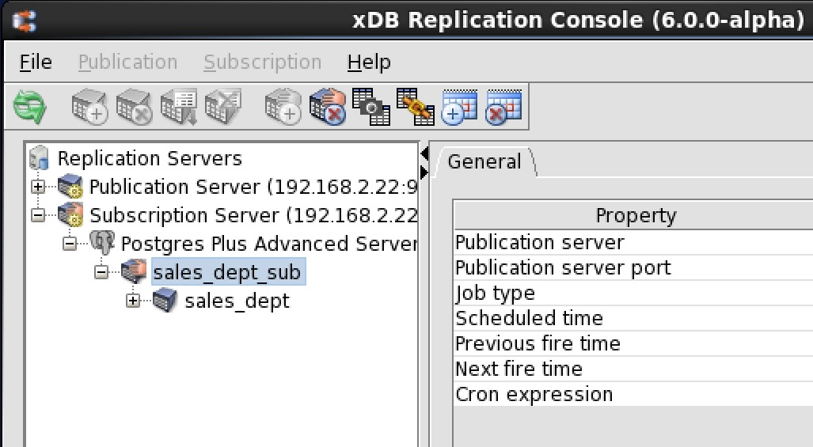
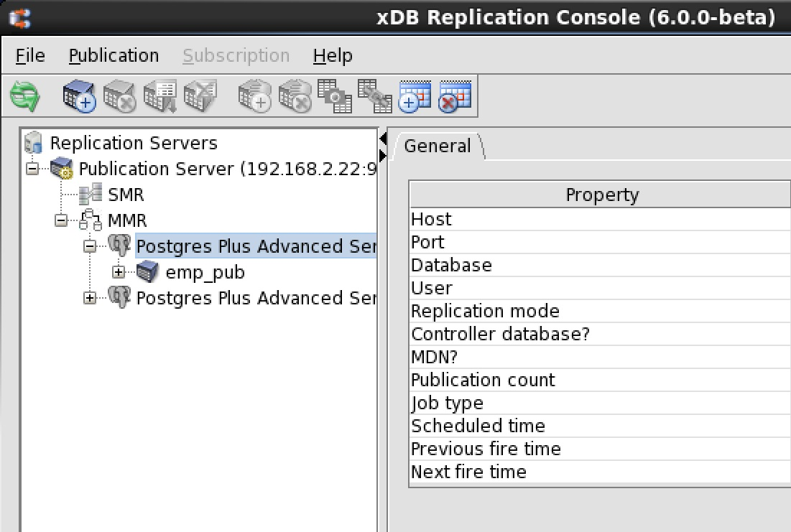
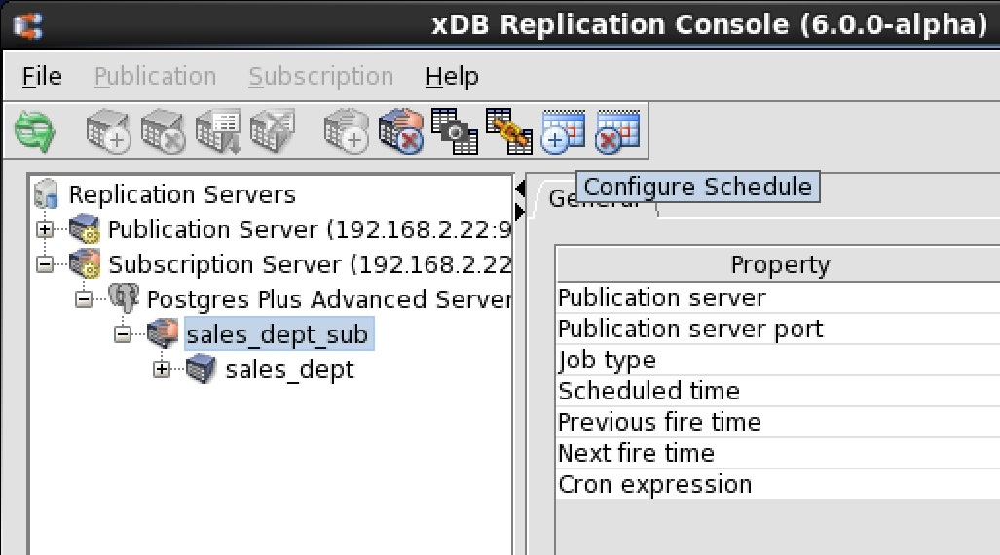
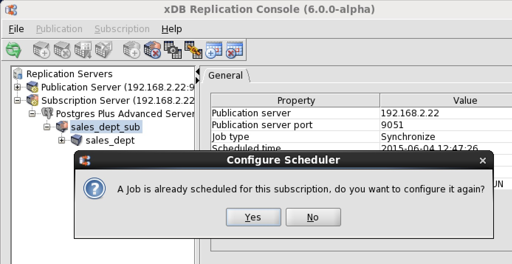
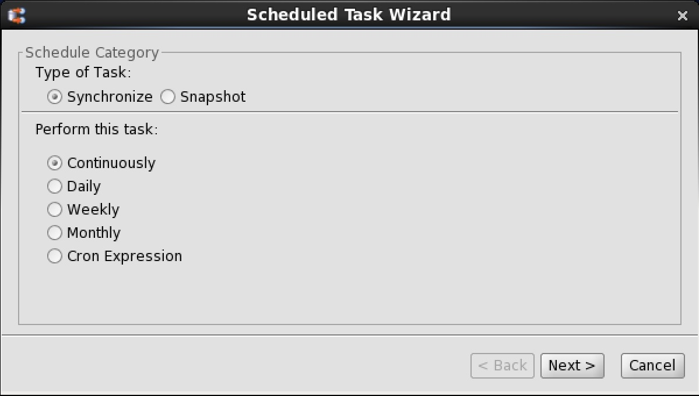
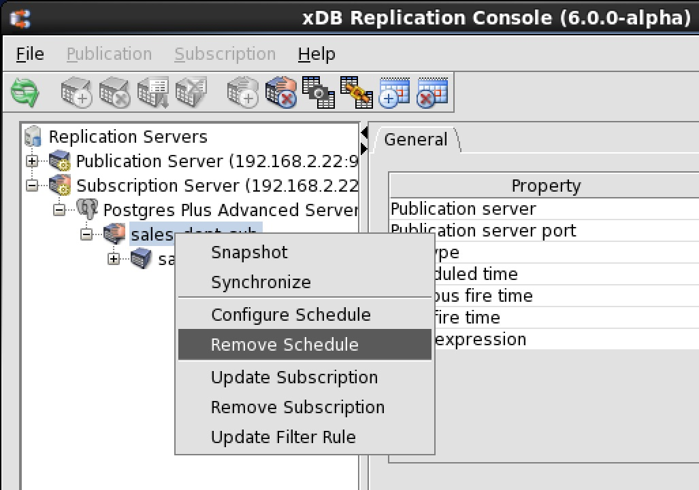
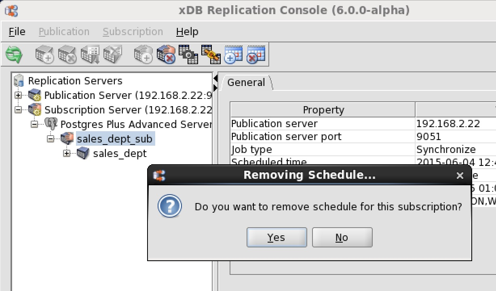
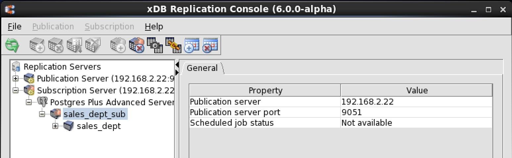

Once a schedule has been created, xDB Replication Server performs replications according to the schedule until the schedule is updated or removed.

The updating or removal of a schedule has no effect on a replication that has already been started. If a replication is in progress when the schedule is updated or removed, the in progress replication continues until completion.

## Updating a Schedule

The following steps illustrate how to change an existing schedule.

**Step 1 (For SMR only):** Make sure the subscription server whose node is the parent of the subscription you wish to change is running and has been registered in the xDB Replication Console you are using. See [Registering a Subscription Server](../05_smr_operation/03_creating_subscription/01_registering_subscription_server/#registering_subscription_server) for directions on starting and registering a subscription server.

**Step 1 (For MMR only):** Make sure the publication server whose node is the parent of the controller database you wish to change is running and has been registered in the xDB Replication Console you are using. See [Registering a Publication Server](../05_smr_operation/02_creating_publication/01_registering_publication_server/#registering_publication_server) for directions on starting and registering a publication server.

**Step 2 (For SMR only):** Select the Subscription node of the subscription for which you wish to update the schedule.

**Figure 7-26: Selecting a subscription whose schedule is to be updated**

**Step 2 (For MMR only):** Select the Publication Database node designated as the controller database for which you wish to update the schedule.

**Figure 7-27: Selecting the controller database whose schedule is to be updated**

**Step 3 (For SMR only):** Open the `Scheduled Task Wizard` dialog box in any of the following ways:

-   From the `subscription` menu, choose `Schedule`, then `Configure Schedule`.
-   Click the secondary mouse button on the Subscription node and choose `Configure Schedule`.
-   Click the primary mouse button on the `Configure Schedule` icon.

**Step 3 (For MMR only):** Open the `Scheduled Task Wizard` dialog box in any of the following ways:

-   Click the secondary mouse button on the Publication Database node and choose `Configure Schedule`.
-   Click the primary mouse button on the `Configure Schedule` icon.

**Figure 7-28: Opening the Scheduled Task Wizard dialog box from the tool bar**

**Step 4:** The `Configure Scheduler` confirmation box appears. Click the `Yes` button.

**Figure 7-29: Configure Scheduler confirmation**

**Step 5:** In the Scheduled Task Wizard dialog box, create the new schedule. See Step 3 of Section [Creating a Schedule](02_creating_schedule/#creating_schedule) for details on how to create a new schedule.

**Figure 7-30: Scheduled Task Wizard dialog box**

## Removing a Schedule

If you no longer wish replication to take place automatically, you must remove the schedule. You can always re-add a schedule or perform on demand replication.

**Step 1 (For SMR only):** Make sure the subscription server whose node is the parent of the subscription you wish to change is running and has been registered in the xDB Replication Console you are using. See Section [Registering a Subscription Server](../05_smr_operation/03_creating_subscription/01_registering_subscription_server/#registering_subscription_server) for directions on starting and registering a subscription server.

**Step 1 (For MMR only):** Make sure the publication server whose node is the parent of the controller database you wish to change is running and has been registered in the xDB Replication Console you are using. See Section [Registering a Publication Server](../05_smr_operation/02_creating_publication/01_registering_publication_server/#registering_publication_server) for directions on starting and registering a publication server.

**Step 2 (For SMR only):** Select the Subscription node of the subscription for which you wish to remove the schedule.

**Figure 7-31: Selecting a subscription for removal of a schedule**

**Step 2 (For MMR only):** Select the Publication Database node designated as the controller database for which you wish to remove the schedule.

**Figure 7-32: Selecting the controller database for removal of a schedule**

**Step 3 (For SMR only):** Remove the schedule in any of the following ways:

-   From the Subscription menu, choose Schedule, then Remove Schedule.
-   Click the secondary mouse button on the Subscription node and choose Remove Schedule.
-   Click the primary mouse button on the Remove Schedule icon.

**Step 3 (For MMR only):** Remove the schedule in any of the following ways:

* Click the secondary mouse button on the Publication Database node and choose Remove Schedule.
* Click the primary mouse button on the Remove Schedule icon.

**Figure 7-33: Removing the schedule**

**Step 4:** In the Removing Schedule confirmation box, click the `Yes` button.

**Figure 7-34: Removing Schedule confirmation**

If you click the `Refresh` icon in the tool bar, you will notice that schedule information no longer appears in the information window.

**Figure 7-35: Information window after schedule removal**
