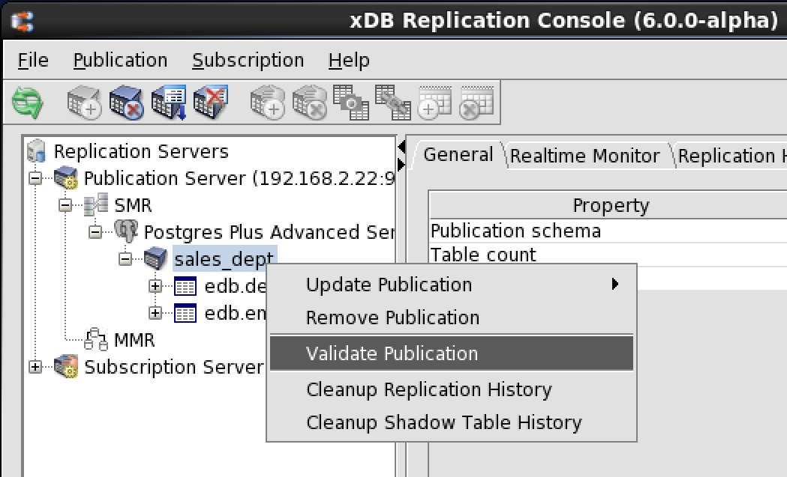
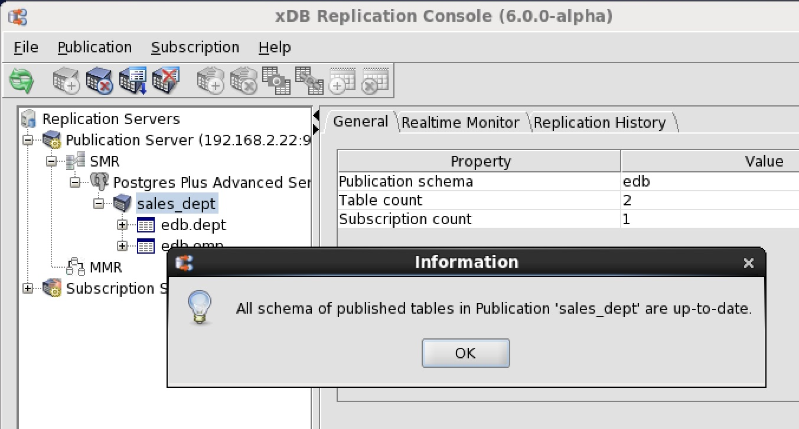
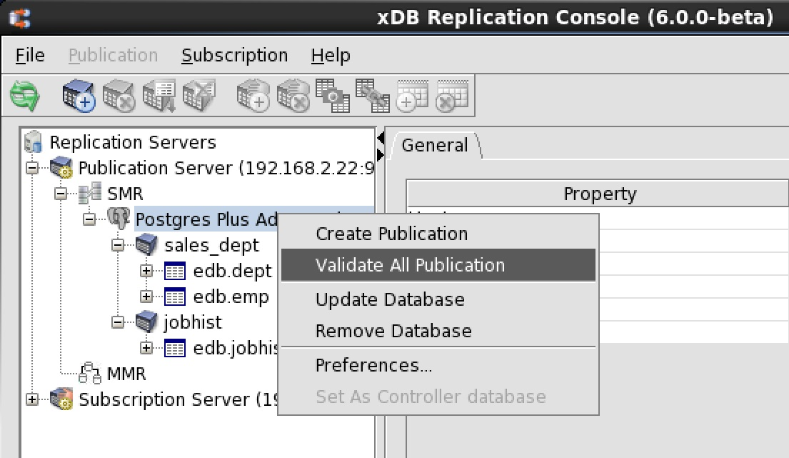
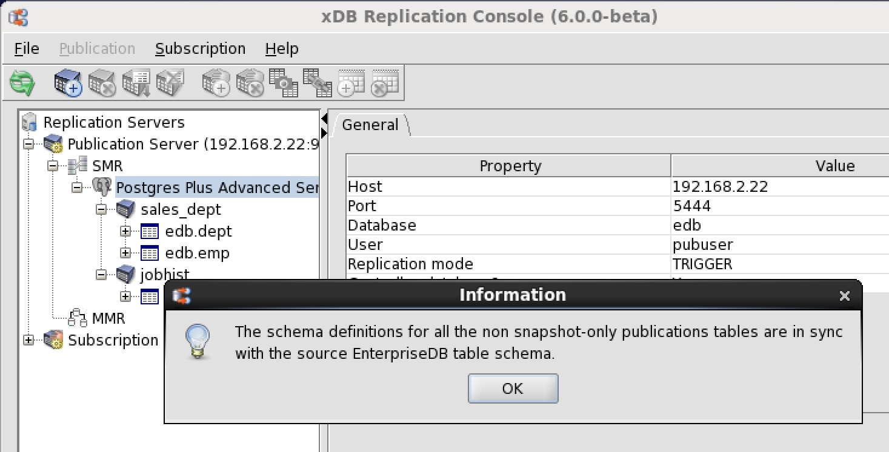
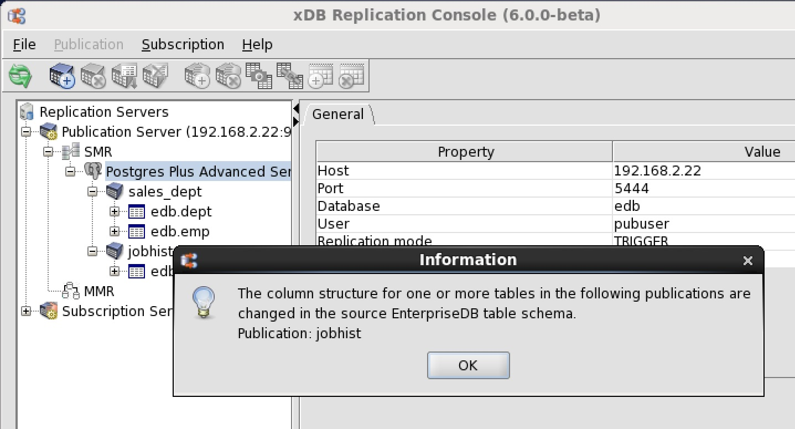

Once a publication is created, do not directly change the definitions of the tables belonging to the publication. Doing so may cause a failure during the replication process. Examples of table definitions that must not be altered include:

-   Adding or removing columns to a table
-   Renaming columns
-   Changing the data types of columns
-   Changing the lengths of columns
-   Changing a not nullable column to nullable or a nullable column to not nullable
-   Adding or removing uniqueness constraints
-   Adding or removing check constraints

In a single-master replication system, xDB Replication Server does not propagate table definition changes to the subscription tables once the subscription tables are created. Rows that may be allowed in an altered publication table may be illegal in the unaltered subscription table and will cause an error during replication.

Similarly, in a multi-master replication system, table definition changes are not propagated from one primary node to another except when a new primary node is added, and you choose to replicate the schema definition from the primary definition node.

In addition, for synchronization replication with the trigger-based method, triggers are generated on the publication tables that use certain attributes of these tables. If the table definition is changed, the trigger may no longer function properly.

!!! Note
    Do not change the triggers generated by xDB Replication Server. If it becomes necessary to regenerate the triggers, you must remove the associated publication and then recreate the publication.

!!! Note
    Certain table definition changes can be made and propagated by xDB Replication Server by using the DDL change replication feature. See Section [Replicating DDL Changes](../08_replicating_ddl_changes/#replicating_ddl_changes) for information on the DDL change replication feature.

If you do not use the DDL change replication feature, then the following general steps must be taken if table definition changes are made.

In a single-master replication system, if changes were made to the definitions of one or more publication tables, the resolution to the problem must be handled on a case by case basis as it depends upon the type of changes that were made. In the worst case scenario, the subscription and publication must be removed and recreated as follows:

-   Remove the subscription that is associated with the publication. See [Removing a Subscription](../../05_smr_operation/05_managing_subscription/05_removing_subscription/#removing_subscription) for directions to remove a subscription.
-   Remove the subscription tables from the subscription database. This is done with `SQL DROP TABLE` statements in the database system.
-   Remove the publication. See [Removing a Publication](06_removing_pub/#removing_pub) for directions to remove a publication.
-   Re-add the publication. See [Adding a Publication](../../05_smr_operation/02_creating_publication/03_adding_publication/#adding_publication) for directions to add a publication.
-   Re-add the subscription. See [Adding a Subscription](../../05_smr_operation/03_creating_subscription/03_adding_subscription/#adding_subscription) for directions to add a subscription.

In a multi-master replication system, if changes were made to the definitions of one or more publication tables on one or more primary nodes, the resolution to the problem involves:

-   Making sure the table definitions are updated on all primary nodes so that they are identical, or updating the table definition on the primary definition node so it can be replicated to the other primary nodes.
-   Recreating the publication database definitions of the primary nodes.

The general steps are the following:

-   Remove the publication database definitions of all primary nodes except for the primary definition node. See [Removing a Publication Database](07_removing_pub_database/#removing_pub_database) for directions to remove a publication database definition.
-   Remove the publication. See [Removing a Publication](06_removing_pub/#removing_pub) for directions to remove a publication.
-   Remove the publication database definition of the primary definition node. See [Removing a Publication Database](07_removing_pub_database/#removing_pub_database) for directions to remove a publication database definition.
-   At this point all of the triggers, shadow tables, and metadata have been removed from the primary nodes.
-   With respect to the publication table definitions, you can either: 
    - Update the table definitions on all primary nodes so that they are identical, or 
    - Assume the table definitions on the primary definition node are up-to-date, and delete the out-of-date table definitions on all other primary nodes.
-   Re-add the publication database definition for the primary definition node. See [Adding the Primary definition node](../../06_mmr_operation/02_creating_publication_mmr/#adding_pdn) for directions to add the primary definition node.
-   Re-add the publication. See [Adding a Publication](../../06_mmr_operation/02_creating_publication_mmr/#add_pub_mmr) for directions to add a publication.
-   Re-add additional primary nodes. See [Creating Additional Primary nodes](../../06_mmr_operation/03_creating_primary_nodes/#creating_primary_nodes) for directions to add an additional primary node. When creating a primary node, uncheck the `Replicate Publication Schema` check box if you have already created the table definitions on all primary nodes. Check the `Replicate Publication Schema` check box if you want to propagate the table definitions from the primary definition node to all other primary nodes. A snapshot reloads the primary node tables from the primary definition node.

## Validating a Single Publication

xDB Replication Server provides a way to verify that certain characteristics of publication tables have not been altered since the publication was created. Note: This validation feature is only available for publications using the trigger-based method of synchronization replication. This validation feature is not available for publications using the log-based method of synchronization replication.

The validation operation described here and in Section [Validating All Publications](#validate_all_pub) can check for the following types of table modifications:

-   Addition of columns to a table
-   Removal of columns from a table
-   Renaming of columns

!!! Note
    In a multi-master replication system, publication tables in only the primary definition node are validated. The validation operation does not check if table definitions have changed in other primary nodes.

The following steps show how to validate a single publication:

**Step 1:** Make sure the publication server whose node is the parent of the publication you wish to validate is running and has been registered in the xDB Replication Console you are using. See [Registering a Publication Server](../../05_smr_operation/02_creating_publication/01_registering_publication_server/#registering_publication_server) for directions on starting and registering a publication server.

**Step 2 (For SMR only):** Select the Publication node of the publication you want to validate.

**Step 2 (For MMR only):** Select the Publication node under the Publication Database node representing the primary definition node.

**Step 3:** From the `Publication` menu, choose `Validate Publication`. Alternatively, click the secondary mouse button on the Publication node and choose `Validate Publication`.

**Figure 7-85: Validating a selected publication**

**Step 4:** If All Schema of Published Tables in Publication 'publication_name' Are Up-To-Date appears, click the `OK` button. If an error appears, determine which tables were changed and what changes were made to the table definitions. These issues need to be resolved on a case by case basis as discussed earlier in this section.

**Figure 7-86: Successful validation of all tables in the selected publication**

## Validating All Publications

All publications under a single Publication Database node can be validated in one operation.

!!! Note
    This validation feature is only available for publications using the trigger-based method of synchronization replication. This validation feature is not available for publications using the log-based method of synchronization replication.

!!! Note
    In a multi-master replication system, publication tables in only the primary definition node are validated. The validation operation does not check if table definitions have changed in other primary nodes.

**Step 1:** Make sure the publication server whose node is the parent of the publications you wish to validate is running and has been registered in the xDB Replication Console you are using. See [Registering a Publication Server](../../05_smr_operation/02_creating_publication/01_registering_publication_server/#registering_publication_server) for directions on starting and registering a publication server.

**Step 2 (For SMR only):** Select the Publication Database node under which you want to validate all publications.

**Step 2 (For MMR only):** Select the Publication Database node representing the primary definition node.

**Step 3:** From the `Publication` menu, choose `Validate All Publications`. Alternatively, click the secondary mouse button on the Publication Database node and choose `Validate All Publications`.

**Figure 7-87: Validating all publications subordinate to a selected publication database**

**Step 4:** If there were no modified tables, click the `OK` button.

**Figure 7-88: Successful validation of all tables in all publications subordinate to a selected publication database**

If there were modified tables, a list of publications that contain the modified tables is displayed. Determine which tables were changed and what changes were made to the table definitions. These issues need to be resolved on a case by case basis as discussed earlier in this section.

**Figure 7-89: List of publications with modified tables**
