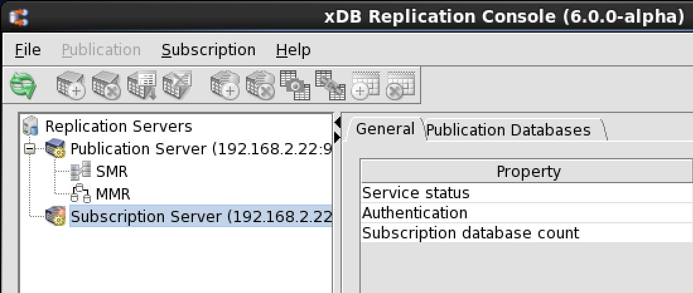

<div id="troubleshooting_areas" class="registered_link"></div>

The following topics provide information on specific problem areas you may encounter.

<div id="java_runtime_errors" class="registered_link"></div>

## Java Runtime Errors

If errors are encountered regarding the Java Runtime Environment such as the Java program cannot be found or Java heap space errors, check the parameters set in the xDB Startup Configuration file `xdbReplicationServer-xx.config`. See [xDB Replication Configuration File](../../02_overview/03_replication_server_components_and_architecture/01_physical_components/#xdb_replication_conf_file) for information on the xDB Startup Configuration file.

The following is an example of the content of the xDB Startup Configuration file:

```text
#!/bin/sh

JAVA_EXECUTABLE_PATH="/usr/bin/java"
JAVA_MINIMUM_VERSION=1.8
JAVA_BITNESS_REQUIRED=64
JAVA_HEAP_SIZE="-Xms256m -Xmx1536m"
PUBPORT=9051
SUBPORT=9052
```

If you make any changes to the parameters in the xDB Startup Configuration file, be sure to restart the publication server and subscription server after making the modifications.

<div id="start_pub_or_sub_server" class="registered_link"></div>

## Starting the Publication Server or Subscription Server

!!! Note
    The subscription server only applies to single-master replication systems.

If you cannot start the publication server or the subscription server perform the following steps:

**Step 1:** Check the `pubserver.log` and `subserver.log` files for errors.

**Step 2:** Check the log file of the database server running the controller database for errors.

**Step 3:** Verify that the user name and password in the xDB Replication Configuration file on the hosts running the publication server and subscription server match a database user name and password in the database server running the controller database that the publication server and subscription server are attempting to access.

**Step 4:** If the controller database is a Postgres database, verify that the `pg_hba.conf` file of its Postgres database server has entries that allow access to the controller database from the IP addresses of the hosts running the publication server and subscription server by the user name in the xDB Replication Configuration file.

<div id="del_control_schema_and objects" class="registered_link"></div>

## Deleting the Control Schema and Control Schema Objects

The control schema completely describes the replication system. The control schema and its control schema objects must be complete and correct in order for replication to occur properly. In addition, the configuration and maintenance operations performed through the xDB Replication Console or the xDB Replication Server CLI cannot be accomplished properly unless the control schema is complete and correct.

There may be occasions where the control schema becomes corrupted. Either one or more control schema tables containing metadata are inadvertently deleted, or the data within the control schema tables becomes corrupted. Typically, corruption occurs in the form of the first case – one or more control schema tables were deleted, or the entire control schema and its contents were deleted manually using an SQL utility rather than through the operation of the xDB Replication Console or xDB Replication Server CLI.

In these situations, there may be no other choice than to remove all of the remaining control schema objects using the database management system’s deletion functions, which effectively deletes all replication systems managed by the control schema.

The same control schema deletion procedure must be performed in all publication databases that share the same control schema information as the current controller database given in the xDB Replication Configuration file.

From the viewpoint of the xDB Replication Console replication tree, a publication server that connects to the controller database has subordinate to it, the publication databases sharing the same control schema information.

In the following example, the SMR publication database edb as well as the three MMR primary node databases `mdnnode`, `MMRnode_a`, and `MMRnode_b` are all managed by the same publication server, which connects to the controller database designated in the xDB Replication Configuration file. Thus, all publication databases `edb`, `mdnnode`, `MMRnode_a`, and `MMRnode_b` contain what should be the same control schema information.

The control schema must be removed from all four publication databases if it is determined that the control schema is corrupted in any of the four publication databases.

Finally, the subscription databases of SMR systems contain a control schema object, which must be deleted as well.

In the preceding example, subscription database `subdb` contains a control schema object that may have to be deleted if control schema deletion is performed on the publication database.

The instructions in this section describe how to completely remove all control schema objects created by the xDB Replication Server product leaving just your original publication tables and any replicated subscription tables or publication tables of multi-master system nodes. Hence, the definition and framework for all existing single-master and multi-master replication systems are deleted. In effect, this simulates the situation when you have installed the xDB Replication Server product for the first time.

After you have performed this deletion process, single-master replication systems must then be recreated following the directions in sections [Creating a Publication](../../05_smr_operation/02_creating_publication/#creating_publication) onward. A multi-master replication system must be recreated following the directions in sections [Creating a Publication](../../06_mmr_operation/02_creating_publication_mmr/#creating_publication_mmr) onward.

Warning: Do not attempt this if any replication systems are running in production. All replication systems will become inoperable. This section describes what to look for in order to tell if the control schema is not complete, and if so, what must be deleted to completely remove the replication system. This section does not discuss the internal contents of the control schema objects. If all of the control schema objects are present, then review the checklist in Section [Common Problem Checklist](03_common_problems_checklist/#common_problems_checklist) before proceeding with deletion of the control schema as it is fairly unlikely that the content of a control schema table becomes corrupted.

If you decide that you must delete all of the control schema objects, follow the steps as discussed in the following:

**Step 1:** Stop the publication server.

**Step 2:** Stop the subscription server.

**Step 3:** Look for the control schema objects contained within a publication database. In the example used in this section, pubuser is the publication database user name. The publication consists of two tables – dept and emp.

**For Oracle only:** See [Oracle Control Schema Objects](../../05_smr_operation/02_creating_publication/04_control_schema_objects_created_for_publication/#ora_control_schema_objects) for a list of Oracle control schema objects.

**For SQL Server only:** See [SQL Control Schema Objects](../../05_smr_operation/02_creating_publication/04_control_schema_objects_created_for_publication/#sql_control_schema_objects) for a list of SQL Server control schema objects.

**For Postgres only:** See [PostgreSQL Control Schema Objects](../../05_smr_operation/02_creating_publication/04_control_schema_objects_created_for_publication/#postgres_control_schema_objects) for a list of Postgres control schema objects.

**Step 4:** If the schema that is supposed to contain the control schema objects (the publication database user name for Oracle, or the control schema you created or selected when configuring a SQL Server publication database along with `_edb_replicator_pub`, `_edb_replicator_sub`, and `_edb_scheduler`, or `_edb_replicator_pub, _edb_replicator_sub`, and `_edb_scheduler` for Postgres) is missing, or there are missing database objects under the control schema, then you may need to complete the process of removing all remaining control schema objects.

If you decide to undergo this procedure, you must remove the control schema objects from all publication databases. You must also remove all subscription metadata objects from the subscription databases. Proceed with Step 7 and repeat Step 7 for all publication databases. Then proceed with Step 8 and repeat Step 8 for all subscription databases.

If the control schema objects look intact, repeat Step 3 for all other publication databases. If the control schema objects of all publication databases appear intact, then proceed with Step 5.

**Step 5:** For single-master replication systems, the subscription database contains a single control schema object in the form of a table named `rrep_txset_health`. See [Subscription Metadata Object](../../05_smr_operation/03_creating_subscription/04_subscription_metadata_object/#subscription_metadata_object) for a listing of this control schema object for each type of subscription database.

For each subscription database, verify the presence of this subscription metadata object.

**Step 6:** If at this point, all control schemas and control schema objects appear intact in all publication databases and all subscription databases, then chances are that the problem lies elsewhere. Do not go proceed with any further steps in this section. Instead, recheck the checklist in Section [Common Problem Checklist](03_common_problems_checklist/#common_problems_checklist).

If it was determined that incomplete control schema objects exist, and you decide to go ahead with the deletion process, proceed with Step 7.

**Step 7:** Repeat this step for every publication database to delete its control schema and control schema objects.

**For Oracle only:** If the publication user name still exists, then log onto SQL\*Plus or any other Oracle database administration utility and drop all control schema objects owned by the publication user. Alternatively, you can drop the publication database user along with its database objects using the cascade option, but the publication database user must be recreated and privileges reassigned if you intend to rebuild your replication systems. See Section [Preparing the Publication Database](../../05_smr_operation/01_prerequisites/04_preparing_pub_database/#preparing_pub_database) for directions on creating the publication database user. The following example illustrates use of the cascade option:

```text
SQL> CONNECT system/password
Connected.
SQL> DROP USER pubuser CASCADE;

User dropped.
```

**For SQL Server only:** If any of the control schema objects listed in Step 3 still exist, then log onto the SQL Server command line program, sqlcmd, or SQL Server Management Studio and drop these objects. The following example assumes some of the control schema objects were created under schema `pubuser`. The other control schema objects are created under `_edb_replicator_pub, _edb_replicator_sub,` and `_edb_scheduler`. The publication tables are `dept` and `emp` located in schema `edb`.

The following example shows how to delete the jobs in the `msdb` database:

```text
1> USE msdb;
2> GO
Changed database context to 'msdb'.
1> EXEC sp_delete_job @job_name = 'rrep_cleanup_job_edb';
2> GO
1> EXEC sp_delete_job @job_name = 'rrep_txset_job_edb';
2> GO
The next example shows the deletion of the triggers on the non-snapshot only publication tables:
1> USE edb;
2> GO
Changed database context to 'edb'.
1> DROP TRIGGER edb.rrpd_edb_dept;
2> DROP TRIGGER edb.rrpi_edb_dept;
3> DROP TRIGGER edb.rrpu_edb_dept;
4> DROP TRIGGER edb.rrpd_edb_emp;
5> DROP TRIGGER edb.rrpi_edb_emp;
6> DROP TRIGGER edb.rrpu_edb_emp;
7> GO
```

The control schema objects under the `_edb_replicator_pub` schema are dropped as shown by the following:

```text
1> USE edb;
2> GO
Changed database context to 'edb'.
1> DROP TABLE _edb_replicator_pub.rrep_lock;
2> DROP TABLE _edb_replicator_pub.rrep_MMR_pub_group;
3> DROP TABLE _edb_replicator_pub.rrep_MMR_txset;
4> DROP TABLE _edb_replicator_pub.rrep_properties;
5> DROP TABLE _edb_replicator_pub.rrep_publication_subscriptions;
6> DROP TABLE _edb_replicator_pub.rrep_publication_tables;
7> DROP TABLE _edb_replicator_pub.rrep_tables;
8> DROP TABLE _edb_replicator_pub.rrep_tx_monitor;
9> DROP TABLE _edb_replicator_pub.rrep_txset;
10> DROP TABLE _edb_replicator_pub.rrep_txset_health;
11> DROP TABLE _edb_replicator_pub.rrep_txset_log;
12> DROP TABLE _edb_replicator_pub.xdb_cleanup_conf;
13> DROP TABLE _edb_replicator_pub.xdb_conflicts;
14> DROP TABLE _edb_replicator_pub.xdb_conflicts_options;
15> DROP TABLE _edb_replicator_pub.xdb_events;
16> DROP TABLE _edb_replicator_pub.xdb_events_status;
17> DROP TABLE _edb_replicator_pub.xdb_MMR_pub_group;
18> DROP TABLE _edb_replicator_pub.xdb_pub_database;
19> DROP TABLE _edb_replicator_pub.xdb_pub_table_replog;
20> DROP TABLE _edb_replicator_pub.xdb_pub_replog;
21> DROP TABLE _edb_replicator_pub.xdb_publication_filter;
22> DROP TABLE _edb_replicator_pub.xdb_publication_filter_rule;
23> DROP TABLE _edb_replicator_pub.xdb_publication_subscriptions;
24> DROP TABLE _edb_replicator_pub.xdb_publications;
25> DROP TABLE _edb_replicator_pub.xdb_pubtables_ignoredcols;
26> DROP TABLE _edb_replicator_pub.xdb_sub_servers;
27> GO
```

**For SQL Server 2008 only:** Drop the following control schema objects when the publication database is SQL Server 2008:

```text
1> USE edb;
2> GO
Changed database context to 'edb'.
1> DROP PROCEDURE _edb_replicator_pub.nextval;
2> DROP PROCEDURE _edb_replicator_pub.sp_createsequence;
3> DROP PROCEDURE _edb_replicator_pub.sp_dropsequence;
4> DROP TABLE _edb_replicator_pub.rrep_common_seq;
5> DROP TABLE _edb_replicator_pub.rrep_tx_seq;
6> DROP TABLE _edb_replicator_pub.rrep_txset_seq;
7> GO
```

**For SQL Server 2012, 2014 only:** Drop the following control schema objects when the publication database is SQL Server 2012 or 2014:

```text
1> USE edb;
2> GO
Changed database context to 'edb'.
1> DROP SEQUENCE _edb_replicator_pub.rrep_tx_seq;
2> DROP SEQUENCE _edb_replicator_pub.rrep_txset_seq;
3> DROP SEQUENCE _edb_replicator_pub.rrep_common_seq;
4> GO
```

Drop the `_edb_replicator_pub` control schema:

> 1> USE edb; 2> GO
>
> Changed database context to `edb`.
>
> 1> DROP SCHEMA \_edb_replicator_pub; 2> GO

The control schema objects under the`_edb_replicator_sub` schema as well as the schema itself are dropped as shown by the following.

!!! Note
    **(For SQL Server 2012, 2014):** When the publication database is SQL Server 2012 or 2014, the first table in the following list, `rrep_common_seq`, does not exist. Therefore do not issue the first `DROP TABLE`

    `_edb_replicator_sub.rrep_common_seq` command.

    ```text
    1> USE edb;
    2> GO
    Changed database context to 'edb'.
    1> DROP TABLE _edb_replicator_sub.rrep_common_seq;
    2> DROP TABLE _edb_replicator_sub.xdb_sub_database;
    3> DROP TABLE _edb_replicator_sub.xdb_subscription_tables;
    4> DROP TABLE _edb_replicator_sub.xdb_subscriptions;
    5> DROP TABLE _edb_replicator_sub.xdb_tables;
    6> DROP SCHEMA _edb_replicator_sub;
    7> GO
    ```

The control schema objects under the `_edb_scheduler` schema as well as the schema itself are dropped as shown by the following:

```text
1> USE edb;
2> GO
Changed database context to 'edb'.
1> DROP TABLE _edb_scheduler.sch_pub_BLOB_TRIGGERS;
2> DROP TABLE _edb_scheduler.sch_pub_CALENDARS;
3> DROP TABLE _edb_scheduler.sch_pub_CRON_TRIGGERS;
4> DROP TABLE _edb_scheduler.sch_pub_SIMPLE_TRIGGERS;
5> DROP TABLE _edb_scheduler.sch_pub_TRIGGER_LISTENERS;
6> DROP TABLE _edb_scheduler.sch_pub_FIRED_TRIGGERS;
7> DROP TABLE _edb_scheduler.sch_pub_TRIGGERS;
8> DROP TABLE _edb_scheduler.sch_pub_JOB_LISTENERS;
9> DROP TABLE _edb_scheduler.sch_pub_JOB_DETAILS;
10> DROP TABLE _edb_scheduler.sch_pub_LOCKS;
11> DROP TABLE _edb_scheduler.sch_pub_PAUSED_TRIGGER_GRPS;
12> DROP TABLE _edb_scheduler.sch_pub_SCHEDULER_STATE;
13> DROP TABLE _edb_scheduler.sch_sub_BLOB_TRIGGERS;
14> DROP TABLE _edb_scheduler.sch_sub_CALENDARS;
15> DROP TABLE _edb_scheduler.sch_sub_CRON_TRIGGERS;
16> DROP TABLE _edb_scheduler.sch_sub_SIMPLE_TRIGGERS;
17> DROP TABLE _edb_scheduler.sch_sub_TRIGGER_LISTENERS;
18> DROP TABLE _edb_scheduler.sch_sub_FIRED_TRIGGERS;
19> DROP TABLE _edb_scheduler.sch_sub_TRIGGERS;
20> DROP TABLE _edb_scheduler.sch_sub_JOB_LISTENERS;
21> DROP TABLE _edb_scheduler.sch_sub_JOB_DETAILS;
22> DROP TABLE _edb_scheduler.sch_sub_LOCKS;
23> DROP TABLE _edb_scheduler.sch_sub_PAUSED_TRIGGER_GRPS;
24> DROP TABLE _edb_scheduler.sch_sub_SCHEDULER_STATE;
25> DROP SCHEMA _edb_scheduler;
26> GO
```

The control schema objects under the `pubuser` schema are dropped as shown by the following:

```text
1> USE edb;
2> GO
Changed database context to 'edb'.
1> DROP FUNCTION pubuser.getPackageVersionNumber;
2> DROP PROCEDURE pubuser.CleanupShadowTables;
3> DROP PROCEDURE pubuser.ConfigureCleanUpJob;
4> DROP PROCEDURE pubuser.ConfigureCreateTxSetJob;
5> DROP PROCEDURE pubuser.CreateMultiTxSet;
6> DROP PROCEDURE pubuser.CreateTableLogTrigger;
7> DROP PROCEDURE pubuser.CreateTxSet;
8> DROP PROCEDURE pubuser.CreateTxSet_old;
9> DROP PROCEDURE pubuser.CreateUniTxSet;
10> DROP PROCEDURE pubuser.GetNewTxsCount;
11> DROP PROCEDURE pubuser.JobCleanup;
12> DROP PROCEDURE pubuser.JobCreateTxSet;
13> DROP PROCEDURE pubuser.LoadPubTableList;
14> DROP PROCEDURE pubuser.RemoveCleanupJob;
15> DROP PROCEDURE pubuser.RemoveCreateTxSetJob;
16> DROP TABLE pubuser.rrst_edb_dept;
17> DROP TABLE pubuser.rrst_edb_emp;
18> GO
```

**For Postgres only:** If any of the schemas `_edb_replicator_pub, _edb_replicator_sub,` or`_edb_scheduler` still exist in the publication database, drop the schema and all of its database objects. The following example shows a connection established in psql to the publication database edb. The `DROP SCHEMA CASCADE` statement is then used to drop the schemas.

```text
edb=# \c edb enterprisedb
You are now connected to database "edb" as user "enterprisedb".

edb=# DROP SCHEMA _edb_replicator_pub CASCADE;
NOTICE:  drop cascades to 51 other objects
DETAIL:  drop cascades to sequence _edb_replicator_pub.rrep_common_seq
drop cascades to sequence _edb_replicator_pub.rrep_tx_seq
            .
            .
            .
DROP SCHEMA

edb=# DROP SCHEMA _edb_replicator_sub CASCADE;
NOTICE:  drop cascades to 9 other objects
DETAIL:  drop cascades to sequence _edb_replicator_sub.rrep_common_seq
drop cascades to table _edb_replicator_sub.xdb_sub_database
            .
            .
            .
DROP SCHEMA

edb=# DROP SCHEMA _edb_scheduler CASCADE;
NOTICE:  drop cascades to 40 other objects
DETAIL:  drop cascades to table _edb_scheduler.sch_pub_job_details
drop cascades to table _edb_scheduler.sch_pub_job_listeners
            .
            .
            .
DROP SCHEMA
```

For synchronization replication with the trigger-based method, in the schema containing the publication tables, drop the triggers and trigger functions associated with the publication tables:

```text
edb=# SET search_path TO edb;
SET
edb=# DROP FUNCTION rrpd_edb_dept_tgfunc() CASCADE;
NOTICE:  drop cascades to trigger rrpd_edb_dept on table dept
DROP FUNCTION
edb=# DROP FUNCTION rrpi_edb_dept_tgfunc() CASCADE;
NOTICE:  drop cascades to trigger rrpi_edb_dept on table dept
DROP FUNCTION
edb=# DROP FUNCTION rrpu_edb_dept_tgfunc() CASCADE;
NOTICE:  drop cascades to trigger rrpu_edb_dept on table dept
DROP FUNCTION
edb=# DROP FUNCTION rrpd_edb_emp_tgfunc() CASCADE;
NOTICE:  drop cascades to trigger rrpd_edb_emp on table emp
DROP FUNCTION
edb=# DROP FUNCTION rrpi_edb_emp_tgfunc() CASCADE;
NOTICE:  drop cascades to trigger rrpi_edb_emp on table emp
DROP FUNCTION
edb=# DROP FUNCTION rrpu_edb_emp_tgfunc() CASCADE;
NOTICE:  drop cascades to trigger rrpu_edb_emp on table emp
DROP FUNCTION
```

**Step 8:** Repeat this step for every subscription database to delete its control schema and control schema object.

For single-master replication systems, the subscription database contains a single control schema object in the form of a table named rrep_txset_health. Delete this table in all subscription databases. For SQL Server and Postgres subscription databases, delete the parent schema \_edb_replicator_sub as well.

For Oracle subscription databases, the parent schema is not generated by xDB Replication Server, so it your decision as to whether to keep or delete the parent schema.

**For Oracle only:** The `RREP_TXSET_HEALTH` table is created in the subscription database user’s schema. Drop this table.

```text
SQL> CONNECT subuser/password
Connected.
SQL> DROP TABLE rrep_txset_health;

Table dropped.
```

**For SQL Server only:** The `rrep_txset_health` table is created in the schema named \_edb_replicator_sub. Drop this table and schema.

```text
1> USE subdb;
2> GO
Changed database context to 'subdb'.
1> DROP TABLE _edb_replicator_sub.rrep_txset_health;
2> GO
1> DROP SCHEMA _edb_replicator_sub;
2> GO
```

**For Postgres only:** The `rrep_txset_health` table is created in the schema named `_edb_replicator_sub`. Drop this table and schema.

```text
edb=# \c subdb enterprisedb
You are now connected to database "subdb" as user "enterprisedb".
subdb=# DROP SCHEMA _edb_replicator_sub CASCADE;
NOTICE:  drop cascades to table _edb_replicator_sub.rrep_txset_health
DROP SCHEMA
```

**Step 9:** In the xDB Replication Configuration file, delete the lines containing the following parameters: `user, password, host, port, database`, and `type`.

Keep the lines with the following parameters: `admin_user, admin_password`, and `license_key` (if it exists).

See [xDB Replication Configuration File](../../02_overview/03_replication_server_components_and_architecture/01_physical_components/#xdb_replication_conf_file) for information on the xDB Replication Configuration file. See [Post Installation Host Environment](../../03_installation/05_post_installation_host_environment/#post_installation_host_environment) for the file system location of the xDB Replication Configuration file.

The absence of these parameters prevents the publication server and subscription server from attempting to connect to this database upon publication and subscription server startup.

The xDB Replication Configuration file should appear as follows without the controller database connection and authentication information:

```text
#xDB Replication Server Configuration Properties
#Fri Jan 30 17:34:06 GMT-05:00 2015
admin_password=ygJ9AxoJEX854elcVIJPTw\=\=
admin_user=enterprisedb
```

**Step 10:** Start the publication server.

**Step 11:** Start the subscription server.

**Step 12:** In the replication tree you should see the following:



**Figure 10-5: Replication tree after removal of all control schema objects**

All the nodes under the SMR and MMR type nodes beneath the Publication Server node, and under the Subscription Server node no longer appear.

**Step 13:** You will need to recreate the replication system as described in sections [Creating a Publication](../../05_smr_operation/02_creating_publication/#creating_publication) onward for a single-master replication system. See sections [Creating a Publication](../../06_mmr_operation/02_creating_publication_mmr/#creating_publication_mmr) onward for a multi-master replication system.

<div id="drop_replication_slots_for_log_based" class="registered_link"></div>

## Dropping Replication Slots for Log-Based Synchronization Replication

As described in Section [Logical Replication Slots](../../02_overview/02_replication_concepts_and_definitions/10_sync_replication_log_based/02_logical_replication_slots/#logical_replication_slots) logical replication slots are used for the log-based method of synchronization replication. While a log-based replication system is in use, these replication slots remain connected to the Postgres databases. When the replication system is removed, these replication slots are also deleted.

There may be circumstances where it is desired to drop a Postgres database used in a replication system, but the replication system could not be removed according to the normal procedure of using the xDB Replication Console or the xDB Replication Server CLI.

In such cases, it is assumed that the replication system has somehow become corrupted, and it is simply desired to delete the replication system components including some of the databases used in the replication system.

When the log-based method is used, certain additional procedures may be required to remove the replication slots before dropping the databases. Postgres does not permit a database to be dropped if a replication slot is connected to it. The following describes how the replication slots can be removed in order to drop a database.

Warning: Do not attempt this if any replication systems are running in production. All replication systems will become inoperable.

Replication slots can be displayed by the following query on the database server containing the databases to be dropped:

```text
edb=# SELECT slot_name, slot_type, database, active, active_pid FROM pg_replication_slots;
  slot_name  | slot_type | database | active | active_pid
-------------+-----------+----------+--------+------------
 xdb_14793_5 | logical   | edb      | t      |       5288
 xdb_79910_5 | logical   | MMRnode  | t      |       5327
(2 rows)
```

The active column indicates whether or not the replication slot is active. To deactivate an active replication slot, first stop the publication server. If the active column of the replication slot now displays f for false then you can remove the replication slot.

If the replication slot is still active, then you can deactivate it by terminating the process shown in the `active_pid` column with the following command:

```text
edb=# SELECT pg_terminate_backend(5327);
 pg_terminate_backend
----------------------
 t
(1 row)
```

The following now shows that replication slot `xdb_79910_5` for database `MMRnode` has been deactivated:

```text
edb=# SELECT slot_name, slot_type, database, active, active_pid FROM pg_replication_slots;
  slot_name  | slot_type | database | active | active_pid
-------------+-----------+----------+--------+------------
 xdb_14793_5 | logical   | edb      | t      |       5288
 xdb_79910_5 | logical   | MMRnode  | f      |
(2 rows)
```

Drop the replication slot with the following command by specifying the slot name:

```text
edb=# SELECT pg_drop_replication_slot('xdb_79910_5');
 pg_drop_replication_slot
--------------------------

(1 row)
```

Now, the dropped replication slot does not appear when the `pg_replication_slots` directory is queried:

```text
edb=# SELECT slot_name, slot_type, database, active, active_pid FROM pg_replication_slots;
  slot_name  | slot_type | database | active | active_pid
-------------+-----------+----------+--------+------------
 xdb_14793_5 | logical   | edb      | t      |       5288
(1 row)
```

The database can now be successfully dropped:

```text
edb=# DROP DATABASE MMRnode;
DROP DATABASE
```

In addition, replication origins can be displayed with the following command:

```text
edb=# SELECT * FROM pg_replication_origin;
 roident |        roname
---------+-----------------------
       1 | xdb_MMRnode_emp_pub_1
       2 | xdb_edb_emp_pub_6
(2 rows)
```

The following command can be used to remove a replication origin:

```text
edb=# SELECT pg_replication_origin_drop('xdb_MMRnode_emp_pub_1');
 pg_replication_origin_drop
----------------------------

(1 row)
```

The following shows this replication origin has been removed:

```text
edb=# SELECT * FROM pg_replication_origin;
 roident |        roname
---------+-----------------------
       2 | xdb_edb_emp_pub_6
(1 row)
```

For additional information on logical decoding functions see Section *9.26.6 Replication Functions` under Section 9.26 System Administration Functions* in the PostgreSQL Core Documentation located at:

> <https://www.postgresql.org/docs/current/static/functions-admin.html>

After performing this process, it is unlikely that removal of the entire replication system can be done with the xDB Replication Console or the xDB Replication Server CLI. Complete removal of the remaining replication system components must be done manually. Part of this process is removing the control schema and control schema objects from the publication databases. See Section [Dropping Replication Slots for Log-Based Synchronization Replication](#drop_replication_slots_for_log_based) for information on this procedure.
