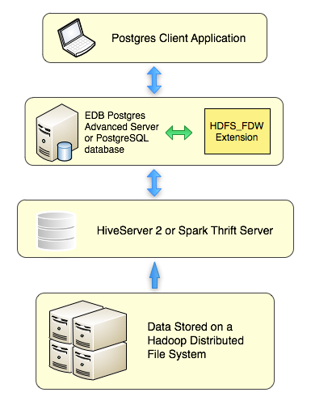

Hadoop is a framework that allows you to store a large data set in a distributed file system.

The Hadoop data wrapper provides an interface between a Hadoop file system and a Postgres database. The Hadoop data wrapper transforms a Postgres `SELECT` statement into a query that is understood by the HiveQL or Spark SQL interface.

When possible, the Foreign Data Wrapper asks the Hive or Spark server to perform the actions associated with the `WHERE` clause of a `SELECT` statement. Pushing down the `WHERE` clause improves performance by decreasing the amount of data moving across the network.
