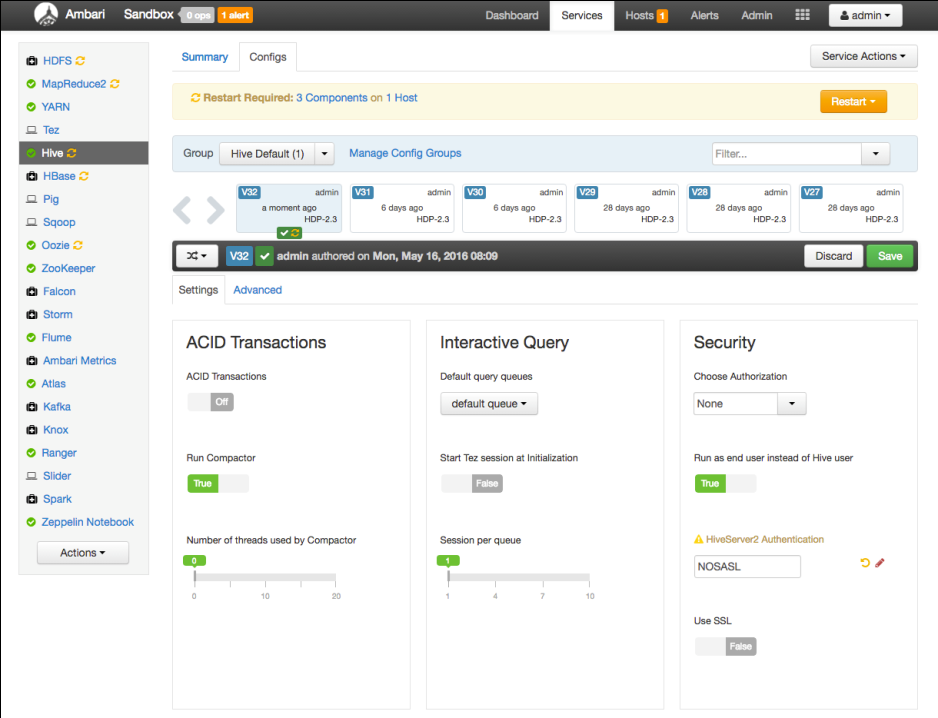
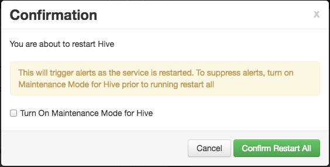
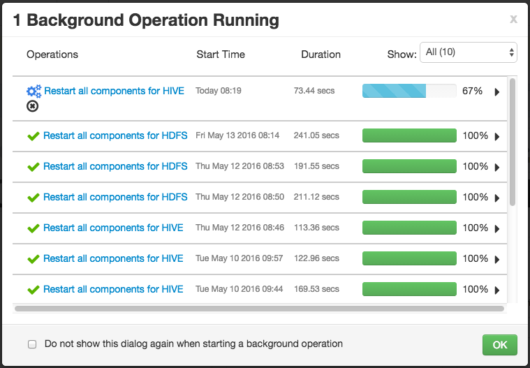

<div id="supported_authentication_methods" class="registered_link"></div>

The data adapter supports NOSASL and LDAP authentication.

## Using LDAP Authentication

When using the data adapter with LDAP authentication, you must first configure the Hive server or Spark server to use LDAP authentication. The configured server must provide a `hive-site.xml` file that includes the connection details for the LDAP server. For example:

```text
<property>
  <name>hive.server2.authentication</name>
  <value>LDAP</value>
  <description>
    Expects one of [nosasl, none, ldap, kerberos, pam, custom].
    Client authentication types.
      NONE: no authentication check
      LDAP: LDAP/AD based authentication
      KERBEROS: Kerberos/GSSAPI authentication
      CUSTOM: Custom authentication provider
              (Use with property hive.server2.custom.authentication.class)
      PAM: Pluggable authentication module
      NOSASL:  Raw transport
  </description>
</property>
<property>
  <name>hive.server2.authentication.ldap.url</name>
  <value>ldap://localhost</value>
  <description>LDAP connection URL</description>
</property>
<property>
  <name>hive.server2.authentication.ldap.baseDN</name>
  <value>ou=People,dc=itzgeek,dc=local</value>
  <description>LDAP base DN</description>
</property>
```

Then, when starting the hive server, include the path to the `hive-site.xml` file in the command. For example:

```text
./hive --config path_to_hive-site.xml_file --service HiveServer2
```

Where *path_to_hive-site.xml_file* specifies the complete path to the `hive‑site.xml` file.

When creating the user mapping, you must provide the name of a registered LDAP user and the corresponding password as options. For details, see [Create User Mapping](../2.0/#create_user_mapping).

<div id="using_nosasl_authentication" class="registered_link"></div>

## Using NOSASL Authentication

When using NOSASL authentication with the data adapter, set the authorization to `None`, and the authentication method to `NOSASL` on the Hive or Spark server. For example, if you start the Hive server at the command line, include the `hive.server2.authentication` configuration parameter in the command:

```text
hive –service hiveserver2 –hiveconf hive.server2.authentication=NOSASL
```

The following example uses the Ambari client interface to manage the Hadoop data source. After authenticating with Ambari, navigate to the `Hive` page, and select the `Configs` tab.



Edit the `HiveServer2 Authentication` field in the `Security` pane, specifying `NOSASL`. Click the `Save` button in the upper-right corner; if prompted, provide a comment about the change and click `Save`, and then `OK` to confirm the change.

After modifying the authentication type, you must restart the Hive server. To restart the server, select `Restart All` from the `Service Actions` drop-down listbox. When prompted, select the `Confirm Restart All` button.



Ambari opens a dialog that will confirm the progress of the server restart.


