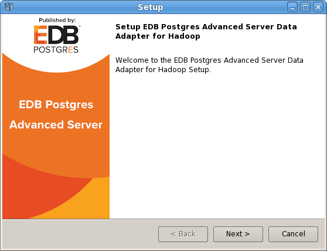
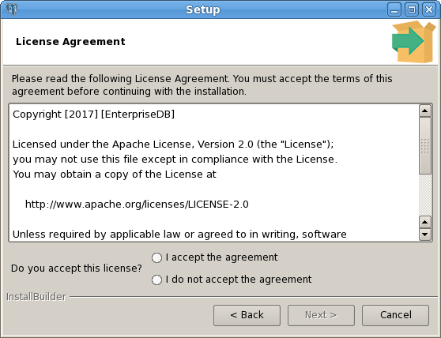
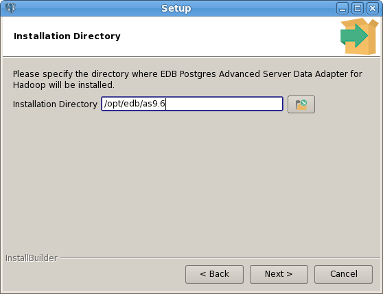
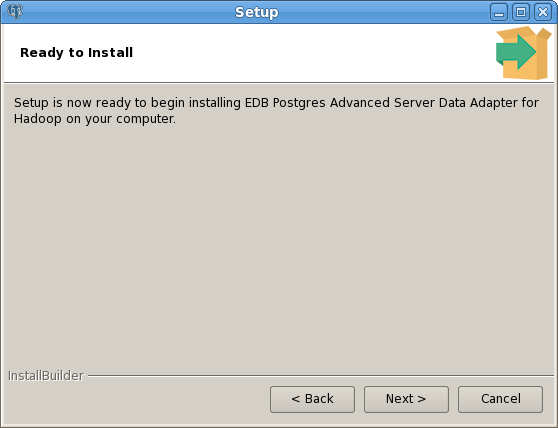
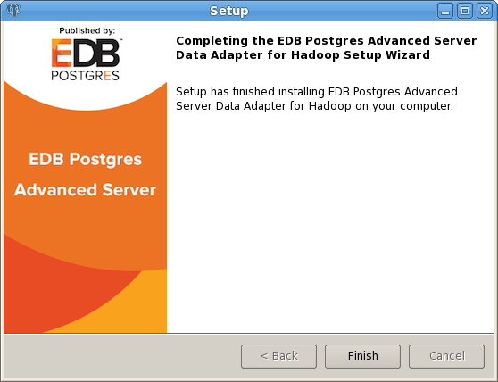

<div id="installing_the_hadoop_data_adapter" class="registered_link"></div>

The Hadoop data adapter can be installed with a graphical installer, an RPM package, or via StackBuilder Plus. During the installation process, the installer will satisfy software prerequisites.

<div id="prerequisites" class="registered_link"></div>

## Prerequisites

Before installing the data adapter, install EDB Postgres Advanced Server or PostgreSQL on the host from which you will query Hadoop. After installing Postgres, modify the `postgresql.conf` file; the `postgresql.conf` file is located in:

-   For an RPM server installation, `/var/lib/edb/as_version/data`
-   For a graphical installation, `/opt/edb/as_version/data`

Modify the configuration file with your editor of choice, adding the `hdfs_fdw.jvmpath` parameter to the end of the configuration file, and setting the value to specify the location of the Java virtual machine (`libjvm.so`).

If your data contains columns with a type of `DATE`, you must also set the following values in the `postgresql.conf` file before using the data adapter:

> `datestyle = 'iso, dmy'`  
> `edb_redwood_date = off`

You must also set the value of `hdfs_fdw.classpath` to indicate the location of the java class files used by the adapter; use a colon (:) as a delimiter between each path. For example:

```text
hdfs_fdw.classpath=
'/usr/local/edb95/lib/postgresql/HiveJdbcClient-1.0.jar: /home/edb/Projects/hadoop_fdw/hadoop/share/hadoop/common/hadoop-common-2.6.4.jar:
/home/edb/Projects/hadoop_fdw/apache-hive-1.0.1-bin/lib/hive-jdbc-1.0.1-standalone.jar'
```

Please note: the following work-around resolves an issue that will be fixed in the next minor release. If your data contains columns with a type of `DATE`, you must also set the following values in the `postgresql.conf` file before using the data adapter:

> `datestyle = 'iso, dmy'`  
> `edb_redwood_date = off`

After setting the parameter values, restart the Postgres server. For detailed information about controlling the service on an Advanced Server host, see the EDB Postgres Advanced Server Installation Guide, available at:

> <https://www.enterprisedb.com/resources/product-documentation>

<div id="using_a_graphical_installer_to_install_the_data_adapter" class="registered_link"></div>

## Using a Graphical Installer to Install the Data Adapter

You can download a graphical installer for the Hadoop data adapter from the EnterpriseDB website. After downloading the installer, assume superuser privileges, and invoke the installer with the command:

> `path_to_installer/edb_hdfs_fdw-9.x-x.x.x-linux-x64.run`

The wizard will prompt you to select an installation language; select a language, and click the `OK` button. The setup wizard opens as shown below:





The `License Agreement` opens; accept the agreement, and click `Next` to continue, or click `Cancel` to exit the installer.



Use the `Installation Directory` dialog to specify the installation directory for the data adapter; the default location is your Postgres installation directory.



When the `Ready to Install` dialog opens, click the `Next` button to start installing the Hadoop Data Adapter. Progress bars will keep you informed of the installer's progress.



When the installation completes, the setup wizard informs you that setup has finished installing the Hadoop Data Adapter; click `Finish` to close the wizard.

<div id="using_an_rpm_package_to_install_the_data_adapter" class="registered_link"></div>

## Using an RPM Package to Install the Data Adapter

The RPM installation package for the Hadoop data adapter is available from the EnterpriseDB repository. Before installing the `data adapter`, you must:

-   Install the `epel-release` package:

<!-- end list -->

```text
yum -y install https://dl.fedoraproject.org/pub/epel/epel-release-latest-7.noarch.rpm
```

Please note that you may need to enable the `[extras]` repository definition in the `CentOS-Base.repo` file (located in `/etc/yum.repos.d`).

You must also have credentials that allow access to the EnterpriseDB repository. For information about requesting credentials, visit:

> <https://info.enterprisedb.com/rs/069-ALB-339/images/Repository%20Access%2004-09-2019.pdf>

After receiving your repository credentials you can:

1.  Create the repository configuration file.
2.  Modify the file, providing your user name and password.
3.  Install the data adapter.

**Creating a Repository Configuration File**

To create the repository configuration file, assume superuser privileges and invoke the following command:

```text
yum -y install https://yum.enterprisedb.com/edb-repo-rpms/edb-repo-latest.noarch.rpm
```

The repository configuration file is named `edb.repo`. The file resides in `/etc/yum.repos.d`.

After creating the `edb.repo` file, use your choice of editor to ensure that the value of the `enabled` parameter is `1`, and replace the `username` and `password` placeholders in the `baseurl` specification with the name and password of a registered EnterpriseDB user.

```text
[edb]
name=EnterpriseDB RPMs $releasever - $basearch
baseurl=https://<username>:<password>@yum.enterprisedb.com/edb/redhat/rhel-$releasever-$basearch
enabled=1
gpgcheck=1
gpgkey=file:///etc/pki/rpm-gpg/ENTERPRISEDB-GPG-KEY
```

After saving your changes to the configuration file, you can use the `yum install` command to the data adapter:

```text
yum install edb-as-xx-hdfs_fdw
```

When you install an RPM package that is signed by a source that is not recognized by your system, yum may ask for your permission to import the key to your local server. If prompted, and you are satisfied that the packages come from a trustworthy source, enter a `y`, and press `Return` to continue.

During the installation, yum may encounter a dependency that it cannot resolve. If it does, it will provide a list of the required dependencies that you must manually resolve.
