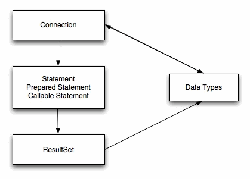
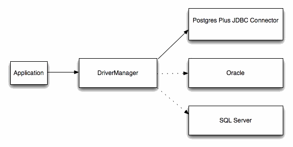

Sun Microsystems created a standardized interface for connecting Java applications to databases known as Java Database Connectivity (JDBC). The EDB JDBC Connector connects a Java application to a Postgres database.

## JDBC Driver Types

There are currently four different types of JDBC drivers, each with their own specific implementation, use and limitations. The EDB JDBC Connector is a Type 4 driver.

Type 1 Driver

-   This driver type is the JDBC-ODBC bridge.
-   It is limited to running locally.
-   Must have ODBC installed on computer.
-   Must have ODBC driver for specific database installed on computer.
-   Generally can’t run inside an applet because of Native Method calls.

Type 2 Driver

-   This is the native database library driver.
-   Uses Native Database library on computer to access database.
-   Generally can’t run inside an applet because of Native Method calls.
-   Must have database library installed on client.

Type 3 Driver

-   100% Java Driver, no native methods.
-   Does not require pre-installation on client.
-   Can be downloaded and configured on-the-fly just like any Java class file.
-   Uses a proprietary protocol for talking with a middleware server.
-   Middleware server converts from proprietary calls to DBMS specific calls

Type 4 Driver

-   100% Java Driver, no native methods.
-   Does not require pre-installation on client.
-   Can be downloaded and configured on-the-fly just like any Java class file.
-   Unlike Type III driver, talks directly with the DBMS server.
-   Converts JDBC calls directly to database specific calls.

## The JDBC Interface

The following figure shows the core API interfaces in the JDBC specification and how they relate to each other. These interfaces are implemented in the `java.sql` package.

JDBC Class Relationships

## JDBC Classes and Interfaces

The core API is composed of classes and interfaces; these classes and interfaces work together as shown below:

Core Classes and Interfaces

## The JDBC DriverManager

The figure below depicts the role of the `DriverManager` class in a typical JDBC application. The `DriverManager` acts as the bridge between a Java application and the backend database and determines which JDBC driver to use for the target database.

DriverManager/Drivers

## Advanced Server JDBC Connector Compatibility

EDB provides support for multiple JRE/JDK versions by providing appropriate JDBC drivers for each version of Java Virtual Machine. Use the following table to determine compatibility between your JRE/JDK version and the Advanced Server Driver.

Table – Advanced Server JDBC Driver Compatibility

| JRE/JDK Version(s)    | JDBC Specification | Advanced Server JDBC Driver | Community JDBC Driver         |
| --------------------- | ------------------ | --------------------------- | ----------------------------- |
| 1.4, 1.5 (see Note 1) | 3                  | edb-jdbc15.jar              | postgresql-9.3.1103.JDBC3.jar |
| 1.6 (see Note 2)      | 4                  | edb-jdbc16.jar              | postgresql-42.2.12.jre6.jar   |
| 1.7 (see Note 3)      | 4.1                | edb-jdbc17.jar              | postgresql-42.2.12.jre7.jar   |
| 1.8 or newer          | 4.2                | edb-jdbc18.jar              | postgresql-42.2.12.jar        |

!!! Note
    1.  JRE/JDK versions 1.4 and 1.5 are no longer supported by the Advanced Server JDBC Connector as the JDBC driver file `edb-jdbc15.jar` is no longer provided.
    2.  The `edb-jdbc16.jar` file is not available for Linux on PowerPC 64 little endian (ppc64le), Debian/Ubuntu and RHEL 8 platforms.
    3.  The `edb-jdbc17.jar` file is not available for Debian/Ubuntu and RHEL 8 platforms.
    4.  Community version numbers are based on the `pgjdbc` version, not the PostgreSQL version.
    5.  Advanced Server JDBC releases are decoupled with EDB Postgres Advanced Server releases.

The following JDBC Compatibility rules apply:

-   From Community website: “The PostgreSQL JDBC driver has some unique properties that you should be aware of before starting to develop any code for it. The current development driver supports six server versions and six java environments. This doesn't mean that every feature must work in every combination, but a reasonable behaviour must be provided for non-supported versions. While this extra compatibility sounds like a lot of work, the actual goal is to reduce the amount of work by maintaining only one code base.”
-   PgJDBC regression tests are run against all PostgreSQL versions since 8.4, including the development version.

For the supported community versions, see the [PostgreSQL JDBC Driver website](https://jdbc.postgresql.org/download.html).
