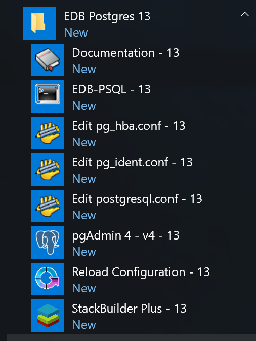

You can use the EDB Connectors Installation wizard to add the JDBC connector to your system; the wizard is available at the [EDB website](https://www.enterprisedb.com/software-downloads-postgres/).

This section demonstrates using the Installation Wizard to install the Connectors on a Windows system. To open the Installation Wizard, download the installer, and then, right-click on the installer icon, and select `Run As Administrator` from the context menu.

When the `Language Selection` popup opens, select an installation language and click `OK` to continue to the `Setup` window.

The JDBC Connector Installation wizard

Click `Next` to continue.

The Installation dialog

Use the `Installation Directory` dialog to specify the directory in which the connector will be installed, and click `Next` to continue.

The Ready to Install dialog

Click `Next` on the `Ready to Install` dialog to start the installation; popup dialogs confirm the progress of the installation wizard.

The installation is complete

When the wizard informs you that it has completed the setup, click the `Finish` button to exit the dialog.

You can also use StackBuilder Plus to add or update the connector on an existing Advanced Server installation; to open StackBuilder Plus, select StackBuilder Plus from the Windows `Apps` menu.

Starting StackBuilder Plus

When StackBuilder Plus opens, follow the onscreen instructions. Select the `EnterpriseDB JDBC Connector` option from the `Database Drivers` node of the tree control.

Selecting the Connectors installer

Follow the directions of the onscreen wizard to add/update an installation of the EDB Connectors.
