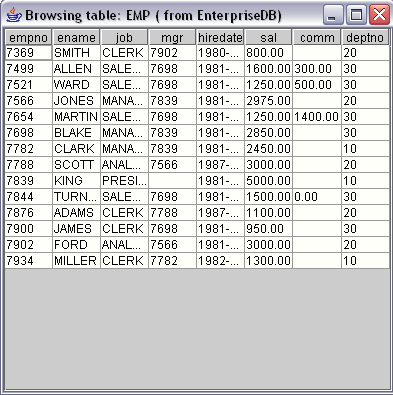

<div id="adding_a_graphical_interface_to_a_java_program" class="registered_link"></div>

With a little extra work, you can add a graphical user interface to a program - the next example (Listing 1.4) demonstrates how to write a Java application that creates a `JTable` (a spreadsheet-like graphical object) and copies the data returned by a query into that `JTable`.

!!! Note
    The following sample application is a method, not a complete application. To call this method, provide an appropriate main() function and wrapper class.

Listing 1.4

```text
import java.sql.*;
import java.util.Vector;
import javax.swing.JFrame;
import javax.swing.JScrollPane;
import javax.swing.JTable;

...
public void showEmployees(Connection con)
{
  try
  {
    Statement stmt = con.createStatement();
    ResultSet rs = stmt.executeQuery("SELECT * FROM emp");
    ResultSetMetaData rsmd = rs.getMetaData();
    Vector labels = new Vector();
    for(int column = 0; column < rsmd.getColumnCount(); column++)
      labels.addElement(rsmd.getColumnLabel(column + 1));

    Vector rows = new Vector();
    while(rs.next())
    {
      Vector rowValues = new Vector();
      for(int column = 0; column < rsmd.getColumnCount(); column++)
        rowValues.addElement(rs.getString(column + 1));
      rows.addElement(rowValues);
    }

    JTable table = new JTable(rows, labels);
    JFrame jf = new JFrame("Browsing table: EMP (from EnterpriseDB)");
    jf.getContentPane().add(new JScrollPane(table));
    jf.setSize(400, 400);
    jf.setVisible(true);
    jf.setDefaultCloseOperation(JFrame.EXIT_ON_CLOSE);
    System.out.println("Command successfully executed");
  }
  catch(Exception err)
  {
    System.out.println("An error has occurred.");
    System.out.println("See full details below.");
    err.printStackTrace();
  }
}
```

Before writing the `showEmployees()` method, you must import the definitions for a few JDK-provided classes:

```text
import java.sql.*;
import java.util.Vector;
import javax.swing.JFrame;
import javax.swing.JScrollPane;
import javax.swing.JTable;
```

The `showEmployees()` method expects a Connection object to be provided by the caller; the `Connection` object must be connected to the Advanced Server:

```text
public void showEmployees(Connection con)
```

`showEmployees()` creates a `Statement` and uses the `executeQuery()` method to execute an SQL query that generates an employee list:

```text
Statement stmt = con.createStatement();
ResultSet rs = stmt.executeQuery("SELECT * FROM emp");
```

As you would expect, `executeQuery()` returns a `ResultSet` object. The `ResultSet` object contains the metadata that describes the `shape` of the result set (that is, the number of rows and columns in the result set, the data type for each column, the name of each column, and so forth). You can extract the metadata from the `ResultSet` by calling the `getMetaData()` method:

```text
ResultSetMetaData rsmd = rs.getMetaData();
```

Next, `showEmployees()` creates a `Vector` (a one dimensional array) to hold the column headers and then copies each header from the `ResultMetaData` object into the vector:

```text
Vector labels = new Vector();
for(int column = 0; column < rsmd.getColumnCount(); column++)
{
  labels.addElement(rsmd.getColumnLabel(column + 1));
}
```

With the column headers in place, `showEmployees()` extracts each row from the `ResultSet` and copies it into a new vector (named `rows`). The `rows` vector is actually a vector of vectors: each entry in the `rows` vector contains a vector that contains the data values in that row. This combination forms the two-dimensional array that you will need to build a `JTable`. After creating the rows vector, the program reads through each row in the `ResultSet` (by calling `rs.next()`). For each column in each row, a `getter` method extracts the value at that row/column and adds the value to the `rowValues` vector. Finally, `showEmployee()` adds each `rowValues` vector to the `rows` vector:

```text
Vector rows = new Vector();
while(rs.next())
{
  Vector rowValues = new Vector();
  for(int column = 0; column < rsmd.getColumnCount(); column++)
    rowValues.addElement(rs.getString(column + 1));
  rows.addElement(rowValues);
}
```

At this point, the vector (`labels`) contains the column headers, and a second two-dimensional vector (`rows`) contains the data for the table. Now you can create a `JTable` from the vectors and a `JFrame` to hold the `JTable`:

```text
JTable table = new JTable(rows, labels);
JFrame jf = new JFrame("Browsing table: EMP (from EnterpriseDB)");
jf.getContentPane().add(new JScrollPane(table));
jf.setSize(400, 400);
jf.setVisible(true);
jf.setDefaultCloseOperation(JFrame.EXIT_ON_CLOSE);
System.out.println("Command successfully executed");
```

The `showEmployees()` method includes a `catch` block to intercept any errors that may occur and display an appropriate message to the user:

```text
catch(Exception err)
{
  System.out.println("An error has occurred.");
  System.out.println("See full details below.");
  err.printStackTrace();
}
```

The result of calling the `showEmployees()` method is shown in below figure:


