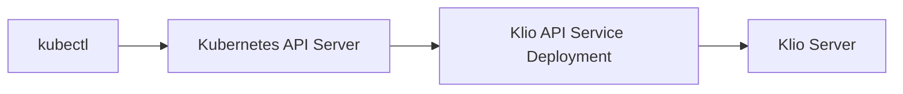

The Klio API Service is a Kubernetes API aggregation server that extends the
Kubernetes API to expose Klio backup metadata as native Kubernetes resources.
This allows users to query and inspect backup information using standard
Kubernetes tools like `kubectl`.

!!!caution Experimental - Subject to Change

The Klio API Service is **experimental** and under evaluation. Future releases
may provide an alternative method for listing backups, which
may result in changes or removal of the API service.
!!!

## Overview

The API service integrates with the Kubernetes API server through the
[API Aggregation Layer](https://kubernetes.io/docs/concepts/extend-kubernetes/api-extension/apiserver-aggregation/),
registering a new API group `kliocatalog.enterprisedb.io/v1alpha1` that provides
access to backup catalog information stored in the Klio repository.

### Key Features

-   **Native Kubernetes Integration**: Query backups using `kubectl` and other
    Kubernetes tools
-   **Secure Communication**: TLS-encrypted connections with certificate-based
    authentication
-   **Real-time Catalog Access**: Direct access to the Klio backup repository
    for up-to-date information
-   **Standard Kubernetes RBAC**: Control access using native Kubernetes
    role-based access control

### Architecture

The API service acts as a bridge between the Kubernetes API server
and the Klio backup repository:



## What the API Service Provides

### KlioBackup Resource

The API service exposes a `KlioBackup` resource that represents
backup metadata from the Klio repository.

The resource is described in the [Klio Catalog API reference](api/klio_catalog_api.mdx).

### Available Operations

The API service supports the following operations:

1.  **List all backups**: Retrieve all backups across all clusters
2.  **Get specific backup**: Retrieve details for a specific backup by name

## Setting Up the API Service

### Prerequisites

Before setting up the Klio API service, ensure you have:

-   A Kubernetes cluster with the Klio operator installed
-   A running Klio server instance
-   `kubectl` configured to access your cluster
-   [cert-manager](https://cert-manager.io/) installed
    for TLS certificate management (optional)

### Required Components

The API service setup includes:

1.  **TLS Certificates**: For secure communication between the Kubernetes API
    server and the Klio API service, and between the Klio API service and the
    Klio server
2.  **Service Account**: Dedicated service account with necessary permissions
3.  **RBAC Resources**: ClusterRole and Role for authorization
4.  **Deployment**: The API service deployment specification
5.  **Service**: Kubernetes service to expose the API server
6.  **APIService**: Registration with the Kubernetes API aggregation layer

### Step-by-Step Setup

!!!note

Setup procedure will be simplified in future Klio releases.
!!!

#### 1. Create ServiceAccount and RBAC Resources

Create a service account and the necessary RBAC resources.

```yaml
apiVersion: v1
kind: ServiceAccount
metadata:
  name: klio-api
---
apiVersion: rbac.authorization.k8s.io/v1
kind: Role
metadata:
  name: klio-api
  namespace: kube-system
rules:
  - apiGroups:
      - ""
    resourceNames:
      - extension-apiserver-authentication
    resources:
      - configmaps
    verbs:
      - get
      - watch
      - list
---
apiVersion: rbac.authorization.k8s.io/v1
kind: RoleBinding
metadata:
  name: klio-api
  namespace: kube-system
roleRef:
  apiGroup: rbac.authorization.k8s.io
  kind: Role
  name: klio-api
subjects:
  - kind: ServiceAccount
    name: klio-api
    namespace: default
---
apiVersion: rbac.authorization.k8s.io/v1
kind: ClusterRole
metadata:
  name: klio-api
  namespace: kube-system
rules:
  - apiGroups: [""]
    resources: ["namespaces"]
    verbs: ["get", "watch", "list"]
  - apiGroups: ["admissionregistration.k8s.io"]
    resources: ["mutatingwebhookconfigurations", "validatingwebhookconfigurations", "validatingadmissionpolicies", "validatingadmissionpolicybindings"]
    verbs: ["get", "watch", "list"]
  - apiGroups: ["flowcontrol.apiserver.k8s.io"]
    resources: ['prioritylevelconfigurations', 'flowschemas']
    verbs: ['list', 'watch']
  - apiGroups:
      - authorization.k8s.io
    resources:
      - subjectaccessreviews
    verbs:
      - create
---
apiVersion: rbac.authorization.k8s.io/v1
kind: ClusterRoleBinding
metadata:
  name: sample-apiserver-clusterrolebinding
roleRef:
  apiGroup: rbac.authorization.k8s.io
  kind: ClusterRole
  name: klio-api
subjects:
  - kind: ServiceAccount
    name: klio-api
    namespace: default
```

#### 2. Create a client certificate secret

Create a Kubernetes `Secret` containing the client certificate
and key for authenticating to the Klio server.

Its common name must be `snapshot_reader@klio`.

See the [Klio documentation](klio_server.mdx#creating-a-client-side-certificate)
for instructions on generating the certificate.

#### 3. Create a server certificate secret

Create a Kubernetes `Secret` containing the Klio server's TLS certificate
for validating the server's identity.

If you're using `cert-manager`, you can create a `Certificate` resource
as shown below:

```yaml
apiVersion: cert-manager.io/v1
kind: Certificate
metadata:
  name: klio-api
spec:
  secretName: klio-api-tls
  commonName: klio-api
  dnsNames:
    - klio-api
    - klio-api.default
    - klio-api.default.svc

  duration: 2160h # 90d
  renewBefore: 360h # 15d

  isCA: false
  usages:
    - server auth
    - client auth

  issuerRef:
    name: selfsigned-issuer
    kind: Issuer
    group: cert-manager.io
```

!!!info

For production environments, use certificates signed by
your organization's Certificate Authority (CA)
or a trusted public CA instead of self-signed certificates.
!!!

#### 4. Deploy the API Service

Create a deployment configuration for the API service.

<!-- x-release-please-start-version -->

```yaml
apiVersion: apps/v1
kind: Deployment
metadata:
  labels:
    app: klio-api
  name: klio-api
spec:
  replicas: 1
  selector:
    matchLabels:
      app: klio-api
  strategy: {}
  template:
    metadata:
      labels:
        app: klio-api
    spec:
      serviceAccountName: klio-api
      volumes:
        - name: klio-server-tls
          secret:
            defaultMode: 420
            secretName: <$KLIO_SERVER_CERT> # The Klio server cert secret
        - name: klio-api-tls
          secret:
            defaultMode: 420
            secretName: klio-api-tls # The Klio API server certificate secret
        - name: klio-client-tls
          secret:
            defaultMode: 420
            secretName: <$KLIO_CLIENT_CERT> # The client certificate used to authenticate to the Klio server
        - emptyDir: {}
          name: scratch-data
      containers:
        - args:
            - server
            - api-server
          env:
            - name: CLIENT_BASE_HOSTNAME
              value: klio
            - name: CLIENT_BASE_URL
              value: <$KLIO_SERVER_ADDRESS> # The Klio server address in https://host:port format
            - name: CLIENT_BASE_SERVER_CERT_PATH
              value: /certs/tls.crt
            - name: CLIENT_BASE_API_SERVER_CERTFILE
              value: /klio-api/certs/tls.crt
            - name: CLIENT_BASE_API_SERVER_KEYFILE
              value: /klio-api/certs/tls.key
            - name: CLIENT_BASE_CLIENT_CERT_PATH
              value: /client-certs/tls.crt
            - name: CLIENT_BASE_CLIENT_KEY_PATH
              value: /client-certs/tls.key
            - name: TMPDIR
              value: /tmp
          image: docker.enterprisedb.com/k8s/klio:v0.0.11
          imagePullPolicy: Always
          name: api-server
          resources: {}
          securityContext:
            runAsNonRoot: true
          volumeMounts:
            - mountPath: /certs
              name: klio-server-tls
            - mountPath: /client-certs
              name: klio-client-tls
            - mountPath: /klio-api/certs
              name: klio-api-tls
            - mountPath: /tmp
              name: scratch-data
```

<!-- x-release-please-end -->

#### 5. Create a service

Now expose the Deployment via a Kubernetes Service:

```yaml
apiVersion: v1
kind: Service
metadata:
  labels:
    app: klio-api
  name: klio-api
spec:
  ports:
    - port: 443
      protocol: TCP
      targetPort: 443
  selector:
    app: klio-api
```

#### 6. Register the `APIService`

Finally, register the API service creating its resource:

```yaml
apiVersion: apiregistration.k8s.io/v1
kind: APIService
metadata:
  name: v1alpha1.kliocatalog.enterprisedb.io

  # If using cert-manager, you can inject the CA bundle specifying the
  # certificate:
  #
  # annotations:
  #   cert-manager.io/inject-ca-from: default/klio-api
spec:
  group: kliocatalog.enterprisedb.io
  groupPriorityMinimum: 1000
  versionPriority: 15
  service:
    name: klio-api
  version: v1alpha1
  # If not using cert-manager, you will need to manually set the CA bundle
  # kubectl get secret klio-api-tls -o jsonpath='{.data.tls\.crt}'
  #
  # caBundle: put-CA-Bundle-here
```

## Using the API Service

Once the API service is running, you can interact with it using `kubectl`.

### List All Backups

```bash
kubectl get kliobackups
```

Example output:

```
NAME                                    CLUSTER NAME      STARTED AT                      STOPPED AT
cluster-example.backup-20251113093137   cluster-example   2025-11-13 09:31:37 +0000 UTC   2025-11-13 09:31:39 +0000 UTC
```

### Get Specific Backup Details

```bash
kubectl get kliobackups cluster-example.backup-20251113093137 -o yaml
```

Example output:

```yaml
apiVersion: kliocatalog.enterprisedb.io/v1alpha1
kind: KlioBackup
metadata:
  name: cluster-example.backup-20251113093137
spec:
  backupID: backup-20251113093137
  clusterName: cluster-example
status:
  annotations:
    klio.io/controlDataKopiaManifestID: f055f78fb1db512b39e695465fa26ead
    klio.io/kopiaManifestID: 2272afec220f48d0fa0064f85b043ac4
  endLSN: 117440800
  endWAL: "000000010000000000000007"
  startLSN: 117440552
  startWAL: "000000010000000000000007"
  startedAt: "2025-11-13T09:31:37Z"
  stoppedAt: "2025-11-13T09:31:39Z"
```

## Limitations

An API service is tied to a specific Klio server instance. If you have multiple
Klio servers, you will need to deploy a separate API service for each server,
defining a different API group for each to avoid conflicts.
