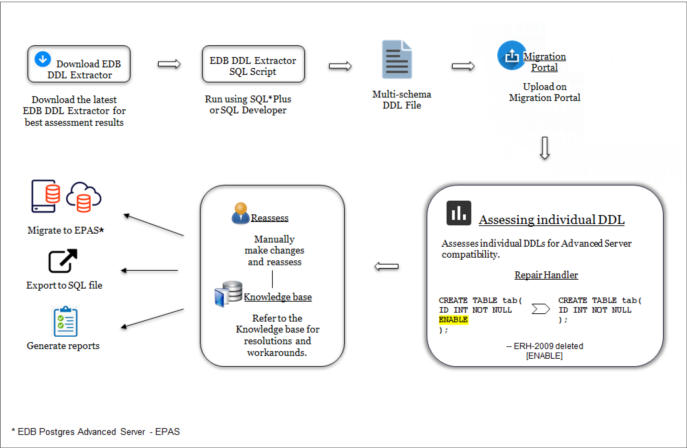
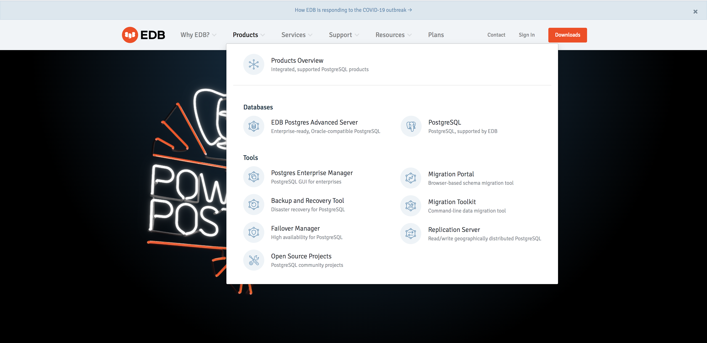

Migration Portal allows you to easily migrate your database schema from Oracle to EDB Postgres Advanced Server. You can upload schemas for assessment and get immediate feedback and suggestions. The portal allows you to download assessed DDLs for all objects and create your EDB Postgres database on-premises or in the cloud.

<figure><figcaption aria-hidden="true"><em>The assessment and migration process</em></figcaption></figure>

To access the Migration Portal:

1.  Open a browser and navigate to <https://www.edbpostgres.com/>
2.  On the EnterpriseDB home page, click `Products` &gt; `Migration Portal`.

<figure><figcaption aria-hidden="true"><em>Accessing the Migration Portal.</em></figcaption></figure>

1.  Click `Open Migration Portal`.
2.  Log in using your credentials.

mp\_overview\_home mp\_overview\_project mp\_overview\_wiki

