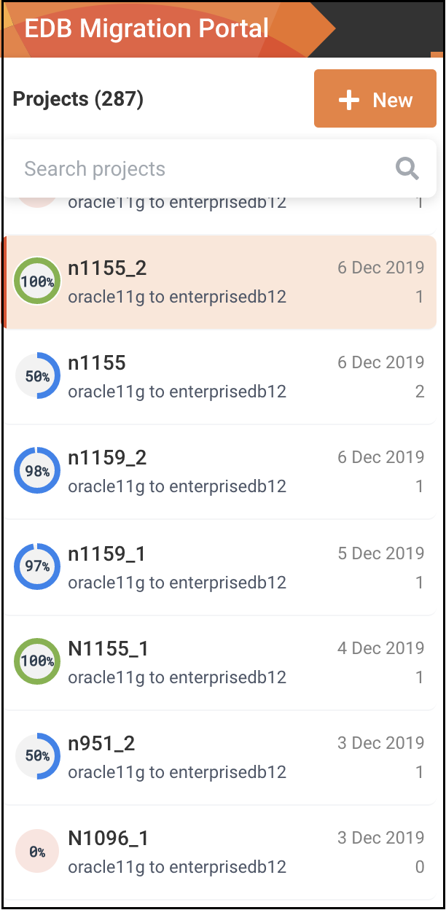
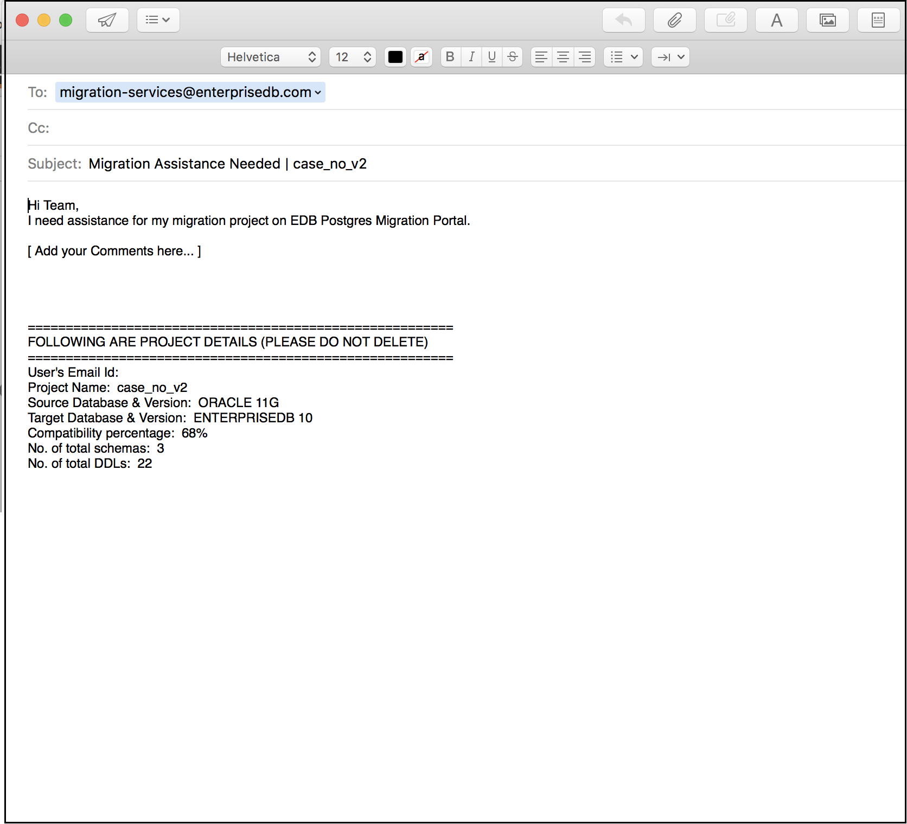

<div id="whats_new" class="registered_link"></div>


The following enhancements are added to the EDB Postgres Migration Portal for this release:

  - The `Project Compatibility` gauge is color-coded to display which projects are the most compatible in a single glance. You can either fix the projects manually that are not fully compatible or contact an EDB representative for help.



>   - Green indicates 100% compatible
>   - Blue indicates 31% to 99% compatible
>   - Red indicates 0% to 30% compatible

  - If there are any issues while assessing the schemas, you can contact the EDB representative for help. You can click the migrating services email ID in the message box. A draft from the system’s default email client will open with a prepopulated subject and body, saving you time drafting the request.



  - The FAQ page is updated with the latest frequently asked questions. Use the following link to access the FAQ:
    
    <https://www.enterprisedb.com/migration-portal-faqs>

  - Many changes have been made to the new UI for better user experience.

**New Repair Handler**

The following repair handler is added to improve the Advance Server compatibility ratio:

  - ERH 1012 - Insert Statement Alias:
    
    Removes alias name and the references of the alias name from the INSERT statement inside any PL/SQL block.
    
    For example:

> 
> 
> ``` text
> CREATE OR REPLACE PROCEDURE REMOVE_ALIAS_TEST (IN_PARAM VARCHAR2)
> IS
>  V_VAR   NUMBER (12, 0);
> BEGIN
>   INSERT INTO TABLE_NAME ALIAS_NAME (ALIAS_NAME.ID,
>            ALIAS_NAME.NAME)
>       VALUES (1,
>        'test');
> END;
> ```
> 
> would become;
> 
> ``` text
> CREATE OR REPLACE PROCEDURE REMOVE_ALIAS_TEST (IN_PARAM VARCHAR2)
> IS
>  V_VAR   NUMBER (12, 0);
> BEGIN
>   INSERT INTO TABLE_NAME (ALIAS_NAME.ID,
>           NAME)
>     VALUES (1,
>      'test');
> END;
> ```

**New Knowledge Base entry**

The following is a new knowledge base entry; refer to the Knowledge Base section on the Migration Portal for workaround details:

  - **UTL_I18N.STRING_TO_RAW and UTL_I18N.RAW_TO_CHAR package functions**:
    
    > In Oracle, `UTL_I18N.STRING_TO_RAW` function is used to convert `VARCHAR2` or `NVARCHAR2` string to another character set and returns the result as `RAW` data and `UTL_I18N.RAW_TO_CHAR` function is used to convert `RAW` data that is not encoded in the database character set into a `VARCHAR2` string. However, in Advanced Server `encode` and `decode` functions are used to convert `VARCHAR2` or `NVARCHAR2` string to `RAW` data and vice-versa.
