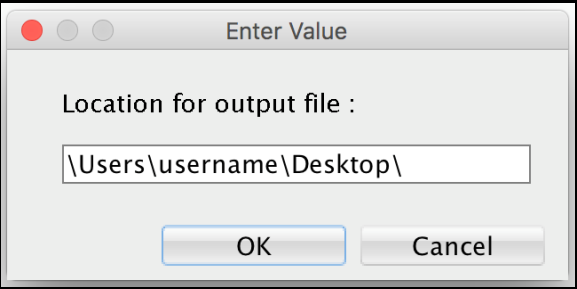

**Prerequisites**

Before extracting a schema, you must download the latest EDB DDL Extractor script from the Migration Portal `Projects` page or from the link provided in the DDL Extractor guide in the Portal Wiki. The script can be run in SQL Developer or SQL*Plus. It uses Oracle’s `DBMS_METADATA` built-in package to extract DDLs for different objects under schemas (specified while running the script). The EDB DDL extractor creates the DDL file that will be uploaded to the portal and analyzed for EDB Postgres compatibility.

Note

The *script user* must have `CONNECT`, `RESOURCE` and `SELECT_CATALOG_ROLE` roles.

**For SQL*Plus**

1.  Connect to SQL*Plus and run the command:

    `SQL>@edb_ddl_extractor.sql`

2.  Provide the schema name and the pathdirectory in which the extractor will store the extracted DDL. When extracting multiple schemas, use a comma (‘,’) as a delimiter.

Note

If you want to extract all the user schemas from the current database, do not mention any schema names while extracting. However, it is recommended to mention the schema names that you would like to extract.

3.  If you want to extract dependent objects from other schemas, enter `yes` or `no`.

    **For example, on Linux:**

    `Enter SCHEMA NAME[S] to extract DDLs:`

    `HR, SCOTT, FINANCE`

    `Enter the PATH to store DDL file:`

    `/home/oracle/extracted_ddls/`

    `Extract dependent objects from other schemas? (yes/no): yes`

    **On Windows:**

    `Enter SCHEMA NAME[S] to extract DDLs:`

    `HR, SCOTT, FINANCE`

    `Enter the PATH to store DDL file:`

    `C:\Users\Example\Desktop\`

    `Extract dependent objects from other schemas? (yes/no): yes`

**For SQL Developer**

1.  Connect to the SQL server and run the following command:

2.  Enter a comma-separated list of schemas:

3.  Enter file path for the output file:

4.  Extract dependent objects from other schemas?(yes/no): `yes`

**Note**: You can also enter a single schema name in both the SQL*Plus and SQL Developer tools.

5.  The script iterates through the object types in the source database and once the task is completed, the .SQL output is stored at the entered location, i.e., `c:\Users\Example\Desktop\`.

**Additional Notes**

  - The EDB DDL Extractor does not extract objects that have names like:

    `BIN$b54+4XIEYwPgUAB/AQBWwA= =$0`

    To extract these objects, you must change the name of the objects and re-run the extraction process.

  - DDL Extractor extracts `nologging` tables as normal tables. Once these tables are migrated to Advanced Server, WAL log files will be created.

## Supported Object Types

The migration portal supports the migration of the following object types:

  - Synonyms
  - DB Links
  - Types and Type Body
  - Sequences
  - Tables
  - Constraints
  - Indexes (Except LOB indexes and indexes on materialized views)
  - Views
  - Materialized Views
  - Triggers
  - Functions
  - Procedures
  - Packages

Note

COMMENTS on Columns, Tables, and Materialized Views are supported.

## Unsupported Object Types

  - Editions
  - Operators
  - Schedulers
  - LOB indexes and Indexes on Materialized Views
  - XML Schemas
  - Profiles
  - Role and Object Grants
  - Tablespaces
  - Directories
  - Users
  - RLS Policy
  - Queues

## Oracle System Schemas

> EDB DDL Extractor script will ignore the following system schemas while extracting from Oracle:

|                          |                          |                      |
| ------------------------ | ------------------------ | -------------------- |
| ANONYMOUS                | APEX_PUBLIC_USER       | APEX_030200         |
| APEX_040000             | APEX_040000             | APPQOSSYS            |
| AUDSYS                   | BI                       | CTXSYS               |
| DMSYS                    | DBSNMP                   | DIP                  |
| DVF                      | DVSYS                    | EXFSYS               |
| FLOWS_FILES             | FLOWS_020100            | GSMADMIN_INTERNAL   |
| GSMCATUSER               | GSMUSER                  | IX                   |
| LBACSYS                  | MDDATA                   | MDSYS                |
| MGMT_VIEW               | OE                       | OJVMSYS              |
| OLAPSYS                  | ORDPLUGINS               | ORDSYS               |
| ORDDATA                  | OUTLN                    | ORACLE_OCM          |
| OWBSYS                   | OWBYSS_AUDIT            | PM                   |
| RMAN                     | SH                       | SI_INFORMTN_SCHEMA |
| SPATIAL_CSW_ADMIN_USR | SPATIAL_WFS_ADMIN_USR | SYS                  |
| SYSBACKUP                | SYSDG                    | SYSKM                |
| SYSTEM SYSMAN            | TSMSYS WKPROXY           | WKSYS                |
| WK_TEST XS$NULL         | WMSYS                    | XDB                  |
