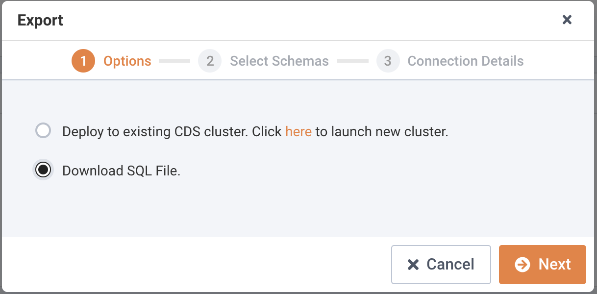
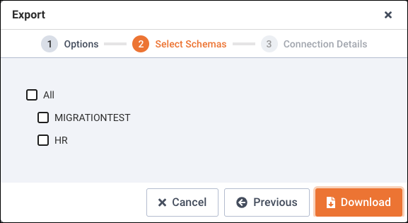
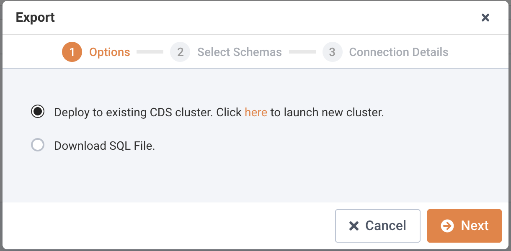
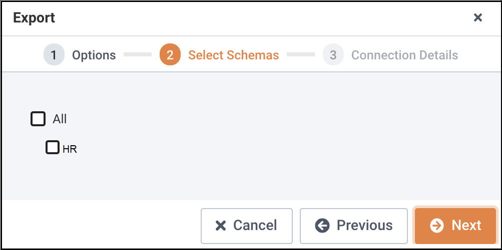
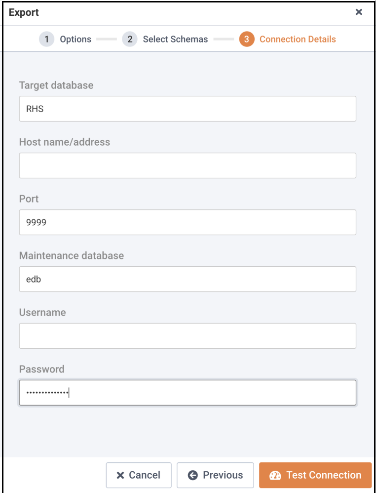
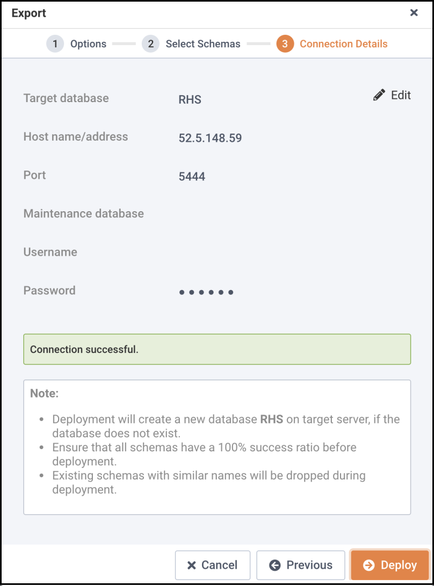
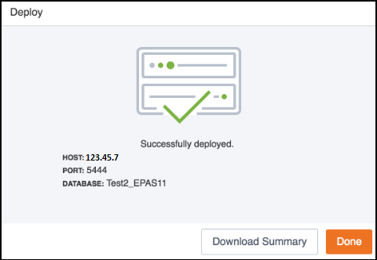

After resolving errors in your schemas, you can use the schemas with a client application such as pgAdmin, ToadEdge, or the PSQL client, or migrate the schema to an EDB Cloud Database Service (CDS) cluster.

**Please Note**: For more information about using Toad Edge with Advanced Server, see [Toad Edge for Postgres](https://www.quest.com/products/toad-edge/toad-edge-postgres.aspx).

**Using PSQL or pgAdmin to Deploy a schema**

After ensuring that the assessed schema is 100% compatible on Migration Portal, you can perform the following steps to deploy a schema using PSQL or pgAdmin:

1.  On the `Project` Page, select the required project.
2.  Click `Export` to download the assessed file.

3.  Click `Download`.

4.  (For PSQL) Connect to desired Advanced Server using the psql/edb-psql client and run the following command:

    `edb=# \i /exported_ddls_folder/hr_schema/ProjHR_hr.sql`

5.  (For pgAdmin) Connect to the desired database and click `Open`.

6.  Upload the schema and click `Run`.

The Advanced Server instance must be installed in Oracle Mode to enable native compatibility with key Oracle capabilities.

## Migrating a Schema to a CDS cluster

Perform the following steps to migrate your database to a CDS cluster:

1.  On the `Project` page, click `Export`.

2.  Select the `Deploy to existing CDS cluster. Click here to launch new cluster` option.

    For information about creating a new cluster, see [Creating a Server Cluster](https://www.enterprisedb.com/edb-docs/d/edb-postgres-cloud-database-service/user-guides/user-guide/1.1/cds_creating_server_cluster.html).

3.  Click `Next`.
4.  Select the schemas you wish to migrate.

5.  Click `Next` to continue.

6.  Enter the required details in the `Connection Details` dialog box.

7.  Click `Test Connection` to verify the connection details.

    Note: You can click `Edit` to make changes to the connection details and retest the connection details.

8.  Once the connection is successful, click `Deploy`.

9.  You can view the deployment details on the `Deploy` dialog; click `Download Summary` to download the deployment log.

10. Click `Done` to close the window.
