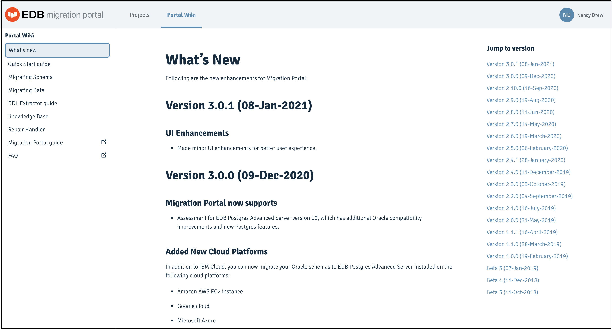

The Portal Wiki page provides quick access to information:

-   What’s New information
-   Quick Start guide
-   Migrating Schema
-   Migrating Data
-   DDL Extractor guide
-   Knowledge Base
-   Repair handlers
-   Migration Portal User's Guide
-   FAQs

*The Migration Portal Wiki page*
